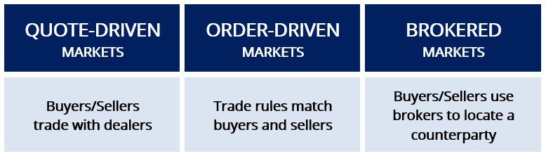

## Table of Contents

## What is a quote-driven market?

A quote-driven market is a type of financial market where prices are set by dealers or market makers. Instead of buyers and sellers directly negotiating prices, dealers provide quotes for the prices at which they are willing to buy or sell securities. These quotes include a bid price, which is what the dealer will pay to buy the security, and an ask price, which is what the dealer will sell the security for. The difference between the bid and ask price is known as the spread, and it represents the dealer's profit.

In a quote-driven market, investors trade with these dealers rather than directly with each other. This system is common in markets for bonds, certain stocks, and foreign exchange. The dealers play a crucial role by providing liquidity, which means they ensure there is always someone ready to buy or sell. This can make trading smoother and more efficient, but it also means that dealers have significant influence over the market prices.

## What is an order-driven market?

An order-driven market is a type of financial market where buyers and sellers come together directly to trade without needing dealers or market makers. In this system, people place their buy and sell orders into a central system called an order book. The order book shows all the current buy and sell orders, and it helps match buyers with sellers. The price of a security in an order-driven market is determined by the highest price someone is willing to pay and the lowest price someone is willing to accept.

This type of market is common in stock exchanges, where traders can see all the orders and decide if they want to buy or sell at those prices. The advantage of an order-driven market is that it can be more transparent because everyone can see the orders. It also allows for direct negotiation between buyers and sellers, which can lead to fairer prices. However, it might be less liquid than a quote-driven market because there's no guaranteed buyer or seller at all times.

## How do quote-driven and order-driven markets differ in their basic structure?

In a quote-driven market, dealers or market makers set the prices for buying and selling securities. They provide two prices: a bid price, which is what they'll pay to buy the security, and an ask price, which is what they'll sell it for. Investors trade directly with these dealers, who make money from the difference between the bid and ask prices, known as the spread. This system ensures there's always someone ready to buy or sell, which can make trading smoother but also gives dealers a lot of control over prices.

In an order-driven market, buyers and sellers come together directly without dealers. They place their buy and sell orders into a central system called an [order book](/wiki/order-book-trading-strategies). This book shows all the current orders, and the system matches buyers with sellers based on the highest price someone is willing to pay and the lowest price someone is willing to accept. This setup can be more transparent because everyone sees the orders, and it might lead to fairer prices. However, it can be less liquid because there's no guaranteed buyer or seller at all times.

## What are the primary roles of market makers in quote-driven markets?

Market makers in quote-driven markets have two main jobs. First, they give prices for buying and selling securities. They tell everyone what price they will pay to buy a security (this is called the bid price) and what price they will sell it for (this is called the ask price). By doing this, they make sure there is always someone ready to trade, which helps keep the market running smoothly.

Second, market makers help make the market more liquid. Liquidity means how easy it is to buy or sell something without affecting its price too much. Market makers are always there to buy or sell, so traders can always find someone to trade with. This is good for the market because it makes trading easier and faster, but it also means market makers can influence prices because they set the bid and ask prices.

## How does price discovery occur in order-driven markets?

In order-driven markets, price discovery happens when buyers and sellers come together and show what prices they are willing to trade at. They do this by putting their buy and sell orders into a big list called an order book. The order book shows all the orders everyone has made, so everyone can see what prices people want to buy or sell at. The price of a security is found when the highest price someone wants to pay matches the lowest price someone is willing to accept.

This process can be a bit like a big auction. As more people put in their orders, the order book changes, and the price can move up or down depending on what everyone wants. If more people want to buy than sell, the price might go up because buyers might have to offer more to get the security. If more people want to sell than buy, the price might go down because sellers might have to lower their price to find a buyer. This way, the market finds a fair price based on what everyone is willing to do.

## What are the advantages of quote-driven markets for traders?

Quote-driven markets can make trading easier for traders because there is always someone ready to buy or sell. This is because market makers are always there, giving prices for buying and selling securities. This means traders don't have to wait to find someone to trade with, which can make trading faster and smoother. It's good for traders who need to buy or sell quickly, like if they need to get out of a trade fast.

Another advantage is that traders can know exactly what price they will get before they trade. Market makers show the bid and ask prices, so traders can see what they will pay or receive right away. This can help traders plan their trades better and make decisions more easily. It's especially helpful for traders who like to know the prices they are working with before they make a move.

## What are the benefits of order-driven markets for investors?

Order-driven markets can be good for investors because they can see all the buy and sell orders in one place called the order book. This means investors know exactly what prices people are willing to trade at, which makes the market more open and fair. When everyone can see what's going on, it's easier for investors to make smart choices about when to buy or sell.

Another benefit is that investors can set their own prices for buying and selling. In an order-driven market, if an investor thinks a security is worth a certain amount, they can put in an order at that price and wait for someone to match it. This gives investors more control over their trades and can help them get better prices. It's like being able to haggle at a market, which can lead to fairer deals for everyone involved.

## How do liquidity and transaction costs compare between quote-driven and order-driven markets?

In quote-driven markets, [liquidity](/wiki/liquidity-risk-premium) is generally better because market makers are always there to buy or sell. This means traders can always find someone to trade with, which makes it easier and quicker to buy or sell securities. But this can also mean higher transaction costs for traders. Market makers make money from the difference between the bid and ask prices, called the spread. So, when traders buy or sell, they have to pay this spread, which can add up and make trading more expensive.

In order-driven markets, liquidity can be less reliable because there's no one always ready to trade. If there aren't enough buyers and sellers, it might be harder to find someone to trade with, and it might take longer to make a trade. But transaction costs can be lower in these markets. Since traders deal directly with each other, they don't have to pay the spread to a market maker. This can make trading cheaper, especially if there are lots of orders in the order book and prices are close together.

## What impact do quote-driven and order-driven systems have on market volatility?

In quote-driven markets, market makers help keep things steady by always being ready to buy or sell. This can make the market less jumpy because there's always someone to trade with. But if market makers get scared and pull back, it can make the market more volatile. When they're not there to help, prices can swing more because it's harder for traders to find someone to trade with.

In order-driven markets, prices can move around more because they depend on what buyers and sellers are willing to do. If lots of people want to buy or sell at the same time, prices can change quickly. This can make the market more volatile, especially if there aren't enough orders to match everyone. But if there are lots of orders and people are trading a lot, it can help keep the market stable because there's always someone to trade with.

## How do regulatory frameworks differ for quote-driven versus order-driven markets?

In quote-driven markets, regulators often focus on making sure market makers act fairly and provide good prices for buying and selling. They set rules to make sure market makers are always there to trade and don't pull back when things get tough. This helps keep the market working smoothly and stops market makers from taking advantage of traders. Regulators might also watch the spreads between bid and ask prices to make sure they're not too big, which can make trading more expensive for everyone.

In order-driven markets, the rules are more about making sure the order book is open and fair for everyone. Regulators want to make sure all the buy and sell orders are shown clearly so everyone can see them. This helps keep the market honest and stops people from hiding what they're doing. They also might set rules to make sure trades happen quickly and fairly, so no one gets left out when prices change. Both types of markets have rules to stop fraud and protect investors, but the focus is different because the way they work is different.

## What are some real-world examples of markets that operate on quote-driven and order-driven systems?

Some real-world examples of quote-driven markets include the over-the-counter (OTC) markets for bonds and certain stocks. In these markets, dealers or market makers provide prices at which they are willing to buy or sell securities. For instance, the U.S. Treasury securities market operates in this way, where dealers quote prices for buying and selling government bonds. Another example is the foreign exchange market, where banks and other financial institutions act as market makers, providing quotes for currency exchange rates.

Order-driven markets are common in major stock exchanges like the New York Stock Exchange (NYSE) and the NASDAQ. In these markets, buyers and sellers place their orders into an order book, and the system matches them based on the best available prices. For example, on the NYSE, traders can see all the buy and sell orders and trade directly with each other without needing a dealer. Similarly, the NASDAQ operates as an order-driven market where electronic trading systems match orders from investors around the world.

## How might technological advancements influence the future of quote-driven and order-driven markets?

Technology is changing the way quote-driven and order-driven markets work. For quote-driven markets, new technology can make it easier for market makers to give prices and handle lots of trades quickly. Computers and algorithms can help them do this faster and better, which might make the market more liquid and the prices more stable. But it could also mean that big companies with lots of technology might have more power over the market, which could be a problem for smaller traders.

In order-driven markets, technology can help by making the order book even clearer and easier to use. With better computers and software, more people from around the world can trade at the same time, which can make the market more lively and the prices more fair. But there's also a risk that fast computers might be able to trade too quickly, which could make prices jump around a lot and be hard for regular people to keep up with. So, while technology can make these markets better, it also brings new challenges that need to be watched carefully.

## References & Further Reading

[1]: Biais, B., Glosten, L., & Spatt, C. (2005). ["Market Microstructure: A Survey of Microfoundations, Empirical Results, and Policy Implications."](https://www.sciencedirect.com/science/article/abs/pii/S1386418104000382) Review of Financial Studies, 18(3), 735-772.

[2]: Harris, L. (2003). ["Trading and Exchanges: Market Microstructure for Practitioners."](https://academic.oup.com/book/52292) Oxford University Press.

[3]: Hasbrouck, J. (2007). ["Empirical Market Microstructure: The Institutions, Economics, and Econometrics of Securities Trading."](https://archive.org/details/empiricalmarketm0000hasb) Oxford University Press.

[4]: Madhavan, A. (2000). ["Market Microstructure: A Survey."](https://www.sciencedirect.com/science/article/pii/S1386418100000070) Journal of Financial Markets, 3(3), 205-258.

[5]: O'Hara, M. (1995). ["Market Microstructure Theory."](https://www.semanticscholar.org/paper/Market-Microstructure-Theory-O'Hara/2bd0833b023f3270a2a6bf301e86b8e02e2f28ed) Wiley.