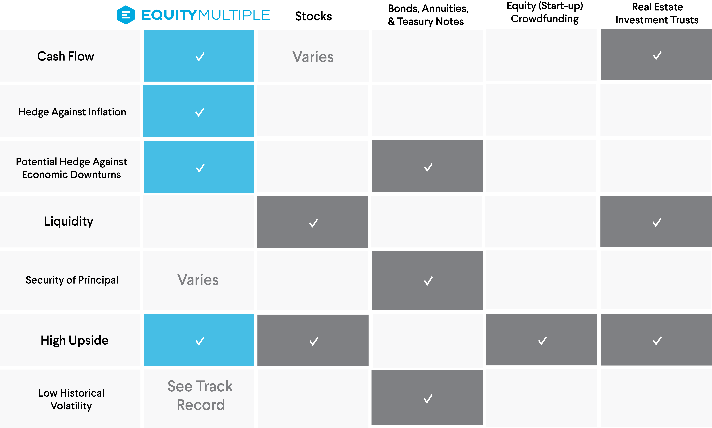

## Table of Contents

## What are real assets and how do they differ from other asset types?

Real assets are things you can touch and feel, like land, buildings, and natural resources such as oil and gold. These assets have real, physical value because they exist in the real world. People often invest in real assets because they can be a good way to protect their money from inflation, which is when the cost of things goes up over time. Real assets can also produce income, like when you rent out a building or get money from a farm.

Other types of assets, like stocks and bonds, are called financial assets. These are not physical things but are more like promises or agreements. Stocks represent ownership in a company, and bonds are like loans you give to a company or government that they promise to pay back with interest. Financial assets can be easier to buy and sell than real assets, but they can also be riskier because their value can go up and down a lot based on what's happening in the economy or with the company.

The main difference between real assets and financial assets is that real assets have a physical presence and often hold their value better over time, while financial assets are more about the potential for growth and income but can be more volatile. Both types of assets can be important parts of an investment strategy, depending on what someone is trying to achieve with their money.

## Can you provide examples of real assets?

Real assets are things you can touch and see. Some examples are land, which can be used for farming or building homes; buildings, like houses or office spaces that people can rent or live in; and natural resources, such as oil, gas, and gold, which can be taken from the earth and sold.

Another example of a real asset is timberland, where trees are grown and then cut down to be used for wood. Art and collectibles, like paintings or rare stamps, are also real assets because they are physical items that can be bought and sold. Even machinery and equipment used in factories or farms count as real assets because they are tangible and help produce goods.

These examples show how real assets are different from things like stocks or bonds, which you can't touch. Real assets often keep their value over time and can give you money through rent or selling what they produce, making them a solid choice for people looking to invest their money in something they can see and use.

## What are the main categories of other asset types?

Other asset types mainly include financial assets and intangible assets. Financial assets are things like stocks, bonds, and cash. Stocks are pieces of a company that you can buy, and if the company does well, the value of the stock can go up. Bonds are like loans you give to a company or government, and they pay you back with interest. Cash is money you can use right away. These assets are not physical but are important because they can grow in value or give you income.

Intangible assets are things you can't touch but still have value. Examples include patents, trademarks, and goodwill. A patent is a right to make or sell a new invention, and a trademark is a logo or name that shows a product comes from a certain company. Goodwill is the value of a business's reputation and customer relationships. These assets are important because they can help a company make money even though you can't see or touch them.

## How do real assets generate returns for investors?

Real assets generate returns for investors in a few ways. One way is through appreciation, which means the value of the asset goes up over time. For example, if you buy a piece of land and its value increases because more people want to live in that area, you can sell it later for more money than you paid. Another way is through income. If you own a building, you can rent it out to people or businesses and collect rent money every month. Natural resources like oil or gold can also be sold for money, which gives investors a return.

Another way real assets can generate returns is by providing a hedge against inflation. Inflation means the cost of things goes up over time, but real assets often keep their value or even go up in value when this happens. This means that if you own real assets, your money is protected from losing value due to inflation. Overall, real assets can offer investors both growth in value and regular income, making them a solid choice for people looking to build wealth over time.

## What are the risk profiles associated with real assets compared to other asset types?

Real assets like land, buildings, and natural resources can be less risky than financial assets like stocks and bonds because they have real, physical value. If you own a piece of land or a building, you can see it and use it, which makes it feel more secure. Real assets can also protect your money from inflation, which is when the cost of things goes up over time. But real assets can still have risks. For example, if you own a building and no one wants to rent it, you won't get any income. Or if you invest in oil and the price of oil goes down, you might lose money.

Financial assets like stocks and bonds can be riskier because their value can go up and down a lot based on what's happening in the economy or with the company. If a company does badly, the value of its stock can drop quickly, and you might lose money. Bonds can be safer than stocks, but if the company or government you lend money to can't pay you back, you could lose your investment. Financial assets can be easier to buy and sell than real assets, which makes them more liquid, but this ease of trading can also make their value more volatile.

Intangible assets like patents and trademarks have their own risks. They don't have physical value, so their worth depends on how well the company uses them to make money. If a company's patent becomes outdated or a trademark loses its popularity, the value of these assets can drop. But if a company uses its intangible assets well, they can be very valuable and help the company grow. Overall, each type of asset has its own risks and benefits, and investors need to think about these when deciding where to put their money.

## How does liquidity vary between real assets and other asset types?

Real assets, like land and buildings, are not as easy to turn into cash quickly as other types of assets. This means they are less liquid. If you want to sell a piece of land or a building, it can take a long time to find someone who wants to buy it and agree on a price. This can be a problem if you need money fast. But real assets can still be good investments because they often keep their value over time and can give you income from things like rent.

Financial assets, like stocks and bonds, are much easier to turn into cash. You can sell them quickly on a stock market or through a broker. This makes them more liquid. But the value of financial assets can go up and down a lot, so they can be riskier. Stocks and bonds are good for people who might need to get their money back quickly, but they need to be ready for the value to change.

Intangible assets, like patents and trademarks, are the least liquid of all. They can be hard to sell because their value depends a lot on how well the company uses them. If you try to sell a patent, you need to find someone who wants to buy it and thinks it's worth the price. This can take a long time. So, while intangible assets can be very valuable, they are not good if you need money right away.

## What are the tax implications of investing in real assets versus other asset types?

When you invest in real assets like land or buildings, you have to think about taxes. If you own a building and rent it out, you have to pay taxes on the rent money you get. This is called income tax. If you sell a real asset for more money than you paid for it, you might have to pay capital gains tax on the profit. But there are ways to save on taxes with real assets. For example, if you own a building, you can take something called depreciation, which lets you lower your taxable income by saying the building loses value over time. Also, if you hold onto a real asset for a long time before selling it, you might pay a lower capital gains tax rate.

Financial assets like stocks and bonds also have tax implications, but they work a bit differently. If you sell a stock for more than you paid for it, you'll pay capital gains tax on the profit. But if you hold onto the stock for more than a year, you might pay a lower tax rate on the gain. If you get dividends from stocks, you have to pay taxes on that money too, but there can be a lower tax rate for qualified dividends. Bonds usually give you interest, and you have to pay income tax on that interest. But some bonds, like municipal bonds, might be tax-free at the federal level, which can be a big advantage.

Intangible assets like patents and trademarks have their own tax rules. If you sell an intangible asset for a profit, you'll pay capital gains tax on that profit. But if you use the asset to make money, like using a patent to sell a product, you might have to pay taxes on the income you get from it. The tax treatment of intangible assets can be complex, and it often depends on how the asset is used and how long you own it. Overall, the tax implications of different asset types can affect how much money you keep from your investments, so it's important to understand them when deciding where to put your money.

## How do inflation and economic cycles impact real assets differently from other asset types?

Inflation and economic cycles can affect real assets like land and buildings in a different way than other asset types. Real assets often do well during times of high inflation because their value tends to go up along with the cost of everything else. If you own a piece of land or a building, you might be able to charge more rent or sell it for more money when prices are rising. This makes real assets a good way to protect your money from losing value due to inflation. But during economic downturns, like a recession, real assets can be harder to sell because fewer people have money to buy them, which can lead to lower prices.

Financial assets like stocks and bonds can be more affected by economic cycles. During good economic times, companies often do well, and the value of their stocks can go up. But in a recession, stock prices can drop a lot because people are worried about the economy and companies might not make as much money. Bonds can be safer, but if interest rates go up during inflation, the value of existing bonds can go down. So, financial assets can be riskier during economic ups and downs because their value can change a lot. But they can also offer big rewards when the economy is doing well.

Intangible assets like patents and trademarks can also be influenced by inflation and economic cycles, but in a more complex way. During high inflation, the value of these assets might go up if they help a company make more money. But if the economy slows down, companies might not be able to use these assets as effectively, which can lower their value. Intangible assets can be very valuable if a company uses them well, but they can also be hard to sell quickly, making them less liquid and more sensitive to economic changes.

## What are the diversification benefits of including real assets in an investment portfolio?

Adding real assets like land, buildings, and natural resources to an investment portfolio can help spread out risk. When you have different types of investments, if one type goes down in value, the others might not be affected as much. Real assets often do well when the economy is growing and prices are going up, which can balance out times when stocks or bonds might not be doing so well. This means that by including real assets, your overall investment might be safer because it's not all tied to the same things.

Real assets also have a way of keeping up with inflation, which means they can protect your money from losing value over time. If prices are going up, the value of real assets usually goes up too. This is different from some financial assets like bonds, which might lose value when inflation is high. By having real assets in your portfolio, you can make sure that part of your money is growing even when other parts might be shrinking. This mix can help keep your investments stable and growing over the long run.

## How do valuation methods for real assets differ from those used for other asset types?

Valuing real assets like land, buildings, and natural resources is different from valuing other types of assets. For real assets, people often use methods like the market approach, where they look at what similar assets have sold for recently. Another way is the income approach, where they figure out how much money the asset can make, like rent from a building, and then use that to guess its value. The cost approach is also used, where they add up how much it would cost to replace the asset if it were new. These methods focus on the physical and income-generating aspects of real assets, which makes sense because you can see and touch them.

Valuing financial assets like stocks and bonds is different because these assets don't have a physical form. For stocks, people use methods like the price-to-earnings ratio, where they look at the company's earnings and compare them to the stock price. For bonds, they might look at the [interest rate](/wiki/interest-rate-trading-strategies) and how likely the bond issuer is to pay back the money. These methods focus on the future income and growth potential of the company or the bond issuer. Intangible assets like patents and trademarks are even harder to value because their worth depends on how well a company uses them. People might use methods like the relief-from-royalty approach, where they guess how much money the company would save by owning the asset instead of paying to use it. Each type of asset needs a different way to figure out its value because they all work differently.

## What are the long-term performance trends of real assets compared to other asset types?

Over the long term, real assets like land, buildings, and natural resources have shown a steady performance. They often do well when prices are going up because their value tends to go up too. This means they can be a good way to protect your money from losing value over time. Real assets can also give you income, like rent from a building or money from selling oil or gold. But they can be harder to sell quickly, and their value might not grow as fast as some other investments.

Financial assets like stocks and bonds can have bigger ups and downs over the long term. Stocks can grow a lot if the company does well, but they can also lose value quickly if the company or the economy does badly. Bonds are usually safer, but their value can go down if interest rates go up. Financial assets can be easier to buy and sell, which makes them more liquid, but this also means their value can change a lot. Intangible assets like patents and trademarks can be very valuable if a company uses them well, but their value depends a lot on how the company does. They can be hard to sell quickly, which makes them less liquid. Overall, real assets can be a good choice for long-term stability and income, while financial and intangible assets might offer more growth but with more risk.

## How do regulatory environments affect the investment in real assets versus other asset types?

The rules and laws set by governments can have a big impact on how easy or hard it is to invest in real assets like land, buildings, and natural resources. For example, if the government puts new rules on how land can be used or makes it harder to get permits for building, it can slow down or even stop some real estate projects. Also, if the government decides to tax properties more, it can make owning real assets less profitable. But sometimes, the government might offer tax breaks or other benefits to encourage people to invest in certain types of real assets, like renewable energy projects. So, the rules can make a big difference in how attractive real assets are to investors.

Financial assets like stocks and bonds are also affected by government rules, but in different ways. If the government changes the rules about how companies have to report their money or how much they can pay out in dividends, it can change how much people want to invest in stocks. For bonds, if the government changes interest rates or tax laws, it can affect how much money people can make from them. Intangible assets like patents and trademarks have their own set of rules, which can be very complex. If the government changes the laws about how long a patent lasts or how trademarks can be used, it can change the value of these assets a lot. So, all types of assets are affected by government rules, but the effects can be different depending on the type of asset.

## References & Further Reading

[1]: Bergstra, J., Bardenet, R., Bengio, Y., & Kégl, B. (2011). ["Algorithms for Hyper-Parameter Optimization"](https://dl.acm.org/doi/10.5555/2986459.2986743). Advances in Neural Information Processing Systems 24.

[2]: Lopez de Prado, M. (2018). ["Advances in Financial Machine Learning"](https://www.amazon.com/Advances-Financial-Machine-Learning-Marcos/dp/1119482089). Wiley.

[3]: Aronson, D. R. (2006). ["Evidence-Based Technical Analysis: Applying the Scientific Method and Statistical Inference to Trading Signals"](https://www.amazon.com/Evidence-Based-Technical-Analysis-Scientific-Statistical/dp/0470008741). Wiley.

[4]: Jansen, S. (2020). ["Machine Learning for Algorithmic Trading"](https://github.com/stefan-jansen/machine-learning-for-trading). Packt Publishing.

[5]: Chan, E. P. (2008). ["Quantitative Trading: How to Build Your Own Algorithmic Trading Business"](https://github.com/ftvision/quant_trading_echan_book). Wiley.