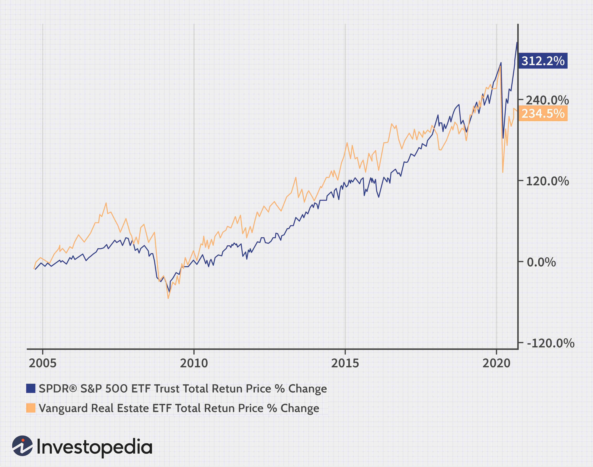

## Table of Contents

## What are the basic differences between real estate and stock market investments?

Real estate and stock market investments are two popular ways to grow your money, but they work differently. Real estate involves buying physical properties like houses or buildings. When you invest in real estate, you can earn money through rental income or by selling the property for a higher price than you paid for it. Real estate is often seen as a more stable investment because property values usually increase over time, and you can use the property while you own it. However, real estate requires a lot of money to start and can be hard to sell quickly if you need cash.

On the other hand, the stock market involves buying shares in companies. When you buy stocks, you own a small part of that company. You can make money if the company does well and the stock price goes up, or if the company pays dividends. Stocks can be bought and sold quickly, making it easier to turn your investment into cash. However, the stock market can be riskier because stock prices can go up and down a lot in a short time, and you don't have any control over the company's decisions.

In summary, real estate and stocks both have their pros and cons. Real estate can provide steady income and long-term growth, but it requires more money and time to manage. Stocks can offer quicker returns and are easier to buy and sell, but they come with higher risks due to market volatility. Choosing between the two depends on your financial goals, how much risk you're willing to take, and how much time and money you can invest.

## How does the initial investment amount compare between real estate and stocks?

The initial investment for real estate is usually much higher than for stocks. Buying a property can cost hundreds of thousands of dollars, depending on where you live. Even if you use a mortgage, you still need a large down payment, often 20% of the property's price. This makes real estate a big commitment right from the start. You also have to think about other costs like property taxes, maintenance, and insurance, which add to the total amount you need to invest.

On the other hand, you can start investing in stocks with much less money. Many online platforms let you buy stocks for just a few dollars. You can even buy fractional shares, which means you can own part of a stock without buying the whole thing. This makes it easier for people with less money to start investing in the stock market. Over time, you can add more money to your stock investments as you save up, without needing a big upfront payment like with real estate.

## What are the typical returns one might expect from real estate versus the stock market?

Real estate can give you different kinds of returns. One way is through rental income, where you earn money by renting out your property to tenants. This can give you a steady flow of money each month. Another way is through appreciation, which means the value of your property goes up over time. On average, real estate might give you returns of about 3% to 10% per year, but this can vary a lot depending on where the property is and the local real estate market. Real estate also comes with extra costs like maintenance, taxes, and insurance, which can eat into your returns.

The stock market can give you higher returns, but it's also riskier. On average, the stock market has given returns of about 7% to 10% per year over the long term. This means if you keep your money in the stock market for many years, you might see your investment grow at this rate. But stock prices can go up and down a lot in the short term, so your returns can be much higher or lower in any given year. Unlike real estate, you don't have to worry about extra costs like maintenance, but you do have to pay fees when you buy and sell stocks, which can affect your overall returns.

## How do the risks associated with real estate compare to those of the stock market?

Real estate comes with its own set of risks. One big risk is that the value of your property might not go up as much as you hope, or it might even go down. This can happen if the local real estate market does badly or if there's a big economic problem. Another risk is that you might have trouble finding good tenants if you're renting out your property, which means you won't get the rental income you need. Real estate also requires a lot of money to start and can be hard to sell quickly if you need cash, which adds to the risk.

The stock market has different risks. The biggest one is that stock prices can go up and down a lot in a short time. This means you could lose money if you need to sell your stocks when the market is down. Also, the success of your investment depends a lot on how well the companies you invest in are doing. If a company does badly, the value of your stocks in that company can drop a lot. But stocks are easier to buy and sell than real estate, so you can turn your investment into cash more quickly if you need to.

In summary, both real estate and the stock market have risks, but they are different. Real estate risks are more about the property value and rental income, and it's harder to get your money out quickly. Stock market risks are more about the ups and downs of stock prices and the performance of companies, but it's easier to turn your investment into cash when you need it.

## What are the liquidity differences between investing in real estate and stocks?

When you invest in real estate, it can be hard to get your money back quickly. Selling a house or a building takes time because you need to find a buyer who is ready to pay the price you want. Sometimes, it can take months or even longer to sell a property. This means if you need cash fast, real estate might not be the best choice because it's not very liquid. You're kind of stuck with the property until you can find someone to buy it.

On the other hand, stocks are much easier to turn into cash. You can sell your stocks any time the stock market is open, which is usually during regular business hours. It only takes a few clicks on your computer or phone, and the money is usually in your account within a few days. This makes stocks a lot more liquid than real estate. If you need money quickly, selling stocks is a much faster way to get it.

So, the main difference in [liquidity](/wiki/liquidity-risk-premium) between real estate and stocks is how quickly you can get your money back. Real estate is slow and can take a long time to sell, while stocks can be sold almost instantly. This makes a big difference if you ever need to use your investment money for something else.

## How do taxes affect returns on real estate and stock market investments?

When you invest in real estate, taxes can take a big bite out of your returns. If you rent out your property, you have to pay taxes on the rental income you earn. But you can also take some deductions, like for mortgage interest, property taxes, and maintenance costs, which can lower your tax bill. When you sell your property, you might have to pay capital gains tax if you made a profit. The tax rate depends on how long you owned the property. If you held it for more than a year, you might get a lower tax rate than if you sold it sooner. All these taxes and deductions can make your real estate returns a bit complicated to figure out.

The stock market has its own set of tax rules. If you get dividends from your stocks, you have to pay taxes on that money. But like with real estate, the tax rate on dividends can be lower if you held the stocks for a while. When you sell your stocks and make a profit, you also have to pay capital gains tax. The rate depends on how long you owned the stocks. If you held them for more than a year, you pay a long-term capital gains tax, which is usually lower than the short-term rate for stocks you held for less than a year. So, taxes can eat into your stock market returns, but knowing the rules can help you plan better.

## What role does leverage play in real estate and stock market investments?

Leverage means using borrowed money to make an investment bigger. In real estate, leverage is very common. People often take out a mortgage to buy a house or building. This lets them control a big asset with a smaller amount of their own money. If the property goes up in value, their return on the money they put in can be much higher. But leverage also makes real estate riskier. If the property value goes down or they can't pay the mortgage, they could lose the property and the money they put in.

In the stock market, you can also use leverage, but it's different. One way is through margin trading, where you borrow money from your broker to buy more stocks. This can make your returns bigger if the stock prices go up. But if the stock prices go down, you could lose more than the money you put in because you have to pay back the loan. Another way is by buying options or futures, which are like bets on how stocks will move. These can be very risky because you could lose a lot of money quickly if things don't go your way. So, leverage in the stock market can lead to big wins or big losses.

## How can diversification be achieved in real estate compared to the stock market?

Diversification in real estate means spreading your investments across different types of properties or locations. You might buy a mix of houses, apartments, and commercial buildings, or invest in properties in different cities or even countries. This can help reduce risk because if one type of property or one area does badly, your other investments might still do well. For example, if the housing market in one city goes down, your commercial property in another city might still be doing okay. But real estate diversification can be hard because it takes a lot of money to buy different properties, and it can be tricky to manage them all.

In the stock market, diversification is easier and less expensive. You can buy stocks from different companies in different industries, like tech, health care, and energy. You can also invest in different countries to spread your risk even more. Another easy way to diversify is by buying mutual funds or exchange-traded funds (ETFs), which hold a bunch of different stocks. This way, you don't have to pick individual stocks, and you can still spread your risk. Diversifying in the stock market can help protect your money if one company or industry does badly because your other investments might still do well.

## What are the management and maintenance costs associated with real estate versus stocks?

Real estate comes with a lot of management and maintenance costs. When you own a property, you have to take care of it. This means fixing things when they break, like a leaky roof or a broken heater. You might need to hire someone to do this work, or you might have to do it yourself, which takes time and money. You also have to pay for things like property taxes and insurance every year. If you rent out your property, you might need to pay for a property manager to help you find tenants and deal with any problems that come up. All these costs can add up and eat into the money you make from renting out your property.

Stocks, on the other hand, don't have these kinds of management and maintenance costs. Once you buy a stock, you don't have to do anything to keep it going. You don't have to fix anything or pay for insurance. The only costs you might have are fees when you buy or sell the stock, and sometimes a small fee if you use a financial advisor or a robo-advisor to manage your investments. These fees are usually much smaller than the costs of owning and managing a property. So, when you invest in stocks, you can keep more of your returns because you don't have to pay for upkeep and management like you do with real estate.

## How do market cycles and economic conditions impact real estate and stock market investments differently?

Market cycles and economic conditions can have a big impact on real estate. When the economy is doing well, more people have jobs and money, so they can buy or rent homes. This can make property values go up and help you earn more from renting out your property. But when the economy is bad, like during a recession, fewer people can afford to buy or rent, so property values might go down. Real estate markets can also be affected by local things, like new jobs coming to an area or a big company leaving. It can take a while for real estate to feel the effects of economic changes because buying and selling properties is slow.

The stock market can also be affected by economic conditions, but it can change much faster. When the economy is good, companies usually make more money, and their stock prices go up. But when the economy is bad, stock prices can drop quickly because investors worry about companies making less money. The stock market can also be influenced by things like interest rates, inflation, and news about companies. Because stocks can be bought and sold so quickly, the stock market can react to economic changes almost right away, which can make it more volatile than real estate.

## What advanced strategies can be used to enhance returns in real estate and stock market investments?

In real estate, one advanced strategy to boost returns is called "flipping." This means buying a property that needs work, fixing it up, and then selling it for a higher price. You need to know the local real estate market well and be good at finding properties that are undervalued. Another strategy is "house hacking," where you live in one part of a property and rent out the other parts. This can help cover your mortgage and other costs, making your investment more profitable. You can also use "1031 exchanges" to sell one property and buy another without paying taxes right away, which can help you grow your real estate portfolio faster.

In the stock market, one way to increase returns is through "options trading." This involves buying and selling options, which are contracts that give you the right to buy or sell a stock at a certain price. Options can be risky but can also lead to big returns if you know what you're doing. Another strategy is "dividend reinvestment," where you use the money you get from dividends to buy more stocks. This can help your investment grow over time. You can also use "dollar-cost averaging," which means investing a fixed amount of money at regular intervals. This can help you buy more stocks when prices are low and fewer when prices are high, which can lead to better long-term returns.

## How do global investment opportunities in real estate and stocks compare in terms of potential and risks?

Global real estate investments can offer big chances for making money, but they also come with more risks. When you buy property in another country, you can make money from the growth in property values or from renting it out to people there. Some places might be growing fast and have high demand for homes or buildings, which can make your investment grow a lot. But there are also risks. You have to learn about different laws and rules in that country, which can be hard. There might be problems with the economy or politics in that country that can make property values drop. It can also be tough to manage a property from far away, and you might have to pay more in taxes or fees.

Global stock market investments also have a lot of potential and risks. When you buy stocks from companies in different countries, you can spread your money around and maybe make more money if those companies do well. Some countries might have booming businesses or new industries that can make stock prices go up a lot. But like with real estate, there are risks. The stock market in another country can be affected by things like changes in the economy, politics, or even big world events. There can also be extra costs like currency exchange fees when you buy and sell stocks in different countries. You need to know about these things to make good choices and manage your risks.

## References & Further Reading

[1]: Bergstra, J., Bardenet, R., Bengio, Y., & Kégl, B. (2011). ["Algorithms for Hyper-Parameter Optimization."](https://dl.acm.org/doi/10.5555/2986459.2986743) Advances in Neural Information Processing Systems 24.

[2]: ["Advances in Financial Machine Learning"](https://www.amazon.com/Advances-Financial-Machine-Learning-Marcos/dp/1119482089) by Marcos Lopez de Prado

[3]: ["Evidence-Based Technical Analysis: Applying the Scientific Method and Statistical Inference to Trading Signals"](https://www.amazon.com/Evidence-Based-Technical-Analysis-Scientific-Statistical/dp/0470008741) by David Aronson

[4]: ["Machine Learning for Algorithmic Trading"](https://github.com/stefan-jansen/machine-learning-for-trading) by Stefan Jansen

[5]: ["Quantitative Trading: How to Build Your Own Algorithmic Trading Business"](https://www.amazon.com/Quantitative-Trading-Build-Algorithmic-Business/dp/1119800064) by Ernest P. Chan