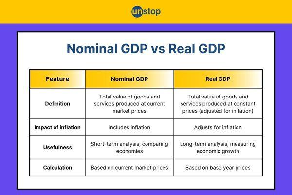

## Table of Contents

## What is GDP and why is it important?

GDP, or Gross Domestic Product, is the total value of all goods and services produced in a country during a specific time, usually a year. It's like adding up everything that people and businesses in a country make and sell. Think of it as a big scoreboard that shows how much a country's economy is producing.

GDP is important because it helps us understand how well a country's economy is doing. When GDP goes up, it usually means more people have jobs and are earning money. Governments and businesses use GDP to make decisions, like planning budgets or deciding where to invest. If GDP is growing, it can mean the country is doing well, but if it's shrinking, it might be a sign of trouble. So, keeping an eye on GDP helps everyone understand the health of the economy.

## What is the difference between Real GDP and Nominal GDP?

Real GDP and Nominal GDP are two ways to measure the total value of goods and services produced in a country, but they do it differently. Nominal GDP is the raw total, calculated using the current prices of goods and services. This means if prices go up because of inflation, Nominal GDP will also go up, even if the actual amount of goods and services produced stays the same. It's like looking at the total sales of a store without adjusting for price changes.

Real GDP, on the other hand, takes inflation into account. It uses constant prices from a base year to measure the value of goods and services. This way, Real GDP shows the true growth or decline in the economy by removing the effect of price changes. It's like comparing the number of items sold in a store over time, rather than just looking at the total money made. By using Real GDP, we get a clearer picture of whether the economy is actually producing more or less, which is crucial for understanding economic health.

## How is Nominal GDP calculated?

Nominal GDP is the total value of all goods and services produced in a country during a year, calculated using the current prices. To find it, you add up the value of everything made and sold, without adjusting for changes in prices over time. If a country makes more cars and the price of cars goes up, Nominal GDP will show a bigger number because it counts the total money made from selling those cars at today's prices.

Because Nominal GDP uses current prices, it can go up even if the country isn't making more stuff. If prices rise due to inflation, Nominal GDP will increase even if the actual amount of goods and services stays the same. This makes Nominal GDP a useful measure for seeing how much money is flowing in the economy at the moment, but it doesn't tell us if the economy is really growing or shrinking without considering price changes.

## How is Real GDP calculated?

Real GDP is a way to measure how much a country makes, but it uses prices from a certain year in the past instead of today's prices. This helps us see if the country is really making more things or if prices are just going up. To calculate Real GDP, you take the total amount of goods and services made and multiply it by the prices from that base year. This way, even if today's prices are higher, you're using the same old prices to measure everything, so you can see the real growth.

For example, if a country made 100 cars last year and 105 cars this year, and the price of a car was $20,000 in the base year, you'd calculate Real GDP by multiplying 100 cars by $20,000 for last year, which is $2,000,000, and 105 cars by $20,000 for this year, which is $2,100,000. This shows a real increase in production because you're using the same price for both years. By doing this, Real GDP gives a clearer picture of whether the economy is growing or not, without the confusion from price changes.

## Why is it important to compare Real GDP and Nominal GDP?

Comparing Real GDP and Nominal GDP helps us understand the true health of an economy. Nominal GDP can go up just because prices are rising, even if the country isn't making more stuff. This can be misleading because it might look like the economy is doing well when it's just inflation making things more expensive. By looking at Real GDP, which uses prices from a past year, we can see if the country is really producing more goods and services. This gives us a clearer picture of whether the economy is actually growing or if it's just the prices that are going up.

Real GDP helps us make better decisions about the economy. If we only look at Nominal GDP, we might think the economy is booming and spend more money, but if it's just inflation, that could lead to problems. By comparing the two, governments and businesses can see if growth is real or if it's just because of higher prices. This way, they can plan better, like deciding where to invest or how to set budgets. Understanding the difference between Real and Nominal GDP helps everyone make smarter choices about the economy.

## What are the common base years used for calculating Real GDP?

The base year for calculating Real GDP is a specific year chosen to compare economic data over time. It's like a starting point that helps us see how much things have changed. Different countries might pick different base years, but they often choose a year when the economy was doing well or a year that's easy to remember, like a round number.

In the United States, the base year used to be 2009, but it was updated to 2012 in 2018. This change helps keep the data more accurate because prices and the economy change over time. Other countries might use different years, like the European Union, which used 2010 as a base year for a while. The important thing is to pick a year that makes sense for the country and helps everyone understand the economy better.

## How do inflation and deflation affect Nominal and Real GDP?

Inflation and deflation can change how we see the economy when we look at Nominal GDP and Real GDP. Inflation means prices are going up. When this happens, Nominal GDP goes up too, even if the country isn't making more stuff. It's like if you sell the same number of apples but each apple costs more, your total money from selling apples goes up. But Real GDP takes away the effect of inflation. It uses prices from a past year, so if the country is only making the same amount of stuff, Real GDP stays the same even if prices are higher now. This way, Real GDP shows if the economy is really growing or not.

Deflation is the opposite, where prices are going down. When deflation happens, Nominal GDP can go down even if the country is making the same amount of stuff. It's like selling the same number of apples but each apple costs less, so your total money from selling apples goes down. But Real GDP still uses those old prices from the base year, so it can show if the country is really making less stuff or if it's just because prices are lower now. By looking at both Nominal and Real GDP, we can understand if changes in the economy are because of inflation, deflation, or if the country is really making more or less.

## Can you give examples of how Real GDP and Nominal GDP have diverged in the past?

In the United States during the 1970s, there was a period known as stagflation, where the economy was not growing much, but prices were going up a lot. Nominal GDP was rising because of the higher prices, but Real GDP was not growing as fast or even staying the same. This showed that even though it looked like the economy was doing well because of the high Nominal GDP, the reality was that people were not buying more stuff; they were just paying more for the same things.

Another example is Japan in the 1990s, when the country went through a period called the "Lost Decade." During this time, Nominal GDP was not growing much because prices were not going up a lot, but Real GDP was also not growing because the country was not making more stuff. This showed that the economy was not doing well, even though Nominal GDP was stable. It was a clear case where both Nominal and Real GDP told a similar story of economic stagnation, but for different reasons.

In more recent years, during the global financial crisis of 2008-2009, many countries saw their Nominal GDP drop because of falling prices and lower demand. But Real GDP also dropped, showing that the economy was really making less stuff. This was a case where both measures showed a clear downturn, but Real GDP helped to show the true extent of the economic contraction by removing the effect of falling prices.

## What are the limitations of using GDP as an economic indicator?

GDP is a good way to see how much a country is making, but it has some problems. One big problem is that GDP only counts things that people pay money for. This means things like volunteering or taking care of family at home don't count, even though they're important for the community. Also, GDP doesn't show if the money is spread out fairly among people. A country can have a high GDP, but if most of the money goes to just a few people, many others might still be poor.

Another limitation is that GDP doesn't tell us about the quality of life or the environment. If a country makes more stuff but pollutes a lot, GDP goes up even though the environment gets worse. Also, GDP can go up if people need to spend more on things like healthcare or fixing damage from natural disasters, but that doesn't mean people are happier or healthier. So, while GDP is useful, it's important to look at other things too, like how happy people are, how clean the environment is, and how fair the economy is.

## How do economists adjust GDP figures for international comparisons?

When economists want to compare how much different countries are making, they need to fix the numbers so they can be compared fairly. They do this by using something called Purchasing Power Parity (PPP). PPP helps to see how much things cost in different countries. For example, if a burger costs $5 in the US but the same burger costs $2 in another country, PPP helps to make these prices equal so we can compare them better. By using PPP, economists can see how much each country is really making, not just how much money they are using.

Another way economists adjust GDP for international comparisons is by converting all the numbers into one currency, usually the US dollar. This helps because if one country uses euros and another uses yen, it's hard to compare them directly. But even after converting to dollars, they might still use PPP to make sure the comparison is fair. This way, they can see which countries are doing better or worse, even if they use different money.

## What advanced statistical methods are used to refine GDP estimates?

Economists use advanced statistical methods to make GDP estimates more accurate. One common method is called "seasonal adjustment." This helps to remove the effects of regular changes that happen every year, like more shopping during holidays or less activity in winter. By taking out these patterns, economists can see the real changes in the economy more clearly. Another method they use is called "chain linking." This helps to connect GDP numbers from different years by using a series of short periods instead of one big jump. This makes the numbers smoother and more accurate over time.

Another important method is "imputation," which is used to fill in missing data. Sometimes, not all the information needed to calculate GDP is available, so economists use other data to guess what's missing. This helps to make the total GDP number more complete. Also, economists use "econometric models" to predict and refine GDP estimates. These models use lots of data and math to understand how different parts of the economy affect each other. By using these models, economists can make better guesses about what the economy will do next and adjust their GDP numbers to be more precise.

## How do changes in Real and Nominal GDP influence monetary policy decisions?

Changes in Real and Nominal GDP help central banks decide on monetary policy, which is about controlling how much money is in the economy. When Nominal GDP goes up a lot because prices are rising, it might mean there's too much money around, causing inflation. Central banks might then raise interest rates to make borrowing more expensive, so people spend less and slow down the economy. If Nominal GDP goes down because prices are falling, it might mean there's not enough money, and the central bank could lower interest rates to make borrowing cheaper, encouraging people to spend more and help the economy grow.

Real GDP is also important because it shows if the economy is really growing or shrinking. If Real GDP is growing slowly or shrinking, it might mean the economy needs help. Central banks might lower interest rates to make it easier for businesses to borrow money and invest, which can help create jobs and boost the economy. On the other hand, if Real GDP is growing too fast, it might cause inflation, so the central bank might raise interest rates to cool things down. By looking at both Real and Nominal GDP, central banks can make better decisions to keep the economy stable.

## What is Understanding Nominal GDP?

Nominal Gross Domestic Product (GDP) represents the total market value of all final goods and services produced within a country's borders in a given time period, evaluated using current prices. This metric provides a straightforward account of the economy's present performance by capturing the value of goods and services based on the prices at which they are actually sold. 

When calculating Nominal GDP, the formula is:

$$
\text{Nominal GDP} = \sum (P_t \times Q_t)
$$

where $P_t$ is the current price of goods and services in year $t$, and $Q_t$ is the quantity of goods and services produced in year $t$.

Nominal GDP is advantageous for offering a snapshot of the economy at specific times, which can be useful for comparing economic activity over short periods. For instance, during times of immediate economic recovery or downturn, Nominal GDP can give a quick indication of economic activity based solely on current price levels and output. However, its primary limitation is its inability to distinguish between changes in output and changes in the price level. This limitation is particularly significant during periods of inflation or deflation. For example, if prices increase while actual production remains stable, Nominal GDP would rise, suggesting economic growth when there may be none in terms of actual production.

Therefore, while Nominal GDP effectively provides an overview of economic activity without adjusting for price level changes, using it for long-term economic analysis can be misleading. It fails to differentiate whether growth is due to increased production or simply rising prices. This characteristic can obscure the real changes in economic output over time, limiting its usefulness for understanding the true state of economic performance during inflationary or deflationary periods.

## What is Exploring Real GDP?

Real GDP is a crucial economic metric that adjusts for the effects of inflation, providing a more accurate representation of an economy's true size and growth. Unlike Nominal GDP, which evaluates economic performance based on current market prices, Real GDP uses a consistent set of base-year prices to neutralize the distortions that can occur due to fluctuating price levels. This adjustment allows for a clearer analysis of economic growth and productivity over different time periods.

To calculate Real GDP, the formula used is:

$$
\text{Real GDP} = \frac{\text{Nominal GDP}}{\text{GDP Deflator}} \times 100
$$

Where the GDP Deflator is an index that measures the change in prices for all of the goods and services produced in an economy. It reflects how much of the change in Nominal GDP can be attributed to changes in the price level.

The use of constant base-year prices is essential for meaningful economic comparisons. By eliminating inflationary effects, Real GDP provides a consistent measure, facilitating the evaluation of an economy's growth without the need for additional inflation adjustments. This consistency is particularly beneficial when comparing the economic output of a country over a series of years, assessing the real growth rather than growth that is merely nominal or due to price level changes.

Economists and policymakers often rely on Real GDP for its accuracy and reliability in conveying true economic growth. It informs a wide range of policy decisions, such as interest rates, tax policies, and government spending levels. By analyzing Real GDP trends, decision-makers can devise strategies that foster sustainable economic development. This measure helps evaluate whether GDP growth reflects real improvements in production levels or merely the inflation of prices, ensuring that policies are based on genuine economic progress.

## What are the key differences between Nominal and Real GDP?

Nominal GDP and Real GDP are two crucial metrics used to evaluate economic output and performance. The primary distinction between these measures lies in their treatment of price changes. Nominal GDP calculates the total market value of all finished goods and services produced within a country using current prices during the reporting period. This means that it reflects both changes in market price levels and actual production [volume](/wiki/volume-trading-strategy).

On the other hand, Real GDP adjusts for changes in price levels—specifically, inflation or deflation—by employing a GDP deflator. This adjustment allows economists and analysts to compare economic productivity across different periods by removing the distortion caused by fluctuating prices. Real GDP thus offers a more accurate representation of an economy's genuine growth over time, without the misleading effects of inflation.

The mathematical relationship between Nominal GDP, Real GDP, and the GDP deflator is expressed as:

$$
\text{Real GDP} = \frac{\text{Nominal GDP}}{\text{GDP Deflator}} \times 100
$$

Where the GDP deflator is an index reflecting the relative change in price levels from a base year. This formula enables analysts to extract the real growth component from economic data, facilitating a precise analysis of economic trends and performance.

Understanding the differences between Nominal GDP and Real GDP is crucial for ensuring accurate economic analysis. Nominal GDP can often exaggerate economic growth or contraction with its sensitivity to price movements, while Real GDP provides a clearer, more reliable picture by focusing solely on output changes. This distinction is particularly important for formulating effective economic policies and making informed investment decisions. Recognizing the impact of inflation on GDP figures allows policymakers and investors to make decisions that align more closely with real economic conditions.

## References & Further Reading

Bureau of Economic Analysis - The Bureau of Economic Analysis (BEA) is a trusted authority for obtaining comprehensive and detailed GDP data. The institution provides real-time updates and statistical information on both Nominal and Real GDP, helping analysts and researchers understand economic dynamics through accurate data. Access the BEA's resources to explore GDP reports, economic accounts, and related statistical tools that facilitate in-depth economic analysis and visualization.

Investopedia - Investopedia serves as a valuable educational resource for those seeking a thorough understanding of economic concepts, particularly Nominal and Real GDP. The platform offers detailed guides, explanatory articles, and video tutorials that clarify the distinctions between these GDP measures, providing practical insights into their implications for economic analysis and trading strategies. Check out Investopedia's well-structured content to enhance your grasp of GDP-related topics.

Academic literature on [algorithmic trading](/wiki/algorithmic-trading) and economic indicators offers insight into the integration of GDP metrics within complex trading models. Authors like Marcos Lopez de Prado and Ernest P. Chan provide in-depth explorations and practical applications of quantitative strategies in trading, which encompass the use of GDP data. Lopez de Prado's works focus on [machine learning](/wiki/machine-learning) and its applications in finance, while Chan’s [books](/wiki/algo-trading-books) offer practical guidance on quantitative investment using a variety of economic indicators, including GDP. These resources are crucial for understanding how economic metrics like GDP can inform algorithmic trading approaches and strategies.

