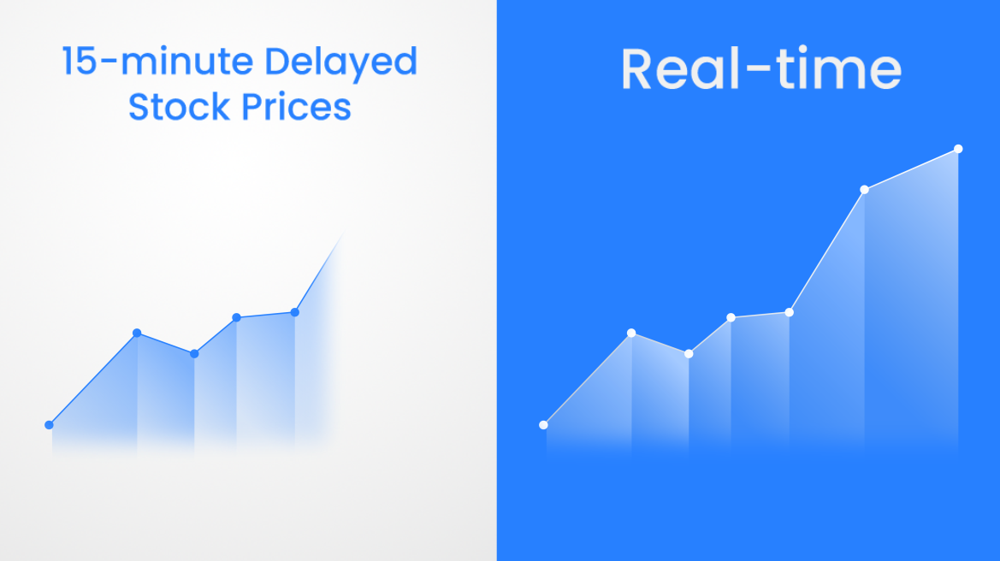

## Table of Contents

## What are real-time market quotes?

Real-time market quotes are the current prices of stocks, bonds, commodities, or other financial instruments shown as they happen. They update every second or even faster, so you always know the latest price. This is important for people who trade a lot because they need to make quick decisions based on the newest information.

These quotes come from stock exchanges, like the New York Stock Exchange or NASDAQ, and are sent to brokers and financial websites. You can see them on trading platforms or financial news websites. Real-time quotes help traders see how prices are moving and decide when to buy or sell. Without them, traders might miss out on good opportunities or make decisions based on old information.

## What are delayed market quotes?

Delayed market quotes are prices of stocks, bonds, or other financial things that aren't shown right away. Instead of updating every second like real-time quotes, they might be 15 or 20 minutes behind. This means if you look at a delayed quote, you're seeing what the price was a little while ago, not what it is right now.

These delayed quotes are often used by people who don't need the very latest information to make their decisions. They can be found on many financial websites and apps that want to give you some information for free. But if you're a trader who needs to act quickly, delayed quotes might not be helpful because the prices could have changed by the time you see them.

## How do real-time and delayed market quotes differ?

Real-time market quotes show the current prices of stocks, bonds, or other financial things as they happen. They update every second or even faster, so you always see the latest price. This is really important for traders who need to make quick decisions because they can see exactly what's happening in the market right now. Real-time quotes come from stock exchanges and are sent to brokers and financial websites where traders can see them.

Delayed market quotes, on the other hand, show prices that are not up-to-the-minute. They might be 15 or 20 minutes behind the real-time prices. This means if you look at a delayed quote, you're seeing what the price was a little while ago, not what it is right now. Delayed quotes are often used by people who don't need the very latest information to make their decisions. They can be found on many financial websites and apps that offer some information for free, but they're not as useful for traders who need to act quickly.

## Why might someone use delayed market quotes instead of real-time?

Someone might use delayed market quotes instead of real-time ones because they are often free. Many financial websites and apps offer delayed quotes without charging, which is great for people who want to keep an eye on the market but don't want to pay for real-time data. If you're not trading every day or need to make quick decisions, delayed quotes can be enough to get a general idea of how the market is doing.

Also, not everyone needs the very latest information to make their financial decisions. For example, long-term investors who hold onto their stocks for months or years might not care about the price changes that happen minute by minute. For them, seeing the price from 15 or 20 minutes ago is good enough. So, delayed market quotes can be a good choice for people who want to save money and don't need to act quickly on the latest market movements.

## What are the costs associated with accessing real-time versus delayed market quotes?

Real-time market quotes usually cost money. You often have to pay a subscription fee to get this up-to-the-minute information. This can be through a brokerage service, a financial website, or a special trading platform. The cost can vary a lot, from a few dollars a month to much more, depending on where you get the data and how much detail you need. Traders who need to make quick decisions and act on the latest information are usually the ones who pay for real-time quotes.

On the other hand, delayed market quotes are often free. Many financial websites and apps give you access to delayed quotes without charging anything. This is because the information is not as current, usually being 15 to 20 minutes behind real-time data. People who don't need the very latest information, like long-term investors, find delayed quotes useful enough. They can keep an eye on the market without spending any money on subscriptions.

## How can the accuracy of real-time and delayed market quotes impact trading decisions?

The accuracy of real-time market quotes is really important for traders who need to make quick decisions. If you're trading and you see the exact price of a stock right now, you can buy or sell at the best possible moment. This can make a big difference in how much money you make or lose. If the quotes are not accurate, you might buy a stock thinking it's cheaper than it really is, or sell it thinking it's more expensive. This can lead to bad trades and losing money.

Delayed market quotes, which are usually 15 to 20 minutes behind, can be less accurate for making quick trading decisions. If you're using delayed quotes, you're looking at old prices, and the market might have changed a lot in those minutes. This can make you miss out on good chances to buy or sell at the right time. But if you're not trading every day and you're more of a long-term investor, the slight delay might not matter as much. You can still get a good idea of how the market is doing without needing the very latest information.

## What are the typical delay times for delayed market quotes?

Delayed market quotes usually have a delay of 15 to 20 minutes. This means the prices you see are not the current ones but what they were a little while ago. Many financial websites and apps offer these delayed quotes for free because they are not as up-to-date as real-time quotes.

The exact delay time can vary a bit depending on where you get the quotes from. Some places might have a 15-minute delay, while others could be 20 minutes or even more. But in general, if you're using delayed quotes, you're looking at prices that are about 15 to 20 minutes old.

## How do different financial platforms handle real-time and delayed quotes?

Different financial platforms handle real-time and delayed quotes in their own ways. Some platforms, like professional trading apps and certain brokerage services, offer real-time quotes to their users. These platforms usually charge a fee for this service because real-time data is very important for people who trade a lot and need the latest information to make quick decisions. For example, platforms like Bloomberg Terminal or E-Trade provide real-time quotes, but you have to pay a subscription fee to use them.

Other platforms, like many free financial websites and apps, offer delayed quotes instead. These delayed quotes are often 15 to 20 minutes behind the real-time prices. Websites like Yahoo Finance or apps like Robinhood might show you these delayed quotes for free because they are not as up-to-date. This is good enough for people who don't need the very latest information and just want to keep an eye on the market without spending money.

## What regulatory considerations affect the distribution of real-time and delayed market quotes?

There are rules that affect how real-time and delayed market quotes are shared. These rules come from places like the Securities and Exchange Commission (SEC) in the U.S. They want to make sure that everyone has a fair chance in the market. So, they have rules about who can see real-time quotes and how fast the information can be shared. For example, some exchanges might only let certain people see real-time quotes, like big investors or brokers, because they pay for it. This can help keep the market fair by making sure that everyone doesn't get the same information at the same time.

Delayed quotes are often shared more freely because they are not as new. The rules for delayed quotes are usually less strict. Websites and apps can show these quotes without needing special permission because the information is a bit old. This helps people who don't need the very latest information to still keep an eye on the market. But even with delayed quotes, there are rules about how long the delay has to be, usually 15 to 20 minutes, to make sure it's not too close to real-time.

## How does the choice between real-time and delayed quotes affect algorithmic trading strategies?

The choice between real-time and delayed quotes can really change how algorithmic trading strategies work. If you're using real-time quotes, your trading algorithms can make quick decisions based on the very latest prices. This is super important for high-frequency trading, where the goal is to buy and sell lots of stocks in a very short time. Real-time data lets these algorithms jump on small price changes right away, which can help them make more money. But, using real-time quotes means you have to pay for them, and that can add to the cost of your trading strategy.

On the other hand, if you're using delayed quotes, your algorithms will be working with information that's a bit old. This can slow down your trading because you're not seeing the latest prices. For strategies that need to act fast, like high-frequency trading, delayed quotes can be a big problem. They might miss out on good chances to buy or sell at the best times. But if your trading strategy is more about looking at bigger trends over time, delayed quotes might be okay. They can still give you a good idea of what's happening in the market without costing as much as real-time quotes.

## What are the technological requirements for accessing real-time market quotes?

To access real-time market quotes, you need good technology. You need a fast internet connection so the quotes can update quickly. If your internet is slow, you might not see the latest prices in time, which can be a problem for trading. You also need a computer or a device that can handle a lot of information coming in fast. This means your device should have a good processor and enough memory to keep up with the real-time data.

You also need special software or apps that can show real-time quotes. These are usually provided by brokers or financial platforms that charge for this service. The software needs to be able to connect to the stock exchange's data feed and show the prices as they change. If you're using a trading platform, it should be able to work well with your computer or device so you can see and use the real-time quotes without any delays.

## How do market data providers ensure the integrity and security of real-time versus delayed market quotes?

Market data providers work hard to keep real-time and delayed market quotes safe and accurate. For real-time quotes, they use strong security measures like encryption to make sure the data stays private and can't be changed by hackers. They also have systems to check the data as it comes in to make sure it's correct. If something seems off, they can fix it quickly. This is really important because real-time quotes are used by traders who need to trust that the prices they see are right.

For delayed quotes, the security steps are a bit different because the information is not as new. Even though delayed quotes are less up-to-date, providers still use some security to keep the data safe. They might not need as much encryption since the quotes are older, but they still check the data to make sure it's correct. The main goal is to make sure that even though the quotes are delayed, they are still accurate and useful for people who don't need the very latest information.

## What is the relationship between Algorithmic Trading and Data Timing?

Algorithmic trading systems rely heavily on the precision and timing of data feeds to execute trades efficiently. These computerized systems, often programmed with complex algorithms, analyze market data to identify and act on trading opportunities. Access to real-time data significantly boosts the performance of these systems by allowing traders to identify and exploit market inefficiencies such as small price discrepancies or momentary imbalances in supply and demand.

Real-time data ensures that trading algorithms can execute orders with minimal delay, which is critical in rapidly changing markets. The core advantage lies in the ability of these algorithms to react in milliseconds to market movements, thus capitalizing on transient opportunities before they vanish. For example, a high-frequency trading algorithm may continuously analyze stock prices using real-time data and execute trades within nanoseconds to benefit from minor price changes. The mathematical representation of such strategies often involves optimizing order execution based on the latest market information:

$$
\text{Profit} = \sum_{t=1}^{T} (P_{\text{sell}, t} - P_{\text{buy}, t} - \text{Transaction Cost})
$$

Where $P_{\text{sell}, t}$ and $P_{\text{buy}, t}$ are the selling and buying prices at time $t$, adjusted for transaction costs.

Despite the benefits of real-time data, algorithmic strategies must also contend with challenges like slippage and [liquidity](/wiki/liquidity-risk-premium) issues. Slippage occurs when there is a difference between the expected price of a trade and the actual price at which the trade is executed. This discrepancy can erode profits, particularly in volatile markets where price changes occur rapidly. Liquidity issues, too, can impact trades, especially for large transactions or trades in less liquid markets. Limited market depth may result in wider spreads or force trades to be executed over multiple price levels, thereby increasing costs.

Additionally, algorithms must be robustly designed to manage these risks and include mechanisms to handle unexpected market conditions. This can involve setting parameters for maximum allowable slippage, or incorporating liquidity-adjusted strategies that adapt to changing market depth. The programming of such systems may include stop-loss orders or other automated risk management techniques to mitigate potential financial losses. A simple Python strategy incorporating slippage management might involve:

```python
def execute_trade(order_price, market_price, slippage_tolerance):
    if abs(order_price - market_price) <= slippage_tolerance:
        return "Trade Executed"
    else:
        return "Trade not executed, Slippage too high"

# Example usage
order_price = 100
market_price = 101
slippage_tolerance = 1.5

trade_status = execute_trade(order_price, market_price, slippage_tolerance)
```

In conclusion, the intricate timing of data in [algorithmic trading](/wiki/algorithmic-trading) underscores the critical role of real-time information, while also necessitating strategies to mitigate risks associated with slippage and liquidity.

## References & Further Reading

[1]: Aldridge, I. (2013). ["High-Frequency Trading: A Practical Guide to Algorithmic Strategies and Trading Systems"](https://books.google.com/books/about/High_Frequency_Trading.html?id=8QpIsVUMhmEC) Wiley.

[2]: Duran, R. (2015). ["Real-Time Trading Systems and Strategies: Experimentation and Analysis."](https://www.sciencedirect.com/science/article/pii/S1319157824001046) Springer.

[3]: Kissell, R. (2013). ["The Science of Algorithmic Trading and Portfolio Management."](https://www.sciencedirect.com/book/9780124016897/the-science-of-algorithmic-trading-and-portfolio-management) Elsevier.

[4]: Thewlis, J. (2016). ["Understanding High Frequency Trading and Its Impact on Microstructure and Trading Strategies."](https://conference.nber.org/confer/2010/MMf10/Brogaard.pdf) Palgrave Macmillan UK.

[5]: Aldridge, I. (2010). ["Real-Time Risk: What Investors Should Know About Fintech and High-Frequency Trading."](https://www.wiley.com/en-us/Real+Time+Risk%3A+What+Investors+Should+Know+About+FinTech%2C+High+Frequency+Trading%2C+and+Flash+Crashes-p-9781119318965) Wiley.