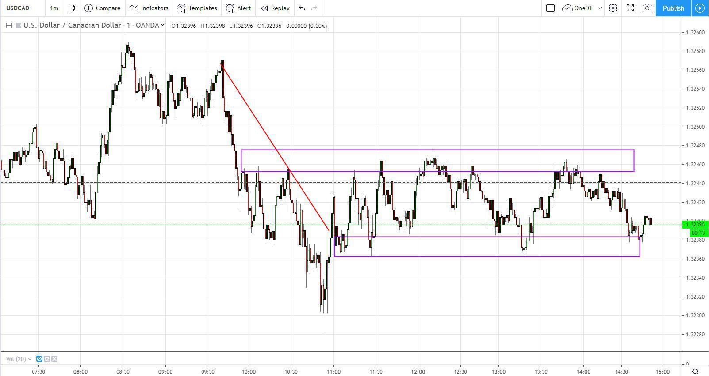

In the fast-paced financial markets, the precision of data and the timing of its delivery are critical for traders and investors seeking to maximize profits and minimize risks. Efficient trading relies heavily on the availability of accurate market information, which can be categorized mainly into two types: real-time market quotes and delayed market quotes. These types vary significantly in terms of immediacy and application, influencing the strategies employed by financial professionals.

Real-time market quotes provide an almost instantaneous reflection of stock prices and market indices, allowing traders to make decisions based on the most current data available. This level of immediacy is especially vital for day traders and high-frequency traders, who need to adjust their positions rapidly to capitalize on fleeting opportunities or mitigate losses.



In contrast, delayed market quotes offer data with a typical lag of 15-20 minutes. While less immediate, these quotes are often sufficient for long-term investors whose strategies do not hinge on second-by-second price changes. Delayed data can provide a cost-effective means to assess general market trends without the financial burden that often accompanies the acquisition of real-time data.

The differences between these data types have considerable implications for algorithmic trading, a method that relies on algorithms to execute trades at speeds and frequencies beyond human capability. Algorithms require precise timing to function optimally, tapping into market inefficiencies and executing pre-set strategies based on specified criteria.

Both real-time and delayed data have their respective advantages and disadvantages, and understanding their roles is crucial for market participants. Financial professionals must effectively navigate these options to make informed trading decisions that align with their objectives and resources.

## Table of Contents

## Understanding Real-Time Market Quotes

Real-time market quotes represent the most current data available regarding the prices of stocks and market indices. These quotes are delivered instantaneously as transactions occur on various trading platforms, enabling users to access the latest price information with minimal delay. This type of data is indispensable for day traders and high-frequency traders (HFTs), who depend on precise timing and quick execution to capitalize on small price movements.

For day traders, the availability of real-time data is essential; their strategies often revolve around buying and selling securities within the same trading day. Immediate access to current market data allows them to make informed buy or sell decisions, avoiding the risks associated with price fluctuations throughout the day. Similarly, high-frequency traders, who execute numerous trades at very high speeds, rely on these quotes to implement algorithmic strategies that seek to exploit market inefficiencies. Their algorithms are programmed to make rapid decisions based on the current state of the market, necessitating immediate and accurate data.

One of the primary benefits of real-time market quotes is the provision of immediate market insights. Such insights enable traders to monitor and assess market conditions as they develop. For example, if a significant event occurs, such as an earnings announcement or a geopolitical development, traders can quickly adjust their strategies to reflect the new market dynamics. This rapid reaction can be critical to maximizing profits and minimizing losses.

Real-time quotes also assist traders in calculating technical indicators that are crucial for chart analysis and developing trading strategies. Technical indicators like moving averages, Relative Strength Index (RSI), and Bollinger Bands can inform traders about the strength or weakness of a security, helping them to identify potential buy or sell signals.

Python programming, among other tools, can be particularly useful for traders monitoring real-time market quotes. For example, using Python libraries such as `pandas` and `numpy`, it is possible to set up a system that continuously fetches and analyzes real-time data:

```python
import pandas as pd
import numpy as np

# Hypothetical function to fetch real-time market data
def fetch_real_time_data(ticker):
    # This function would interface with a real trading API
    data = {
        'Price': np.random.random(),  # Simulate a market price
        'Volume': np.random.randint(100, 1000)
    }
    return data

# Continuous monitoring of a stock
ticker = 'AAPL'
while True:
    data = fetch_real_time_data(ticker)
    df = pd.DataFrame([data])
    current_price = df['Price'].iloc[-1]
    print(f"Current price of {ticker}: {current_price}")
    # Trader can now implement logic based on current_price
```

This example demonstrates a basic mechanism by which traders can process and utilize real-time market data to inform their trading decisions. Through the effective use of real-time market quotes and supporting technologies, traders can maintain a competitive edge by swiftly adapting to changes and executing trades efficiently.

## The Role and Value of Delayed Market Quotes

Delayed market quotes present financial information with a time lag, typically ranging from 15 to 20 minutes following the actual market events. This delay transforms such data into a valuable resource for specific investor profiles, primarily those with a long-term focus. Unlike traders who require immediate data for split-second decision-making, long-term investors seek broader market trends and are less affected by short-term price fluctuations. The utility of delayed quotes lies primarily in their sufficiency for these investors’ needs.

For long-term investors, the key advantage of delayed market quotes is the cost-effectiveness they provide. Real-time data comes with added expenses due to the technology and infrastructure required to transmit such timely information. As a result, delayed data offers a viable alternative without substantially diminishing the quality of investment decisions for these investors. This cost-saving aspect can accumulate significantly over time, contributing positively to overall portfolio returns, especially in environments where transaction costs and fees pose a considerable challenge to maintaining returns.

Another critical value of delayed quotes is in their application to individuals and entities interested in analyzing general market trends rather than precise, real-time price movements. This data set can be used to study historical pricing patterns, assess the impact of past economic events on markets, and build investment models that focus on sustaining long-term strategies rather than reacting to every market shift.

Furthermore, delayed market data provides a robust foundation for testing trading strategies under realistic conditions. Investors can utilize these data sets to back-test strategies and understand how they would have performed in different market environments. The insights gained from analyzing delayed market quotes can help refine investment approaches, ensuring that they align with overarching objectives rather than short-term market shocks.

In summary, while delayed market quotes may not cater to the needs of high-frequency and day traders who rely on immediate information to perform trades, they hold substantial value for long-term investors. By offering a cost-effective method to track market trends and analyze historical data, delayed quotes enable investors to maintain a strategic focus on long-term growth objectives.

## Algorithmic Trading and Data Timing

Algorithmic trading systems rely heavily on the precision and timing of data feeds to execute trades efficiently. These computerized systems, often programmed with complex algorithms, analyze market data to identify and act on trading opportunities. Access to real-time data significantly boosts the performance of these systems by allowing traders to identify and exploit market inefficiencies such as small price discrepancies or momentary imbalances in supply and demand.

Real-time data ensures that trading algorithms can execute orders with minimal delay, which is critical in rapidly changing markets. The core advantage lies in the ability of these algorithms to react in milliseconds to market movements, thus capitalizing on transient opportunities before they vanish. For example, a high-frequency trading algorithm may continuously analyze stock prices using real-time data and execute trades within nanoseconds to benefit from minor price changes. The mathematical representation of such strategies often involves optimizing order execution based on the latest market information:

$$
\text{Profit} = \sum_{t=1}^{T} (P_{\text{sell}, t} - P_{\text{buy}, t} - \text{Transaction Cost})
$$

Where $P_{\text{sell}, t}$ and $P_{\text{buy}, t}$ are the selling and buying prices at time $t$, adjusted for transaction costs.

Despite the benefits of real-time data, algorithmic strategies must also contend with challenges like slippage and [liquidity](/wiki/liquidity-risk-premium) issues. Slippage occurs when there is a difference between the expected price of a trade and the actual price at which the trade is executed. This discrepancy can erode profits, particularly in volatile markets where price changes occur rapidly. Liquidity issues, too, can impact trades, especially for large transactions or trades in less liquid markets. Limited market depth may result in wider spreads or force trades to be executed over multiple price levels, thereby increasing costs.

Additionally, algorithms must be robustly designed to manage these risks and include mechanisms to handle unexpected market conditions. This can involve setting parameters for maximum allowable slippage, or incorporating liquidity-adjusted strategies that adapt to changing market depth. The programming of such systems may include stop-loss orders or other automated risk management techniques to mitigate potential financial losses. A simple Python strategy incorporating slippage management might involve:

```python
def execute_trade(order_price, market_price, slippage_tolerance):
    if abs(order_price - market_price) <= slippage_tolerance:
        return "Trade Executed"
    else:
        return "Trade not executed, Slippage too high"

# Example usage
order_price = 100
market_price = 101
slippage_tolerance = 1.5

trade_status = execute_trade(order_price, market_price, slippage_tolerance)
```

In conclusion, the intricate timing of data in [algorithmic trading](/wiki/algorithmic-trading) underscores the critical role of real-time information, while also necessitating strategies to mitigate risks associated with slippage and liquidity.

## Balancing Real-Time and Delayed Data in Trading

Integrating both real-time and delayed data is critical for crafting a robust trading strategy. Real-time data offers invaluable insights into the instantaneous movement of stock prices and market indices, enabling traders to make quick decisions in response to rapid market shifts. This immediacy is particularly advantageous for day traders and high-frequency traders who seek to capitalize on short-term market fluctuations.

Conversely, delayed data, while not as expedient, provides a broader perspective of market conditions and trends. With a typical lag of 15-20 minutes, delayed data serves long-term investors well when immediate price updates are not crucial for their strategy. This form of data allows for more meticulous planning and evaluation of historical market patterns, making it an essential tool for strategic decision-making.

Traders and institutions often combine both real-time and delayed data to enhance trading outcomes. By integrating instantaneous data with lagged insights, they gain a comprehensive overview of market dynamics. This approach helps in aligning short-term actions with long-term objectives, ensuring that immediate trading decisions consider overarching market trends.

One method to achieve this integration effectively is to implement algorithmic trading systems that can process both types of data. These systems may employ basic statistical methods or advanced [machine learning](/wiki/machine-learning) models to predict market movements by analyzing vast datasets. An example of a simple algorithmic strategy in Python could be:

```python
import numpy as np
import pandas as pd

# Simulated real-time and delayed data
real_time_data = pd.Series(np.random.randn(10), name='RealTime')
delayed_data = pd.Series(np.random.randn(10), name='Delayed')

# Example strategy: Moving average crossover
short_window = 3
long_window = 5

real_time_ma = real_time_data.rolling(window=short_window).mean()
delayed_ma = delayed_data.rolling(window=long_window).mean()

# Signal generation: Buy when the short moving average crosses above the long moving average
signals = (real_time_ma > delayed_ma).astype(int)
```

This Python snippet demonstrates a simple moving average crossover strategy, utilizing both real-time and delayed datasets to generate buy signals. Such strategies highlight the balance between leveraging the precision of real-time data for immediate execution and utilizing delayed data for strategic analysis.

In conclusion, an effective trading strategy incorporates both real-time and delayed data, allowing for dynamic decision-making and thoughtful planning. This dual approach enables traders to optimize their market interactions, aligning short-term gains with long-term strategic goals.

## Challenges and Considerations

Real-time data plays a crucial role in algorithmic trading, yet it often comes at a high cost due to the advanced technology and regulatory compliance required to ensure timely and accurate information. The financial burden and resource allocation necessary to maintain such systems can limit access for smaller traders and institutions, creating a barrier to entry in fast-paced markets.

Ensuring data quality is paramount for algorithmic traders, as erroneous trades can arise from delayed or low-quality data feeds. These errors can lead to substantial financial losses and destabilize trading strategies. To prevent such occurrences, traders must implement rigorous data validation processes and continuously monitor the data flow. Employing techniques like anomaly detection and data reconciliation can help maintain data integrity and reliability. For instance, Python libraries such as `pandas` and `numpy` can be used to assess data consistency and identify anomalies:

```python
import pandas as pd
import numpy as np

# Example data validation using pandas
data = pd.DataFrame({
    'price': [100, 101, np.nan, 103, 104],
    'volume': [200, -300, 250, 0, 300]  # Assuming negative volumes or zeros are errors
})

# Identify and handle anomalies
anomalies = data[(data['price'].isnull()) | (data['volume'] <= 0)]
clean_data = data.drop(anomalies.index)

print("Anomalies detected and removed:")
print(anomalies)
```

Besides ensuring data quality, the selection of reliable data providers is vital. Traders need to partner with providers who offer robust and comprehensive data solutions, minimizing the risk of incomplete or inaccurate information. These providers must be evaluated on their track record, the breadth and depth of their data offerings, customer support, and technological capabilities. Due diligence in this area is crucial for maintaining competitive advantage in algorithmic trading.

Overall, while real-time data is an essential asset for traders seeking to optimize their algorithmic strategies, the inherent challenges of cost, quality assurance, and provider reliability must be effectively managed. Doing so can significantly mitigate risks and enhance trading outcomes.

## Conclusion

In the context of trading strategies, the integration of both real-time and delayed market data is essential. Real-time data is indispensable for traders whose strategies rely on executing trades based on immediate market movements. This type of data is particularly vital for day traders and high-frequency trading algorithms that require up-to-the-second information to capitalize on short-term [volatility](/wiki/volatility-trading-strategies) and market inefficiencies.

Conversely, delayed market data, while lagging by about 15 to 20 minutes, plays a significant role for long-term investors who prioritize broader market trends over precise timing. This data is cost-effective and often sufficient for individuals and institutions focused on strategic planning rather than rapid execution.

For algorithmic trading, understanding the trade-offs between real-time and delayed data is crucial. Traders need to assess their specific requirements, such as the frequency and timing of trades, as well as budget constraints, to determine the appropriate type of data. The choice between real-time and delayed data should align with overall market objectives and the nature of the trading strategy employed.

Mastering the art of leveraging these data types can significantly impact the success of algorithmic trading endeavors. By strategically incorporating both real-time and delayed data into their trading models, traders can optimize their decision-making processes and enhance trading outcomes in the competitive and dynamic landscape of financial markets.

## References & Further Reading

[1]: Aldridge, I. (2013). ["High-Frequency Trading: A Practical Guide to Algorithmic Strategies and Trading Systems"](https://books.google.com/books/about/High_Frequency_Trading.html?id=8QpIsVUMhmEC) Wiley.

[2]: Duran, R. (2015). ["Real-Time Trading Systems and Strategies: Experimentation and Analysis."](https://www.sciencedirect.com/science/article/pii/S1319157824001046) Springer.

[3]: Kissell, R. (2013). ["The Science of Algorithmic Trading and Portfolio Management."](https://www.sciencedirect.com/book/9780124016897/the-science-of-algorithmic-trading-and-portfolio-management) Elsevier.

[4]: Thewlis, J. (2016). ["Understanding High Frequency Trading and Its Impact on Microstructure and Trading Strategies."](https://conference.nber.org/confer/2010/MMf10/Brogaard.pdf) Palgrave Macmillan UK.

[5]: Aldridge, I. (2010). ["Real-Time Risk: What Investors Should Know About Fintech and High-Frequency Trading."](https://www.wiley.com/en-us/Real+Time+Risk%3A+What+Investors+Should+Know+About+FinTech%2C+High+Frequency+Trading%2C+and+Flash+Crashes-p-9781119318965) Wiley.