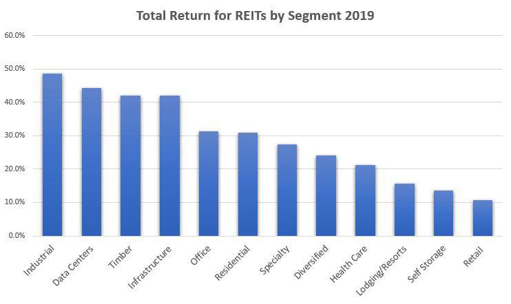

The real estate fund and Real Estate Investment Trust (REIT) market plays a significant role in the global financial ecosystem, offering investors opportunities to diversify portfolios and gain exposure to real estate without directly owning properties. Real estate funds are investment vehicles that pool capital from multiple investors to buy, manage, and develop properties, while REITs offer a similar function through a structured corporation or trust. REITs are distinct for their ability to provide regular income streams to investors, as they are required to pay out at least 90% of their taxable income as dividends. Major types of REITs include equity REITs, which invest in physical properties, mortgage REITs, which deal in real estate loans, and hybrid REITs, which combine both strategies.

In recent years, algorithmic trading has transformed the landscape of modern investing across various asset classes, including real estate funds and REITs. Algorithmic trading utilizes advanced mathematical models and computer programs to execute trades at speeds significantly faster than traditional strategies, relying on data analysis to identify and capitalize on market opportunities. This technology-driven approach has introduced greater efficiency, reduced transaction costs, and the ability to swiftly adapt to market conditions.



The convergence of real estate investments and algorithmic trading is gradually redefining how investors approach these markets. By integrating algorithms, investors can leverage data to enhance decision-making processes within real estate funds and REITs, thus potentially maximizing returns and optimizing portfolio management. The burgeoning field of predictive analytics and machine learning further augments these capabilities, allowing for more precise forecasting of market trends and asset valuations.

This article aims to explore the dynamic interplay between real estate funds, REIT investments, and algorithmic trading. By examining the foundational principles of these financial instruments and the technological advancements shaping their future, the piece provides a comprehensive overview for investors seeking to navigate this evolving landscape. Understanding these instruments is crucial for investors aiming to optimize their investment strategies, ensuring they harness the full potential of technological innovations while managing inherent risks. Thus, staying informed about developments in algorithmic trading and its impact on real estate markets is essential for making informed investment decisions and achieving sustainable financial growth.

## Table of Contents

## Understanding Real Estate Funds and REITs

Real estate funds and Real Estate Investment Trusts (REITs) are integral components of the real estate market, providing investors with opportunities to diversify their portfolios without the need to directly purchase and manage physical properties. 

Real estate funds are pooled investment vehicles that aggregate capital from multiple investors to invest in a diversified portfolio of real estate assets. These funds may include commercial properties, residential units, land, and sometimes REITs themselves, offering investors access to a broad spectrum of real estate investments with professional management. The primary aim of these funds is to achieve returns through capital appreciation and rental income from the underlying assets.

Real Estate Investment Trusts (REITs) are companies that own, operate, or finance income-producing real estate across a range of property sectors. They allow individual investors to earn a share of the income generated through real estate ownership without having to buy, manage, or finance any properties themselves. REITs work by pooling the capital of numerous investors to purchase real estate assets, and income generated from these assets is then distributed to shareholders through dividends.

There are three primary types of REITs: Equity REITs, Mortgage REITs, and Hybrid REITs. Equity REITs own and operate income-generating real estate and derive most of their revenue from leasing space and collecting rents. Mortgage REITs provide financing for income-producing real estate by purchasing or originating mortgages and mortgage-backed securities, [earning](/wiki/earning-announcement) income from the interest on these financial instruments. Hybrid REITs combine the investment strategies of both equity and mortgage REITs, engaging in property ownership and real estate financing to generate income.

Investing in real estate funds and REITs offers several benefits. These include diversification, as they allow investors to gain exposure to a broad array of real estate properties and sectors without direct investment. Additionally, REITs are known for providing [liquidity](/wiki/liquidity-risk-premium) advantages over direct property investment, as they often trade on major stock exchanges similar to equities. The potential for regular income through dividends and rental income is a significant attraction for income-focused investors. Moreover, the professional management of these investment vehicles can lead to expertly managed portfolios, reducing the complexities associated with direct real estate ownership.

However, investing in real estate funds and REITs carries inherent risks. Market risk is prevalent, as real estate values can fluctuate due to economic factors, changes in interest rates, or shifts in property demand. Specific risk factors associated with REITs might include [interest rate](/wiki/interest-rate-trading-strategies) sensitivity, given their income-distribution focus, and the performance of underlying property sectors impacted by supply, demand, and macroeconomic conditions. Additionally, management risk is present, as the performance of these investment vehicles heavily depends on the expertise and decisions of fund managers.

In conclusion, real estate funds and REITs provide investors with avenues to invest in real estate without the complexities of direct ownership. While offering benefits such as diversification, liquidity, and regular income, they also present risks that require careful consideration and understanding.

## Basics of Algorithmic Trading

Algorithmic trading, often referred to as algo trading, involves using computer algorithms to execute a large number of trades at speeds and frequencies that are impossible for human traders. The core idea is to remove human emotion and error from the trading process, utilizing pre-programmed instructions accounting for variables such as timing, price, and [volume](/wiki/volume-trading-strategy).

**Technology Behind Algorithmic Trading**

The technology powering [algorithmic trading](/wiki/algorithmic-trading) relies heavily on advanced computing systems and programming to analyze market data and execute trades. At the heart of algorithmic trading systems are complex algorithms that process vast amounts of financial data and market activity. These systems are implemented using high-level programming languages such as Python, C++, or Java, which are capable of handling tasks such as data retrieval, statistical analysis, and the execution of buy or sell decisions.

For example, a simple algorithmic trading strategy could be based on moving averages:

```python
def simple_moving_average(data, window_size):
    sma = data.rolling(window=window_size).mean()
    return sma

def generate_signals(data, short_window, long_window):
    signals = pd.DataFrame(index=data.index)
    signals['signal'] = 0.0
    signals['short_mavg'] = simple_moving_average(data['close'], short_window)
    signals['long_mavg'] = simple_moving_average(data['close'], long_window)
    signals['signal'][short_window:] = np.where(signals['short_mavg'][short_window:] > signals['long_mavg'][short_window:], 1.0, 0.0)
    signals['positions'] = signals['signal'].diff()
    return signals
```

This script calculates short-term and long-term moving averages and generates buy or sell signals based on the crossover points.

**Common Strategies in Algorithmic Trading**

Several strategies are prevalent in algorithmic trading:

1. **Trend Following**: This strategy involves identifying and following market trends, such as moving averages, channel breakouts, and related patterns.

2. **Arbitrage**: This strategy finds price inefficiencies between related instruments, such as stocks, bonds, or derivatives, and aims to exploit these differences for profit.

3. **Market Making**: Here, the algorithm provides liquidity to the markets by placing simultaneous buy and sell limit orders to capture the spread.

4. **Mean Reversion**: This strategy assumes that asset prices will revert to their historical means over time and involves trading based on the deviation from these means.

**Benefits of Algorithmic Trading**

Algorithmic trading offers several advantages over traditional trading methods. It is highly efficient and can process and execute decisions much faster than a human trader, capitalizing on market opportunities with precise timing. The method's objective approach can reduce emotional errors, which are common in manual trading. Additionally, algorithmic trading enables [backtesting](/wiki/backtesting), where strategies can be tested using historical data to evaluate their effectiveness before being applied in live markets.

**Potential Pitfalls and Limitations**

Despite its advantages, algorithmic trading is not without risks. A significant concern is the potential for algorithmic errors or "flash crashes," where erroneous trading activities lead to dramatic market drops. Moreover, these trading systems necessitate vast amounts of high-quality market data and robust technical infrastructure, both of which can be costly. Regulatory scrutiny also poses challenges, as regulatory bodies globally have increased oversight to prevent market manipulation and ensure fairness.

Algorithmic trading represents a transformative approach to financial markets by leveraging computation and advanced mathematics. While it provides substantial benefits, its integration requires careful execution, ensuring that both technical and regulatory hurdles are effectively managed.

## How Algorithmic Trading Impacts Real Estate Fund and REIT Investments

Algorithmic trading, characterized by the use of computer algorithms to automate trading decisions, has become increasingly integrated into the real estate fund and Real Estate Investment Trust (REIT) markets. This integration is driven by the need for efficiency, speed, and data-driven decision making in a sector traditionally dominated by slower, human-driven processes.

Algorithmic trading offers several advantages for real estate investors. First, it enhances the speed and efficiency of transactions, allowing investors to capitalize on market movements instantaneously. Algorithms can analyze large volumes of data and execute trades at a pace unachievable by humans. This efficiency reduces transaction costs and increases liquidity in the market, making real estate funds and REITs more attractive to a broader range of investors.

Furthermore, algorithmic trading supports data-driven decision making, reducing emotional bias, which can often cloud investment judgments. By leveraging vast datasets, algorithms can identify patterns and trends that may not be immediately evident to human analysts. For example, [machine learning](/wiki/machine-learning) models can predict price movements based on historical data and external factors such as interest rates or economic indicators.

There have been successful examples of algorithmic trading in real estate investments, especially concerning hedging risks and optimizing portfolios. Hedge funds focused on real estate assets have employed algorithmic strategies to maximize returns while minimizing exposure to market [volatility](/wiki/volatility-trading-strategies). These strategies include [momentum](/wiki/momentum) trading, statistical [arbitrage](/wiki/arbitrage), and market-making techniques, which enhance the profitability and stability of real estate portfolios.

Despite its advantages, algorithmic trading in real estate markets poses several challenges. The primary concern is the complexity and high initial investment required to develop and maintain sophisticated trading systems. As real estate markets are less liquid than equities markets, algorithms may face execution risks and slippage, affecting trade performance. Moreover, real estate markets are heavily influenced by macroeconomic factors, regulations, and local market conditions, which algorithms may struggle to predict accurately without comprehensive data inputs.

Looking forward, future trends in algorithmic trading within real estate funds and REIT investments are likely to be shaped by advancements in [artificial intelligence](/wiki/ai-artificial-intelligence) and machine learning. Enhanced data analytics will allow algorithms to process unstructured data such as news articles, social media sentiment, and economic indicators, enriching their predictive capabilities (Schumaker et al., 2012). Additionally, the growing focus on sustainable and ethical investing will see the development of algorithms that optimize portfolios based on Environmental, Social, and Governance ([ESG](/wiki/esg-investing)) criteria.

In conclusion, algorithmic trading is poised to revolutionize investments in real estate funds and REITs by providing speed, efficiency, and data-driven insights. However, success in this sector requires overcoming challenges related to market liquidity, data quality, and regulatory compliance. As technology and data analytics continue to advance, they will undoubtedly play a pivotal role in shaping the future landscape of real estate investments.

## Creating a Strategy for Investing in Real Estate Funds and REITs with Algorithms

Developing an algorithmic trading strategy for Real Estate Investment Trusts (REITs) requires a systematic approach that integrates both quantitative analysis and real estate market insights. To achieve this, investors should follow several key steps and considerations.

### Steps to Develop an Algorithmic Trading Strategy for REIT Investments

1. **Define Clear Objectives and Constraints**: Begin by outlining investment goals such as risk tolerance, target return, and investment horizon. Constraints could include capital limitations, leverage allowed, and maximum drawdown.

2. **Data Collection and Preprocessing**: Gather historical price data, financial statements, interest rates, and macroeconomic indicators relevant to REITs. Ensure that data is clean, free of outliers, and standardized for analysis.

3. **Feature Selection and Engineering**: Identify key features that influence REIT performance, such as dividends, occupancy rates, and economic conditions. Create additional features like moving averages or momentum indicators.

4. **Model Development**: Choose algorithms that fit the investment strategy. Common models include regression analysis, time series analysis, machine learning models, and neural networks. Python libraries such as `pandas`, `numpy`, `scikit-learn`, and `tensorflow` can be useful.

5. **Backtesting**: Implement backtesting with historical data to assess the strategy’s performance. This step involves evaluating key metrics like the Sharpe ratio, maximum drawdown, and annualized return.

Example of a Simple Backtest in Python:
```python
import pandas as pd
from backtesting import Backtest, Strategy

class SimpleREITStrategy(Strategy):
    def init(self):
        self.price_ma = self.data.Close.rolling(window=20).mean()

    def next(self):
        if self.data.Close[-1] > self.price_ma[-1]:
            self.buy()
        elif self.data.Close[-1] < self.price_ma[-1]:
            self.sell()

# Example usage with historical data 'data.csv':
data = pd.read_csv('data.csv', parse_dates=True, index_col='Date')
bt = Backtest(data, SimpleREITStrategy, cash=10000, commission=.002)
stats = bt.run()
bt.plot()
```

### Important Factors to Consider

- **Market Conditions**: Real estate market cycles, interest rate changes, and macroeconomic conditions should be considered, as they heavily influence REIT prices.

- **Liquidity**: Ensure the REITs selected have sufficient trading volume to allow for algorithm execution without significant market impact.

- **Transaction Costs**: Account for brokerage fees, bid-ask spreads, and other costs that may erode profits.

### Tools and Technologies

Investors should leverage technologies such as:

- **Data Processing Libraries**: `pandas`, `numpy` for data manipulation.
- **Algorithm Design and Testing**: `scikit-learn` for machine learning models, `tensorflow` for deep learning.
- **Backtesting Platforms**: `Backtrader`, `QuantConnect`, and `Zipline` for assessing strategy effectiveness.

### Risk Management Techniques

- **Position Sizing**: Use techniques like the Kelly Criterion or fixed fractional to determine position size.
- **Stop-Loss Orders**: Automated triggers to sell positions that move unfavorably.
- **Diversification**: Spread investments across various REIT sectors to mitigate sector-specific risks.

### Monitoring and Adjusting the Algo Trading Strategy

Continuous monitoring of the strategy's performance is essential. This involves:

- **Performance Review**: Regularly analyzing metrics such as return on investment (ROI), volatility, and trade success rate.
- **Parameter Tuning**: Adjust strategy parameters in response to changing market conditions or strategy performance.
- **Strategy Evolution**: Implement machine learning techniques such as reinforcement learning to adapt the strategy dynamically.

Investors must remain vigilant and ready to adapt their strategies as market conditions evolve. By following these steps and considerations, one can create a robust algorithmic trading strategy tailored to the REIT market.

## Regulatory and Ethical Considerations

Regulations play a crucial role in governing both algorithmic trading and Real Estate Investment Trust (REIT) investments. Algorithmic trading, defined as the use of computer algorithms to automate trading strategies, falls under the oversight of financial regulatory bodies like the U.S. Securities and Exchange Commission (SEC) and the European Securities and Markets Authority (ESMA). These agencies set rules to prevent market manipulation, ensure transparency, and protect investors. Algorithmic traders must adhere to regulations like the Markets in Financial Instruments Directive II (MiFID II) in the European Union, which stipulates high-frequency trading firms to become authorized and monitored.

For REIT investments, the regulations are distinct yet equally comprehensive. In the United States, REITs must comply with the Internal Revenue Code, which mandates strict criteria such as distributing at least 90% of taxable income to shareholders in the form of dividends. These regulations help maintain the integrity and attractiveness of REITs as investment vehicles.

Ethical considerations in algorithmic trading are equally significant. The automation of trading can lead to substantial market fluctuations, often termed as "flash crashes," which raise ethical questions about the stability and fairness of financial markets. Moreover, algorithmic trading can amplify systemic risks, questioning its ethical implications on financial stability. Traders must ensure that their algorithms do not exploit market inefficiencies or engage in manipulative practices, which could unfairly disadvantage other market participants.

Ensuring compliance with financial regulations involves rigorous procedures. Traders and institutions typically employ compliance officers to oversee operations. Algorithmic strategies must undergo stress testing under various market conditions to ensure they operate within legal bounds. Additionally, firms might utilize compliance software to audit and monitor trades, ensuring adherence to legal standards and reducing the risk of costly infractions.

AI and machine learning are pivotal in maintaining ethical standards in algorithmic trading. Machine learning models can analyze vast datasets to detect potential unethical trading patterns. Moreover, AI systems can adapt to new regulations rapidly, ensuring ongoing compliance. Ensuring ethical practices entails programming algorithms to recognize and avert potentially risky or manipulative trades autonomously.

The future of regulation in algorithmic trading may involve adaptive regulatory frameworks that account for rapid technological advancements. Regulators might employ AI themselves to track and analyze trading patterns in real-time, a prospect that could lead to more nuanced and effective oversight. Furthermore, international regulatory collaboration could be strengthened to manage the global nature of algorithmic trading, aiming for more cohesive and comprehensive governance.

In summary, navigating the regulatory and ethical landscape of algorithmic trading and REIT investments requires a robust understanding of existing frameworks and a proactive approach to compliance. As technology evolves, so too must the regulations that govern it, ensuring that innovative trading strategies benefit both investors and the broader financial ecosystem.

## Conclusion

In conclusion, the dynamic landscape of real estate investment funds and Real Estate Investment Trusts (REITs) is increasingly influenced by the integration of algorithmic trading. As discussed, algorithmic trading represents a technological advancement that holds the potential to significantly enhance investment strategies within the real estate sector. By leveraging sophisticated algorithms, investors can improve decision-making processes, optimize portfolio management, and potentially achieve better returns. The automation and speed provided by algorithmic systems can lead to more efficient market participation, reducing human errors and biases.

It is crucial for investors to remain informed and adapt to these evolving technologies. Staying educated about the latest developments in algorithmic trading and its application in real estate investing is essential for capitalizing on opportunities and mitigating risks. As technology continues to advance, so do the strategies that can be developed and executed, making continuous learning a necessity.

Balancing technology with traditional investment wisdom is key. While algorithmic trading offers numerous benefits, it is important not to overlook the fundamental principles of real estate investment, such as due diligence and market analysis. A hybrid approach that incorporates both technological tools and traditional insights can create a more robust investment strategy.

Looking ahead, the future of real estate investment funds and algorithmic trading is promising. We can expect further innovations, particularly in the integration of artificial intelligence and machine learning, which could redefine how market data is analyzed and investment decisions are made. As regulatory frameworks adapt to these advancements, the ethical use of technology will become a critical consideration, ensuring fair and equitable market practices.

In summary, embracing algorithmic trading while respecting the foundational elements of real estate investing presents a path forward for investors seeking to enhance their strategies in an ever-changing financial landscape.

## References & Further Reading

[1]: Bergstra, J., Bardenet, R., Bengio, Y., & Kégl, B. (2011). ["Algorithms for Hyper-Parameter Optimization."](https://dl.acm.org/doi/10.5555/2986459.2986743) Advances in Neural Information Processing Systems 24.

[2]: ["Advances in Financial Machine Learning"](https://www.amazon.com/Advances-Financial-Machine-Learning-Marcos/dp/1119482089) by Marcos Lopez de Prado

[3]: ["Evidence-Based Technical Analysis: Applying the Scientific Method and Statistical Inference to Trading Signals"](https://www.amazon.com/Evidence-Based-Technical-Analysis-Scientific-Statistical/dp/0470008741) by David Aronson

[4]: ["Machine Learning for Algorithmic Trading"](https://github.com/stefan-jansen/machine-learning-for-trading) by Stefan Jansen

[5]: ["Quantitative Trading: How to Build Your Own Algorithmic Trading Business"](https://www.amazon.com/Quantitative-Trading-Build-Algorithmic-Business/dp/1119800064) by Ernest P. Chan