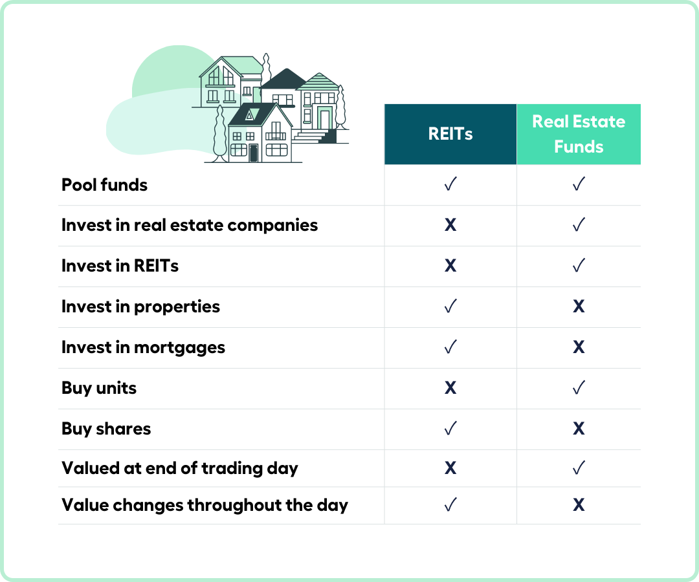

## Table of Contents

## What is a REIT?

A REIT, or Real Estate Investment Trust, is a company that owns, operates, or finances income-generating real estate. It's like a mutual fund for real estate, where people can invest their money and get a share of the profits. REITs make money mostly from rent and then pay out most of that money to their investors as dividends. This makes them a popular choice for people looking to earn regular income from real estate without having to buy property themselves.

There are different types of REITs. Some focus on specific types of properties like apartments, shopping centers, or offices. Others might invest in mortgages or loans secured by real estate. By law, REITs in the United States must pay out at least 90% of their taxable income as dividends to shareholders. This requirement helps investors because it means they can count on getting regular payments, which can be especially appealing for retirees or anyone looking for steady income.

## What is a Real Estate Fund?

A Real Estate Fund is a type of investment where money from many people is pooled together to buy, manage, or sell properties. It's like a big group of people chipping in to buy real estate together. The fund is managed by professionals who decide which properties to buy or sell, and they aim to make money for everyone who invested.

These funds can focus on different types of real estate, like apartments, shopping centers, or office buildings. Investors in the fund get a share of the profits from rent or when properties are sold. It's a way for people to invest in real estate without having to buy and manage properties themselves.

## How do REITs and Real Estate Funds differ in terms of structure?

REITs and Real Estate Funds are both ways to invest in real estate, but they have different structures. A REIT is a company that owns or finances real estate and must pay out at least 90% of its taxable income as dividends to shareholders. This means that when you invest in a REIT, you're buying shares in a company that's required to give most of its earnings back to you. REITs are often traded on major stock exchanges, making them easy to buy and sell like stocks.

On the other hand, a Real Estate Fund is more like a pool of money from many investors that's used to buy, manage, or sell properties. These funds are managed by professionals who make decisions about which properties to invest in. Unlike REITs, Real Estate Funds don't have the same requirement to distribute most of their income as dividends. Instead, they might reinvest the earnings to buy more properties or improve existing ones, which could lead to growth in the value of the fund.

In summary, while both REITs and Real Estate Funds allow people to invest in real estate without directly owning property, the key difference is in their structure and how they handle earnings. REITs are more focused on providing regular income to shareholders through dividends, whereas Real Estate Funds might aim for growth by reinvesting profits.

## What are the investment thresholds for REITs compared to Real Estate Funds?

Investing in REITs is generally easier and more accessible than investing in Real Estate Funds. You can buy shares of a REIT on the stock market, just like you would buy shares of any other company. This means you can start investing in a REIT with as little money as it takes to buy one share, which can be as low as a few hundred dollars. This low entry point makes REITs a good option for people who don't have a lot of money to invest but still want to get into real estate.

Real Estate Funds often have higher investment thresholds. These funds are usually set up as private investments, which means they are not traded on public stock exchanges. Because of this, they often require investors to put in a larger amount of money, sometimes tens of thousands of dollars or more. This higher entry point can make Real Estate Funds less accessible to the average investor but might be more suitable for those who can afford to invest larger sums and are looking for potentially higher returns over the long term.

## How do the tax implications of investing in REITs differ from those of Real Estate Funds?

When you invest in a REIT, the tax situation is pretty straightforward. REITs must pay out at least 90% of their taxable income as dividends to shareholders. These dividends are taxed as ordinary income, which can be at a higher rate than the capital gains tax you might pay on other investments. However, a part of the dividends might be considered return of capital, which isn't taxed right away but reduces your cost basis in the REIT. This means you might pay less tax when you sell your shares. Also, if you hold the REIT in a tax-advantaged account like an IRA, you won't have to pay taxes on the dividends until you withdraw the money.

Real Estate Funds, on the other hand, can have a bit more complicated tax situation. These funds often operate as partnerships, which means they pass through their income, gains, losses, and deductions to the investors. This can be good because it might allow you to use losses to offset other income. But it also means you'll get a K-1 form instead of a simple 1099, and you might have to pay taxes on the fund's income even if you don't get any cash distributions. If the fund sells properties at a profit, you'll also have to pay capital gains tax on your share of those profits. Like with REITs, holding Real Estate Funds in a tax-advantaged account can help manage the tax burden.

## What are the liquidity differences between REITs and Real Estate Funds?

REITs are usually very easy to buy and sell because they trade on big stock markets like the New York Stock Exchange. This means you can sell your shares whenever you want during trading hours, just like selling any other stock. This makes REITs a good choice if you might need your money back quickly.

Real Estate Funds are not as easy to sell. They are often set up as private investments, which means you can't just sell them on a stock market. You might have to wait until the fund decides to let investors take their money out, which could take months or even years. This makes Real Estate Funds better for people who don't mind their money being tied up for a long time.

## How do the returns from REITs compare to those from Real Estate Funds?

Returns from REITs and Real Estate Funds can be different because they work in different ways. REITs mostly make money from renting out properties and they have to give most of that money back to investors as dividends. So, if you invest in a REIT, you might get regular payments that can be pretty steady, but the value of the REIT's shares might not go up as much. This can be good if you want a regular income, but not so good if you're looking for big growth.

Real Estate Funds, on the other hand, might not give you regular payments like REITs do. Instead, they often try to grow by buying more properties or making the ones they have better. This means you might not get money back right away, but if the fund does well, the value of your investment could go up a lot over time. So, Real Estate Funds can be better if you're okay with waiting and want your investment to grow more in the long run.

## What are the diversification benefits of investing in REITs versus Real Estate Funds?

Investing in REITs can help you spread your money across different types of real estate without having to buy each property yourself. REITs can focus on things like apartments, shopping centers, or offices. By buying shares in different REITs, you can own a little piece of many different kinds of properties. This can help lower your risk because if one type of property doesn't do well, you might still make money from the others. Plus, since REITs trade on stock markets, it's easy to buy and sell them, making it simpler to adjust your investments as needed.

Real Estate Funds also let you invest in a mix of properties, but they might give you even more ways to diversify. These funds can invest in all sorts of real estate, from homes to big commercial buildings. They might also invest in different places around the world, which can help protect your money if the real estate market in one area goes down. But, because Real Estate Funds are often private, it can be harder to get your money out quickly if you need to. So, while they can offer great diversification, they might be better if you're okay with keeping your money invested for a longer time.

## How do management fees and expenses compare between REITs and Real Estate Funds?

When you invest in REITs, you usually pay less in fees than you would with Real Estate Funds. REITs are like regular companies, so they have costs to run their business, but these costs are often lower than what you see with Real Estate Funds. You might pay a small fee when you buy or sell shares of a REIT, but there's no big ongoing fee for managing the REIT itself. This makes REITs a cheaper way to invest in real estate if you're watching your costs.

Real Estate Funds, on the other hand, can have higher fees because they are managed by professionals who make decisions about which properties to buy or sell. These funds often charge a management fee, which can be a percentage of the money you have invested. This fee can add up over time, making Real Estate Funds more expensive than REITs. If you're thinking about investing in a Real Estate Fund, it's a good idea to look closely at the fees to see how much they might eat into your returns.

## What role do market conditions play in the performance of REITs and Real Estate Funds?

Market conditions can really affect how well REITs and Real Estate Funds do. For REITs, if the economy is doing well, people might have more money to spend on renting or buying property, which can make the properties owned by REITs more valuable. But if the economy goes down, people might not be able to pay rent, and property values could drop. Interest rates also matter a lot for REITs. When interest rates go up, it can make borrowing money more expensive for REITs, which might hurt their profits. But if interest rates are low, REITs can borrow more cheaply and maybe buy more properties.

Real Estate Funds can also be influenced by the same market conditions, like the economy and interest rates. But since these funds often invest in different types of properties and might even invest in different countries, they can be affected in different ways. For example, if the real estate market in one area is doing badly, a Real Estate Fund might still do okay if it has properties in another area that's doing well. But, like REITs, if interest rates go up, it can make it harder for the fund to borrow money to buy new properties, which could slow down their growth.

## How can an investor's strategy influence their choice between REITs and Real Estate Funds?

An investor's strategy can really change whether they choose REITs or Real Estate Funds. If you're someone who wants to get regular payments from your investments, REITs might be a good pick. They have to pay out most of their earnings as dividends, which means you could get a steady income. Also, if you like being able to easily buy and sell your investments, REITs are traded on stock markets, so you can do that quickly. This makes them good if you might need your money back soon.

On the other hand, if you're looking to grow your money over a long time and don't mind waiting, Real Estate Funds could be better. These funds might not give you regular payments, but they can buy more properties or improve the ones they have, which could make your investment grow a lot. But remember, Real Estate Funds can be harder to sell quickly because they're often private investments. So, they're better if you're okay with keeping your money tied up for a while.

## What advanced risk management techniques are available for investors in REITs compared to Real Estate Funds?

For investors in REITs, one advanced risk management technique is using options and other derivatives to hedge against market changes. You can buy put options on REIT shares to protect against a drop in their value. Another way is to diversify by investing in different types of REITs, like those that focus on apartments, shopping centers, or offices. This can help spread out the risk because if one type of property does badly, the others might still do well. Also, keeping an eye on interest rates is important because they can affect REITs a lot. If you think rates will go up, you might want to invest less in REITs or use other investments to balance out the risk.

For Real Estate Funds, risk management can be trickier because they're often private and not as easy to buy and sell. But you can still do things like diversifying across different types of properties and different areas. This can help because if one market goes down, others might go up. Another technique is to look at the fund's leverage, which is how much money it borrows to buy properties. If a fund has a lot of debt, it might be riskier, especially if interest rates go up. You can also ask the fund managers about their risk management strategies, like how they choose properties and how they plan to handle downturns in the market.

## References & Further Reading

[1]: Bergstra, J., Bardenet, R., Bengio, Y., & Kégl, B. (2011). ["Algorithms for Hyper-Parameter Optimization."](https://dl.acm.org/doi/10.5555/2986459.2986743) Advances in Neural Information Processing Systems 24.

[2]: ["Advances in Financial Machine Learning"](https://www.amazon.com/Advances-Financial-Machine-Learning-Marcos/dp/1119482089) by Marcos Lopez de Prado

[3]: ["Evidence-Based Technical Analysis: Applying the Scientific Method and Statistical Inference to Trading Signals"](https://www.amazon.com/Evidence-Based-Technical-Analysis-Scientific-Statistical/dp/0470008741) by David Aronson

[4]: ["Machine Learning for Algorithmic Trading"](https://github.com/stefan-jansen/machine-learning-for-trading) by Stefan Jansen

[5]: ["Quantitative Trading: How to Build Your Own Algorithmic Trading Business"](https://www.amazon.com/Quantitative-Trading-Build-Algorithmic-Business/dp/1119800064) by Ernest P. Chan