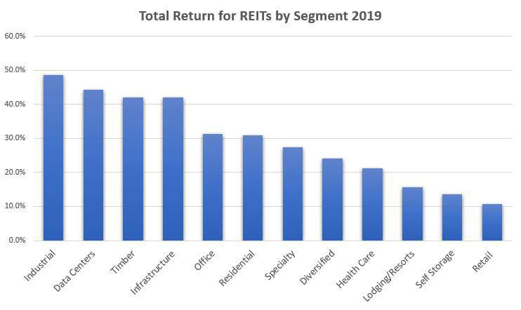

Investing is a crucial strategy for individuals seeking to grow their wealth, providing opportunities to generate additional income and meet long-term financial goals. Amid a plethora of options, four prominent investment opportunities stand out: Real Estate, Mutual Funds, Real Estate Investment Trusts (REITs), and Algorithmic Trading. Understanding these options and how they align with one's financial objectives and risk tolerance is essential for optimal portfolio growth and risk management.

Diversification is a fundamental principle in investing, designed to reduce risk by spreading investments across various asset classes. By not concentrating wealth in a single asset or investment type, investors can better withstand market volatility and potential downturns. Each of the aforementioned investment options presents unique benefits and challenges, making them suitable for different investor profiles and strategies.

Real estate investment involves purchasing property to generate rental income or capitalize on appreciation. It is a tangible asset offering potential tax benefits and a relatively steady cash flow. Conversely, mutual funds allow investors to pool their money, which is then managed by professionals to be invested in a diversified portfolio of stocks, bonds, or other securities. This option provides ease of diversification and professional management but may include management fees that can impact returns.

REITs offer an alternative means to invest in real estate, where individuals can buy shares in companies that own, operate, or finance income-generating real estate. This option provides liquidity and access to large-scale real estate portfolios without the challenges of direct property management. Algorithmic trading, which utilizes computer algorithms to execute trades based on pre-defined criteria, can offer speed and efficiency but comes with risks such as programming errors and market volatility.

The purpose of this article is to compare these investment options in terms of risks, returns, and suitability for different types of investors. By exploring the distinct characteristics of each option, readers can better appreciate their potential roles in a diversified portfolio and make informed decisions that align with their financial goals.

In today’s dynamic market, making informed investment choices is more relevant than ever. Investors must stay educated about market trends and investment strategies to navigate financial uncertainties successfully. By the end of this article, readers will gain a comprehensive understanding of the benefits and drawbacks of each investment option and be better equipped to develop a balanced and diversified investment strategy tailored to their unique needs and objectives.

## Table of Contents

## Understanding Real Estate Investment

Real estate investment refers to the acquisition, ownership, management, rental, or sale of real property for profit. It is an avenue for individuals to increase wealth by investing in types of physical property that appreciate over time. Real estate investments come in various forms, including residential properties, commercial properties, and real estate development projects.

Residential properties are homes or apartments leased to tenants, often providing a steady rental income stream. Commercial properties comprise office buildings, retail spaces, and warehouses, usually commanding higher rents but posing potentially greater investment risk. Real estate development involves purchasing land, developing it to increase its value, and selling or renting out the finished property. Other avenues include investing in raw land, industrial properties, and mixed-use developments.

Investing in real estate has several advantages. Firstly, real estate represents a tangible asset that affords investors the security and stability of owning physical property. It often offers potential tax benefits, such as deductions for mortgage interest, property taxes, and depreciation. Real estate can provide consistent cash flow through rental income, and historically, real estate has shown the propensity to appreciate over time, offering potential capital gains.

However, real estate investment comes with certain drawbacks. High initial capital requirements can act as a barrier, making it difficult for some investors to enter the market. Real estate can also be illiquid, meaning that selling properties quickly without loss might be challenging, particularly in a sluggish market. Maintaining properties to retain their value and attract tenants also requires ongoing management and financial output.

In a diversified investment portfolio, real estate plays a crucial role by potentially reducing risk and enhancing returns through asset allocation. Its historical performance of low correlation with other asset classes, such as stocks and bonds, means it may help stabilize overall portfolio returns during market [volatility](/wiki/volatility-trading-strategies). Proper investment diversification involves not placing all financial resources into a single asset type but spreading risk across various investment avenues, including real estate, to safeguard and maximize wealth over time. By understanding and leveraging the characteristics of real estate investments, individuals can make informed decisions that align with their financial goals and risk tolerance.

## Exploring Mutual Funds

Mutual funds are investment vehicles that pool money from multiple investors to collectively purchase a diversified portfolio of securities such as stocks, bonds, or other assets. They are managed by professional fund managers who make investment decisions on behalf of the fund’s investors, aiming to achieve the fund's objectives.

A professional fund manager plays a critical role in mutual funds. These managers are responsible for researching and analyzing market trends, selecting appropriate securities, and executing trades to optimize the fund's performance in line with its stated goals. Their expertise is one of the primary reasons investors opt for mutual funds, as it provides access to professional management they might not otherwise afford or execute independently.

Mutual funds come in various types, catering to different investment strategies and risk appetites:

1. **Equity Funds**: These primarily invest in stocks and aim for capital appreciation. They are suited for investors willing to accept higher risk for potentially higher returns.

2. **Bond Funds**: These funds focus on fixed-income securities like government and corporate bonds. They are generally considered less risky than equity funds and are suitable for investors seeking steady income with lower risk.

3. **Index Funds**: These funds track a specific market index, such as the S&P 500. They offer broad market exposure with typically lower fees, making them an attractive option for investors preferring a passive management approach.

4. **Balanced Funds**: These invest in a mix of equities and bonds, aiming to provide a balance of income and growth. Suitable for investors looking for a diversified portfolio in a single investment product.

Investing in mutual funds offers numerous advantages. Diversification is a key benefit, as investors gain exposure to a wide array of securities, which helps mitigate individual stock or bond risk. Liquidity is another significant advantage; mutual fund shares can be bought or sold on any business day, providing flexibility for investors. Additionally, professional management relieves investors from the complexities of market tracking and decision-making.

However, mutual funds have drawbacks. Management fees can erode returns over time, with some actively managed funds charging higher fees than passively managed ones like index funds. Moreover, investors relinquish control over specific investment choices, relying instead on the fund manager's discretion. Potentially lower returns can also be a concern, particularly when management fees outpace fund performance.

The suitability of mutual funds varies with investor profiles. Investors who prefer a hands-off approach may appreciate the professional management aspect, while those starting with smaller capital can benefit from the diversification offered. Conversely, investors with a high degree of market knowledge and expertise might find mutual funds less appealing, as they could potentially achieve higher returns through direct investments that align closely with their specific strategies and goals.

In summary, mutual funds present a robust investment option for varying investor profiles, offering professional management and broad diversification. Considering their pros and cons, investors should assess mutual funds in light of their individual financial goals, risk tolerance, and investment horizon.

## Understanding REITs (Real Estate Investment Trusts)

Real Estate Investment Trusts (REITs) are companies that own, operate, or finance income-producing real estate across various sectors. Modeled after mutual funds, they provide investors with an opportunity to invest in large-scale, diversified portfolios of real estate assets. REITs are a popular investment vehicle because they offer a proportionate share of income without needing to purchase or manage properties directly, offering a way to invest in real estate with greater [liquidity](/wiki/liquidity-risk-premium) and lower capital requirements compared to buying physical real estate.

### Types of REITs

1. **Equity REITs**: These are the most common type of REITs and they own and manage income-generating real estate. Revenue primarily comes from leasing space and collecting rents on the properties they own. Equity REITs can invest in various property types, including office buildings, retail shops, residential apartments, or industrial warehouses.

2. **Mortgage REITs (mREITs)**: Unlike equity REITs, mortgage REITs provide financing for income-producing real estate by purchasing or originating mortgages and mortgage-backed securities. They profit from the interest on the mortgages they hold, making them susceptible to interest rate fluctuations.

3. **Hybrid REITs**: As the name suggests, hybrid REITs are a combination of equity REITs and mortgage REITs. They thus gain revenue from both renting properties and earning interest on mortgage-backed assets, combining the characteristics and risk profiles of both equity and mortgage REITs.

### Benefits of Investing in REITs

- **Liquidity**: Unlike direct real estate investments, REITs are typically traded on major stock exchanges, making them highly liquid. Investors can quickly buy and sell shares without the complexities of transacting real property.

- **Diversification**: REITs allow individual investors to diversify their portfolios by gaining exposure to various real estate markets without requiring large capital outlays.

- **Access to Professional Management**: Investing in REITs provides investors access to professionally managed real estate portfolios, typically managed by experienced teams with expertise in real estate acquisition, development, and management.

### Risks Associated with REITs

- **Market Volatility**: As publicly traded securities, REIT shares can experience significant price fluctuations due to market forces, potentially leading to short-term capital losses.

- **Interest Rate Risks**: Since REITs operate with substantial debt and often distribute a large portion of net income as dividends, an increase in interest rates can affect both the cost of borrowing and the attractiveness of high-dividend stocks.

- **Management Fees**: Similar to mutual funds, REITs incur management fees which can impact the net return to investors.

### Comparing REITs to Physical Real Estate Investment

In terms of risk, REITs often offer lower entry barriers and reduced liquidity risks compared to direct real estate investment. Investors benefit from the liquidity of stock markets but at the cost of exposure to market volatility. REITs, with professionally managed portfolios, offer diversification and income potential through dividends. However, they lack the direct control over investment properties and the potential tax advantages that direct ownership might offer, making them more suitable for investors seeking passive involvement with a focus on income generation. Direct real estate investment, conversely, provides potential for higher returns through property appreciation and rental income but comes with higher upfront costs, ongoing management responsibilities, and illiquidity risks.

## Delving into Algorithmic Trading

Algorithmic trading, often referred to as algo trading, is a method of executing trades that leverages pre-programmed instructions accounting for variables such as timing, price, and [volume](/wiki/volume-trading-strategy). These complex algorithms enable traders to make swift decisions, allowing them to execute orders more efficiently than manual trading. As trading technology has evolved, so has the sophistication of these algorithms, enabling them to manage large volumes of data and execute trades with minimal human intervention.

At its core, [algorithmic trading](/wiki/algorithmic-trading) uses a series of mathematical models and computations to identify and capitalize on trading opportunities. The algorithms analyze market data in real-time and use historical data to predict future price movements, effectively seeking [arbitrage](/wiki/arbitrage) opportunities or optimizing a set of predefined strategies. This process is often supported by high-frequency trading systems, which can execute thousands of orders per second.

The primary benefits of algorithmic trading are speed, efficiency, and the elimination of human error. By employing automated systems, traders can rapidly respond to market conditions, often executing trades within milliseconds. This speed allows for the capture of marginal gains that would be impossible with manual trading. Furthermore, algorithms can process large quantities of data to identify trends and patterns more accurately, thereby enabling more informed decision-making.

However, algorithmic trading is not without its risks. One significant risk is the potential for programming errors, where flawed code could lead to significant financial losses. Additionally, market volatility can lead to unpredictable outcomes, as algorithms may struggle to adapt to sudden market changes without manual intervention. Regulatory issues also present challenges, as different jurisdictions have varying rules regarding automated trading.

Algorithmic trading is particularly suitable for institutional investors, hedge funds, and proprietary trading firms that have the resources to develop and maintain sophisticated trading systems. It is also ideal for traders with a strong background in quantitative analysis and programming skills, as these are essential for developing effective trading algorithms. For retail investors, while algorithmic trading can offer new opportunities, it often requires a significant commitment of time and technical expertise.

Overall, algorithmic trading represents a powerful tool in the financial markets, capable of executing trades with precision and efficiency. Nonetheless, it requires careful consideration of the associated risks and a thorough understanding of the underlying technology.

## Comparative Analysis: Which Investment is Right for You?

When evaluating investment opportunities, it's essential to compare the risk-return profiles of various options such as real estate, mutual funds, REITs, and algorithmic trading. Each comes with distinct characteristics suited to different investor goals and risk tolerances.

**Risk-Return Profiles**

1. **Real Estate:** Real estate investments typically offer stable income through rent and potential appreciation. However, they entail high initial costs, low liquidity, and significant maintenance responsibilities. The long-term return can be appealing, but it's susceptible to market fluctuations and physical risks like natural disasters.

2. **Mutual Funds:** Mutual funds provide diversification through pooled investments managed by professionals. They generally present moderate risk and potential returns compared to individual stocks, but investors lack control over asset selection. The primary risk lies in market volatility and potentially high management fees reducing net gains.

3. **REITs:** REITs allow investors to participate in real estate markets without owning physical properties. They offer liquidity similar to stocks, with dividend-like regular income. Nevertheless, they are sensitive to interest rate changes, and the market can be as volatile as the broader stock market. Management fees might also eat into returns.

4. **Algorithmic Trading:** This method uses computer algorithms to execute trades at high speed. It promises efficiency, reduced human error, and potential for high returns. However, it carries risks such as programming errors and heightened susceptibility to market instability, which can lead to significant losses.

**Considerations for Choosing an Investment Option**

- **Investment Goals:** Determining whether the focus is on income, growth, or a combination of both is crucial. For instance, real estate might suit income-focused investors, while algorithmic trading could appeal to those aiming for rapid growth.
- **Risk Tolerance:** Investors must assess their risk appetite. Conservative investors might favor mutual funds or certain REITs, while risk-tolerant ones could lean towards algorithmic trading.
- **Market Knowledge:** Understanding the chosen investment market is vital. Real estate requires knowledge of property markets, while algorithmic trading demands a grasp of complex financial algorithms.
- **Financial Position:** Assessing one's financial capacity to absorb potential losses or cash flow needs is necessary. High-net-worth individuals might handle the illiquidity of real estate more comfortably.

**Benefits of Diversification**

Diversification across these investment options can significantly mitigate risks and enhance returns. By spreading investments, one might offset losses in one area with gains in another. For example, the stable income from REITs and real estate can buffer against the volatility of algorithm trading.

**Real-World Scenarios**

Consider an investor balancing a portfolio with 30% in real estate for stability, 40% in mutual funds for diversification, 20% in REITs for liquidity, and 10% in algorithmic trading for potential high returns. Such a mix can provide steady income and growth while cushioning market declines.

**Tools and Resources**

Investors can utilize various tools and resources to draw informed decisions. Financial software for portfolio analysis, platforms offering algorithmic trading strategies, and advisory services from financial planners can equip investors with insights into these investment vehicles.

In conclusion, by comparing these investment vehicles and considering personal factors, investors can build a balanced portfolio that aligns with their financial aspirations.

## Conclusion

In this article, we have explored four distinct investment options: Real Estate, Mutual Funds, REITs, and Algorithmic Trading. Each option presents unique advantages and challenges, necessitating a comprehensive understanding to make informed decisions. Assessing personal financial goals and risk appetite is crucial in choosing the most suitable investment approach. For instance, real estate offers tangible assets and potential tax benefits but requires significant capital and management efforts. Mutual funds provide diversification and professional management but come with management fees and limited control over individual investments. REITs offer liquidity and access to professionally managed portfolios with the trade-offs of market volatility and [interest rate](/wiki/interest-rate-trading-strategies) risks. Algorithmic trading, characterized by speed and efficiency, involves programming risks and regulatory considerations.

Investors are encouraged to conduct further research and seek advice from financial advisors to align investment choices with their financial objectives. Combining different investment strategies can enhance wealth growth potential by capitalizing on the strengths of each option while mitigating risks. Diversification across real estate, mutual funds, REITs, and algorithmic trading allows investors to balance their portfolios effectively.

Staying engaged with financial communities and keeping abreast of market trends can provide valuable insights and foster better decision-making. Informed investment choices today could significantly impact financial security in the future. Each investor's journey is unique, and ongoing education and consultation will be vital as markets and personal circumstances evolve.

## References & Further Reading

[1]: NAREIT. ["What is a REIT?"](https://www.reit.com/what-reit/reit-basics) Visit the National Association of Real Estate Investment Trusts for a comprehensive overview of REITs.

[2]: Fidelity Investments. ["Mutual Funds: Different Types and How They Work"](https://www.fidelity.com/learning-center/smart-money/investment-types) Explore the basics of mutual funds and their various types.

[3]: Chan, Ernest P. ["Algorithmic Trading: Winning Strategies and Their Rationale"](https://github.com/ftvision/quant_trading_echan_book) Gain insights into algorithmic trading strategies from an expert in the field.

[4]: Schwab, Charles. ["Real Estate Investing: What You Need to Know"](https://www.schwab.com/learn/topic/real-estate) Learn about the fundamentals of real estate investing and its potential benefits.

[5]: Morningstar. ["Real Estate Mutual Funds"](https://www.morningstar.com/best-investments/real-estate-funds) Review data and analysis on real estate mutual funds.