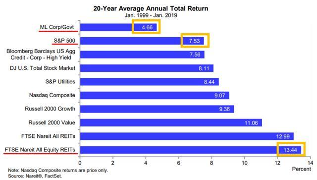

## Table of Contents

## What is a REIT?

A REIT, or Real Estate Investment Trust, is a company that owns, operates, or finances income-generating real estate. It's like a big property company that people can invest in, similar to buying stocks. By investing in a REIT, people can earn a share of the income produced through real estate without having to buy, manage, or finance any properties themselves.

REITs are popular because they offer a way to invest in real estate without the hassle of being a landlord. They must pay out at least 90% of their taxable income as dividends to shareholders, which means investors can get regular income from their investment. This makes REITs attractive for people looking for steady income, like retirees.

## What is a REIT ETF?

A REIT ETF, or Real Estate Investment Trust Exchange Traded Fund, is a type of investment fund that you can buy and sell on the stock market. It's made up of a bunch of different REITs all put together into one fund. This means when you buy shares of a REIT ETF, you're investing in a whole bunch of real estate properties at once, without having to pick and choose individual REITs yourself.

REIT ETFs are popular because they make it easy to invest in real estate. Instead of buying a single property or a single REIT, you get a piece of many properties spread across different areas and types. This can help spread out your risk. Plus, like individual REITs, REIT ETFs often pay out dividends, giving investors a regular income from their investment.

## How do REITs generate income for investors?

REITs make money for investors mainly by renting out the properties they own. Imagine you own a bunch of apartment buildings, shopping centers, or office spaces. You rent these out to people or businesses, and they pay you rent every month. The REIT collects all this rent money and, after paying for things like maintenance and management, shares most of it with its investors as dividends. This is how investors get a regular income from their investment in the REIT.

Another way REITs can make money is by selling properties they own for more than they bought them. If a REIT buys a building for a good price, fixes it up, and then sells it later for a higher price, the profit from that sale can also be shared with investors. But the main way REITs make money for investors is through the rent they collect from their properties, which they then pass on as dividends.

## What are the main differences between investing in individual REITs and REIT ETFs?

When you invest in individual REITs, you pick and choose specific real estate companies that own certain types of properties, like apartments or shopping malls. This means you can focus on the areas you think will do well, but it also means you need to do a lot of research to make sure you're [picking](/wiki/asset-class-picking) the right ones. If one of your chosen REITs doesn't do well, it can affect your whole investment. On the other hand, you might get higher returns if you pick a winner.

Investing in a REIT [ETF](/wiki/etf-trading-strategies) is like buying a basket of different REITs all at once. This spreads out your risk because you're not betting on just one or two companies; you're investing in a whole bunch of them. It's easier and less work because you don't have to pick and choose; the ETF does that for you. But, because it's spread out, the returns might not be as high as they could be with a single, well-performing REIT. Plus, REIT ETFs usually have lower fees than buying a bunch of individual REITs.

## What are the advantages of investing in REITs?

Investing in REITs is a great way to get into real estate without the hassle of buying and managing properties yourself. When you invest in a REIT, you're basically buying a piece of a company that owns lots of different buildings like apartments, offices, and shopping centers. These companies collect rent from their tenants and then share most of that money with you as regular payments called dividends. This can be a good way to earn steady income, especially if you're someone like a retiree who needs money coming in every month.

Another big advantage of REITs is that they let you spread out your risk. Instead of putting all your money into one building or one area, you can invest in a REIT that owns many different properties in different places. This means if one building or area doesn't do well, it won't hurt your whole investment as much. Plus, REITs are traded on the stock market, so you can easily buy and sell them whenever you want, which makes them more flexible than owning actual property.

## What are the advantages of investing in REIT ETFs?

Investing in REIT ETFs is a smart way to get into real estate without having to pick and choose which properties to invest in. When you buy a REIT ETF, you're buying a little bit of many different real estate companies all at once. This means you don't have to do as much homework to decide which REITs to buy, because the ETF does that for you. It's like buying a mixed bag of candies instead of picking out each piece one by one. Plus, because REIT ETFs spread your money across lots of different properties, it's less risky than putting all your money into one or two REITs.

Another advantage of REIT ETFs is that they can give you a steady income. Just like individual REITs, REIT ETFs pay out dividends, which are like little payments you get regularly from your investment. These dividends come from the rent that all the different properties in the ETF collect. So, even though you're investing in many different places, you can still get a regular income from it. And because REIT ETFs usually have lower fees than buying a bunch of individual REITs, you get to keep more of your money.

## What are the risks associated with investing in individual REITs?

When you invest in individual REITs, you might face some risks. One big risk is that you're putting your money into just one company. If that company doesn't do well, maybe because the buildings they own don't get enough rent or the area where the buildings are located goes downhill, your whole investment could lose value. It's like betting on one horse in a race; if it doesn't win, you lose.

Another risk is that real estate markets can go up and down. If the market goes down, the value of the properties the REIT owns might drop, and that can hurt the price of the REIT's stock. Also, REITs can be affected by interest rates. If interest rates go up, it might cost the REIT more to borrow money for new projects, and that could cut into their profits. So, it's important to keep an eye on these things when you're thinking about investing in individual REITs.

## What are the risks associated with investing in REIT ETFs?

When you invest in a REIT ETF, you're spreading your money across many different real estate companies, which can help lower your risk. But even with this spread-out approach, there are still risks to watch out for. One big risk is that the whole real estate market might go down. If that happens, all the REITs in the ETF could lose value, and so could your investment. It's like if you had a basket of different fruits, but all fruits became less popular at the same time.

Another risk is that interest rates can affect REIT ETFs. If interest rates go up, it might cost the REITs more to borrow money for new projects, and that could hurt their profits. This could then lower the value of the ETF. Plus, even though you're investing in many different REITs, if a big chunk of the ETF is focused on one type of property, like shopping malls, and those malls start doing badly, it could still hurt your investment. So, it's good to know what's in the ETF and how it might be affected by changes in the market.

## How does the diversification of a REIT ETF compare to that of individual REITs?

When you invest in an individual REIT, you're putting your money into just one real estate company. This means you're betting on that one company and the specific properties it owns. If the company does well, you could see good returns, but if it runs into trouble, like if its buildings don't get enough rent or the area they're in goes downhill, your whole investment could be at risk. It's like putting all your eggs in one basket; if something goes wrong with that basket, you could lose a lot.

On the other hand, a REIT ETF gives you a lot more diversification. When you buy into a REIT ETF, you're investing in a bunch of different real estate companies all at once. This means your money is spread across many different properties in different places and different types of real estate, like apartments, offices, and shopping centers. It's like having many baskets for your eggs, so if one basket has a problem, it won't affect all your eggs as much. This can help lower your risk because you're not relying on just one company to do well.

## What are the tax implications of investing in REITs versus REIT ETFs?

When you invest in individual REITs, the tax situation can be a bit tricky. REITs have to pay out at least 90% of their taxable income as dividends to shareholders. These dividends can be taxed as ordinary income, which might be higher than the tax rate on qualified dividends from regular stocks. Plus, some of the dividends might be considered return of capital, which isn't taxed right away but reduces your cost basis in the REIT. When you sell your REIT shares, you'll have to pay capital gains tax on any profit you make, and the rate depends on how long you held the shares.

Investing in a REIT ETF can have a different tax impact. Like individual REITs, the dividends from a REIT ETF are usually taxed as ordinary income. But because a REIT ETF holds many different REITs, the tax treatment of the dividends can be a bit more complex. You might get a mix of ordinary income, qualified dividends, and return of capital. When you sell your shares of a REIT ETF, you'll also have to pay capital gains tax on any profit, with the rate depending on your holding period. So, while both have similar tax treatments for dividends and capital gains, the mix of income types from a REIT ETF might require a bit more attention come tax time.

## How do the expense ratios of REIT ETFs impact overall returns?

The expense ratio of a REIT ETF is like a fee you pay every year just for owning the ETF. It's a percentage of your investment that goes to cover the costs of managing the fund. A lower expense ratio means you keep more of your money, which can make a big difference in your overall returns over time. For example, if you invest $10,000 in a REIT ETF with a 0.5% expense ratio, you'll pay $50 a year in fees. But if the expense ratio is 1%, you'll pay $100 a year. Over many years, those extra fees can add up and eat into your returns.

Even small differences in expense ratios can have a big impact on your investment over the long run. Let's say you invest in two different REIT ETFs, one with a 0.2% expense ratio and another with a 0.5% expense ratio. Both ETFs might perform the same in terms of the real estate market, but the one with the lower expense ratio will give you more money in the end because you're paying less in fees. So, when choosing a REIT ETF, it's smart to look for one with a low expense ratio to help boost your overall returns.

## What are some advanced strategies for optimizing a portfolio that includes both REITs and REIT ETFs?

One way to optimize a portfolio with both individual REITs and REIT ETFs is to use them together to balance risk and reward. You can pick a few individual REITs that you think will do really well, maybe because they own properties in areas that are growing fast or because they focus on types of real estate that are in high demand. These can be the stars of your portfolio, the ones you hope will give you big returns. But because individual REITs can be risky, you can also add a REIT ETF to spread out your risk. The ETF will include many different REITs, so if one of your individual REITs doesn't do well, the ETF can help cushion the blow.

Another strategy is to think about how much income you want from your investments. REITs and REIT ETFs both pay dividends, but you can choose ones that pay more or less depending on what you need. If you need a steady income, you might pick REITs or ETFs that have a history of paying high dividends. You can also look at how often they pay dividends, like monthly or quarterly, to match your income needs. By mixing high-dividend REITs with a diversified REIT ETF, you can get both a good income and a balanced risk in your portfolio.

Lastly, keep an eye on the overall economy and real estate market trends. If interest rates are going up, it might be a good time to focus more on REITs that don't rely heavily on borrowing money. Or if certain types of real estate, like apartments or warehouses, are doing well, you can adjust your portfolio to include more of those. By staying informed and flexible, you can shift your investments between individual REITs and REIT ETFs to take advantage of the best opportunities and manage your risks.

## References & Further Reading

[1]: ["The Intelligent REIT Investor: How to Build Wealth with Real Estate Investment Trusts"](https://www.amazon.com/Intelligent-REIT-Investor-Wealth-Investment/dp/1119252717) by Stephanie Krewson-Kelly and R. Brad Thomas

[2]: ["Guide to Real Estate Exchange-Traded Funds (REIT ETFs)"](https://www.fool.com/investing/stock-market/market-sectors/real-estate-investing/reit/reit-etf/) on Investopedia

[3]: ["Algorithmic and High-Frequency Trading"](https://www.amazon.com/Algorithmic-High-Frequency-Trading-Mathematics-Finance/dp/1107091144) by Álvaro Cartea, Sebastian Jaimungal, and José Penalva

[4]: ["Handbook of Mortgage-Backed Securities"](https://www.amazon.com/Handbook-Mortgage-Backed-Securities-7th/dp/0198785771) by Frank J. Fabozzi

[5]: ["Real Estate Finance and Investments"](https://www.mheducation.com/highered/product/Real-Estate-Finance-and-Investments-Brueggeman.html) by William B. Brueggeman and Jeffrey D. Fisher