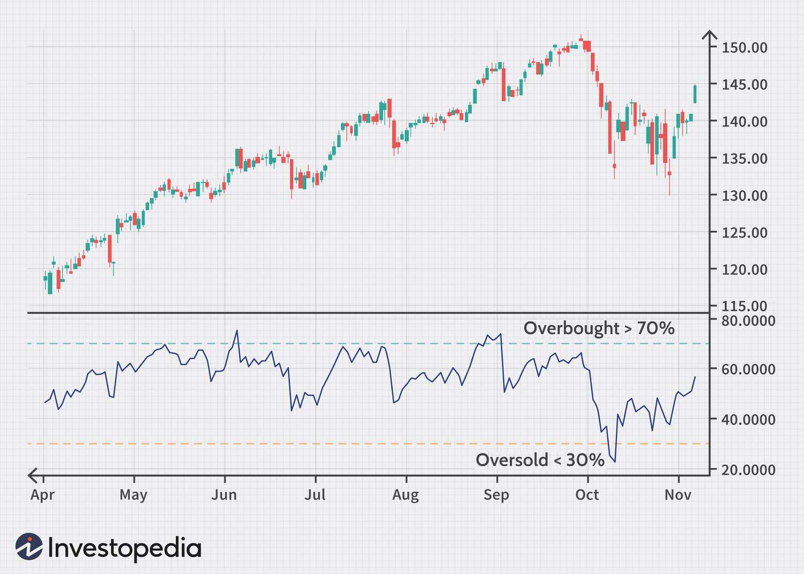

The integration of technical indicators such as the Commodity Channel Index (CCI) and the Relative Strength Index (RSI) plays a crucial role in algorithmic trading, where the analysis of market trends and conditions is automated using algorithms. Both these indicators are classified as momentum oscillators, used extensively by traders to interpret market conditions and predict future price movements. 

The Commodity Channel Index (CCI) and the Relative Strength Index (RSI) serve as invaluable tools, each offering unique perspectives on market dynamics. CCI, which was originally developed to identify cyclical turns in commodity markets, is now applied to a broad range of asset classes, including stocks and currencies. It provides insights by quantifying deviations from a predetermined moving average, assisting traders in identifying overbought or oversold conditions without the constraint of fixed boundary levels.



On the other hand, RSI is designed to measure the magnitude of recent price changes, acting within a bounded scale of 0 to 100. It effectively highlights potential reversals in market trends by comparing average gains and losses over a defined period, thereby indicating whether an asset is currently overvalued or undervalued.

This article will explore the functionalities of CCI and RSI, providing a robust understanding of how these indicators can be implemented in algorithmic trading strategies. By analyzing their calculations, signal generation capabilities, and comparative advantages, we aim to provide traders with actionable insights. This content will be valuable to both novices and seasoned traders seeking to enhance their technical analysis toolkits. 

Moreover, we will also examine the algorithmic aspect of these indicators, demonstrating their application in trading systems to optimize decision-making processes. Code snippets using Python libraries that facilitate the integration of CCI and RSI into automated trading scripts will be included, showcasing their practical application in real-world trading scenarios. Through a comprehensive evaluation, traders will be equipped not only with the theoretical knowledge but also the practical skills necessary to employ these indicators effectively in their trading activities.

## Table of Contents

## Understanding Commodity Channel Index (CCI)

The Commodity Channel Index (CCI) is a widely-utilized technical indicator that assists traders in identifying cyclical trends across a broad spectrum of asset classes, including commodities, stocks, and currencies. Created to measure the deviation of an asset's price from its moving average, the CCI provides critical insights into market conditions, highlighting periods when assets may be overbought or oversold. This makes CCI an instrumental tool in forecasting potential price reversals.

One of the unique features of the CCI is its lack of defined boundaries, which distinguishes it from other bounded oscillators such as the RSI. This unbounded nature allows the CCI to adapt to varying market conditions, making it particularly effective for detecting trends in different market scenarios. By assessing how far a price has diverged from its average, the CCI helps traders recognize emerging trends or the beginnings of potential reversals, offering a dynamic approach to market analysis.

The calculation of the CCI incorporates the typical price, moving averages, and mean deviation. The typical price is calculated as the average of the high, low, and close prices for a given period, usually over 20 days. The formula for the Commodity Channel Index is:

$$
\text{CCI} = \frac{\text{Typical Price} - \text{Simple Moving Average of Typical Price}}{0.015 \times \text{Mean Deviation}}
$$

Where:
- The Typical Price (TP) is $\frac{\text{High} + \text{Low} + \text{Close}}{3}$.
- The Simple Moving Average (SMA) of the typical price provides a smoothed view of price trends over a chosen period.
- The Mean Deviation measures the average deviation of the typical price from its SMA.

The constant 0.015 is typically used to ensure that approximately 70-80% of CCI values fall within the range of -100 to +100, without imposing hard boundaries.

The normalized view provided by CCI calculation facilitates comparison across different securities, making it a favored choice among traders seeking to identify potential buying or selling opportunities in diverse financial markets. This adaptability and the depth of insight offered render the Commodity Channel Index an invaluable tool in technical analysis, particularly for algorithmic traders aiming to optimize their trading strategies.

## Exploring Relative Strength Index (RSI)

The Relative Strength Index (RSI) is a widely-used [momentum](/wiki/momentum) oscillator that assists traders in identifying overbought and oversold conditions in the financial markets. Developed by J. Welles Wilder Jr., the RSI operates on a scale bounded between 0 and 100, providing a clear numerical representation of market momentum.

The RSI is calculated by evaluating the average gains and losses over a specified period, commonly 14 days. This calculation helps traders discern potential trend reversals. The formula for RSI is as follows:

$$
\text{RSI} = 100 - \left( \frac{100}{1 + \text{RS}}} \right)
$$

where RS (Relative Strength) is the ratio of average gains to average losses over the set period. This measure of strength assists in defining market conditions, where readings above 70 traditionally indicate overbought conditions, suggesting a potential sell signal. Conversely, readings below 30 suggest oversold conditions, indicating a potential buy signal.

The popularity of RSI stems from its straightforward interpretation and effectiveness in markets characterized by defined trends. The oscillator's clear numerical output facilitates decision-making, allowing even novice traders to apply RSI-based strategies with relative ease. For instance, traders can use RSI to confirm price directions or predict possible market corrections. Typically, when RSI indicates an overbought condition, it may precede a price drop as assets are likely traded at higher prices relative to their historical performance. Similarly, an oversold reading may suggest an upcoming price increase as the asset might be undervalued.

RSI’s capability to provide reliable signals makes it a staple in technical analysis across various asset classes, including stocks, commodities, and [forex](/wiki/forex-system). However, while the RSI is efficient in trending markets, it may give false signals in markets with higher [volatility](/wiki/volatility-trading-strategies) or without clear direction, necessitating its use in conjunction with other indicators or confirmation strategies to enhance trading precision.

## Comparing CCI and RSI

While both the Commodity Channel Index (CCI) and the Relative Strength Index (RSI) are integral to momentum analysis in trading, their methodologies, applications, and interpretations present distinct differences that cater to diverse trading strategies.

The CCI operates without fixed upper and lower bounds, offering increased flexibility for traders to interpret cyclical trends across a variety of asset classes and market conditions. This flexibility allows traders to capture deviations from the mean more dynamically, which can be particularly useful in volatile or trending markets where price movements frequently exceed traditional boundaries.

Mathematically, the CCI is calculated as follows:
$$

CCI = \frac{(Typical\ Price - MA\ of\ Typical\ Price)}{0.015 \times Mean\ Deviation} 
$$
where the Typical Price is an average of the high, low, and close prices, and the Moving Average (MA) and Mean Deviation are calculated over a selected period.

Conversely, the RSI operates within a bounded scale of 0 to 100, making it more user-friendly and straightforward for identifying extreme market conditions. It is particularly effective for suggesting potential overbought conditions when above 70, and oversold conditions when below 30, providing clear signals for buying or selling decisions. The bounded scale of the RSI enhances its reliability in highlighting these conditions, making it a preferred tool for traders seeking quick decision-making signals.

The RSI is computed using the following formula:
$$

RSI = 100 - \left(\frac{100}{1 + \frac{Average\ Gain}{Average\ Loss}}\right) 
$$
This relies on the average gains and losses over a specified period, typically 14 days, to determine the relative strength of an asset.

In practice, traders leverage the CCI primarily for identifying price divergences. Divergences occur when the price of an asset moves in the opposite direction to the CCI, which can indicate potential reversals or continuations of the current trend. These divergences are particularly crucial in identifying hidden market movements that are not immediately apparent through other indicators.

On the other hand, the RSI is renowned for providing clearer buy and sell signals due to its bounded nature. Its ability to identify overextended conditions in the market offers traders immediate insights into potential entry and [exit](/wiki/exit-strategy) points, making it a versatile tool in various trading conditions.

Both indicators can serve complementary roles in technical analysis, enhancing the robustness of market evaluations. While the CCI provides flexibility in spotting trend deviations and divergences, the RSI delivers straightforward and reliable signals for decision-making processes. Combining these indicators allows traders to construct a more comprehensive analysis framework, effectively optimizing their trading strategies across different market scenarios.

## Implementing CCI and RSI in Algorithmic Trading

Algorithmic trading leverages the power of computers to execute trading strategies based on defined sets of rules and signals. Integrating the Commodity Channel Index (CCI) and the Relative Strength Index (RSI) within such frameworks allows traders to enhance their decision-making speed and efficiency. Both indicators offer distinct advantages and can significantly optimize trading when automated appropriately.

Automation of CCI and RSI involves using these indicators to generate buy or sell signals based on predefined thresholds. For instance, traders might set up a system where a CCI above +100 triggers a buy signal, while a CCI below -100 prompts a sell signal. Similarly, an RSI greater than 70 might indicate overbought conditions, suggesting a potential sell, whereas an RSI below 30 could signal oversold conditions and a buying opportunity.

### Backtesting Strategies

Before fully deploying trading strategies based on CCI and RSI, traders often conduct [backtesting](/wiki/backtesting). This process involves simulating the strategy against historical market data to evaluate its performance and robustness. Backtesting helps ensure the algorithm's potential profitability and stability over time. For this purpose, traders typically employ Python libraries like `pandas` for data manipulation, `numpy` for numerical computations, and `[backtrader](/wiki/backtrader)` for testing and refining trading strategies.

### Python Implementation Example

Here's a basic Python example illustrating how CCI and RSI can be utilized in an automated trading strategy:

```python
import pandas as pd
import numpy as np
import talib as ta
import backtrader as bt

class CCI_RSI_Strategy(bt.Strategy):
    params = (
        ('cci_period', 20),
        ('rsi_period', 14),
    )

    def __init__(self):
        self.cci = bt.indicators.CommodityChannelIndex(self.data, period=self.params.cci_period)
        self.rsi = bt.indicators.RSI(self.data, period=self.params.rsi_period)

    def next(self):
        if self.cci[0] > 100 and self.rsi[0] < 30:
            self.buy()
        elif self.cci[0] < -100 and self.rsi[0] > 70:
            self.sell()

cerebro = bt.Cerebro()
cerebro.addstrategy(CCI_RSI_Strategy)
data = bt.feeds.YahooFinanceData(dataname='AAPL', fromdate=pd.to_datetime('2021-01-01'),
                                 todate=pd.to_datetime('2023-10-01'))
cerebro.adddata(data)
cerebro.run()
```

In this example, the `CCI_RSI_Strategy` monitors the CCI and RSI indicators. It initiates a buy when the CCI is above 100 and RSI below 30, signaling favorable market conditions, and triggers a sell when CCI drops below -100 and RSI exceeds 70, indicating potential downturns.

### Setting Periods and Thresholds

The effectiveness of CCI and RSI, like many indicators, often depends on the specific periods and thresholds used. For CCI, the default look-back period is often 20 days, while the RSI typically uses a 14-day window. However, traders may adjust these parameters to suit the volatility and characteristics of the specific asset class they are trading. 

Experimentation and iterative refinement using historical data are crucial for discovering the optimal settings. It’s essential to adapt these parameters to align with your trading goals, whether in capturing short-term price movements or analyzing longer-term market trends.

In conclusion, by integrating and automating CCI and RSI within [algorithmic trading](/wiki/algorithmic-trading) frameworks, traders can achieve faster response times and enhanced efficiency, provided they undertake rigorous backtesting and parameter tuning to suit their specific trading contexts.

## Developing Trading Strategies

In developing trading strategies utilizing the Commodity Channel Index (CCI) and Relative Strength Index (RSI), traders can apply distinct approaches to leverage these momentum oscillators effectively across different market environments.

Trend-following strategies are particularly potent, exploiting market trends identified by the behaviors of the CCI and RSI. These strategies aim to capitalize on sustained price movements, whether upward or downward. Specifically, when the CCI shows sustained high readings or the RSI crosses above a critical threshold, such as 50 or 70, it indicates a potential continuation of the current trend. Conversely, declining CCI values or an RSI drop below these thresholds might suggest a downward trend, offering short-selling opportunities. An example in Python to identify these trends could be:

```python
import numpy as np
import pandas as pd

def calculate_cci(data, period=20):
    TP = (data['High'] + data['Low'] + data['Close']) / 3
    MA = TP.rolling(window=period).mean()
    MD = TP.rolling(window=period).apply(lambda x: np.mean(np.abs(x - np.mean(x))), raw=True)
    return (TP - MA) / (0.015 * MD)

def calculate_rsi(data, period=14):
    delta = data['Close'].diff(1)
    gain = (delta.where(delta > 0, 0)).rolling(window=period).mean()
    loss = (-delta.where(delta < 0, 0)).rolling(window=period).mean()
    RS = gain / loss
    return 100 - (100 / (1 + RS))

# Usage
data = pd.read_csv('market_data.csv')  # Assuming the dataset contains 'High', 'Low', and 'Close' columns
data['CCI'] = calculate_cci(data)
data['RSI'] = calculate_rsi(data)

# Identifying trends
trend_up = (data['CCI'] > 100) & (data['RSI'] > 70)
trend_down = (data['CCI'] < -100) & (data['RSI'] < 30)
```

Mean reversion strategies, on the other hand, target the assumption that asset prices will revert to their historical averages after significant swings. When CCI and RSI readings suggest overbought or oversold conditions—typically with CCI above +100 or below -100, and RSI over 70 or under 30, traders might anticipate a price correction back towards the mean. Such strategies often utilize the oscillations and look for reversal signals to buy at low prices and sell at high ones, taking advantage of deviations from the norm.

Successful trading strategies often require diversification to withstand variability across different market scenarios. By integrating trend-following and mean-reversion methods, traders can balance potential returns while mitigating risks. This diversification allows traders to adapt to volatile conditions, optimizing the strategies for diverse markets and asset classes. Each strategy’s effectiveness relies on careful analysis, continuous monitoring, and adjustment of parameters to align with current market behavior.

## Advantages and Limitations

The primary advantage of the Commodity Channel Index (CCI) and the Relative Strength Index (RSI) lies in their capability to provide timely insights for identifying potential entry and exit points in the market. By highlighting overbought and oversold conditions, these indicators assist traders in making informed decisions on when to initiate or liquidate positions. The CCI, with its ability to measure price deviation from a moving average, is particularly useful in recognizing cyclical price fluctuations. On the other hand, the RSI's bounded scale facilitates straightforward interpretation of market momentum, making it a favorite among traders who prioritize simplicity in their analysis.

Nevertheless, both CCI and RSI are not devoid of limitations. One of the significant drawbacks is their susceptibility to generating false signals, especially in markets characterized by high volatility and rapid price swings. Such market conditions can lead to misleading overbought and oversold indicators, resulting in potential trading losses. Therefore, relying solely on CCI or RSI without supplementary analysis may not yield optimal results.

A common approach to augment the reliability of these indicators is to integrate them with other technical tools, such as moving averages. Incorporating a moving average can help smooth out price data and provide a clearer trend direction, thereby filtering out noise that might lead to erroneous buy or sell decisions. For instance, a trader might use a 50-day moving average in conjunction with RSI to confirm a trend, only taking positions when both the RSI signals and the price relation to the moving average align.

Moreover, it is crucial for traders to be mindful of the risk of overfitting strategies to historical data, a phenomenon where models are excessively tailored to past market conditions and lose their predictive power for future datasets. To mitigate this, traders should employ robust backtesting methodologies that include out-of-sample testing. This involves partitioning the data into training and testing sets to ensure that strategies perform well not just on historical data, but also on unseen data. For example:

```python
import pandas as pd
import numpy as np
from backtrader import Cerebro, indicators

# Sample code for backtesting a strategy with CCI and RSI
def backtest_strategy(data):
    cerebro = Cerebro()
    cerebro.adddata(data)

    # Define strategy
    class CCI_RSI_Strategy(bt.Strategy):
        def __init__(self):
            self.cci = indicators.CommodityChannelIndex(self.data)
            self.rsi = indicators.RelativeStrengthIndex(self.data)

        def next(self):
            if self.cci < -100 and self.rsi < 30 and not self.position:
                self.buy()
            elif self.cci > 100 and self.rsi > 70 and self.position:
                self.sell()

    cerebro.addstrategy(CCI_RSI_Strategy)
    cerebro.run()

# Assume `data` is a properly formatted pandas DataFrame
```

Overall, while CCI and RSI serve as valuable components in a trader's toolkit, their optimal use requires strategic integration with other indicators and frequent evaluation against evolving market conditions to sustain long-term trading success.

## Conclusion

Technical analysis utilizing the Commodity Channel Index (CCI) and Relative Strength Index (RSI) provides traders with vital insights for algorithmic trading. However, to fully exploit their capabilities, a systematic approach is required, emphasizing both strategic implementation and rigorous evaluation. The dynamic nature of financial markets necessitates that traders integrate CCI and RSI application into a more extensive analytical framework that includes other technical tools and risk management tactics. This integration not only enhances decision-making but also reduces exposure to risks associated with false signals and market volatility.

To optimize the use of CCI and RSI, continual backtesting and refinement are imperative. Backtesting allows traders to simulate trading strategies using historical market data to evaluate their effectiveness. This process helps in identifying weaknesses and tuning parameters, such as the periods used for calculating CCI and RSI, or thresholds for buy/sell signals. Advanced tools such as Python libraries (including pandas and numpy) can streamline this process by providing efficient data manipulation and analysis capabilities. For instance, traders can use the backtrader library to backtest their strategies as shown in the following example:

```python
import pandas as pd
import numpy as np
import backtrader as bt

class CCI_RSI_Strategy(bt.Strategy):
    params = (('cciperiod', 14), ('rsiperiod', 14,))

    def __init__(self):
        self.cci = bt.indicators.CommodityChannelIndex(period=self.params.cciperiod)
        self.rsi = bt.indicators.RelativeStrengthIndex(period=self.params.rsiperiod)

    def next(self):
        if self.cci < -100 and self.rsi < 30:
            self.buy()
        elif self.cci > 100 and self.rsi > 70:
            self.sell()

# Load data and run backtest
data = bt.feeds.YahooFinanceData(dataname='AAPL', fromdate=pd.datetime(2020, 1, 1), todate=pd.datetime(2021, 1, 1))
cerebro = bt.Cerebro()
cerebro.addstrategy(CCI_RSI_Strategy)
cerebro.adddata(data)
cerebro.run()
```

As markets evolve, continual refinement and adjustment of CCI and RSI strategies are necessary to maintain profitability and adapt to new trends. This involves not only updating the algorithms as new data is available but also reassessing the assumptions on which the strategies are built. A comprehensive approach that combines technical analysis with a keen understanding of market conditions and diligent risk management is essential for sustained success in algorithmic trading.

## References & Further Reading

[1]: Constance Brown. ["Technical Analysis for the Trading Professional."](https://www.amazon.com/Technical-Analysis-Trading-Professional-Second/dp/007175914X) McGraw-Hill Educational, 2011.

[2]: J. Welles Wilder Jr. ["New Concepts in Technical Trading Systems."](https://www.amazon.com/New-Concepts-Technical-Trading-Systems/dp/0894590278) Trend Research, 1978.

[3]: Thomas N. Bulkowski. ["Encyclopedia of Chart Patterns."](https://www.amazon.com/Encyclopedia-Chart-Patterns-Thomas-Bulkowski/dp/0471668265) Wiley, 2005.

[4]: Robert W. Colby. ["The Encyclopedia of Technical Market Indicators."](https://www.amazon.com/Encyclopedia-Technical-Market-Indicators-Second/dp/0070120579) McGraw-Hill, 2003.

[5]: Marcos Lopez de Prado. ["Advances in Financial Machine Learning."](https://www.amazon.com/Advances-Financial-Machine-Learning-Marcos/dp/1119482089) Wiley, 2018.

[6]: David Aronson. ["Evidence-Based Technical Analysis: Applying the Scientific Method and Statistical Inference to Trading Signals."](https://www.amazon.com/Evidence-Based-Technical-Analysis-Scientific-Statistical/dp/0470008741) Wiley, 2007.