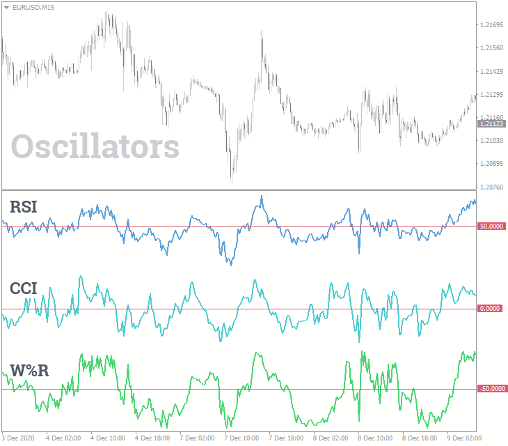

## Table of Contents

## What is the Relative Strength Index (RSI)?

The Relative Strength Index (RSI) is a tool used in trading to measure how fast and how much a stock or other asset is moving. It helps traders see if an asset is being bought a lot (overbought) or sold a lot (oversold). The RSI is shown as a number between 0 and 100. If the RSI is above 70, it might mean the asset is overbought and could soon go down in price. If it's below 30, it might mean the asset is oversold and could soon go up in price.

The RSI is calculated using the average gains and losses of an asset over a certain period, usually 14 days. Traders look at the RSI to help them decide when to buy or sell. For example, if the RSI moves from below 30 to above 30, it might be a good time to buy. If it moves from above 70 to below 70, it might be a good time to sell. But, the RSI is just one tool, and traders should use it along with other information to make their decisions.

## What is the Commodity Channel Index (CCI)?

The Commodity Channel Index (CCI) is a tool that traders use to see if an asset, like a stock or a commodity, is being bought or sold a lot. It helps them figure out if the price of the asset is too high (overbought) or too low (oversold). The CCI is shown as a line on a chart that moves above and below a zero line. When the CCI goes above +100, it might mean the asset is overbought and the price could soon go down. When it goes below -100, it might mean the asset is oversold and the price could soon go up.

The CCI is calculated using the average price of the asset over a certain period, usually 20 days, and how much the price changes during that time. Traders look at the CCI to help them decide when to buy or sell. For example, if the CCI moves from below -100 to above -100, it might be a good time to buy. If it moves from above +100 to below +100, it might be a good time to sell. But, like the RSI, the CCI is just one tool, and traders should use it along with other information to make their decisions.

## How is the RSI calculated?

The RSI is calculated using the average gains and losses of an asset over a certain period, usually 14 days. First, you find the average gain and the average loss over the last 14 days. The average gain is the sum of all the gains divided by 14, and the average loss is the sum of all the losses divided by 14. If there are no gains or no losses on a particular day, you count it as zero.

Next, you use these averages to calculate the relative strength (RS), which is the average gain divided by the average loss. Then, you plug the RS into the RSI formula: RSI = 100 - (100 / (1 + RS)). This gives you a number between 0 and 100. Traders use this number to see if an asset might be overbought or oversold.

## How is the CCI calculated?

The Commodity Channel Index (CCI) is calculated using the price of an asset over a certain period, usually 20 days. First, you find the average price of the asset for each day. The average price is the sum of the high, low, and closing price divided by 3. Then, you find the average of these average prices over the last 20 days. This is called the simple moving average (SMA).

Next, you find out how much the price changes each day by taking the difference between the average price and the SMA. You then find the average of these differences over the last 20 days. This is called the mean deviation. Finally, you use these numbers to calculate the CCI. The formula is: CCI = (Typical Price - SMA) / (0.015 x Mean Deviation). The result is a number that shows if the asset might be overbought or oversold.

## What are the typical settings for RSI?

The typical setting for the RSI is 14 days. This means that the RSI calculation looks at the average gains and losses of an asset over the last 14 days. Traders use this setting because it gives a good balance between being sensitive to recent price changes and not being too jumpy.

Some traders might change the setting to a shorter period, like 9 days, to get quicker signals. Others might use a longer period, like 25 days, for a smoother line that shows longer-term trends. But most traders stick with the 14-day setting because it's the standard and works well for many different types of assets.

## What are the typical settings for CCI?

The typical setting for the Commodity Channel Index (CCI) is 20 days. This means the CCI calculation looks at the average price of an asset over the last 20 days. Traders use this setting because it gives a good balance between showing recent price changes and not being too jumpy.

Some traders might change the setting to a shorter period, like 10 days, to get quicker signals about when an asset might be overbought or oversold. Others might use a longer period, like 30 days, for a smoother line that shows longer-term trends. But most traders stick with the 20-day setting because it's the standard and works well for many different types of assets.

## How does RSI help in identifying overbought and oversold conditions?

The RSI helps traders see if a stock or other asset is being bought too much or sold too much. It does this by giving a number between 0 and 100. If the RSI number is over 70, it means the asset might be overbought. This means a lot of people are buying it, and the price might be too high. It could be a good time to sell before the price goes down.

If the RSI number is under 30, it means the asset might be oversold. This means a lot of people are selling it, and the price might be too low. It could be a good time to buy before the price goes up. Traders use the RSI to help them decide when to buy or sell, but they also look at other things to make sure they're making good choices.

## How does CCI help in identifying overbought and oversold conditions?

The Commodity Channel Index (CCI) helps traders figure out if a stock or other asset is being bought too much or sold too much. It does this by giving a number that moves above and below a zero line. If the CCI number goes above +100, it means the asset might be overbought. This means a lot of people are buying it, and the price might be too high. It could be a good time to sell before the price goes down.

If the CCI number goes below -100, it means the asset might be oversold. This means a lot of people are selling it, and the price might be too low. It could be a good time to buy before the price goes up. Traders use the CCI to help them decide when to buy or sell, but they also look at other things to make sure they're making good choices.

## Can RSI and CCI be used together for trading signals, and if so, how?

Yes, RSI and CCI can be used together to make trading decisions. When both the RSI and CCI show that an asset is overbought (RSI above 70 and CCI above +100), it might be a good time to sell. This is because both tools are saying the price is too high and could soon go down. On the other hand, if both the RSI and CCI show that an asset is oversold (RSI below 30 and CCI below -100), it might be a good time to buy. This is because both tools are saying the price is too low and could soon go up.

Using both RSI and CCI together can help traders feel more confident in their decisions. If only one tool shows an overbought or oversold condition, traders might wait to see if the other tool confirms it before making a move. This way, they can avoid making quick decisions based on just one tool and can look for stronger signals that both tools agree on.

## What are the key differences between RSI and CCI in terms of their applications?

The RSI and CCI are both tools that help traders see if a stock or other asset is being bought too much or sold too much. But they look at different things to figure this out. The RSI looks at how the price of an asset has changed over the last 14 days. It uses the average gains and losses to give a number between 0 and 100. If the RSI is over 70, it might mean the price is too high and could go down soon. If it's under 30, it might mean the price is too low and could go up soon.

The CCI looks at the average price of an asset over the last 20 days. It uses the high, low, and closing prices to find out if the price is too high or too low. The CCI gives a number that moves above and below a zero line. If the CCI is above +100, it might mean the price is too high and could go down soon. If it's below -100, it might mean the price is too low and could go up soon. So, while both tools help traders make decisions, they use different ways to figure out if an asset is overbought or oversold.

## How do RSI and CCI perform in different market conditions, such as trending vs. ranging markets?

In trending markets, where the price of an asset is moving steadily in one direction, the RSI and CCI can behave differently. The RSI might stay above 70 for a long time in a strong uptrend, which could make it seem like the asset is always overbought. This can be confusing because it might make traders think the price will go down when it keeps going up. The CCI can also stay above +100 in a strong uptrend, but it might be a bit better at showing when the trend is getting weaker. In a strong downtrend, both the RSI and CCI might stay below their oversold levels, which can make it hard for traders to know when to buy.

In ranging markets, where the price of an asset moves up and down between two levels, both the RSI and CCI can be very useful. The RSI often moves between 30 and 70, showing good times to buy when it goes below 30 and good times to sell when it goes above 70. The CCI also moves between -100 and +100 in a ranging market, making it easier for traders to see when the price might be ready to change direction. In these markets, both tools can help traders find good times to buy and sell, as long as they remember that the price is not likely to keep moving in one direction for a long time.

## What are some advanced techniques for using RSI and CCI, such as divergences and failure swings?

One advanced technique for using RSI and CCI is looking for divergences. A divergence happens when the price of an asset is moving one way, but the RSI or CCI is moving the other way. For example, if the price is going up but the RSI is going down, it's called a bearish divergence. This can mean the price might start to go down soon. If the price is going down but the RSI is going up, it's called a bullish divergence. This can mean the price might start to go up soon. Traders look for these divergences to find times when the price might change direction, even if the RSI or CCI isn't showing overbought or oversold conditions.

Another advanced technique is looking for failure swings. A failure swing with the RSI happens when the RSI goes above 70 and then drops back below 70, but then it goes above 70 again and drops below a lower level than before. This can mean the price might go down soon. With the CCI, a failure swing happens when the CCI goes above +100 and then drops back below +100, but then it goes above +100 again and drops below a lower level than before. This can also mean the price might go down soon. For both tools, a failure swing in the other direction can mean the price might go up soon. Traders use these failure swings to find good times to buy or sell, especially when the price is not moving much.

## What is the Commodity Channel Index (CCI) and how does it work?

The Commodity Channel Index (CCI) is a widely-utilized technical indicator that assists traders in identifying cyclical trends across a broad spectrum of asset classes, including commodities, stocks, and currencies. Created to measure the deviation of an asset's price from its moving average, the CCI provides critical insights into market conditions, highlighting periods when assets may be overbought or oversold. This makes CCI an instrumental tool in forecasting potential price reversals.

One of the unique features of the CCI is its lack of defined boundaries, which distinguishes it from other bounded oscillators such as the RSI. This unbounded nature allows the CCI to adapt to varying market conditions, making it particularly effective for detecting trends in different market scenarios. By assessing how far a price has diverged from its average, the CCI helps traders recognize emerging trends or the beginnings of potential reversals, offering a dynamic approach to market analysis.

The calculation of the CCI incorporates the typical price, moving averages, and mean deviation. The typical price is calculated as the average of the high, low, and close prices for a given period, usually over 20 days. The formula for the Commodity Channel Index is:

$$
\text{CCI} = \frac{\text{Typical Price} - \text{Simple Moving Average of Typical Price}}{0.015 \times \text{Mean Deviation}}
$$

Where:
- The Typical Price (TP) is $\frac{\text{High} + \text{Low} + \text{Close}}{3}$.
- The Simple Moving Average (SMA) of the typical price provides a smoothed view of price trends over a chosen period.
- The Mean Deviation measures the average deviation of the typical price from its SMA.

The constant 0.015 is typically used to ensure that approximately 70-80% of CCI values fall within the range of -100 to +100, without imposing hard boundaries.

The normalized view provided by CCI calculation facilitates comparison across different securities, making it a favored choice among traders seeking to identify potential buying or selling opportunities in diverse financial markets. This adaptability and the depth of insight offered render the Commodity Channel Index an invaluable tool in technical analysis, particularly for algorithmic traders aiming to optimize their trading strategies.

## What is Exploring Relative Strength Index (RSI)?

The Relative Strength Index (RSI) is a widely-used [momentum](/wiki/momentum) oscillator that assists traders in identifying overbought and oversold conditions in the financial markets. Developed by J. Welles Wilder Jr., the RSI operates on a scale bounded between 0 and 100, providing a clear numerical representation of market momentum.

The RSI is calculated by evaluating the average gains and losses over a specified period, commonly 14 days. This calculation helps traders discern potential trend reversals. The formula for RSI is as follows:

$$
\text{RSI} = 100 - \left( \frac{100}{1 + \text{RS}}} \right)
$$

where RS (Relative Strength) is the ratio of average gains to average losses over the set period. This measure of strength assists in defining market conditions, where readings above 70 traditionally indicate overbought conditions, suggesting a potential sell signal. Conversely, readings below 30 suggest oversold conditions, indicating a potential buy signal.

The popularity of RSI stems from its straightforward interpretation and effectiveness in markets characterized by defined trends. The oscillator's clear numerical output facilitates decision-making, allowing even novice traders to apply RSI-based strategies with relative ease. For instance, traders can use RSI to confirm price directions or predict possible market corrections. Typically, when RSI indicates an overbought condition, it may precede a price drop as assets are likely traded at higher prices relative to their historical performance. Similarly, an oversold reading may suggest an upcoming price increase as the asset might be undervalued.

RSI’s capability to provide reliable signals makes it a staple in technical analysis across various asset classes, including stocks, commodities, and [forex](/wiki/forex-system). However, while the RSI is efficient in trending markets, it may give false signals in markets with higher [volatility](/wiki/volatility-trading-strategies) or without clear direction, necessitating its use in conjunction with other indicators or confirmation strategies to enhance trading precision.

## References & Further Reading

[1]: Constance Brown. ["Technical Analysis for the Trading Professional."](https://www.amazon.com/Technical-Analysis-Trading-Professional-Second/dp/007175914X) McGraw-Hill Educational, 2011.

[2]: J. Welles Wilder Jr. ["New Concepts in Technical Trading Systems."](https://www.amazon.com/New-Concepts-Technical-Trading-Systems/dp/0894590278) Trend Research, 1978.

[3]: Thomas N. Bulkowski. ["Encyclopedia of Chart Patterns."](https://www.amazon.com/Encyclopedia-Chart-Patterns-Thomas-Bulkowski/dp/0471668265) Wiley, 2005.

[4]: Robert W. Colby. ["The Encyclopedia of Technical Market Indicators."](https://www.amazon.com/Encyclopedia-Technical-Market-Indicators-Second/dp/0070120579) McGraw-Hill, 2003.

[5]: Marcos Lopez de Prado. ["Advances in Financial Machine Learning."](https://www.amazon.com/Advances-Financial-Machine-Learning-Marcos/dp/1119482089) Wiley, 2018.

[6]: David Aronson. ["Evidence-Based Technical Analysis: Applying the Scientific Method and Statistical Inference to Trading Signals."](https://www.amazon.com/Evidence-Based-Technical-Analysis-Scientific-Statistical/dp/0470008741) Wiley, 2007.