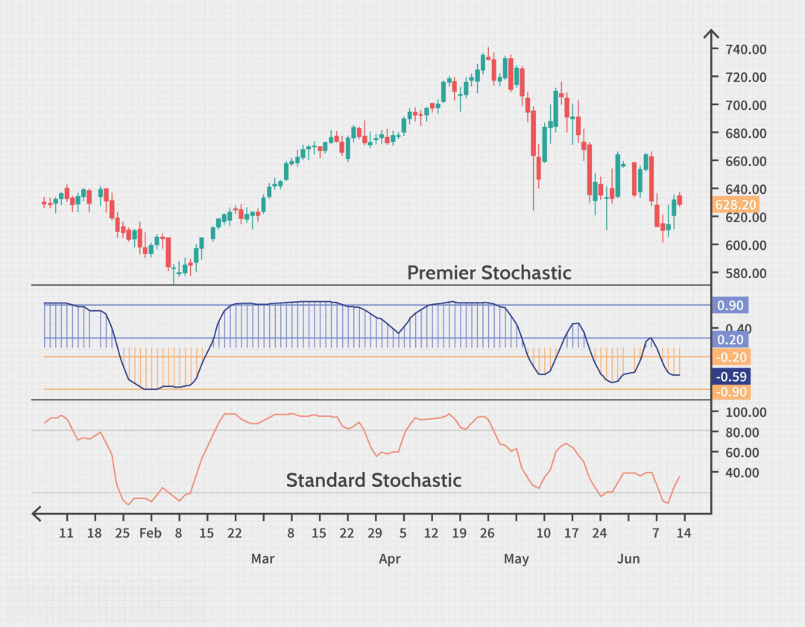

Technical analysis tools are essential components in trading, providing traders with a systematic approach to evaluating securities and predicting future price movements. These tools encompass various techniques, including momentum indicators, which are pivotal in assessing the speed and direction of price changes. Momentum indicators are crucial in determining the strength of market trends, thereby aiding traders in making informed decisions.

Among the plethora of momentum indicators, the Relative Strength Index (RSI) and the Stochastic Oscillator stand out as two of the most widely used tools. The RSI, developed by J. Welles Wilder, measures the magnitude of recent price changes to evaluate overbought or oversold conditions in an asset. In contrast, the Stochastic Oscillator, introduced by George Lane, compares a security's closing price to a range of its prices over a specific period. Both indicators operate on a scale from 0 to 100, helping traders identify potential turning points in market trends.



This article aims to explore both the RSI and Stochastic Oscillator, focusing on their application within algorithmic trading—a field that has witnessed exponential growth. Algorithmic trading leverages computer algorithms to execute trades at optimal speeds, volumes, and prices, often using momentum indicators as part of their decision-making process. By integrating RSI and Stochastic Oscillator into these systems, traders can automate and enhance their strategies, potentially increasing efficiency and profitability.

The increasing prominence of algorithmic trading underscores the relevance of momentum indicators like RSI and Stochastic Oscillator. Through a deeper understanding of these tools, traders can optimize their trading strategies, adapt to dynamic market conditions, and effectively navigate the complexities of financial markets.

## Table of Contents

## Understanding the Relative Strength Index (RSI)

The Relative Strength Index (RSI) is a momentum oscillator that quantifies the speed and change of price movements. It was developed by J. Welles Wilder Jr. and introduced in his 1978 book "New Concepts in Technical Trading Systems." The RSI has since become one of the most popular tools used in technical analysis because it provides a concise method to evaluate price trends and potential reversal points.

The RSI measures the magnitude of recent price changes to evaluate overbought or oversold conditions in the price of an asset. The indicator uses an oscillator scale from 0 to 100, where levels above 70 suggest that the asset may be overbought, while levels below 30 may indicate that it is oversold. The formula for calculating the RSI involves two primary steps: determining the average gain and average loss over a specified period, and then applying these values to the RSI equation:

$$
RSI = 100 - \frac{100}{1 + RS}
$$

where $RS$ is the relative strength, calculated as the average gain divided by the average loss over a specified period.

The RSI is often used by traders to identify potential support and resistance levels, as well as to confirm trading signals. For instance, if an asset is trending and the RSI crosses above the 70 level, it may serve as a signal to traders that the asset could be poised for a downward reversal. Conversely, an RSI reading falling below 30 is sometimes interpreted as an uptrend signal in oversold situations.

The main advantages of utilizing the RSI in technical analysis include its visual simplicity and its ability to provide clear, quantifiable signals of potential market reversals or trend continuations. Furthermore, the RSI can be effectively combined with other indicators to form a comprehensive analysis toolkit. However, there are limitations, such as its potential to generate false signals, especially during volatile market conditions or when used as the sole basis for trading decisions. Over-reliance on RSI without additional confirmation from other technical tools or [fundamental analysis](/wiki/fundamental-analysis) can lead to suboptimal trading outcomes.

In summary, the RSI is a valuable tool in technical analysis, offering insights into market [momentum](/wiki/momentum) and potential reversal points, but it should be used with caution and in conjunction with other forms of analysis.

## Exploring the Stochastic Oscillator

The Stochastic Oscillator is a widely recognized momentum indicator in technical analysis, conceptualized by George Lane in the late 1950s. It functions through the comparative assessment of a security's closing price to a price range over a preset period. This comparison operates under the premise that in an upward-trending market, prices might close near their high, whereas they might close near their low in a downtrend. 

The Stochastic Oscillator is computed using the formula:

$$
\text{Stochastic \%K} = \frac{\text{Current Close} - \text{Lowest Low}}{\text{Highest High} - \text{Lowest Low}} \times 100
$$

where the "Current Close" pertains to the most recent closing price, "Lowest Low" refers to the lowest price over the observation period, and "Highest High" is the highest price over the same period. Typically, the observation period is set at 14 days. 

The Stochastic Oscillator ranges from 0 to 100, facilitating the identification of potential overbought and oversold conditions. Values above 80 typically suggest that the asset might be overbought, indicating a potential decline, while values below 20 suggest that the asset might be oversold, implying a possible rally.

A key aspect of the Stochastic Oscillator is the use of two lines, %K and %D, where %D is a moving average of %K. Their intersections can serve as indicators of market turnarounds. When %K crosses above %D, it can signal a bullish trend, whereas a cross below %D might signify a bearish trend.

One of the oscillator's advantages is its ability to generate numerous trading signals in oscillating or range-bound markets, which might not be as apparent using trend-following indicators. Additionally, its predictive capacity around the overbought and oversold levels offers traders insightful entry and [exit](/wiki/exit-strategy) points.

However, the Stochastic Oscillator is not without limitations. One notable drawback is its propensity to generate false signals in strongly trending markets. In such scenarios, the oscillator might remain in the overbought or oversold territory for extended periods without a corresponding reversal in market momentum. Therefore, it is often recommended to use the Stochastic Oscillator in conjunction with other indicators to validate its signals. This ensures a more robust trading strategy capable of adapting to varying market conditions.

## RSI vs. Stochastic Oscillator: Key Differences

The Relative Strength Index (RSI) and the Stochastic Oscillator are both momentum indicators used in technical analysis to assess the market's momentum and identify potential overbought or oversold conditions. Although they share similar objectives, their underlying theories and calculation methods differ significantly.

The RSI, developed by J. Welles Wilder, gauges recent gains against recent losses over a specified period, typically 14 days. The formula for RSI is:

$$

\text{RSI} = 100 - \left( \frac{100}{1 + \frac{\text{Average Gain}}{\text{Average Loss}}} \right) 
$$

It values from 0 to 100, with levels above 70 considered overbought and below 30 considered oversold. RSI is particularly favored in trending markets due to its ability to confirm the strength and direction of a trend.

The Stochastic Oscillator, created by George Lane, operates on the principle that closing prices tend to close near the high of the range in an uptrend and near the low in a downtrend. Its calculation involves:

$$
\text{Stochastic} = \frac{\text{(Current Close - Lowest Low)}}{\text{(Highest High - Lowest Low)}} \times 100
$$

This results in a value ranging from 0 to 100, with readings above 80 indicating overbought conditions and below 20 indicating oversold conditions. This indicator is often used in choppy or sideways markets because it is sensitive to price movements, which makes it effective in identifying reversals.

One of the key differences lies in their sensitivity and application in various market conditions. The RSI is commonly preferred in trending markets as it reacts to price changes over a more intermediate period, filtering out excessive price noise. Conversely, the Stochastic Oscillator is more responsive, capturing potential reversal signals in volatile or range-bound markets through the crossing of its %K and %D lines.

Divergences in RSI and Stochastic Oscillator are crucial signals of potential reversals. A divergence occurs when the price makes a new high or low that is not confirmed by the indicator. For example, a bearish divergence is observed when the price reaches a new high, but the RSI or Stochastic Oscillator does not, suggesting a potential weakening of the trend and a reversal.

In conclusion, the RSI and Stochastic Oscillator offer unique strengths and weaknesses that cater to different market environments. Analysts often prefer the RSI for its trend-confirmation capabilities and the Stochastic Oscillator for its agility in non-trending markets. Both indicators, when used alongside other tools and signals, can enhance the robustness of trading strategies.

## Incorporating RSI and Stochastic Oscillator in Algorithmic Trading

Algorithmic trading refers to the use of computer algorithms to automate trading decisions in financial markets. These algorithms are programmed to [carry](/wiki/carry-trading) out specific trading strategies based on pre-defined criteria and can execute trades with speed and precision unattainable by human traders. Algorithmic trading offers several benefits, including the ability to process vast amounts of data quickly, eliminate emotional biases, and increase the efficiency of trading operations.

Incorporating momentum indicators like the Relative Strength Index (RSI) and Stochastic Oscillator into [algorithmic trading](/wiki/algorithmic-trading) can enhance the effectiveness of these strategies. Both indicators provide insights into market momentum, which can help in anticipating price movements and identifying potential trading opportunities.

### Utilization in Algorithmic Strategies

RSI and Stochastic Oscillator indicators can be programmed into trading algorithms to automate decision-making processes. For instance, a simple algorithm may involve initiating a buy order when the RSI drops below 30, indicating an oversold condition, and executing a sell order when it exceeds 70, signaling an overbought environment. Similarly, the Stochastic Oscillator can trigger a buy when its value falls below 20 and a sell when it rises above 80.

### Sample Strategies

**1. Combined RSI and Stochastic Oscillator Strategy:**

A combined strategy might look for convergence in signals from both indicators to enhance reliability. For instance, an algorithm could be designed to buy only when both the RSI and Stochastic Oscillator indicate oversold conditions. The combined confirmation increases the likelihood of a successful trade by reducing false positives from individual indicators.

```python
def trading_strategy(data, rsi_period=14, stoch_period=14):
    """
    An example strategy using RSI and Stochastic Oscillator signals.
    data: Pandas DataFrame with columns 'close', 'high', 'low'
    rsi_period: int, default 14
    stoch_period: int, default 14
    """
    import talib

    # Calculate RSI
    data['RSI'] = talib.RSI(data['close'], timeperiod=rsi_period)

    # Calculate Stochastic Oscillator
    stoch_k, stoch_d = talib.STOCHF(data['high'], data['low'], data['close'], fastk_period=stoch_period)
    data['Stochastic_K'] = stoch_k
    data['Stochastic_D'] = stoch_d

    # Define buy/sell signals
    data['signal'] = 0
    data.loc[(data['RSI'] < 30) & (data['Stochastic_K'] < 20), 'signal'] = 1  # Buy signal
    data.loc[(data['RSI'] > 70) & (data['Stochastic_K'] > 80), 'signal'] = -1  # Sell signal

    return data
```

### Considerations for Backtesting and Real-Time Application

Backtesting is a critical step in developing algorithmic trading strategies. It involves running the trading algorithm using historical market data to assess its performance over a specified period. This process helps in understanding how the strategy might perform in various market conditions and identifying any potential weaknesses.

When [backtesting](/wiki/backtesting) a strategy that incorporates RSI and Stochastic Oscillator, it is essential to consider transaction costs, market [liquidity](/wiki/liquidity-risk-premium), and slippage to ensure realistic results. Moreover, the past performance of a strategy is not always indicative of future outcomes, so continuous testing and optimization are necessary.

In real-time applications, factors such as data latency, execution speed, and the robustness of trading infrastructure become crucial. Algorithms must be optimized for low-latency environments to ensure timely responses to market conditions. Additionally, incorporating risk management measures, such as stop-loss orders, can help protect against significant losses.

In conclusion, algorithmic trading using RSI and Stochastic Oscillator can provide traders with systematic and effective methodologies for entering and exiting trades. These indicators enhance trade timing and decision-making, and when combined with rigorous backtesting and risk management, they can form a powerful component of an algorithmic trading strategy.

## Best Practices for Using RSI and Stochastic in Trading

When utilizing the Relative Strength Index (RSI) and Stochastic Oscillator in trading, applying best practices enhances your trading strategy's effectiveness and reliability. Here are several important considerations to keep in mind:

### Tips for Effectively Using RSI and Stochastic Indicators

1. **Understand Market Context**: Before deploying RSI and Stochastic Oscillator, consider the broader market conditions. RSI is beneficial in trending markets as it offers insight into potential overbought or oversold scenarios. In contrast, the Stochastic Oscillator is more effective in sideways or choppy markets, where it can highlight potential reversals.

2. **Use Appropriate Time Frames**: Select time frames that align with your trading strategy. Shorter time frames can generate more signals, but they might be less reliable, while longer time frames produce fewer, but potentially more accurate, signals. Adjust the period settings (e.g., 14-period RSI) based on the asset's volatility and your trading objectives.

3. **Signal Confirmation**: Use RSI and Stochastic Oscillator in conjunction with other technical analysis tools to confirm signals. For example, combining these oscillators with moving averages, such as the 50-day or 200-day moving average, can filter out false signals and improve decision-making.

4. **Customization**: Tailor the parameters of the indicators to fit your specific trading style and the asset being traded. An example is adjusting the RSI overbought/oversold thresholds from the standard 70/30 to 80/20 for assets with higher volatility.

### Common Pitfalls and How to Avoid Them

1. **Over-reliance on Indicators**: While RSI and Stochastic Oscillator offer valuable insights, relying solely on these indicators can be detrimental. Always incorporate other market data, such as volume and price action, to provide context.

2. **Ignoring Divergences**: Failing to recognize divergences between the price and the indicators can lead to missed opportunities. A divergence occurs when the trend in the price movement does not align with the trend in the indicator, often signaling potential reversals.

3. **Not Adapting to Market Conditions**: Markets evolve, and trading strategies should adapt accordingly. Regularly review and adjust the settings of RSI and the Stochastic Oscillator based on changing market dynamics and asset behaviors.

### Integrating with Other Technical Analysis Tools

Combining RSI and Stochastic Oscillator with other indicators can create a more robust trading strategy. For example:

- **Bollinger Bands** can be used alongside RSI to identify price extremes and potential reversals.
- **Moving Average Convergence Divergence (MACD)** can help confirm trends and potential entry or exit points.
- **Fibonacci Retracements** can be used to identify support and resistance levels, complemented by signals from RSI and Stochastic Oscillator.

### Importance of Risk Management and Constant Evaluation

Effective risk management is crucial for successful trading. Always define stop-loss limits to protect against significant losses and use position-sizing techniques to manage risk exposure.

Moreover, regularly evaluate the performance of your strategy. Backtesting historical data and using paper trading to simulate real-time trading can provide insights into the strengths and weaknesses of your approach. This feedback loop allows for continuous improvement and adaptation to maintain an edge in the market.

By integrating these best practices into your use of the RSI and Stochastic Oscillator, you can enhance the precision and effectiveness of your trading strategies, leading to potentially more successful outcomes.

## Conclusion

The Relative Strength Index (RSI) and the Stochastic Oscillator are indispensable momentum indicators in the domain of technical analysis. Their utility extends far beyond mere signal generation, offering traders a nuanced understanding of market dynamics. RSI, developed by J. Welles Wilder, excels in trending markets, providing insights into potential overbought or oversold conditions through its scale of 0 to 100. Conversely, the Stochastic Oscillator, devised by George Lane, shines in fluctuating market conditions by comparing closing prices against price ranges over a specified period. Both indicators warn traders of potential trend reversals, setting the stage for informed decision-making.

In the context of algorithmic trading, these indicators play pivotal roles. By quantifying momentum and price movements, they can be seamlessly integrated into algorithmic strategies to automate trading decisions. A common strategy might involve executing trades when RSI or Stochastic Oscillator signals align with broader market patterns, or when divergences suggest a trend reversal.

Experimentation and adaptation are crucial in leveraging the full potential of RSI and Stochastic Oscillator. Traders are encouraged to combine these tools with other forms of analysis to tailor strategies that suit their individual trading styles and objectives. This flexibility not only enhances strategy robustness but also aligns with the personalized nature of trading.

Finally, continuous education is paramount in the ever-evolving field of technical trading. Staying informed about new strategies, tools, and market conditions can significantly enhance trading effectiveness. By doing so, traders can effectively harness the power of RSI, Stochastic Oscillator, and other technical indicators to optimize their trading performance.

## FAQs

**Q1: How is the Relative Strength Index (RSI) interpreted in trading?**

The Relative Strength Index (RSI) is a momentum indicator that quantifies the speed and change of price movements. It provides traders with the ability to identify overbought or oversold conditions in the market. The RSI ranges from 0 to 100, where traditionally:

- An RSI above 70 indicates that an asset might be overbought, suggesting that a price pullback or reversal could occur.
- An RSI below 30 suggests an asset could be oversold, indicating a possible price rise or reversal.

RSI is also used to identify potential support and resistance levels and to help confirm trading signals. It's important to note that its effectiveness is diminished when used in a trending market, as RSI can remain in overbought or oversold zones for extended periods.

**Q2: How should the Stochastic Oscillator be interpreted?**

The Stochastic Oscillator compares a particular closing price of an asset to its price range over a specific period. Its value also ranges from 0 to 100:

- Values above 80 are typically seen as indicating that the asset is in an overbought region, which might suggest that price correction or reversal could soon occur.
- Values below 20 are perceived as showing that the asset is oversold, potentially leading to a price rise or reversal.

Traders often watch for the crossing of the %K and %D lines (fast and slow lines, respectively) as potential signals. A crossover in the overbought or oversold regions could indicate a bullish or bearish reversal.

**Q3: Where can I find resources for further learning about RSI and Stochastic Oscillator?**

For those looking into expanding their knowledge about RSI and the Stochastic Oscillator, as well as algorithmic trading strategies, the following resources are beneficial:

1. **Books**: Titles such as "Technical Analysis of the Financial Markets" by John J. Murphy and "New Concepts in Technical Trading Systems" by J. Welles Wilder.
2. **Online Courses**: Platforms like Coursera, Udemy, and Khan Academy offer courses on technical analysis and algorithmic trading.
3. **Trading Platforms and Software**: Many trading platforms, such as MetaTrader, TradingView, and Thinkorswim, often have educational resources and built-in tools for backtesting strategies.
4. **Websites and Blogs**: Sites like Investopedia or technical analysis blogs provide articles and practical examples.
5. **Community Forums**: Engaging in forums like Stack Exchange, Elite Trader, or TradingView Community can offer insights from experienced traders.

**Q4: Are there any common pitfalls in using RSI and Stochastic Oscillator, and how do I avoid them?**

Common pitfalls include relying solely on these indicators without considering the broader market context or additional technical analysis tools. To avoid these pitfalls, consider the following tips:

- Use RSI and the Stochastic Oscillator alongside other indicators to confirm signals, such as moving averages or volume indicators.
- Avoid using them in isolation, especially in trending markets, where they may give false signals.
- Incorporate risk management protocols, like stop-loss orders, to protect against downside risks.
- Regularly backtest strategies under different market conditions to ensure their effectiveness before implementing them in real-time trading.

## References & Further Reading

[1]: Wilder, J. W. (1978). ["New Concepts in Technical Trading Systems."](https://archive.org/details/newconceptsintec00wild) Trend Research.

[2]: Murphy, J. J. (1999). ["Technical Analysis of the Financial Markets: A Comprehensive Guide to Trading Methods and Applications."](https://archive.org/details/technicalanalysi0000murp) New York Institute of Finance.

[3]: Kirkpatrick, C. D., & Dahlquist, J. R. (2010). ["Technical Analysis: The Complete Resource for Financial Market Technicians."](https://ptgmedia.pearsoncmg.com/images/9780134137049/samplepages/9780134137049.pdf) FT Press.

[4]: Pring, M. J. (2002). ["Technical Analysis Explained: The Successful Investor's Guide to Spotting Investment Trends and Turning Points."](https://www.amazon.com/Technical-Analysis-Explained-Fifth-Successful/dp/0071825177) McGraw-Hill Education.

[5]: Lane, G. C. (1984). ["Lane's Stochastics: A Key for Quick Market Diagnosis."](https://en.wikipedia.org/wiki/List_of_people_who_died_in_traffic_collisions) Lane Research.

[6]: Aronson, D. (2007). ["Evidence-Based Technical Analysis: Applying the Scientific Method and Statistical Inference to Trading Signals."](https://www.amazon.com/Evidence-Based-Technical-Analysis-Scientific-Statistical/dp/0470008741) Wiley.

[7]: de Prado, M. L. (2018). ["Advances in Financial Machine Learning."](https://www.amazon.com/Advances-Financial-Machine-Learning-Marcos/dp/1119482089) Wiley.

[8]: Chan, E. P. (2009). ["Quantitative Trading: How to Build Your Own Algorithmic Trading Business."](https://github.com/ftvision/quant_trading_echan_book) Wiley.