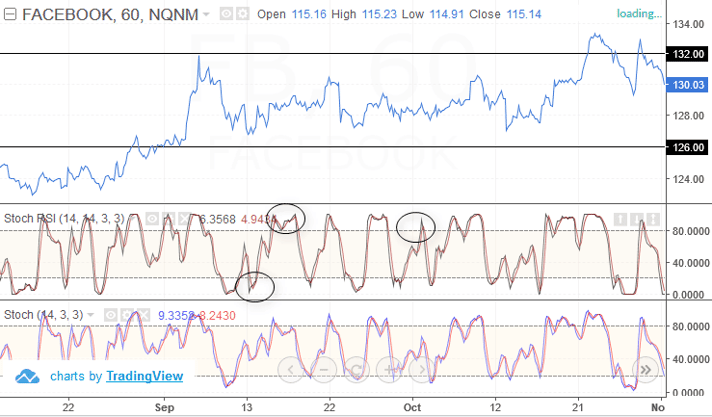

## Table of Contents

## What is the Relative Strength Index (RSI)?

The Relative Strength Index (RSI) is a tool used in trading to measure how fast and how much a stock's price is changing. It helps traders figure out if a stock is being bought too much (overbought) or sold too much (oversold). The RSI is shown as a number between 0 and 100. If the RSI is above 70, it might mean the stock is overbought, and if it's below 30, it might mean the stock is oversold.

Traders use the RSI to make decisions about buying or selling stocks. For example, if the RSI shows a stock is oversold, a trader might think it's a good time to buy because the price might go up soon. On the other hand, if the RSI shows a stock is overbought, a trader might decide to sell because the price might go down soon. The RSI can help traders spot good times to trade, but it's not perfect and should be used with other tools to make the best decisions.

## What is the Stochastic Oscillator?

The Stochastic Oscillator is another tool traders use to help them decide when to buy or sell stocks. It works by comparing a stock's closing price to its price range over a certain period of time. The idea behind it is that in an uptrend, prices tend to close near the high of the period, and in a downtrend, prices tend to close near the low. The Stochastic Oscillator gives you two lines, %K and %D, which move between 0 and 100. If these lines are above 80, it might mean the stock is overbought, and if they're below 20, it might mean the stock is oversold.

Traders look at the Stochastic Oscillator to find good times to trade. For example, if the lines move from above 80 to below 80, it might be a good time to sell because the stock might be starting to go down. On the other hand, if the lines move from below 20 to above 20, it might be a good time to buy because the stock might be starting to go up. Like the RSI, the Stochastic Oscillator is not perfect and should be used with other tools to make the best trading decisions.

## How is the RSI calculated?

The RSI is calculated using a stock's price changes over a certain number of days, usually 14 days. First, you find the average gain and the average loss over those 14 days. The average gain is the total of all the days where the price went up, divided by 14. The average loss is the total of all the days where the price went down, divided by 14. If the price didn't change on a day, that day is not counted in either the gains or the losses.

Next, you use these averages to find the Relative Strength (RS), which is the average gain divided by the average loss. Then, you plug the RS into a formula to get the RSI. The formula is: RSI = 100 - (100 / (1 + RS)). This gives you a number between 0 and 100. If the RSI is above 70, it might mean the stock is overbought, and if it's below 30, it might mean the stock is oversold.

## How is the Stochastic Oscillator calculated?

The Stochastic Oscillator is calculated using the stock's price over a certain number of days, usually 14 days. It compares the closing price of the stock to its high and low prices during that time. The calculation gives you two numbers, %K and %D. To find %K, you take the current closing price minus the lowest price in the last 14 days, then divide that by the highest price in the last 14 days minus the lowest price in the last 14 days. You multiply this by 100 to get a number between 0 and 100.

To find %D, you take the average of the last three %K values. This smooths out the %K line and makes it easier to see trends. Both %K and %D move between 0 and 100. If they are above 80, it might mean the stock is overbought, and if they are below 20, it might mean the stock is oversold. Traders use these numbers to help decide when to buy or sell stocks.

## What are the common settings for RSI?

The common setting for the RSI is a period of 14 days. This means the RSI is calculated using the price changes over the last 14 days. Traders can change this period to make the RSI more sensitive or less sensitive to price changes. A shorter period, like 7 days, will make the RSI react faster to price changes, while a longer period, like 21 days, will make it react slower.

When using the RSI, traders often look at levels of 70 and 30. If the RSI goes above 70, it might mean the stock is overbought, and if it goes below 30, it might mean the stock is oversold. These levels can help traders decide when to buy or sell a stock. However, some traders might use different levels, like 80 and 20, depending on their strategy and the stock they are trading.

## What are the common settings for the Stochastic Oscillator?

The common setting for the Stochastic Oscillator is a period of 14 days. This means the oscillator is calculated using the price data from the last 14 days. Traders can change this period to make the oscillator more or less sensitive to price changes. A shorter period, like 5 days, will make the oscillator react faster to price changes, while a longer period, like 21 days, will make it react slower.

Traders also use two lines with the Stochastic Oscillator: %K and %D. The %K line is usually set to a period of 14 days, and the %D line is a 3-period moving average of %K. These settings help traders see trends more clearly. When using the Stochastic Oscillator, traders often look at levels of 80 and 20. If the lines go above 80, it might mean the stock is overbought, and if they go below 20, it might mean the stock is oversold. These levels can help traders decide when to buy or sell a stock.

## How do traders interpret RSI values?

Traders use the RSI to figure out if a stock is being bought too much or sold too much. The RSI is a number between 0 and 100. If the RSI goes above 70, it might mean the stock is overbought, which means a lot of people are buying it and the price might be too high. On the other hand, if the RSI goes below 30, it might mean the stock is oversold, which means a lot of people are selling it and the price might be too low. These levels help traders decide when to buy or sell.

Traders also look at how the RSI is moving. If the RSI is going up, it can mean the stock's price is getting stronger. If the RSI is going down, it can mean the stock's price is getting weaker. Sometimes, traders look for a thing called "divergence," which happens when the RSI is moving in the opposite direction of the stock's price. This can be a sign that the stock's price might change direction soon.

## How do traders interpret Stochastic Oscillator values?

Traders use the Stochastic Oscillator to figure out if a stock is being bought too much or sold too much. The Stochastic Oscillator gives two lines, %K and %D, which move between 0 and 100. If these lines go above 80, it might mean the stock is overbought, which means a lot of people are buying it and the price might be too high. If the lines go below 20, it might mean the stock is oversold, which means a lot of people are selling it and the price might be too low. These levels help traders decide when to buy or sell.

Traders also look at how the %K and %D lines are moving. If the lines are going up, it can mean the stock's price is getting stronger. If the lines are going down, it can mean the stock's price is getting weaker. Sometimes, traders look for something called "crossovers," where the %K line crosses over the %D line. If the %K line crosses above the %D line and both are below 20, it might be a good time to buy. If the %K line crosses below the %D line and both are above 80, it might be a good time to sell.

## What are the key differences between RSI and Stochastic Oscillator in terms of their use?

The RSI and the Stochastic Oscillator are both tools that traders use to figure out if a stock is being bought too much or sold too much. The RSI looks at how fast and how much a stock's price is changing over a certain number of days, usually 14 days. If the RSI goes above 70, it might mean the stock is overbought, and if it goes below 30, it might mean the stock is oversold. Traders use these levels to decide when to buy or sell. The RSI also helps traders see if the stock's price is getting stronger or weaker by looking at how the RSI is moving.

The Stochastic Oscillator, on the other hand, compares the stock's closing price to its high and low prices over a certain number of days, also usually 14 days. It gives two lines, %K and %D, which move between 0 and 100. If these lines go above 80, it might mean the stock is overbought, and if they go below 20, it might mean the stock is oversold. Traders use these levels to decide when to buy or sell. The Stochastic Oscillator also helps traders see if the stock's price is getting stronger or weaker by looking at how the %K and %D lines are moving and if they cross over each other.

## Can RSI and Stochastic Oscillator be used together in trading strategies, and if so, how?

Yes, traders can use both the RSI and the Stochastic Oscillator together to make better trading decisions. By using both tools, traders can get a clearer picture of whether a stock is overbought or oversold. For example, if both the RSI is above 70 and the Stochastic Oscillator's %K and %D lines are above 80, it's a strong sign that the stock might be overbought. On the other hand, if both the RSI is below 30 and the Stochastic Oscillator's %K and %D lines are below 20, it's a strong sign that the stock might be oversold. This can help traders feel more confident about when to buy or sell.

Traders can also look for times when the RSI and the Stochastic Oscillator give different signals. For example, if the RSI is going up but the Stochastic Oscillator's lines are going down, it might mean the stock's price is about to change direction. This is called divergence, and it can be a good sign for traders to watch out for. By using both tools together, traders can spot these kinds of signals and make better trading decisions.

## How do the RSI and Stochastic Oscillator perform in different market conditions?

The RSI and Stochastic Oscillator can work well in different market conditions, but they might work better in some situations than others. In a market that is going up and down a lot, both tools can be really helpful. The RSI can show if a stock is being bought too much or sold too much by looking at how fast and how much the price is changing. The Stochastic Oscillator can also show if a stock is being bought too much or sold too much by comparing the closing price to the high and low prices over a certain time. In a market that is moving a lot, these tools can help traders spot good times to buy or sell.

In a market that is not moving much, the RSI and Stochastic Oscillator might not be as helpful. When prices are not changing a lot, the RSI might stay in the middle and not give clear signals about whether a stock is overbought or oversold. The Stochastic Oscillator might also stay in the middle and not move much, making it hard to see good times to buy or sell. Traders might need to use other tools or wait for bigger price changes to make good trading decisions in these quiet markets.

## What are some advanced techniques for optimizing the use of RSI and Stochastic Oscillator?

Traders can use some advanced techniques to make the RSI and Stochastic Oscillator work better for them. One way is to change the time period they use for these tools. Instead of using the usual 14 days, traders can try different periods like 7 or 21 days to see if it helps them spot good times to buy or sell more clearly. Another way is to use something called "divergence." This happens when the RSI or Stochastic Oscillator is moving in the opposite direction of the stock's price. If traders see this, it might mean the stock's price is about to change direction, which can be a good time to trade.

Another advanced technique is to use the RSI and Stochastic Oscillator together with other tools. For example, traders can use moving averages to see the overall trend of the stock's price. If the moving average is going up and the RSI or Stochastic Oscillator shows the stock is oversold, it might be a good time to buy. Traders can also use something called "crossovers" with the Stochastic Oscillator. If the %K line crosses above the %D line and both are below 20, it might be a good time to buy. If the %K line crosses below the %D line and both are above 80, it might be a good time to sell. By using these advanced techniques, traders can make better decisions about when to buy or sell stocks.

## What is the Relative Strength Index (RSI) and how does it work?

The Relative Strength Index (RSI) is a momentum oscillator that quantifies the speed and change of price movements. It was developed by J. Welles Wilder Jr. and introduced in his 1978 book "New Concepts in Technical Trading Systems." The RSI has since become one of the most popular tools used in technical analysis because it provides a concise method to evaluate price trends and potential reversal points.

The RSI measures the magnitude of recent price changes to evaluate overbought or oversold conditions in the price of an asset. The indicator uses an oscillator scale from 0 to 100, where levels above 70 suggest that the asset may be overbought, while levels below 30 may indicate that it is oversold. The formula for calculating the RSI involves two primary steps: determining the average gain and average loss over a specified period, and then applying these values to the RSI equation:

$$
RSI = 100 - \frac{100}{1 + RS}
$$

where $RS$ is the relative strength, calculated as the average gain divided by the average loss over a specified period.

The RSI is often used by traders to identify potential support and resistance levels, as well as to confirm trading signals. For instance, if an asset is trending and the RSI crosses above the 70 level, it may serve as a signal to traders that the asset could be poised for a downward reversal. Conversely, an RSI reading falling below 30 is sometimes interpreted as an uptrend signal in oversold situations.

The main advantages of utilizing the RSI in technical analysis include its visual simplicity and its ability to provide clear, quantifiable signals of potential market reversals or trend continuations. Furthermore, the RSI can be effectively combined with other indicators to form a comprehensive analysis toolkit. However, there are limitations, such as its potential to generate false signals, especially during volatile market conditions or when used as the sole basis for trading decisions. Over-reliance on RSI without additional confirmation from other technical tools or [fundamental analysis](/wiki/fundamental-analysis) can lead to suboptimal trading outcomes.

In summary, the RSI is a valuable tool in technical analysis, offering insights into market [momentum](/wiki/momentum) and potential reversal points, but it should be used with caution and in conjunction with other forms of analysis.

## What is Exploring the Stochastic Oscillator?

The Stochastic Oscillator is a widely recognized momentum indicator in technical analysis, conceptualized by George Lane in the late 1950s. It functions through the comparative assessment of a security's closing price to a price range over a preset period. This comparison operates under the premise that in an upward-trending market, prices might close near their high, whereas they might close near their low in a downtrend. 

The Stochastic Oscillator is computed using the formula:

$$
\text{Stochastic \%K} = \frac{\text{Current Close} - \text{Lowest Low}}{\text{Highest High} - \text{Lowest Low}} \times 100
$$

where the "Current Close" pertains to the most recent closing price, "Lowest Low" refers to the lowest price over the observation period, and "Highest High" is the highest price over the same period. Typically, the observation period is set at 14 days. 

The Stochastic Oscillator ranges from 0 to 100, facilitating the identification of potential overbought and oversold conditions. Values above 80 typically suggest that the asset might be overbought, indicating a potential decline, while values below 20 suggest that the asset might be oversold, implying a possible rally.

A key aspect of the Stochastic Oscillator is the use of two lines, %K and %D, where %D is a moving average of %K. Their intersections can serve as indicators of market turnarounds. When %K crosses above %D, it can signal a bullish trend, whereas a cross below %D might signify a bearish trend.

One of the oscillator's advantages is its ability to generate numerous trading signals in oscillating or range-bound markets, which might not be as apparent using trend-following indicators. Additionally, its predictive capacity around the overbought and oversold levels offers traders insightful entry and [exit](/wiki/exit-strategy) points.

However, the Stochastic Oscillator is not without limitations. One notable drawback is its propensity to generate false signals in strongly trending markets. In such scenarios, the oscillator might remain in the overbought or oversold territory for extended periods without a corresponding reversal in market momentum. Therefore, it is often recommended to use the Stochastic Oscillator in conjunction with other indicators to validate its signals. This ensures a more robust trading strategy capable of adapting to varying market conditions.

## What are the key differences between RSI and Stochastic Oscillator?

The Relative Strength Index (RSI) and the Stochastic Oscillator are both momentum indicators used in technical analysis to assess the market's momentum and identify potential overbought or oversold conditions. Although they share similar objectives, their underlying theories and calculation methods differ significantly.

The RSI, developed by J. Welles Wilder, gauges recent gains against recent losses over a specified period, typically 14 days. The formula for RSI is:

$$

\text{RSI} = 100 - \left( \frac{100}{1 + \frac{\text{Average Gain}}{\text{Average Loss}}} \right) 
$$

It values from 0 to 100, with levels above 70 considered overbought and below 30 considered oversold. RSI is particularly favored in trending markets due to its ability to confirm the strength and direction of a trend.

The Stochastic Oscillator, created by George Lane, operates on the principle that closing prices tend to close near the high of the range in an uptrend and near the low in a downtrend. Its calculation involves:

$$
\text{Stochastic} = \frac{\text{(Current Close - Lowest Low)}}{\text{(Highest High - Lowest Low)}} \times 100
$$

This results in a value ranging from 0 to 100, with readings above 80 indicating overbought conditions and below 20 indicating oversold conditions. This indicator is often used in choppy or sideways markets because it is sensitive to price movements, which makes it effective in identifying reversals.

One of the key differences lies in their sensitivity and application in various market conditions. The RSI is commonly preferred in trending markets as it reacts to price changes over a more intermediate period, filtering out excessive price noise. Conversely, the Stochastic Oscillator is more responsive, capturing potential reversal signals in volatile or range-bound markets through the crossing of its %K and %D lines.

Divergences in RSI and Stochastic Oscillator are crucial signals of potential reversals. A divergence occurs when the price makes a new high or low that is not confirmed by the indicator. For example, a bearish divergence is observed when the price reaches a new high, but the RSI or Stochastic Oscillator does not, suggesting a potential weakening of the trend and a reversal.

In conclusion, the RSI and Stochastic Oscillator offer unique strengths and weaknesses that cater to different market environments. Analysts often prefer the RSI for its trend-confirmation capabilities and the Stochastic Oscillator for its agility in non-trending markets. Both indicators, when used alongside other tools and signals, can enhance the robustness of trading strategies.

## References & Further Reading

[1]: Wilder, J. W. (1978). ["New Concepts in Technical Trading Systems."](https://archive.org/details/newconceptsintec00wild) Trend Research.

[2]: Murphy, J. J. (1999). ["Technical Analysis of the Financial Markets: A Comprehensive Guide to Trading Methods and Applications."](https://archive.org/details/technicalanalysi0000murp) New York Institute of Finance.

[3]: Kirkpatrick, C. D., & Dahlquist, J. R. (2010). ["Technical Analysis: The Complete Resource for Financial Market Technicians."](https://ptgmedia.pearsoncmg.com/images/9780134137049/samplepages/9780134137049.pdf) FT Press.

[4]: Pring, M. J. (2002). ["Technical Analysis Explained: The Successful Investor's Guide to Spotting Investment Trends and Turning Points."](https://www.amazon.com/Technical-Analysis-Explained-Fifth-Successful/dp/0071825177) McGraw-Hill Education.

[5]: Lane, G. C. (1984). ["Lane's Stochastics: A Key for Quick Market Diagnosis."](https://en.wikipedia.org/wiki/List_of_people_who_died_in_traffic_collisions) Lane Research.

[6]: Aronson, D. (2007). ["Evidence-Based Technical Analysis: Applying the Scientific Method and Statistical Inference to Trading Signals."](https://www.amazon.com/Evidence-Based-Technical-Analysis-Scientific-Statistical/dp/0470008741) Wiley.

[7]: de Prado, M. L. (2018). ["Advances in Financial Machine Learning."](https://www.amazon.com/Advances-Financial-Machine-Learning-Marcos/dp/1119482089) Wiley.

[8]: Chan, E. P. (2009). ["Quantitative Trading: How to Build Your Own Algorithmic Trading Business."](https://github.com/ftvision/quant_trading_echan_book) Wiley.