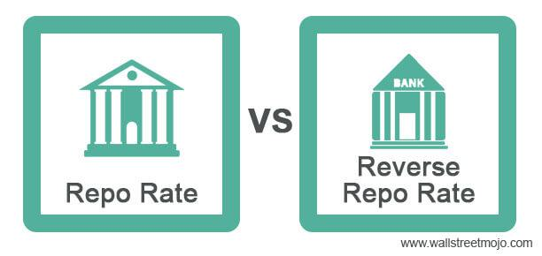

Financial transactions such as repurchase agreements (repo), reverse repo agreements, and algorithmic trading represent vital components of the modern financial landscape. Each of these elements plays a significant role in shaping market dynamics, providing liquidity, and ensuring operational efficiency across financial institutions worldwide.

Repo transactions involve the sale of securities with the agreement to repurchase them at a later date, often overnight or within a short-term period. These transactions are crucial for short-term borrowing, allowing financial institutions to manage liquidity needs with minimal risk. Conversely, reverse repo transactions are the purchasing side of this agreement, where institutions acquire securities with the intent to sell them back, effectively loaning out cash at interest. The symbiotic relationship between repo and reverse repo facilitates a balanced flow of capital, which is essential for maintaining liquidity in financial markets.



In terms of institutional importance, central banks play a pivotal role by utilizing these transactions as instruments of monetary policy. They help manage the supply of money and influence interest rates, both critical factors in economic stability and inflation control. The precision and predictable nature of repo and reverse repo transactions make them valuable tools in financial management and planning.

Concurrently, algorithmic trading has transformed the financial environment through its ability to execute orders at speeds and volumes unimaginable for manual trading methods. With algorithms programmed to follow specific strategies and respond to market conditions, algorithmic trading enhances market efficiency, providing tighter spreads and improved liquidity. This form of trading is now prevalent across a myriad of financial asset classes, allowing traders to leverage state-of-the-art technology to capitalize on market opportunities.

Understanding these mechanisms and their interactions is crucial for appreciating their role in today's fast-paced financial markets. Algorithmic trading, with its ability to automate processes, complements the repo market by efficiently executing trades that support liquidity and balance. As a whole, these financial mechanisms underpin the stability and operation of financial markets, enabling institutions to navigate the complexities of the global economic landscape effectively.

This guide aims to provide a comprehensive exploration of these essential financial transactions, offering insights into their importance, mechanisms, and impact on contemporary economics. Through this examination, readers can gain a deeper understanding of how repo, reverse repo, and algorithmic trading collectively enhance the functioning and resilience of financial markets.

## Table of Contents

## Understanding Repo and Reverse Repo Transactions

Repurchase agreements, commonly referred to as repos, are short-term borrowing mechanisms extensively used by financial institutions to manage [liquidity](/wiki/liquidity-risk-premium) and facilitate efficient cash flow within the financial markets. In a repo transaction, one party sells securities to another with the agreement to repurchase the same securities at a predetermined date and price. This effectively functions as a collateralized loan, where the difference between the selling price and the repurchase price reflects the implied [interest rate](/wiki/interest-rate-trading-strategies) on the loan.

Reverse repo transactions are the counterpart to repos, where the roles of borrower and lender are reversed. In this case, the party purchasing the securities (and agreeing to sell them back later) acts as the lender, temporarily providing cash in exchange for securities. These transactions are instrumental for financial institutions that have excess liquidity, allowing them to earn returns on their idle funds by lending them out in a secured manner via the collateralized securities.

The significance of repo and reverse repo transactions in maintaining market liquidity cannot be overstated. By enabling the temporary transfer of cash and securities between parties, these transactions ensure that liquidity is available where needed most, thus supporting the smooth functioning of the financial markets. Financial institutions leverage repos as a tool to manage their short-term funding needs, while central banks utilize them as a pivotal instrument for implementing monetary policy strategies.

Central banks frequently engage in repos and reverse repos to control short-term interest rates and manage the money supply in the economy. By conducting these operations, central banks can inject liquidity into the banking system during periods of tight money supply or absorb excess liquidity when there is too much cash in circulation. This practice is essential for stabilizing financial markets and ensuring economic stability.

For example, during periods of economic uncertainty, central banks may increase the frequency and [volume](/wiki/volume-trading-strategy) of repos to ensure that financial institutions have sufficient liquidity to continue lending and funding operations. Conversely, they may engage in reverse repos to draw out surplus liquidity and counteract inflationary pressures.

Overall, repo and reverse repo transactions are indispensable tools both for financial institutions managing day-to-day liquidity and for central banks executing monetary policy. These instruments contribute significantly to market efficiency and the overall stability of financial systems worldwide.

## The Role of Algorithmic Trading

Algorithmic trading has revolutionized the financial markets by leveraging computational algorithms to conduct trading decisions and activities at speeds and frequencies impossible for human traders. The core advantage of [algorithmic trading](/wiki/algorithmic-trading) lies in its ability to enhance trading efficiency through automation. By minimizing human intervention, these algorithms execute trades based on preset criteria such as timing, price, or volume, significantly reducing the latency and errors typically associated with manual trading.

Various types of algorithms are employed in trading, each with specific applications across different financial asset classes. Some common types include:

1. **Trend-following algorithms**: These strategies seek to capitalize on upward or downward market trends. They analyze historical data and price movements to identify and follow the trend, aiming to buy an asset when prices are rising and sell when they are falling.

2. **Arbitrage algorithms**: These are designed to exploit price inefficiencies in the market. For instance, if a stock is priced differently on two exchanges, the algorithm will buy the stock at the lower price and sell it at the higher price, thereby making a profit from the price differential.

3. **Market-making algorithms**: These algorithms provide liquidity to the markets by continuously placing buy and sell orders. They profit from the bid-ask spread, the difference between the buy and sell prices.

4. **Statistical arbitrage**: This involves trading strategies that employ econometric, statistical, and machine learning techniques to exploit statistical mispricings in the market.

5. **Sentiment analysis**: Advanced algorithms also employ natural language processing techniques to analyze news stories, social media, and other text-based sources to make predictions about market movements based on market sentiment.

Algorithmic trading has redefined market dynamics by introducing high-frequency trading ([HFT](/wiki/high-frequency-trading-strategies)), where algorithms execute thousands, if not millions, of trades per second. This has increased market liquidity and narrowed bid-ask spreads, offering better prices to investors. However, it has also led to new challenges, such as heightened [volatility](/wiki/volatility-trading-strategies) and the potential for "flash crashes," where prices can plummet precipitously due to algorithmic malfunctions or unforeseen interaction between algorithms.

Globally, trading strategies have evolved to incorporate algorithmic trading extensively. Algorithms have enabled the creation of more sophisticated trading strategies by allowing for diversification across markets and asset classes and enabling quicker adaptation to changing market conditions. Trading strategies today are more dynamic, data-driven, and scalable due to the computational efficiency brought about by algorithmic trading.

In conclusion, algorithmic trading not only bolsters market efficiency but also presents a double-edged sword with its associated risks and rewards. It fosters a more competitive trading environment by continually reshaping market norms and practices across various asset classes worldwide.

## Benefits and Risks of Repo and Reverse Repo Transactions

Repurchase agreements (repo) and reverse repurchase agreements (reverse repo) are pivotal in managing liquidity in financial markets. They provide a mechanism for short-term borrowing and lending, characterized by their generally low-risk profile and operational efficiency.

**Advantages of Repo and Reverse Repo Transactions**

Repos offer market participants, including financial institutions and central banks, a secure method to access liquidity. These transactions are inherently low-risk due to the collateral involved, typically high-quality government securities. In a repo transaction, the borrower sells securities to the lender with the agreement to repurchase them at a later date and at a predetermined price. This arrangement assures the lender of receiving the nominal value of the securities plus a small interest, known as the repo rate.

Reverse repo transactions, wherein the roles are reversed, offer a tool for cash-rich institutions to optimize their returns by lending excess liquidity against collateral. Central banks utilize reverse repos to manage money supply and economic stability. By adjusting the levels of these transactions, central banks can influence short-term interest rates, effectively steering monetary policy objectives.

**Potential Risks**

Despite their advantages, repo and reverse repo transactions are not devoid of risks. One of the primary concerns is counterparty risk, the risk that one party may default on its obligation. To mitigate this, transactions are often over-collateralized, ensuring that the value of the collateral exceeds the amount borrowed.

Market volatility poses another risk. Fluctuations in the market value of the securities used as collateral could affect the safety net provided by such assets. If the value of the collateral falls significantly, the lender might face exposure to financial loss. However, regular marking-to-market of the collateral and margin calls help manage this risk.

**Mitigation Strategies**

Financial institutions implement several mitigation strategies to reduce the risks associated with repo and reverse repo agreements. Over-collateralization is a common practice where the collateral value is set higher than the borrowed amount. Regular assessments of collateral value (mark-to-market) ensure adequacy, and any shortfall can trigger margin calls, requiring the borrower to provide additional collateral.

Furthermore, legal agreements like the Global Master Repurchase Agreement (GMRA) standardize terms and provide clarity in legal recourse, thus minimizing legal risk. Additionally, institutions favor collateral with high credit ratings and low volatility, typically government securities, thus reducing the risk of drastic value changes.

In summary, repo and reverse repo transactions play an integral role in maintaining liquidity and operational efficiency in financial markets. Their benefits in providing low-risk borrowing and lending avenues are balanced by inherent risks that require careful management through strategic mitigation techniques.

## The Interaction Between Repo Transactions and Algorithmic Trading

Algorithmic trading significantly enhances the efficiency and execution of repo and reverse repo transactions by utilizing sophisticated strategies that capitalize on market conditions. These transactions, fundamental to short-term borrowing, rely heavily on speed and precision, which algorithmic trading provides. 

At the core of these interactions is the synergy between high-frequency trading (HFT) algorithms and short-term borrowing instruments, such as repurchase agreements (repos). HFT algorithms are designed to execute a large number of orders at extremely high speeds, often in milliseconds, which is essential for capitalizing on small price fluctuations. This capability is particularly beneficial for repo transactions, where financial institutions need to manage liquidity effectively and respond quickly to shifting market demands.

For instance, a typical repo transaction involves the sale of securities with an agreement to repurchase them at a later date for a higher price. This necessitates rapid access to markets and the ability to execute orders judiciously to optimize funding costs and returns. Algorithmic trading systems can swiftly analyze the vast data flows and execute trades at optimal prices, effectively managing the financial resources of institutions engaged in repo markets.

Furthermore, algorithmic trading enhances market liquidity through its role in repo transactions. By facilitating a higher volume of transactions, algorithmic trading contributes to narrower bid-ask spreads, thus ensuring that buying and selling can occur at prices close to each other. This increased liquidity is essential in volatile markets, where rapid changes can affect interest rates and the availability of collateral. Efficient price discovery via algorithms helps maintain stability in such markets, which is crucial for the functioning of central bank operations related to monetary policy.

Python code can exemplify how these algorithms might interact with repo transactions:

```python
import random

class RepoTransaction:
    def __init__(self, security_price, repo_rate):
        self.security_price = security_price
        self.repo_rate = repo_rate

    def execute_trade(self):
        repurchase_price = self.security_price * (1 + self.repo_rate)
        return repurchase_price

def high_frequency_trading(strategy, num_trades):
    for _ in range(num_trades):
        price_fluctuation = random.uniform(-0.01, 0.01)  # Simulating market changes
        security_price = 100 + price_fluctuation
        repo_rate = 0.05  # 5% repo rate
        transaction = RepoTransaction(security_price, repo_rate)
        repurchase_price = transaction.execute_trade()
        strategy.execute(repurchase_price)

class TradingStrategy:
    def execute(self, price):
        print(f"Executing trade at price: {price}")

# Instantiate a strategy and execute trades
strategy = TradingStrategy()
high_frequency_trading(strategy, 10)
```

The code snippet simulates the execution of repo transactions through a high-frequency trading system. Here, a `RepoTransaction` class defines the security's initial price and repo rate. The `high_frequency_trading` function models the algorithm's ability to execute multiple trades rapidly as market conditions change.

Ultimately, the collaboration between algorithmic trading and repo markets bolsters market efficiency and liquidity, which are essential for maintaining the stability of financial systems. These sophisticated tools and techniques enable institutions to optimize their operations, making them indispensable in modern financial markets.

## Impact on Monetary Policy and Financial Markets

Repo and reverse repo transactions play an essential role in central banks' monetary policy operations. These financial instruments, by their design, facilitate short-term borrowing and lending, thus directly influencing the liquidity levels in the banking system. This, in turn, affects interest rates and broader economic stability.

Central banks frequently engage in repo and reverse repo operations to maintain target interest rates. By entering into repurchase agreements, central banks inject liquidity into the financial system, effectively easing monetary policy. Conversely, through reverse repos, central banks absorb excess liquidity, tightening the monetary policy stance. This balancing act helps to manage inflation and stabilize the economy.

An integral element of these transactions is the influence exerted on interest rates. The interplay between borrowing and lending via repo operations impacts the federal funds rate—the rate at which banks lend balances to each other overnight. Consequently, the central bank can indirectly guide this rate to align with its monetary policy targets. For instance, during economic downturns, central banks might increase repo transactions to lower interest rates and encourage borrowing and investment. Conversely, in a booming economy, increasing reverse repo operations can help temper inflationary pressures by raising the short-term interest rates.

The link between repo transactions and overall economic stability is also critical. By ensuring banks have the necessary liquidity, central banks prevent credit crunches, which can lead to broader financial crises. This liquidity management supports the smooth functioning of the financial system and helps to avert severe economic downturns.

Moreover, algorithmic trading has profound implications for market volatility and regulatory oversight. The rapid execution and vast number of transactions handled by trading algorithms can amplify market movements, contributing to increased volatility. For example, algorithms reacting to market signals can cause a cascade of selling or buying pressure, exacerbating market swings.

Regulators face challenges in overseeing these rapidly executed trades. The complexity and speed of algorithmic trading require sophisticated monitoring systems and possibly new regulatory frameworks to manage potential systemic risks. Regulatory bodies aim to strike a balance between fostering innovation in financial markets and ensuring enough safeguards are in place to maintain market integrity and protect against excessive volatility.

In sum, repo and reverse repo transactions are vital tools in monetary policy, impacting interest rates and economic stability. The advent of algorithmic trading adds another layer of complexity, influencing market behavior and necessitating prudent regulatory measures.

## Conclusion

The interconnected nature of repo, reverse repo, and algorithmic trading highlights their significance in contemporary financial markets. Repo transactions, characterized by short-term borrowing using securities as collateral, ensure the smooth functioning of the financial system by facilitating liquidity. Reverse repo transactions complement this mechanism by allowing parties to lend cash in exchange for securities, thus balancing the liquidity dynamics. Central banks utilize these instruments to regulate money supply and interest rates, playing a crucial role in financial stability.

Algorithmic trading has modernized the financial landscape, offering unprecedented speed and efficiency. By leveraging complex algorithms, market participants can execute trades with precision, thus contributing to market liquidity and reducing transaction costs. The synergy between algorithmic trading and repo transactions demonstrates the potential for enhanced market operations. High-frequency trading, a subset of algorithmic trading, can optimize the execution of repo agreements, leading to more efficient capital utilization.

Looking ahead, financial markets are likely to witness further integration of technology with traditional financial instruments. The evolution of [machine learning](/wiki/machine-learning) and [artificial intelligence](/wiki/ai-artificial-intelligence) might lead to more sophisticated trading algorithms, capable of managing an even wider array of financial transactions, including repos. However, with advancement comes the need for heightened regulatory scrutiny to manage potential risks such as market manipulation and systemic risk.

The continued exploration and understanding of these components are essential for both novice and seasoned market participants. As digital innovations reshape the financial ecosystem, staying informed about developments in repo, reverse repo, and algorithmic trading will be imperative. Further research into these areas will not only enhance one's knowledge but also prepare individuals and institutions for the dynamic world of finance.

## References & Further Reading

[1]: ["Advances in Financial Machine Learning"](https://www.amazon.com/Advances-Financial-Machine-Learning-Marcos/dp/1119482089) by Marcos Lopez de Prado

[2]: ["Algorithmic Trading: Winning Strategies and Their Rationale"](https://www.wiley.com/en-us/Algorithmic+Trading%3A+Winning+Strategies+and+Their+Rationale-p-9781118460146) by Ernest P. Chan

[3]: ["The Repo Handbook"](https://archive.org/details/repohandbook0000chou) by Moorad Choudhry

[4]: Gorton, G., & Metrick, A. (2012). ["Securitized Banking and the Run on Repo."](https://www.sciencedirect.com/science/article/pii/S0304405X1100081X) Journal of Financial Economics, 104(3), 425-451.

[5]: Hendershott, T., Jones, C. M., & Menkveld, A. J. (2011). ["Does Algorithmic Trading Improve Liquidity?"](https://onlinelibrary.wiley.com/doi/full/10.1111/j.1540-6261.2010.01624.x) Review of Financial Studies, 24(8), 2703-2743.