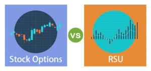

## Table of Contents

## What are restricted shares?

Restricted shares are a type of stock that companies give to their employees as part of their pay. These shares come with rules that say when and how the employees can sell or use them. Usually, employees have to wait for a certain time, called a vesting period, before they can do anything with the shares. This is a way for companies to reward their employees and keep them working there longer.

Once the vesting period is over, the employees can sell the shares or keep them as an investment. But, there might still be some rules to follow. For example, there could be a time when they are not allowed to sell the shares, called a lock-up period. Restricted shares are different from regular shares because of these extra rules. They help companies motivate their employees and align their goals with the company's success.

## What are stock options?

Stock options are a type of benefit that companies give to their employees. They give the employee the right to buy a certain number of the company's shares at a set price, called the exercise price, within a certain time. This can be a good deal for the employee if the company's stock price goes up above the exercise price. The employee can then buy the stock at the lower exercise price and sell it at the higher market price, making a profit.

There are two main types of stock options: incentive stock options (ISOs) and non-qualified stock options (NSOs). ISOs have special tax benefits but come with more rules. NSOs are more flexible but don't have the same tax advantages. Both types of options usually have a vesting period, which means the employee has to wait a certain amount of time before they can exercise their options. Stock options can be a great way for employees to share in the company's success and feel more connected to its goals.

## How do you acquire restricted shares?

Restricted shares are given to employees by their company as part of their pay. This usually happens when someone starts a new job, gets a promotion, or as a reward for good work. The company decides how many shares to give and sets rules about when the employee can use them. These rules are written in a special agreement that the employee has to sign.

To get the restricted shares, the employee doesn't have to do anything special other than keep working at the company. The shares are given to them over time, often in parts, according to a schedule set by the company. This schedule is called a vesting period. Once the vesting period is over, the employee can finally use the shares, but they might still have to follow some more rules before they can sell them.

## How do you acquire stock options?

Stock options are given to employees by their company as a part of their pay. This usually happens when someone starts a new job, gets a promotion, or as a reward for good work. The company decides how many options to give and at what price the employee can buy the stock. This price is called the exercise price. The company writes all these details in an agreement that the employee has to sign.

To get the stock options, the employee doesn't need to do anything special other than keep working at the company. The options are given to them over time, often in parts, according to a schedule set by the company. This schedule is called a vesting period. Once the vesting period is over, the employee can use their options to buy the company's stock at the exercise price. If the stock's market price is higher than the exercise price, the employee can sell the stock for a profit.

## What are the vesting conditions for restricted shares?

Vesting conditions for restricted shares are rules set by the company that say when employees can actually use or sell their shares. These conditions are important because they make sure that employees stay with the company for a certain time before they get to keep the shares. The most common vesting condition is time-based vesting, where employees have to work at the company for a set period, like one to four years, before their shares start to vest. This period is called the vesting period.

Sometimes, companies also use performance-based vesting, where the shares vest only if the company or the employee meets certain goals. For example, the company might need to reach a certain level of profit, or the employee might need to hit specific targets in their job. Some companies mix both time-based and performance-based vesting, so employees have to stay with the company and meet performance goals to get their shares. Once the vesting conditions are met, the shares become the employee's to keep and use as they want, but they might still have to follow other rules like a lock-up period before they can sell them.

## What are the vesting conditions for stock options?

Vesting conditions for stock options are rules that say when employees can use their options to buy company stock. The most common type of vesting condition is time-based vesting. This means employees have to work at the company for a certain amount of time, often between one to four years, before their options start to vest. This period is called the vesting period. Once the vesting period is over, the employees can use their options to buy the stock at the exercise price.

Sometimes, companies also use performance-based vesting for stock options. This means the options will only vest if the company or the employee meets certain goals. For example, the company might need to reach a certain level of profit, or the employee might need to hit specific targets in their job. Some companies use a mix of both time-based and performance-based vesting, so employees have to stay with the company and meet performance goals to use their options. Once the vesting conditions are met, employees can buy the stock at the exercise price, and if the market price is higher, they can sell it for a profit.

## What are the tax implications of restricted shares?

When you get restricted shares, you have to think about taxes. Usually, you don't have to pay taxes right away when you get the shares. But, when the shares vest and you can use them, you have to pay taxes on the value of the shares at that time. This is called ordinary income tax. The amount you pay depends on how much the shares are worth when they vest.

After the shares vest and you pay the ordinary income tax, any money you make from selling the shares later is taxed as capital gains. If you sell the shares soon after they vest, it's called a short-term capital gain, and you pay your normal income tax rate on it. If you wait more than a year to sell, it's a long-term capital gain, and the tax rate is usually lower. It's a good idea to talk to a tax expert to understand exactly how much you'll need to pay in taxes on your restricted shares.

## What are the tax implications of stock options?

When you get stock options from your company, you don't have to pay taxes right away. But, when you use your options to buy the stock, called exercising them, you might have to pay taxes. It depends on the type of options you have. If you have non-qualified stock options (NSOs), you pay ordinary income tax on the difference between the stock's market price and the exercise price when you exercise them. If you have incentive stock options (ISOs), you usually don't pay any tax when you exercise them, but there are special rules you need to follow.

After you exercise your stock options and buy the stock, any money you make from selling the stock later is taxed as capital gains. If you sell the stock soon after exercising your options, it's called a short-term capital gain, and you pay your normal income tax rate on it. If you wait more than a year to sell, it's a long-term capital gain, and the tax rate is usually lower. It's a good idea to talk to a tax expert to understand exactly how much you'll need to pay in taxes on your stock options.

## How does the value of restricted shares change over time?

The value of restricted shares can go up or down over time, just like any other stock. When you first get the shares, they might be worth a certain amount based on the company's stock price at that time. But as time goes by, the company's stock price can change because of things like how well the company is doing, what's happening in the economy, or news about the company. If the company does well and its stock price goes up, your restricted shares will be worth more. If the company doesn't do so well and the stock price goes down, your shares will be worth less.

When your restricted shares vest and you can use them, their value at that time is what you have to think about for taxes. After they vest, you can keep them as an investment or sell them. If you keep them, their value will keep changing with the company's stock price. If you sell them right away, you'll get whatever they're worth at that moment. So, the value of restricted shares can change a lot over time, and it's important to keep an eye on the company's performance and the stock market to understand what your shares might be worth.

## How does the value of stock options change over time?

The value of stock options can change a lot over time. When you get stock options, their value depends on the difference between the exercise price and the current market price of the company's stock. If the market price goes up above the exercise price, your options become more valuable because you can buy the stock at a lower price and sell it at a higher price. But if the market price stays the same or goes down, your options might not be worth much because you wouldn't make any money by exercising them.

After you get your stock options, the company's stock price can change because of many things like how well the company is doing, what's happening in the economy, or news about the company. If the company does well and its stock price goes up, your options will be worth more. But if the company doesn't do so well and the stock price goes down, your options might lose value. It's important to keep an eye on the company's performance and the stock market to understand how the value of your stock options might change over time.

## What are the key considerations when choosing between restricted shares and stock options?

When you're deciding between restricted shares and stock options, think about how much risk you want to take and how much you believe in your company's future. Restricted shares are less risky because you get the actual shares, and their value is based on the current stock price when they vest. You know exactly what you're getting, and you can sell them right away if you want. Stock options are riskier because they only have value if the stock price goes up above the exercise price. If the stock price stays the same or goes down, your options might not be worth anything. So, if you think the company's stock price will go up a lot, stock options might be better because you could make more money.

Another thing to think about is taxes and how much money you'll actually keep after paying them. With restricted shares, you have to pay ordinary income tax on the value of the shares when they vest. With stock options, the tax rules depend on whether you have non-qualified stock options (NSOs) or incentive stock options (ISOs). NSOs are taxed as ordinary income when you exercise them, while ISOs have special tax benefits but come with more rules. Also, think about how long you plan to stay with the company. Restricted shares usually vest over time, so you might get more of them if you stay longer. Stock options also have a vesting period, but you might need to wait longer to see if they're worth exercising. Talking to a financial advisor can help you make the best choice based on your situation.

## How do market conditions affect the decision between restricted shares and stock options?

Market conditions can really change how you decide between restricted shares and stock options. If the market is doing well and the stock prices are going up, stock options might be a better choice. This is because options let you buy the stock at a set price, and if the market price goes up a lot, you can make more money by selling the stock at the higher price. But if the market is not doing so well, and stock prices are going down or staying the same, restricted shares might be safer. With restricted shares, you get the actual stock, so even if the price goes down a bit, you still have something that has value.

Also, think about how the market might change in the future. If you think the market will keep getting better, stock options could be a good bet because they could become more valuable over time. But if you're not sure about the market and want something more stable, restricted shares might be better. They give you a piece of the company right away, and you don't have to worry about the stock price going up to make money. So, looking at what's happening in the market now and what might happen later can help you pick the right choice between restricted shares and stock options.

## What are the future trends in equity compensation and algo trading?

Equity compensation and algorithmic trading are at the forefront of financial innovation, with each field evolving to meet the demands of modern markets. As we look to the future, several trends are poised to shape the landscape of equity compensation, bringing with them enhanced efficiency and new opportunities for both companies and employees.

One anticipated development in equity compensation is the increased use of performance-based restricted stock units (PSUs). These equity instruments reward employees with shares based on the achievement of specific performance metrics, aligning incentives with company goals. The structure of PSUs can vary widely, incorporating complex formulas to determine payout thresholds. For example, companies may use a formula like:

$$
\text{Payout} = \text{Target Shares} \times \left(\frac{\text{Actual Performance}}{\text{Target Performance}}\right)
$$

The inclusion of PSUs in compensation packages aims to better motivate employees and align their interests with those of shareholders, potentially enhancing company performance.

Simultaneously, the domain of algorithmic trading is undergoing significant advancements. Emerging trends focus on improving the speed and accuracy of trade execution, mitigating risks associated with human intervention. The use of [machine learning](/wiki/machine-learning) algorithms is increasingly common, allowing systems to adapt and optimize strategies based on real-time data analysis. For instance, algorithms can be programmed using Python libraries such as pandas and scikit-learn to analyze historical stock data and predict future price movements. A simple example of a trading strategy based on moving averages might look like:

```python
import pandas as pd

# Assume df is a DataFrame containing stock price data with a 'Close' column
df['Short_MA'] = df['Close'].rolling(window=10).mean()
df['Long_MA'] = df['Close'].rolling(window=50).mean()

df['Signal'] = 0
df.loc[df['Short_MA'] > df['Long_MA'], 'Signal'] = 1  # Buy
df.loc[df['Short_MA'] < df['Long_MA'], 'Signal'] = -1  # Sell
```

As technological capabilities advance, integration of [artificial intelligence](/wiki/ai-artificial-intelligence) (AI) and more sophisticated algorithms will play a larger role in financial markets, offering enhanced decision-making tools for traders and investors.

In terms of equity management strategies, technology will continue to drive change through increased digitalization and blockchain integration. Blockchain technology promises to improve the transparency and traceability of equity transactions. Smart contracts can automate and streamline the process of issuing and managing equity compensation, reducing administrative overhead and ensuring compliance with regulatory requirements.

Furthermore, the ongoing development of fintech platforms is enabling better personalization of equity compensation packages. These platforms leverage data analytics to tailor offerings based on individual employee preferences and financial situations, providing a more customized and motivating package.

In conclusion, the future of equity compensation and algorithmic trading is shaped by innovations that enhance alignment between employees and company goals, improve market operations, and utilize technology to increase efficiency and personalization. As these fields evolve, they promise to deliver more robust financial solutions and facilitate growth across various sectors.

## References & Further Reading

[1]: Bergstra, J., Bardenet, R., Bengio, Y., & Kégl, B. (2011). ["Algorithms for Hyper-Parameter Optimization."](https://dl.acm.org/doi/10.5555/2986459.2986743) Advances in Neural Information Processing Systems 24.

[2]: ["Advances in Financial Machine Learning"](https://www.amazon.com/Advances-Financial-Machine-Learning-Marcos/dp/1119482089) by Marcos Lopez de Prado

[3]: ["Evidence-Based Technical Analysis: Applying the Scientific Method and Statistical Inference to Trading Signals"](https://www.amazon.com/Evidence-Based-Technical-Analysis-Scientific-Statistical/dp/0470008741) by David Aronson

[4]: ["Machine Learning for Algorithmic Trading"](https://github.com/PacktPublishing/Machine-Learning-for-Algorithmic-Trading-Second-Edition) by Stefan Jansen

[5]: ["Quantitative Trading: How to Build Your Own Algorithmic Trading Business"](https://books.google.com/books/about/Quantitative_Trading.html?id=j70yEAAAQBAJ) by Ernest P. Chan