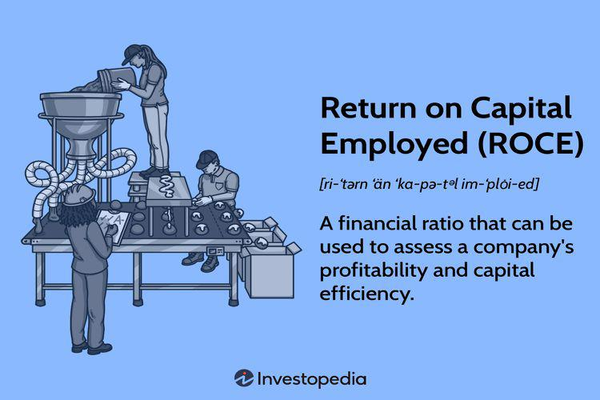

Understanding key financial metrics is crucial for evaluating company performance. Among these metrics, Return on Capital (ROC) and Return on Equity (ROE) hold particular significance, especially within the context of algorithmic trading. This article explores the intricacies of ROC and ROE, their importance in financial analysis, and their application in algorithmic trading.

Financial metrics like ROE and ROC are vital tools for gaining insights into a company's profitability. They guide investors and traders in making informed decisions by providing measures of how efficiently a company utilizes its capital. ROE assesses the profitability relative to shareholders' equity, while ROC extends this evaluation to include both equity and debt, offering a broader perspective on capital utilization.



Algorithmic trading relies extensively on quantitative data, using a systematic approach to execute trades. It particularly benefits from precise financial metrics like ROE and ROC, as these metrics inform trading algorithms. By incorporating such metrics, algorithms can better evaluate the financial health and performance of companies, thereby determining trade quality and timing.

The primary objective of this piece is to provide a comprehensive understanding of ROC and ROE, highlighting their role in financial analysis and their impact on algorithmic trading strategies. By examining these metrics, the article aims to equip readers with insights into the critical use of financial data in crafting effective trading strategies, ultimately contributing to more informed investment decisions in a rapidly evolving financial landscape.

## Table of Contents

## Understanding Return on Equity (ROE)

Return on equity (ROE) is a fundamental financial metric that evaluates a company's ability to generate profits from its shareholders' equity. It serves as an indicator of a firm's operational efficiency and profitability, providing insight into how well the company is utilizing each dollar invested by its equity holders to generate earnings.

Mathematically, ROE is expressed with the formula:

$$
\text{ROE} = \frac{\text{Net Income}}{\text{Average Shareholders' Equity}}
$$

The numerator, net income, represents the total earnings of the company after taxes and interest, while the denominator, average shareholders' equity, is the average amount of equity held by shareholders over a period, typically calculated as the sum of the opening and closing equity for a period divided by two.

ROE is essential for equity investors who seek to assess the effectiveness of their investments in a particular company. A higher ROE suggests that the company is effectively using its equity base to create profits, hence indicating efficient management and potentially rewarding ownership. Such companies are often attractive to investors, as they show a capacity to deliver higher returns on the investment made by shareholders.

Different industry sectors exhibit varying average ROE levels due to the nature of businesses and their capital structures. It is crucial to compare the ROE of companies within the same industry to draw meaningful conclusions.

For practical application, consider a hypothetical company, XYZ Corp, which posted a net income of $200,000 over the past year. At the beginning and end of the year, XYZ Corp had shareholders' equities of $1,000,000 and $1,200,000, respectively. The average shareholders' equity is calculated as $(1,000,000 + 1,200,000) / 2 = 1,100,000.$

By applying the ROE formula:

$$
\text{ROE} = \frac{200,000}{1,100,000} \approx 0.1818 \text{ or } 18.18\%
$$

This result suggests that for every dollar of shareholders' equity, XYZ Corp generated approximately 18 cents in profit over the year, indicating a strong capability to convert equity investments into earnings.

Analyzing ROE alongside other financial metrics allows investors to gauge not only profitability but also the overall effectiveness of a company's management at maximizing shareholder value.

## Deciphering Return on Capital (ROC)

Return on Capital (ROC) is a key financial metric that evaluates a company's ability to generate profit from its capital base, which encompasses both equity and debt. The formula for calculating ROC is:

$$
\text{ROC} = \frac{\text{Net Income}}{\text{Total Capital}}
$$

Where the total capital is the sum of a company’s debt and equity. This metric provides insight into how effectively a company uses its capital to produce earnings, making it an essential tool for assessing the overall efficiency of capital investments.

A high ROC indicates that a company is using its capital effectively, generating robust profits relative to the capital invested. When ROC exceeds the company's cost of capital, typically reflected through metrics like Weighted Average Cost of Capital (WACC), it suggests the company is creating value. Conversely, if ROC falls below the cost of capital, it may indicate inefficiencies or unsustainable practices.

To illustrate, consider a company with a net income of $200 million, debt of $600 million, and equity of $400 million. The total capital is therefore $1 billion. The ROC calculation would be:

$$
\text{ROC} = \frac{200,000,000}{1,000,000,000} = 20\%
$$

If this company's cost of capital is 15%, the positive spread of 5% indicates efficient capital utilization and value creation.

Understanding ROC's implications is vital for financial decision-making. Investors and analysts often compare ROC across companies to gauge management effectiveness and potential for long-term profitability. High ROC values can signal competitive advantages, sound management decisions, or efficient operations, prompting investors to favor such companies in their portfolios.

Furthermore, in financial analysis, ROC is utilized to benchmark a company's performance against its industry peers or the broader market. Recognizing trends in a company's ROC over time can provide insights into its strategic direction and operational efficiencies. This metric is particularly suited for evaluating capital-intensive industries where the efficiency of capital allocation can significantly impact competitive positioning and financial sustainability. 

Overall, ROC serves as a crucial indicator in evaluating a company’s profitability and strategic prospects, guiding investors and decision-makers towards more informed financial decisions.

## ROE vs. ROC: Key Differences and Applications

Return on Equity (ROE) and Return on Capital (ROC) are two fundamental financial metrics utilized to assess a company’s profitability, yet they each highlight distinct dimensions of capital utilization. Understanding the key differences between these metrics is crucial for both traditional investors and those employing [algorithmic trading](/wiki/algorithmic-trading) strategies.

ROE is a financial ratio that signifies a company’s ability to generate profit from its shareholders' equity. It is computed as:

$$
\text{ROE} = \frac{\text{Net Income}}{\text{Average Shareholders' Equity}}
$$

This metric provides insights specifically from the perspective of equity holders, focusing solely on profits generated relative to the equity capital. Consequently, for shareholders, high ROE indicates efficient utilization of their invested funds, rendering it an essential tool for evaluating management performance and corporate efficiency.

Conversely, ROC extends its scope by assessing a company’s profitability relative to the total capital invested, encompassing both equity and debt. The ROC formula is expressed as:

$$
\text{ROC} = \frac{\text{Net Income}}{\text{Total Capital}}
$$

where Total Capital includes both equity and debt. This metric offers a comprehensive view of how well a company generates returns from all capital resources. A high ROC indicates efficient use of all available capital, making it pivotal for appraising a company’s overall capital management.

When comparing investment opportunities, investors often look for companies exhibiting both high ROE and ROC as these signify effective management and profitability per unit of capital. However, the situational applicability of these metrics diverges based on individual investment strategies.

For traditional investors, ROE provides a clear picture of equity profitability and management efficiency without considering the impact of financial leverage. This is particularly useful for equity-focused assessments where shareholder returns are paramount.

In contrast, algorithmic traders leverage both metrics to build algorithms that integrate quantitative measurements of company performance. ROC’s inclusion of debt offers a broader analysis, essential for strategies contemplating the holistic financial health of potential investment targets. By factoring in both ROE and ROC, these algorithms can construct trading strategies that optimize for both profitability and risk management.

An understanding of when to prioritize each metric is critical for sound decision-making. High ROE companies are attractive when focusing on shareholder returns and management efficiency, whereas high ROC values offer insights into comprehensive capital efficiency, pertinent for evaluating leveraged scenarios. Through integrating these metrics, investors and traders can enhance their decision-making frameworks, whether evaluating long-term investments or designing dynamic trading algorithms.

## The Role of Financial Metrics in Algorithmic Trading

Algorithmic trading relies heavily on quantitative analysis to make rapid and informed trading decisions. The use of financial metrics such as Return on Equity (ROE) and Return on Capital (ROC) is crucial in this context, as they provide valuable insights into the profitability and capital efficiency of companies. These metrics are integral to the design of trading algorithms, which use them to assess the quality and potential direction of trades.

Financial metrics like ROE and ROC help algorithms to evaluate company performance. For instance, an algorithm might prioritize trades involving companies with high ROE values, indicating efficient equity utilization and potentially higher returns on investment. Similarly, a high ROC could signal that a company is effectively using its total invested capital, including both equity and debt, to generate profits. By integrating these metrics, trading algorithms can be programmed to automatically identify and capitalize on profitable trading opportunities.

The development of algorithmic trading strategies involves setting specific rules and parameters within the trading algorithm itself. Financial metrics play a role in this process by guiding the identification of criteria for executing trades. For example, a trading algorithm might be programmed to buy stocks when the ROE exceeds a certain threshold, or to sell when the ROC falls below a predefined level. These rules help optimize the decision-making process, ensuring that the algorithm adapts to the financial health and performance metrics of target companies.

By incorporating financial metrics, algorithmic trading systems can better respond to changes in a company's financial condition, leading to more timely and effective trading decisions. This adaptability is crucial in volatile markets, where rapid changes can significantly impact trading outcomes. Metrics such as ROE and ROC ensure that trading algorithms remain dynamic and responsive to the financial realities of the companies they target.

Practical examples illustrate how these metrics are implemented within algorithmic trading strategies. Consider a scenario where a Python-based algorithm uses ROE and ROC as part of its decision-making process. The following Python snippet demonstrates a simplified approach to selecting stocks based on these metrics:

```python
def select_stocks(data):
    selected_stocks = []
    for stock in data:
        roe = stock['net_income'] / stock['shareholders_equity']
        roc = stock['net_income'] / (stock['debt'] + stock['equity'])
        if roe > 0.15 and roc > 0.10:  # predefined thresholds
            selected_stocks.append(stock['symbol'])
    return selected_stocks
```

In this example, the algorithm assesses each company's ROE and ROC, adding those that meet or exceed predefined thresholds to a list of selected stocks for trading. This simplification highlights how financial metrics can be effectively utilized to guide algorithmic trades, ensuring that the strategies implemented are aligned with the financial performance and potential of the companies involved.

## Conclusion

Metrics such as Return on Equity (ROE) and Return on Capital (ROC) are essential in financial analysis and algorithmic trading for evaluating company performance. A nuanced understanding of these metrics provides investors and traders with a significant analytical advantage, facilitating more informed and strategic decisions.

Incorporating ROE and ROC into algorithmic trading strategies allows for the refinement of trading algorithms, improving profitability and reducing risk. These metrics aid in the development of sophisticated algorithmic rules that assess a company's financial health and performance effectively, enhancing the decision-making process of trading systems.

As financial analysis and algorithmic trading continue to evolve, reliance on key metrics like ROE and ROC is expected to grow. Future trends will likely incorporate these metrics even more deeply, refining strategies and forecasting models within trading algorithms. This progression will enable traders to adapt to dynamic market conditions with greater precision and insight.

The insights provided aim to equip readers with a robust foundational understanding of how financial metrics like ROE and ROC integrate into complex trading systems. This integration not only supports better investment decisions but also offers a framework for refining trading strategies in an ever-changing financial landscape.

## References & Further Reading

[1]: ["Financial Ratios and Financial Statement Analysis: The Judgmental and Statistical Evaluation of Accounting Information"](https://corporatefinanceinstitute.com/resources/accounting/financial-ratios/) by Jagdish Kothari and Thomas E. King

[2]: ["Return on Equity: Advanced Techniques for Calculating ROI and Residual Income"](https://www.trading212.com/learn/investing-101/roi-roe-roa) by S.R. Smale

[3]: ["Algorithmic Trading and DMA: An Introduction to Direct Access Trading Strategies"](https://archive.org/details/algorithmictradi0000john) by Barry Johnson

[4]: Damodaran, Aswath. ["Investment Valuation: Tools and Techniques for Determining the Value of any Asset"](https://archive.org/details/investmentvaluat0000damo_n6k9)

[5]: ["Principles of Corporate Finance"](https://www.mheducation.com/highered/product/Principles-of-Corporate-Finance-Brealey.html) by Richard A. Brealey, Stewart C. Myers, and Franklin Allen