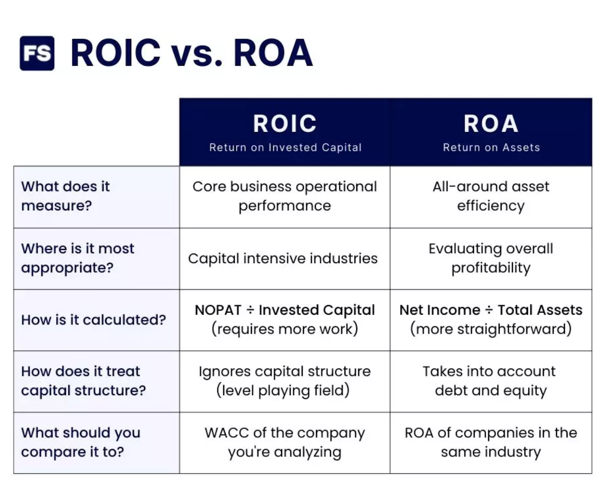

## Table of Contents

## What is Return on Equity (ROE)?

Return on Equity (ROE) is a financial ratio that shows how well a company is using the money invested by its shareholders to generate profit. It is calculated by dividing the company's net income by the shareholders' equity. In simple terms, ROE tells you how much profit a company makes for every dollar of shareholder's money.

ROE is important because it helps investors see how efficiently a company is using their money. A higher ROE means the company is doing a good job at turning shareholder investments into profits. For example, if a company has an ROE of 15%, it means that for every dollar of equity, the company is generating 15 cents in profit. Investors often use ROE to compare different companies and decide where to invest their money.

## What is Return on Capital (ROC)?

Return on Capital (ROC) is a financial measure that shows how well a company is using all its money, not just the money from shareholders, to make a profit. It looks at the total capital the company uses, which includes money from shareholders and money the company has borrowed. To find ROC, you divide the company's earnings before interest and taxes (EBIT) by the total capital. This tells you how much profit the company makes for every dollar of capital it uses.

ROC is important because it helps investors see how good a company is at using all its money to make more money. A higher ROC means the company is doing a good job at turning its capital into profits. For example, if a company has an ROC of 20%, it means that for every dollar of capital, the company is making 20 cents in profit. Investors can use ROC to compare different companies and see which ones are using their money the best.

## How is ROE calculated?

Return on Equity (ROE) is a way to see how well a company is using the money its shareholders have given it to make a profit. To find ROE, you take the company's net income, which is how much money the company made after paying all its costs, and divide it by the shareholders' equity. Shareholders' equity is the money that belongs to the shareholders after all the company's debts are paid off.

ROE is important because it shows how good a company is at turning the money from shareholders into more money. If a company has a high ROE, it means it's doing a great job at using that money to make profits. For example, if a company's ROE is 15%, it means that for every dollar of shareholders' money, the company is making 15 cents in profit. This helps investors decide where to put their money by comparing different companies.

## How is ROC calculated?

Return on Capital (ROC) is a way to see how well a company is using all its money to make a profit. This includes money from shareholders and money the company has borrowed. To find ROC, you take the company's earnings before interest and taxes (EBIT), which is how much money the company made before paying interest on its loans and taxes, and divide it by the total capital. Total capital is all the money the company uses, including both shareholder money and borrowed money.

ROC is important because it shows how good a company is at using all its money to make more money. A higher ROC means the company is doing a good job at turning its capital into profits. For example, if a company has an ROC of 20%, it means that for every dollar of capital, the company is making 20 cents in profit. This helps investors compare different companies and see which ones are using their money the best.

## Why are ROE and ROC important financial metrics?

ROE and ROC are important because they help people who want to invest their money understand how well a company is doing. ROE, or Return on Equity, shows how much profit a company makes with the money that shareholders have given it. If a company has a high ROE, it means it's good at using that money to make more money. This helps investors see which companies are good at turning their investments into profits. For example, if a company has an ROE of 15%, it means for every dollar of shareholder money, the company makes 15 cents in profit.

ROC, or Return on Capital, looks at how well a company uses all its money, including money from shareholders and money it has borrowed, to make a profit. A high ROC means the company is doing a great job at using all its money to make more money. This is helpful for investors because it shows which companies are the best at using their total capital to generate profits. For instance, if a company has an ROC of 20%, it means for every dollar of capital, the company makes 20 cents in profit. By comparing ROE and ROC, investors can make smarter choices about where to put their money.

## What do high ROE and ROC values indicate about a company?

A high Return on Equity (ROE) value means that a company is good at using the money from its shareholders to make profits. If a company has a high ROE, it shows that it's doing a great job at turning the money that people have invested into more money. For example, if a company has an ROE of 15%, it means that for every dollar of shareholder money, the company makes 15 cents in profit. This is important because it helps investors see which companies are the best at using their investments to make money.

A high Return on Capital (ROC) value tells us that a company is good at using all its money, not just the money from shareholders, to make profits. This includes money the company has borrowed too. A high ROC means the company is doing well at using all its money to make more money. For example, if a company has an ROC of 20%, it means that for every dollar of total capital, the company makes 20 cents in profit. This is helpful for investors because it shows which companies are the best at using all their money to generate profits.

## How do ROE and ROC differ in what they measure?

ROE, or Return on Equity, measures how well a company uses the money that shareholders have given it to make a profit. It looks at the net income of the company, which is the money left after all costs are paid, and divides it by the shareholders' equity, which is the money that belongs to shareholders after all debts are paid off. A high ROE means the company is good at turning the money from shareholders into more money. This helps investors see which companies are the best at using their investments to make profits.

ROC, or Return on Capital, measures how well a company uses all its money, including money from shareholders and money it has borrowed, to make a profit. It uses the company's earnings before interest and taxes (EBIT) and divides it by the total capital, which is all the money the company uses. A high ROC means the company is doing well at using all its money to make more money. This is helpful for investors because it shows which companies are the best at using all their money to generate profits.

## Can ROE and ROC be used together to assess a company's performance?

Yes, ROE and ROC can be used together to get a better understanding of how well a company is doing. ROE shows how good a company is at using the money from shareholders to make a profit. It looks at the net income, which is the money left after all costs are paid, and divides it by the shareholders' equity, which is the money that belongs to shareholders after all debts are paid off. A high ROE means the company is good at turning the money from shareholders into more money. This helps investors see which companies are the best at using their investments to make profits.

ROC, on the other hand, looks at how well a company uses all its money, not just the money from shareholders, to make a profit. This includes money the company has borrowed. ROC uses the company's earnings before interest and taxes (EBIT) and divides it by the total capital, which is all the money the company uses. A high ROC means the company is doing well at using all its money to make more money. By looking at both ROE and ROC, investors can get a full picture of how efficiently a company is using both its shareholders' money and its total capital to generate profits.

## What are the limitations of using ROE as a performance metric?

ROE, or Return on Equity, can be a useful way to see how well a company is using the money from its shareholders to make a profit. But, it has some problems. One big problem is that ROE can be made to look better by using more debt. If a company borrows a lot of money, it can make its ROE go up because the money from shareholders stays the same, but the profits might go up because of the borrowed money. This can make a company look like it's doing better than it really is. Also, ROE doesn't tell you anything about how risky the company's business is. A company might have a high ROE, but if it's taking a lot of risks, it might not be a good investment.

Another problem with ROE is that it can be different for companies in different industries. What's a good ROE in one industry might not be good in another. So, you can't always compare ROE numbers from different types of companies. Also, ROE only looks at the past. It tells you how the company did before, but it doesn't tell you how it will do in the future. This means that ROE can be helpful, but it's not the only thing you should look at when deciding if a company is a good investment.

## What are the limitations of using ROC as a performance metric?

ROC, or Return on Capital, is a useful way to see how well a company is using all its money to make a profit. But, it has some problems. One big problem is that ROC can be affected by how a company decides to account for its costs. For example, if a company uses a way of accounting that makes its costs look lower, its ROC can look higher. This can make the company seem like it's doing better than it really is. Also, ROC doesn't tell you anything about how risky the company's business is. A company might have a high ROC, but if it's taking a lot of risks, it might not be a good investment.

Another problem with ROC is that it can be different for companies in different industries. What's a good ROC in one industry might not be good in another. So, you can't always compare ROC numbers from different types of companies. Also, ROC only looks at the past. It tells you how the company did before, but it doesn't tell you how it will do in the future. This means that ROC can be helpful, but it's not the only thing you should look at when deciding if a company is a good investment.

## How do industry standards affect the interpretation of ROE and ROC?

Industry standards are important when looking at ROE and ROC because what is considered a good number can be different for different industries. For example, a high ROE or ROC in one industry might be normal in another. This means you can't just look at the numbers alone; you have to compare them to what is usual for that type of business. If a company in the tech industry has an ROE of 15%, that might be seen as good, but the same number might not be as impressive in the utility industry where ROEs are often lower.

Understanding these industry standards helps investors make better choices. If you only look at the numbers without thinking about the industry, you might think a company is doing better or worse than it really is. For example, a company in the retail industry might have a lower ROC than one in the software industry, but that doesn't mean the retail company is doing poorly. It just means that the standards for what is considered good are different in those industries. So, when using ROE and ROC, it's important to look at them in the context of the industry the company is in.

## What advanced techniques can be used to adjust ROE and ROC for more accurate comparisons across different companies?

To make ROE and ROC more useful for comparing different companies, you can use a technique called normalization. This means adjusting the numbers to make them fairer to compare. For example, if one company has a lot of debt and another doesn't, their ROE numbers might look different even if they're doing the same thing with their money. By taking out the effects of debt, you can see how well each company is using its shareholders' money to make a profit. You can also adjust for things like different accounting methods, which can make numbers look different even if the companies are doing the same thing.

Another way to make ROE and ROC more accurate is by looking at them over time, not just at one moment. This is called trend analysis. If a company's ROE or ROC is going up over time, it might mean the company is getting better at using its money to make profits. If it's going down, it might mean the opposite. By looking at these trends, you can see if a company is improving or not. Also, you can use industry averages to see how a company is doing compared to others in its field. This helps you understand if a company's ROE or ROC is good or not, based on what's normal for that industry.

## What is Return on Equity (ROE) and how can it be understood?

Return on equity (ROE) is a fundamental financial metric that evaluates a company's ability to generate profits from its shareholders' equity. It serves as an indicator of a firm's operational efficiency and profitability, providing insight into how well the company is utilizing each dollar invested by its equity holders to generate earnings.

Mathematically, ROE is expressed with the formula:

$$
\text{ROE} = \frac{\text{Net Income}}{\text{Average Shareholders' Equity}}
$$

The numerator, net income, represents the total earnings of the company after taxes and interest, while the denominator, average shareholders' equity, is the average amount of equity held by shareholders over a period, typically calculated as the sum of the opening and closing equity for a period divided by two.

ROE is essential for equity investors who seek to assess the effectiveness of their investments in a particular company. A higher ROE suggests that the company is effectively using its equity base to create profits, hence indicating efficient management and potentially rewarding ownership. Such companies are often attractive to investors, as they show a capacity to deliver higher returns on the investment made by shareholders.

Different industry sectors exhibit varying average ROE levels due to the nature of businesses and their capital structures. It is crucial to compare the ROE of companies within the same industry to draw meaningful conclusions.

For practical application, consider a hypothetical company, XYZ Corp, which posted a net income of $200,000 over the past year. At the beginning and end of the year, XYZ Corp had shareholders' equities of $1,000,000 and $1,200,000, respectively. The average shareholders' equity is calculated as $(1,000,000 + 1,200,000) / 2 = 1,100,000.$

By applying the ROE formula:

$$
\text{ROE} = \frac{200,000}{1,100,000} \approx 0.1818 \text{ or } 18.18\%
$$

This result suggests that for every dollar of shareholders' equity, XYZ Corp generated approximately 18 cents in profit over the year, indicating a strong capability to convert equity investments into earnings.

Analyzing ROE alongside other financial metrics allows investors to gauge not only profitability but also the overall effectiveness of a company's management at maximizing shareholder value.

## What is the process of Deciphering Return on Capital (ROC)?

Return on Capital (ROC) is a key financial metric that evaluates a company's ability to generate profit from its capital base, which encompasses both equity and debt. The formula for calculating ROC is:

$$
\text{ROC} = \frac{\text{Net Income}}{\text{Total Capital}}
$$

Where the total capital is the sum of a company’s debt and equity. This metric provides insight into how effectively a company uses its capital to produce earnings, making it an essential tool for assessing the overall efficiency of capital investments.

A high ROC indicates that a company is using its capital effectively, generating robust profits relative to the capital invested. When ROC exceeds the company's cost of capital, typically reflected through metrics like Weighted Average Cost of Capital (WACC), it suggests the company is creating value. Conversely, if ROC falls below the cost of capital, it may indicate inefficiencies or unsustainable practices.

To illustrate, consider a company with a net income of $200 million, debt of $600 million, and equity of $400 million. The total capital is therefore $1 billion. The ROC calculation would be:

$$
\text{ROC} = \frac{200,000,000}{1,000,000,000} = 20\%
$$

If this company's cost of capital is 15%, the positive spread of 5% indicates efficient capital utilization and value creation.

Understanding ROC's implications is vital for financial decision-making. Investors and analysts often compare ROC across companies to gauge management effectiveness and potential for long-term profitability. High ROC values can signal competitive advantages, sound management decisions, or efficient operations, prompting investors to favor such companies in their portfolios.

Furthermore, in financial analysis, ROC is utilized to benchmark a company's performance against its industry peers or the broader market. Recognizing trends in a company's ROC over time can provide insights into its strategic direction and operational efficiencies. This metric is particularly suited for evaluating capital-intensive industries where the efficiency of capital allocation can significantly impact competitive positioning and financial sustainability. 

Overall, ROC serves as a crucial indicator in evaluating a company’s profitability and strategic prospects, guiding investors and decision-makers towards more informed financial decisions.

## What are the key differences and applications of ROE versus ROC?

Return on Equity (ROE) and Return on Capital (ROC) are two fundamental financial metrics utilized to assess a company’s profitability, yet they each highlight distinct dimensions of capital utilization. Understanding the key differences between these metrics is crucial for both traditional investors and those employing [algorithmic trading](/wiki/algorithmic-trading) strategies.

ROE is a financial ratio that signifies a company’s ability to generate profit from its shareholders' equity. It is computed as:

$$
\text{ROE} = \frac{\text{Net Income}}{\text{Average Shareholders' Equity}}
$$

This metric provides insights specifically from the perspective of equity holders, focusing solely on profits generated relative to the equity capital. Consequently, for shareholders, high ROE indicates efficient utilization of their invested funds, rendering it an essential tool for evaluating management performance and corporate efficiency.

Conversely, ROC extends its scope by assessing a company’s profitability relative to the total capital invested, encompassing both equity and debt. The ROC formula is expressed as:

$$
\text{ROC} = \frac{\text{Net Income}}{\text{Total Capital}}
$$

where Total Capital includes both equity and debt. This metric offers a comprehensive view of how well a company generates returns from all capital resources. A high ROC indicates efficient use of all available capital, making it pivotal for appraising a company’s overall capital management.

When comparing investment opportunities, investors often look for companies exhibiting both high ROE and ROC as these signify effective management and profitability per unit of capital. However, the situational applicability of these metrics diverges based on individual investment strategies.

For traditional investors, ROE provides a clear picture of equity profitability and management efficiency without considering the impact of financial leverage. This is particularly useful for equity-focused assessments where shareholder returns are paramount.

In contrast, algorithmic traders leverage both metrics to build algorithms that integrate quantitative measurements of company performance. ROC’s inclusion of debt offers a broader analysis, essential for strategies contemplating the holistic financial health of potential investment targets. By factoring in both ROE and ROC, these algorithms can construct trading strategies that optimize for both profitability and risk management.

An understanding of when to prioritize each metric is critical for sound decision-making. High ROE companies are attractive when focusing on shareholder returns and management efficiency, whereas high ROC values offer insights into comprehensive capital efficiency, pertinent for evaluating leveraged scenarios. Through integrating these metrics, investors and traders can enhance their decision-making frameworks, whether evaluating long-term investments or designing dynamic trading algorithms.

## References & Further Reading

[1]: ["Financial Ratios and Financial Statement Analysis: The Judgmental and Statistical Evaluation of Accounting Information"](https://corporatefinanceinstitute.com/resources/accounting/financial-ratios/) by Jagdish Kothari and Thomas E. King

[2]: ["Return on Equity: Advanced Techniques for Calculating ROI and Residual Income"](https://www.trading212.com/learn/investing-101/roi-roe-roa) by S.R. Smale

[3]: ["Algorithmic Trading and DMA: An Introduction to Direct Access Trading Strategies"](https://archive.org/details/algorithmictradi0000john) by Barry Johnson

[4]: Damodaran, Aswath. ["Investment Valuation: Tools and Techniques for Determining the Value of any Asset"](https://archive.org/details/investmentvaluat0000damo_n6k9)

[5]: ["Principles of Corporate Finance"](https://www.mheducation.com/highered/product/Principles-of-Corporate-Finance-Brealey.html) by Richard A. Brealey, Stewart C. Myers, and Franklin Allen