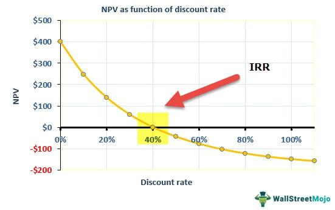

Understanding investment metrics is crucial for making informed financial decisions. In this article, we examine the internal rate of return (IRR) and its significance in investment analysis, with a specific focus on algorithmic trading. 

The internal rate of return is a financial metric employed to evaluate the profitability of potential investments. It is calculated as the discount rate that sets the net present value (NPV) of all expected cash flows from an investment to zero. By providing a singular annualized rate of return, IRR simplifies comparisons among various projects or investment opportunities. Typically, it is used alongside other metrics such as return on investment (ROI) to conduct a comprehensive analysis, enabling investors to assess the viability and potential returns of different investment avenues.



Algorithmic trading utilizes automated and statistical models to execute trades efficiently. In such a dynamic environment, precise and effective metrics like IRR are highly beneficial. By incorporating IRR calculations, algorithmic trading systems can make rapid and informed decisions based on potential returns, thereby enhancing their strategic execution.

This article will explore the calculation of IRR, its application in trading, and its associated advantages and limitations. By delving into these aspects, we aim to empower investors with the knowledge to make strategic decisions in complex financial landscapes. A deep understanding of IRR, combined with other financial metrics, can significantly contribute to the optimization of investment strategies.

## Table of Contents

## Understanding Internal Rate of Return

The Internal Rate of Return (IRR) is a financial metric that represents the discount rate at which the Net Present Value (NPV) of all expected cash flows from an investment is zero. Essentially, it is the break-even interest rate that equates the present value of cash inflows with the initial investment. The formula to determine NPV is:

$$
\text{NPV} = \sum_{t=0}^{n} \frac{C_t}{(1 + r)^t}
$$

where:
- $C_t$ is the net cash inflow at time $t$,
- $r$ is the discount rate,
- $n$ is the total number of periods.

Finding the IRR involves solving for $r$ when the NPV equals zero.

The IRR is valuable because it provides a single, annualized rate of return, which simplifies comparing the profitability of different projects or investment opportunities. A higher IRR suggests a more profitable investment, assuming the same risk level across projects.

Typically, an investment is considered desirable if its IRR surpasses the required rate of return or the cost of capital. The required rate of return is the minimum acceptance criterion set by investors to compensate for risk. By comparing the IRR with this benchmark, investors can decide whether an investment will likely yield a satisfactory return over its lifecycle.

The simplicity and comprehensiveness of IRR have led to its widespread usage in capital budgeting and investment planning, allowing stakeholders to assess the potential value generation of projects quickly. However, being aware of its limitations is crucial, as it must often be used alongside other financial metrics to make well-informed investment decisions.

## Importance of IRR in Investment Decisions

The internal rate of return (IRR) is a powerful tool in investment decisions, primarily due to its ability to distill complex cash flow projections into a single percentage figure. This simplification aids in the comparison of different projects or investment opportunities, making it easier for investors to decide where to allocate their resources. By converting future cash flows into an annualized expected rate of return, IRR allows investors to assess the potential profitability of projects holistically.

IRR is particularly useful in strategic resource allocation, enabling businesses and investors to prioritize projects that exceed the required rate of return or the cost of capital. This comparison assists in ensuring that limited financial resources are directed towards the most promising opportunities, aligning investment choices with broader financial objectives and targets. The metric further aids in risk management, as it allows investors to gauge and quantify potential returns relative to the costs incurred, providing a clearer picture of risk versus reward.

Moreover, IRR serves as a vital component in strategic planning and financial forecasting. By offering insights into expected returns, it supports decision-makers in evaluating whether an investment aligns with the long-term financial goals of the organization or individual. This evaluation process is crucial for maintaining a balanced portfolio and ensuring consistent value creation over time. However, while IRR is a critical metric for gauging investment attractiveness, it's advisable to consider it along with other financial indicators to obtain a more nuanced and comprehensive understanding of potential investments.

## How to Calculate IRR

Calculating the Internal Rate of Return (IRR) is an essential process for assessing the profitability of investments by determining the discount rate at which the net present value (NPV) of future cash flows equals zero. This process usually involves iterative methods or software tools for accuracy and efficiency.

The IRR is defined mathematically by solving the equation:

$$

NPV = \sum_{t=0}^{n} \frac{C_t}{(1 + IRR)^t} = 0 
$$

where $C_t$ represents the net cash flow at time $t$, $n$ is the total number of periods, and IRR is the rate being solved for.

Given the complexity of solving for IRR analytically, numerical methods such as the Newton-Raphson method or bisection method are generally used. These methods iteratively refine the estimated rate until the NPV is rendered to zero.

Software tools, including Microsoft Excel, provide functions like `IRR` that approximate this rate through built-in iterative algorithms, simplifying the calculation process for users. In Excel, once the cash flow values are input as a range, a straightforward application of the `IRR` function returns the result. Here is a basic example:

```excel
=IRR(A1:A5)
```
Python, aided by libraries such as NumPy, is also effective for calculating IRR, especially in more complex scenarios encountered in [algorithmic trading](/wiki/algorithmic-trading) and other applications. The `numpy.irr` function can calculate the IRR with just a few lines of code:

```python
import numpy as np

cash_flows = [-1000, 300, 420, 680, 900]
irr = np.irr(cash_flows)
print(f"The IRR is: {irr:.2%}")
```

This Python function approximates the IRR by initially estimating a rate and refining this through available solver algorithms until the conditions of the IRR definition are met.

When calculating IRR, these tools not only simplify the process but also enhance accuracy, especially in complex investment scenarios involving numerous or irregular cash flows. Using such computational methods allows for faster, more efficient decision-making when evaluating investment opportunities.

## Algorithmic Trading and IRR

Algorithmic trading significantly enhances the ability to calculate and utilize the Internal Rate of Return (IRR) for investment assessment. This form of trading leverages algorithms to automate decision-making processes, allowing for real-time calculation of various financial metrics, including IRR. By utilizing software, traders can quickly evaluate the viability of numerous trading strategies and securities, leading to more dynamic and informed decision-making.

Python is particularly prevalent in algorithmic trading due to its simplicity and the extensive range of libraries available. Libraries like NumPy and SciPy offer robust functions for performing complex financial calculations, including IRR, thus streamlining the process. Here's a basic Python example demonstrating how to calculate IRR using NumPy:

```python
import numpy as np

# Example cash flow series
cash_flows = [-1000, 300, 420, 450, 500]

# IRR calculation
irr = np.irr(cash_flows)

print(f"The IRR is {irr:.2%}")
```

This code efficiently calculates the IRR for a given series of cash flows, making it an invaluable tool for traders who require rapid and precise analysis.

While algorithmic trading automates and accelerates IRR calculations, traders must recognize the limitations of IRR itself. IRR presumes that interim cash flows can be reinvested at the same rate, which may not always reflect actual market conditions. Additionally, the IRR does not account for variations in the scale of projects, potentially skewing results in favor of smaller initiatives with disproportionately high IRRs but lower total returns. Therefore, continuous validation and adjustment of algorithmic trading models are essential. Trading strategies should be frequently reassessed and aligned with evolving financial landscapes to ensure their continued relevance and accuracy. By combining algorithmic efficiency with a holistic understanding of IRR, traders can optimize their strategy execution, leveraging potential returns effectively while mitigating risks associated with the metric's limitations.

## Limitations of IRR

The internal rate of return (IRR) is a widely utilized financial metric for assessing investment potential. However, its application comes with significant limitations that investors should consider when making decisions. One major assumption of IRR is that all interim cash flows are reinvested at the same rate as the IRR itself. This assumption can lead to unrealistic projections, as it may not reflect actual market conditions. In reality, the reinvestment rate could be lower, affecting overall returns and potentially leading to overestimated investment outcomes.

Additionally, IRR does not account for the scale of a project, which can skew the perceived favorability of investment opportunities. Smaller projects with high IRRs might seem more attractive compared to larger projects with slightly lower IRRs, even if they generate less total value. This can lead investors to prioritize projects that do not maximize total wealth creation, thereby affecting long-term financial goals.

Furthermore, IRR can produce multiple or ambiguous values in scenarios involving unconventional cash flows. When cash flow patterns change direction multiple times during the project's life, it can result in more than one IRR, complicating the evaluation process. To illustrate, a project with an initial outlay followed by a mix of positive and negative cash flows could yield different IRR values, making it challenging to determine the true rate of return.

In such cases, alternative metrics like the modified internal rate of return (MIRR) or net present value (NPV) might provide more reliable assessments. These methods do not require the same reinvestment rate assumptions and can accommodate varying cash flow scales, offering a clearer picture of an investment's potential.

## Comparing IRR with Other Financial Metrics

Internal Rate of Return (IRR), Return on Investment (ROI), and Net Present Value (NPV) are fundamental financial metrics employed in investment analysis, each offering distinct and valuable perspectives for decision-making. These methods provide investors with different lenses through which to assess the profitability and efficiency of potential investments.

**Internal Rate of Return (IRR):** As a percentage, IRR represents the discount rate at which the Net Present Value (NPV) of all future cash flows from an investment equals zero. This rate serves as an indicator of the expected annualized return of an investment, facilitating straightforward comparisons across various projects. A higher IRR suggests a more attractive investment opportunity, assuming it exceeds the cost of capital or required rate of return.

**Net Present Value (NPV):** NPV measures the absolute value of an investment by calculating the difference between the present value of cash inflows and outflows over a period, using a specified discount rate. Mathematically, it is expressed as:

$$
\text{NPV} = \sum_{t=0}^{n} \frac{C_t}{(1 + r)^t} - C_0
$$

where $C_t$ represents cash flow at time $t$, $r$ is the discount rate, and $C_0$ is the initial investment cost. A positive NPV indicates that the projected earnings, discounted for time and risk, exceed the initial cost, marking the investment as favorable. Unlike IRR, which provides a percentage, NPV offers a tangible dollar value, highlighting the absolute profitability of an endeavor.

**Return on Investment (ROI):** ROI provides a quick snapshot of an investment's efficiency by calculating the percentage return relative to the initial cost. It is defined as:

$$
\text{ROI} = \frac{\text{Net Profit}}{\text{Investment Cost}} \times 100
$$

This metric is widely used for its simplicity and ease of understanding, helping investors swiftly gauge the profitability of an investment without considering the time value of money, as is done with NPV and IRR.

**Integration of Metrics:** While each of these metrics presents unique insights, their combined use offers a more comprehensive and nuanced evaluation of potential investments. IRR excels in illuminating the relative profitability of various projects, especially when timing and duration differ significantly. NPV, on the other hand, delivers an absolute value that helps in assessing the overall wealth impact of an investment, crucial for comparing projects of different sizes. ROI supports quick efficiency evaluations.

Investors can optimize decision-making by applying these metrics collectively. For example, using IRR alongside NPV can help prioritize projects based on their potential financial contributions while considering the scale effect, ensuring alignment with strategic financial objectives.

## Conclusion

The internal rate of return (IRR) plays a valuable role in assessing investment potential, offering insights into the profitability of various opportunities. However, it is essential to recognize that IRR should not be the sole measure relied upon due to its intrinsic limitations. For instance, IRR assumes that interim cash flows are reinvested at the same rate, which may not align with realistic financial conditions. Also, it does not account for the scale of an investment, potentially skewing preference towards smaller projects with higher relative returns but less overall value creation.

To achieve a comprehensive evaluation of investment opportunities, IRR should be paired with complementary financial metrics like Net Present Value (NPV) and Modified Internal Rate of Return (MIRR). While IRR provides a percentage-based approach, NPV offers an absolute monetary value, illustrating the actual wealth increase from an investment. MIRR, on the other hand, adjusts for IRR's reinvestment rate assumptions and provides a clearer picture when cash flows are non-standard or when projects have differing durations.

Investors should employ a combination of these metrics to form a more balanced and detailed understanding of potential investments, thus aiding in the development of a strategic investment approach. A robust grasp of these various financial measures allows investors to make informed decisions that are aligned with their broader financial goals and market conditions. By leveraging the strengths of each metric, they can mitigate the limitations inherent in any single measure, ultimately leading to more sound and strategic investment outcomes.

## References & Further Reading

[1]: ["Guide to Financial Markets"](https://media.economist.com/sites/default/files/pdfs/Guide_to_Financial_Markets_6e.pdf) by Marc Levinson

[2]: ["Quantitative Investment Analysis"](https://www.investopedia.com/articles/investing/041114/simple-overview-quantitative-analysis.asp) by Richard A. DeFusco, Dennis W. McLeavey, Jerald E. Pinto, and David E. Runkle

[3]: ["Investment Valuation: Tools and Techniques for Determining the Value of Any Asset"](https://books.google.com/books/about/Investment_Valuation.html?id=5SRHAAAAQBAJ) by Aswath Damodaran

[4]: ["Advances in Financial Machine Learning"](https://www.amazon.com/Advances-Financial-Machine-Learning-Marcos/dp/1119482089) by Marcos Lopez de Prado

[5]: ["Machine Learning for Asset Managers"](https://www.cambridge.org/core/books/machine-learning-for-asset-managers/6D9211305EA2E425D33A9F38D0AE3545) by Marcos Lopez de Prado