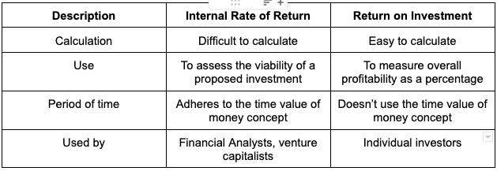

## Table of Contents

## What is Return on Investment (ROI)?

Return on Investment, or ROI, is a way to measure how much money you make or lose on an investment compared to how much you spent on it. It's like figuring out if the money you put into something was worth it. To calculate ROI, you take the profit you made from the investment and divide it by the cost of the investment. Then, you multiply the result by 100 to get a percentage. If the ROI is positive, it means you made more money than you spent. If it's negative, you lost money.

ROI is used by people and businesses to see if their investments are good choices. It helps them decide where to put their money in the future. For example, if you invest in a new business and the ROI is high, you might decide to invest more money in similar businesses. But if the ROI is low or negative, you might choose to invest your money elsewhere. Knowing the ROI helps make smarter decisions about where to spend money.

## What is Internal Rate of Return (IRR)?

Internal Rate of Return, or IRR, is a way to figure out how good an investment is over time. It's like a special percentage that tells you the expected profit from an investment. To find the IRR, you need to look at all the money coming in and going out from the investment. The IRR is the rate where the total money you get back equals the total money you put in, making the net present value of the investment zero.

Think of IRR as a tool to compare different investments. If one investment has a higher IRR than another, it's usually considered better because it's expected to make more money. But remember, IRR assumes you can reinvest any money you earn at the same rate, which might not always be possible. So, while IRR is helpful, it's good to use it along with other ways to check if an investment is worth it.

## How is ROI calculated?

To figure out ROI, you take the profit you made from an investment and divide it by the cost of the investment. Then, you multiply the result by 100 to turn it into a percentage. For example, if you spent $100 on an investment and it grew to $120, your profit would be $20. You'd divide $20 by $100 to get 0.2, and then multiply by 100 to get a 20% ROI.

ROI is a simple way to see if an investment was worth it. A positive ROI means you made money, while a negative ROI means you lost money. It's a quick and easy way to compare different investments and see which ones are doing better. Just remember, ROI doesn't tell the whole story because it doesn't consider things like how long the investment took or other costs involved.

## How is IRR calculated?

IRR, or Internal Rate of Return, is a bit trickier to calculate than ROI. It's the rate at which the present value of all the money you get back from an investment equals the money you put in. To find the IRR, you need to look at all the cash flows, both coming in and going out, over the life of the investment. You then solve for the rate that makes the net present value of these cash flows equal to zero. This usually involves using a calculator or a computer because it's a trial-and-error process where you keep guessing different rates until you find the one that works.

Think of IRR as a way to see how well an investment is doing over time. It's like a special percentage that shows you the expected growth rate of your investment. If the IRR is high, it means the investment is expected to grow a lot. But remember, IRR assumes you can reinvest any money you earn at the same rate, which might not always be true. So, while IRR is a useful tool, it's best to use it along with other measures to get a full picture of an investment's potential.

## What are the key differences between ROI and IRR?

ROI, or Return on Investment, is a simple way to see if an investment was worth it. You calculate it by taking the profit you made and dividing it by the money you spent, then turning that into a percentage. For example, if you spent $100 and made $120, your ROI would be 20%. ROI is great for a quick look at how well an investment did, but it doesn't consider the time it took or other costs involved. It's like a snapshot of your investment's performance.

On the other hand, IRR, or Internal Rate of Return, looks at how well an investment does over time. It's the rate where the total money you get back equals the money you put in, making the net present value zero. To find IRR, you need to look at all the money coming in and going out over the life of the investment. IRR is more complex to calculate and often needs a computer, but it gives you a fuller picture of an investment's growth rate. IRR is useful for comparing different investments, but it assumes you can reinvest any earnings at the same rate, which might not always be possible.

In short, ROI is simpler and gives a quick look at an investment's performance, while IRR is more detailed and considers the time value of money. Both are useful, but they serve different purposes. ROI is good for a fast check, while IRR is better for understanding long-term growth and comparing different investment options.

## In what scenarios is ROI more useful than IRR?

ROI is more useful than IRR when you want a quick and easy way to see how well an investment did. It's like looking at a simple scorecard. If you spent $100 on something and it grew to $120, ROI tells you right away that you made a 20% return. This is great for small projects or when you just need a fast answer without getting into the nitty-gritty details. For example, if you're deciding whether to buy a new piece of equipment for your business, ROI can quickly show you if it's worth the cost.

ROI is also better when you don't need to consider the time it took for the investment to grow. It's all about the end result, not the journey. If you're comparing different short-term investments or looking at the overall performance of a project without worrying about how long it took, ROI is your go-to tool. It's like checking the final score of a game without caring about how the points were scored over time.

## In what scenarios is IRR more useful than ROI?

IRR is more useful than ROI when you need to see how well an investment grows over time. It looks at all the money coming in and going out during the life of the investment, giving you a fuller picture of its performance. For example, if you're deciding between different long-term projects, IRR can help you see which one will grow your money better over the years. It's like comparing the growth rates of different plants over time, not just looking at their final size.

IRR is also better when you want to compare different investment options that have different cash flows and time periods. It helps you see which investment will give you a better return over time, even if they have different costs and earnings schedules. For instance, if you're choosing between investing in a new business or buying real estate, IRR can show you which one will likely give you a higher growth rate. It's a more detailed tool that considers the timing of money, making it perfect for complex investment decisions.

## How do ROI and IRR help in investment decision-making?

ROI and IRR are like tools that help you decide where to put your money. ROI is simple and quick. It tells you if an investment made you money or lost you money. You just look at how much you spent and how much you got back. If the ROI is high, it means the investment did well. For example, if you're thinking about buying a new tool for your business, ROI can quickly show you if it's worth the cost. It's great for small projects or when you need a fast answer without looking too deep into things.

IRR is a bit more complicated but gives you a better idea of how an investment grows over time. It looks at all the money coming in and going out during the life of the investment. If the IRR is high, it means the investment is expected to grow a lot. This is helpful when you're choosing between different long-term projects or investments with different costs and earnings schedules. For instance, if you're deciding between starting a new business or buying real estate, IRR can show you which one will likely give you a higher growth rate. Both ROI and IRR help you make smarter choices about where to spend your money, but they focus on different parts of the investment journey.

## What are the limitations of using ROI for investment analysis?

ROI is a handy tool for a quick look at how well an investment did, but it has some limits. One big problem is that ROI doesn't think about time. If you made a 20% ROI in one year, it's different from making the same 20% over five years. ROI treats all time the same, which can be confusing when you're trying to compare investments that take different amounts of time to grow.

Another issue with ROI is that it doesn't look at all the costs. For example, if you buy a new machine for your business, ROI might only look at the purchase price and how much money it made. But it might not consider other costs like maintenance, training, or the money you could have made if you invested somewhere else. This can make ROI seem higher than it really is, leading you to make choices based on incomplete information.

## What are the limitations of using IRR for investment analysis?

IRR is a great way to see how well an investment will grow over time, but it has some problems too. One big issue is that IRR assumes you can reinvest any money you earn at the same rate. This isn't always true in real life. For example, if you make money from one investment, you might not be able to find another investment with the same high rate of return. This can make IRR seem better than it really is, leading you to think an investment is more profitable than it will be.

Another problem with IRR is that it can be hard to figure out, especially if the cash flows are unusual. Sometimes, an investment might have more than one IRR, which can confuse things. Also, IRR doesn't think about the size of the investment. A small project with a high IRR might not be as good as a bigger project with a lower IRR if you're looking at the total amount of money you can make. So while IRR is helpful, it's best to use it with other tools to get a full picture of an investment's potential.

## How can ROI and IRR be used together to evaluate investments?

Using ROI and IRR together can give you a better idea of how good an investment is. ROI is simple and quick, telling you if you made or lost money on an investment. It's like looking at the final score of a game. If you spent $100 and got back $120, your ROI is 20%. This is great for a fast check on whether an investment was worth it. But ROI doesn't think about time or all the costs involved, so it's like a snapshot that might miss some important details.

IRR, on the other hand, looks at how well an investment grows over time. It's like watching a plant grow and seeing how fast it gets bigger. IRR considers all the money coming in and going out over the life of the investment. If the IRR is high, it means the investment is expected to grow a lot. But IRR can be tricky to figure out and assumes you can reinvest your earnings at the same rate, which might not always be true. By using both ROI and IRR, you get a fuller picture of an investment's performance. ROI gives you the quick answer on whether you made money, while IRR shows you how well that money grew over time. Together, they help you make smarter choices about where to put your money.

## What advanced techniques can be applied to improve the accuracy of ROI and IRR calculations?

To make ROI and IRR calculations more accurate, you can use something called the net present value (NPV). NPV looks at all the money coming in and going out over time, but it also thinks about the time value of money. This means it adjusts the value of future cash flows to what they're worth today. By using NPV along with ROI, you can see not just if you made money, but also how the timing of those gains or losses affects the investment's overall value. For IRR, NPV helps make sure the rate you find is realistic because it considers how money changes value over time.

Another way to improve ROI and IRR is by using sensitivity analysis. This technique lets you see how changes in different parts of your investment might affect the ROI or IRR. For example, you can change the cost of the investment, the expected returns, or the time it takes to see what happens. This helps you understand how sure you can be about your calculations. It's like testing your investment plan to see if it still works if things don't go exactly as planned. By using these advanced techniques, you get a clearer and more reliable picture of how well your investment will do.

## What is the Understanding of Internal Rate of Return?

The Internal Rate of Return (IRR) is a financial metric that represents the discount rate at which the Net Present Value (NPV) of all expected cash flows from an investment is zero. Essentially, it is the break-even [interest rate](/wiki/interest-rate-trading-strategies) that equates the present value of cash inflows with the initial investment. The formula to determine NPV is:

$$
\text{NPV} = \sum_{t=0}^{n} \frac{C_t}{(1 + r)^t}
$$

where:
- $C_t$ is the net cash inflow at time $t$,
- $r$ is the discount rate,
- $n$ is the total number of periods.

Finding the IRR involves solving for $r$ when the NPV equals zero.

The IRR is valuable because it provides a single, annualized rate of return, which simplifies comparing the profitability of different projects or investment opportunities. A higher IRR suggests a more profitable investment, assuming the same risk level across projects.

Typically, an investment is considered desirable if its IRR surpasses the required rate of return or the cost of capital. The required rate of return is the minimum acceptance criterion set by investors to compensate for risk. By comparing the IRR with this benchmark, investors can decide whether an investment will likely yield a satisfactory return over its lifecycle.

The simplicity and comprehensiveness of IRR have led to its widespread usage in capital budgeting and investment planning, allowing stakeholders to assess the potential value generation of projects quickly. However, being aware of its limitations is crucial, as it must often be used alongside other financial metrics to make well-informed investment decisions.

## How do you calculate IRR?

Calculating the Internal Rate of Return (IRR) is an essential process for assessing the profitability of investments by determining the discount rate at which the net present value (NPV) of future cash flows equals zero. This process usually involves iterative methods or software tools for accuracy and efficiency.

The IRR is defined mathematically by solving the equation:

$$

NPV = \sum_{t=0}^{n} \frac{C_t}{(1 + IRR)^t} = 0 
$$

where $C_t$ represents the net cash flow at time $t$, $n$ is the total number of periods, and IRR is the rate being solved for.

Given the complexity of solving for IRR analytically, numerical methods such as the Newton-Raphson method or bisection method are generally used. These methods iteratively refine the estimated rate until the NPV is rendered to zero.

Software tools, including Microsoft Excel, provide functions like `IRR` that approximate this rate through built-in iterative algorithms, simplifying the calculation process for users. In Excel, once the cash flow values are input as a range, a straightforward application of the `IRR` function returns the result. Here is a basic example:

```excel
=IRR(A1:A5)
```
Python, aided by libraries such as NumPy, is also effective for calculating IRR, especially in more complex scenarios encountered in [algorithmic trading](/wiki/algorithmic-trading) and other applications. The `numpy.irr` function can calculate the IRR with just a few lines of code:

```python
import numpy as np

cash_flows = [-1000, 300, 420, 680, 900]
irr = np.irr(cash_flows)
print(f"The IRR is: {irr:.2%}")
```

This Python function approximates the IRR by initially estimating a rate and refining this through available solver algorithms until the conditions of the IRR definition are met.

When calculating IRR, these tools not only simplify the process but also enhance accuracy, especially in complex investment scenarios involving numerous or irregular cash flows. Using such computational methods allows for faster, more efficient decision-making when evaluating investment opportunities.

## How does IRR compare with other financial metrics?

Internal Rate of Return (IRR), Return on Investment (ROI), and Net Present Value (NPV) are fundamental financial metrics employed in investment analysis, each offering distinct and valuable perspectives for decision-making. These methods provide investors with different lenses through which to assess the profitability and efficiency of potential investments.

**Internal Rate of Return (IRR):** As a percentage, IRR represents the discount rate at which the Net Present Value (NPV) of all future cash flows from an investment equals zero. This rate serves as an indicator of the expected annualized return of an investment, facilitating straightforward comparisons across various projects. A higher IRR suggests a more attractive investment opportunity, assuming it exceeds the cost of capital or required rate of return.

**Net Present Value (NPV):** NPV measures the absolute value of an investment by calculating the difference between the present value of cash inflows and outflows over a period, using a specified discount rate. Mathematically, it is expressed as:

$$
\text{NPV} = \sum_{t=0}^{n} \frac{C_t}{(1 + r)^t} - C_0
$$

where $C_t$ represents cash flow at time $t$, $r$ is the discount rate, and $C_0$ is the initial investment cost. A positive NPV indicates that the projected earnings, discounted for time and risk, exceed the initial cost, marking the investment as favorable. Unlike IRR, which provides a percentage, NPV offers a tangible dollar value, highlighting the absolute profitability of an endeavor.

**Return on Investment (ROI):** ROI provides a quick snapshot of an investment's efficiency by calculating the percentage return relative to the initial cost. It is defined as:

$$
\text{ROI} = \frac{\text{Net Profit}}{\text{Investment Cost}} \times 100
$$

This metric is widely used for its simplicity and ease of understanding, helping investors swiftly gauge the profitability of an investment without considering the time value of money, as is done with NPV and IRR.

**Integration of Metrics:** While each of these metrics presents unique insights, their combined use offers a more comprehensive and nuanced evaluation of potential investments. IRR excels in illuminating the relative profitability of various projects, especially when timing and duration differ significantly. NPV, on the other hand, delivers an absolute value that helps in assessing the overall wealth impact of an investment, crucial for comparing projects of different sizes. ROI supports quick efficiency evaluations.

Investors can optimize decision-making by applying these metrics collectively. For example, using IRR alongside NPV can help prioritize projects based on their potential financial contributions while considering the scale effect, ensuring alignment with strategic financial objectives.

## References & Further Reading

[1]: ["Guide to Financial Markets"](https://media.economist.com/sites/default/files/pdfs/Guide_to_Financial_Markets_6e.pdf) by Marc Levinson

[2]: ["Quantitative Investment Analysis"](https://www.investopedia.com/articles/investing/041114/simple-overview-quantitative-analysis.asp) by Richard A. DeFusco, Dennis W. McLeavey, Jerald E. Pinto, and David E. Runkle

[3]: ["Investment Valuation: Tools and Techniques for Determining the Value of Any Asset"](https://books.google.com/books/about/Investment_Valuation.html?id=5SRHAAAAQBAJ) by Aswath Damodaran

[4]: ["Advances in Financial Machine Learning"](https://www.amazon.com/Advances-Financial-Machine-Learning-Marcos/dp/1119482089) by Marcos Lopez de Prado

[5]: ["Machine Learning for Asset Managers"](https://www.cambridge.org/core/books/machine-learning-for-asset-managers/6D9211305EA2E425D33A9F38D0AE3545) by Marcos Lopez de Prado