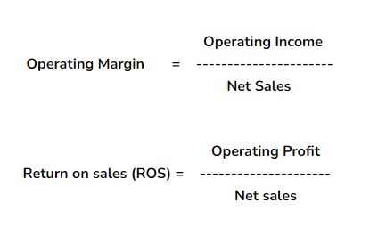

## Table of Contents

## What is Return on Sales (ROS)?

Return on Sales (ROS) is a financial ratio that shows how much profit a company makes from its sales. It is calculated by dividing the company's operating profit by its net sales. This ratio helps business owners and investors understand how efficiently a company is turning its sales into profits.

ROS is important because it gives a clear picture of a company's operational efficiency. A higher ROS means the company is good at controlling costs and generating profit from its sales. On the other hand, a lower ROS might indicate that the company needs to work on reducing expenses or increasing sales prices to improve profitability. By comparing ROS over time or against other companies in the same industry, stakeholders can make better decisions about the company's performance and potential.

## What is Operating Margin?

Operating Margin is a way to see how much profit a company makes from its main business activities. It is calculated by taking the operating income and dividing it by the net sales. The result is shown as a percentage. This number tells us how well a company is doing at turning its sales into profit before other costs like taxes and interest are taken out.

This measure is useful because it focuses only on the core business operations. It helps business owners and investors see if the company is good at managing its day-to-day costs and making money from what it sells. A high operating margin means the company is efficient and good at controlling its costs. A low operating margin might mean the company needs to find ways to cut costs or increase the price of its products or services.

## How is Return on Sales calculated?

Return on Sales, or ROS, is a way to figure out how much profit a company makes from its sales. You calculate it by dividing the company's operating profit by its net sales. The result is a percentage that shows how much of each dollar of sales turns into profit.

This ratio is helpful because it tells business owners and investors how well the company is doing at making money from what it sells. A higher ROS means the company is good at keeping costs down and making more profit from its sales. A lower ROS might mean the company needs to work on reducing expenses or finding ways to increase sales prices to improve how much profit it makes.

## How is Operating Margin calculated?

Operating Margin is a way to see how much profit a company makes from its main business activities. You find it by dividing the operating income by the net sales. The answer is a percentage that shows how good the company is at turning sales into profit before taking out other costs like taxes and interest.

This measure is useful because it focuses only on the core business operations. It helps business owners and investors understand if the company is doing well at managing its day-to-day costs and making money from what it sells. A high operating margin means the company is efficient and good at controlling its costs. A low operating margin might mean the company needs to find ways to cut costs or increase the price of its products or services.

## What is the difference between Return on Sales and Operating Margin?

Return on Sales (ROS) and Operating Margin are similar because they both show how well a company turns its sales into profit. They are calculated in the same way: by dividing the operating profit by the net sales. This gives a percentage that tells us how much profit the company makes from each dollar of sales.

Even though they are calculated the same way, people sometimes use the terms differently. Some people use "Return on Sales" to talk about the whole company's performance, while "Operating Margin" focuses more on the main business activities. But really, both terms mean the same thing and help us understand if a company is good at making money from what it sells.

## Why are Return on Sales and Operating Margin important financial metrics?

Return on Sales (ROS) and Operating Margin are important because they show how well a company makes money from its sales. These metrics help business owners and investors see if a company is good at turning what it sells into profit. A high ROS or Operating Margin means the company is doing a good job at keeping costs low and making more money from its sales. This is important because it shows the company is efficient and can make money even if sales go down a bit.

These metrics are also useful for comparing a company's performance over time or against other companies in the same industry. If a company's ROS or Operating Margin is going up, it might mean they are getting better at managing costs or finding ways to make more money from their products. If it's going down, it could be a sign that the company needs to work on cutting costs or increasing prices. By looking at these numbers, people can make better decisions about investing in or managing the company.

## Can you provide an example of how to calculate Return on Sales for a company?

Let's say a company called "TechGadgets" had a great year. They made $1 million in sales and their operating profit was $200,000. To find out their Return on Sales (ROS), we take the operating profit and divide it by the net sales. So, we do $200,000 divided by $1,000,000. That gives us 0.2, which we turn into a percentage by multiplying by 100. So, TechGadgets' ROS is 20%. This means for every dollar of sales, TechGadgets makes 20 cents in profit.

Understanding this number helps TechGadgets know how well they are doing at turning sales into profit. If their ROS is higher than last year or better than other companies in their industry, it means they are doing a good job at keeping costs down and making money from their sales. If it's lower, they might need to find ways to cut costs or increase prices to improve their profit.

## Can you provide an example of how to calculate Operating Margin for a company?

Let's say a company called "HealthyFoods" had a good year. They made $500,000 in sales and their operating income was $50,000. To find out their Operating Margin, we take the operating income and divide it by the net sales. So, we do $50,000 divided by $500,000. That gives us 0.1, which we turn into a percentage by multiplying by 100. So, HealthyFoods' Operating Margin is 10%. This means for every dollar of sales, HealthyFoods makes 10 cents in profit before other costs like taxes and interest.

Understanding this number helps HealthyFoods know how well they are doing at turning sales into profit from their main business activities. If their Operating Margin is higher than last year or better than other companies in their industry, it means they are doing a good job at keeping costs down and making money from their sales. If it's lower, they might need to find ways to cut costs or increase prices to improve their profit.

## How do industry standards affect the interpretation of Return on Sales and Operating Margin?

Industry standards are important when looking at Return on Sales (ROS) and Operating Margin because they help us see if a company is doing well compared to others in the same business. Each industry has different costs and ways of making money, so what is a good ROS or Operating Margin can be different for different industries. For example, a tech company might have a higher ROS than a grocery store because tech companies often have lower costs and can charge more for their products.

If a company's ROS or Operating Margin is higher than the industry average, it means they are doing a better job at making money from their sales compared to their competitors. This can make the company look more attractive to investors because it shows they are good at managing costs and making profit. On the other hand, if a company's numbers are lower than the industry average, it might mean they need to find ways to improve, like cutting costs or raising prices. By comparing these numbers to industry standards, we can get a better idea of how well a company is really doing.

## What are the limitations of using Return on Sales and Operating Margin for financial analysis?

Return on Sales (ROS) and Operating Margin are helpful for understanding how much profit a company makes from its sales, but they have some limitations. One big problem is that they don't tell the whole story about a company's financial health. They focus only on operating profit and don't include other important costs like taxes, interest, or one-time expenses. This means a company might look good based on ROS and Operating Margin but still have big debts or other financial issues that these numbers don't show.

Another limitation is that ROS and Operating Margin can be different from one industry to another. What is a good number in one industry might not be good in another. For example, a grocery store might have a lower ROS than a tech company because grocery stores have smaller profit margins. So, comparing these numbers across different industries can be misleading. It's important to compare a company's ROS and Operating Margin to others in the same industry to get a fair picture.

Lastly, these metrics can be affected by how a company reports its numbers. Companies can sometimes make their ROS and Operating Margin look better by moving costs around or using different accounting methods. This means that even within the same industry, it can be hard to compare companies if they use different ways to calculate their numbers. So, while ROS and Operating Margin are useful, they should be used along with other financial measures to get a complete view of a company's performance.

## How can a company improve its Return on Sales?

A company can improve its Return on Sales by focusing on increasing its sales and reducing its costs. One way to boost sales is by finding new customers or selling more to existing ones. This can be done through marketing, offering promotions, or improving the product or service to make it more appealing. Another way is to raise prices if the market can handle it, but this needs to be done carefully so it doesn't scare customers away. On the other hand, cutting costs can help too. This means looking at every part of the business to see where money is being spent and finding ways to spend less. This could be by negotiating better deals with suppliers, using technology to work more efficiently, or cutting back on unnecessary expenses.

It's also important for a company to keep an eye on its industry and competitors. By understanding what others in the same business are doing, a company can find new ways to improve its ROS. For example, if competitors are using new technology to cut costs, it might be a good idea to look into that too. Additionally, keeping up with industry trends can help a company stay ahead and find new opportunities to increase sales. By working on both increasing sales and reducing costs, and staying aware of what's happening in the industry, a company can improve its Return on Sales and become more profitable.

## How can a company improve its Operating Margin?

A company can improve its Operating Margin by increasing its sales and cutting its costs. To boost sales, the company can find new customers or sell more to the ones they already have. This can be done by doing more marketing, offering special deals, or making the product or service better so more people want it. Another way is to raise prices, but the company needs to be careful because if prices go up too much, customers might go somewhere else. On the other hand, cutting costs can also help. The company should look at everything it spends money on and see where it can spend less. This could mean getting better deals from suppliers, using technology to work more efficiently, or getting rid of unnecessary expenses.

It's also important for a company to keep an eye on what's happening in its industry and what other companies are doing. By understanding the industry, a company can find new ways to improve its Operating Margin. For example, if other companies are using new technology to cut costs, it might be a good idea to look into that too. Keeping up with industry trends can help a company stay ahead and find new opportunities to increase sales. By working on both increasing sales and reducing costs, and staying aware of what's happening in the industry, a company can improve its Operating Margin and become more profitable.

## What is Operating Margin?

Operating margin is a crucial financial metric used to assess a company's profitability derived from its core operational activities. It provides insights into a company's efficiency in transforming revenue from sales into operating profit. The calculation of operating margin is straightforward: it is the operating income divided by the net sales of the company. This ratio is generally expressed as a percentage, indicating the proportion of revenue that remains as profit after accounting for the cost of goods sold and operational expenses such as wages, rent, and utilities, but before interest and taxes are considered.

Mathematically, the operating margin is defined as:

$$
\text{Operating Margin} = \left( \frac{\text{Operating Income}}{\text{Net Sales}} \right) \times 100
$$

where:
- **Operating Income** is the income realized from a company's operations after deducting operating expenses and cost of goods sold (COGS), but before deductions of interest and taxes.
- **Net Sales** represents the revenue amount after subtracting returns, allowances for damaged or missing goods, and any discounts allowed.

A higher operating margin suggests a more financially healthy company, capable of efficiently controlling its costs and capitalizing on its sales. Conversely, a lower margin may indicate potential challenges in managing operational costs or pricing strategy. Monitoring operating margin trends over time can provide stakeholders with valuable insights into the company's operational efficiency and cost management effectiveness. This ratio is widely used by analysts to compare companies within the same industry, as different industries have varying cost structures impacting their operating margins.

## What is Return on Sales (ROS) and how can it be understood?

Return on Sales (ROS) is a crucial profitability ratio that serves as an indicator of a company's operational efficiency. It highlights the effectiveness with which a company converts its sales into profits before accounting for interest and tax expenses. The formula to calculate Return on Sales is:

$$
\text{ROS} = \frac{\text{EBIT}}{\text{Net Sales}}
$$

where EBIT stands for Earnings Before Interest and Taxes. This formula emphasizes the proportion of revenue that is transformed into operating profit, providing valuable insight into how profitably a company is managing its core business operations.

A higher ROS implies that the company is more efficient in generating profits from its sales, indicating robust operational management and cost control measures. Investors and analysts use this ratio to compare a company's profitability to its peers, assess performance over different periods, and evaluate the effectiveness of management in maximizing revenue outcomes.

While similar to other profitability ratios, ROS focuses on the income generated from core operations, excluding financial and tax considerations, making it especially useful for comparisons across companies or industries with different capital structures and tax regulations. Thus, ROS plays a pivotal role in financial analysis, shaping investment decisions with respect to companies' operational proficiency.

## What are the differences between Operating Margin and Return on Sales?

Operating margin and return on sales (ROS) are both crucial profitability ratios, but they differ fundamentally in terms of their components and applications. The key distinction between these two ratios arises from the numerator used in their calculations.

Operating margin is defined as the ratio of operating income to net sales. Operating income is a Generally Accepted Accounting Principles (GAAP) measure, which accounts for the profits derived from a company's core business operations, excluding items such as taxes and interest expenses. The formula for operating margin can be expressed as:

$$
\text{Operating Margin} = \frac{\text{Operating Income}}{\text{Net Sales}}
$$

Return on sales (ROS), on the other hand, is calculated using earnings before interest and taxes (EBIT) as the numerator. EBIT is a non-GAAP measure that reflects a company's profitability by considering its earnings before any financial obligations, taxes, or non-operational income and expenses are deducted. The formula for ROS is:

$$
\text{Return on Sales (ROS)} = \frac{\text{EBIT}}{\text{Net Sales}}
$$

While both operating margin and ROS focus on profitability, the choice of numerator affects their applications and interpretations. Operating margin, using operating income, provides insights into how effectively a company is managing its core operations and controlling operational costs. In contrast, ROS, with EBIT, offers a broader perspective on operational efficiency by incorporating all earnings from ongoing business activities without accounting for interest and taxes.

Both ratios are instrumental in assessing the profitability of companies across various industries. Investors, analysts, and corporate managers utilize these metrics to compare the operational performance of businesses, identify trends, and make informed financial decisions. Although they are calculated differently, both ratios serve as valuable tools for understanding the financial health and performance of a company.

## References & Further Reading

[1]: Bergstra, J., Bardenet, R., Bengio, Y., & Kégl, B. (2011). ["Algorithms for Hyper-Parameter Optimization."](https://papers.nips.cc/paper/4443-algorithms-for-hyper-parameter-optimization) Advances in Neural Information Processing Systems 24.

[2]: ["Advances in Financial Machine Learning"](https://www.amazon.com/Advances-Financial-Machine-Learning-Marcos/dp/1119482089) by Marcos Lopez de Prado

[3]: ["Evidence-Based Technical Analysis: Applying the Scientific Method and Statistical Inference to Trading Signals"](https://www.amazon.com/Evidence-Based-Technical-Analysis-Scientific-Statistical/dp/0470008741) by David Aronson

[4]: ["Machine Learning for Algorithmic Trading"](https://github.com/stefan-jansen/machine-learning-for-trading) by Stefan Jansen

[5]: ["Quantitative Trading: How to Build Your Own Algorithmic Trading Business"](https://www.amazon.com/Quantitative-Trading-Build-Algorithmic-Business/dp/1119800064) by Ernest P. Chan