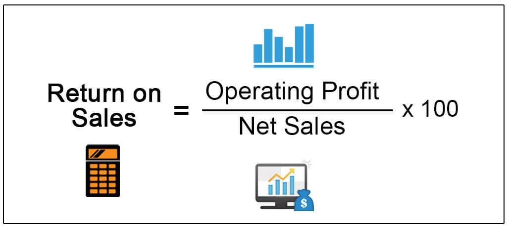

Understanding financial markets and the performance of companies requires a thorough analysis of key financial ratios. Two of the most critical profitability ratios in financial analysis are operating margin and return on sales (ROS). These ratios provide insights into a company's efficiency in generating profits from its operations, constituting essential metrics for investors, analysts, and business managers alike.

Operating margin is calculated as operating income divided by net sales. It measures how efficiently a company converts sales into operating profit, indicating the percentage of revenue left after covering the costs of production, excluding interest and taxes. By evaluating the operating margin, stakeholders can assess a company's core business performance without the influence of financing and tax strategies, providing a clear picture of operational profitability.



Return on sales (ROS), on the other hand, is calculated as earnings before interest and taxes (EBIT) divided by net sales. This ratio reflects the operational efficiency of a company by measuring the amount of profit a company generates per dollar of sales. ROS is a valuable tool for comparing the profitability of companies within the same industry, providing a benchmark for evaluating performance.

These financial ratios are not only essential for individual or institutional investors but also play a significant role in algorithmic trading. In algorithmic trading, computers execute trades based on predefined criteria, often involving a thorough analysis of financial metrics like operating margin and ROS. By integrating these ratios into trading algorithms, traders can develop strategies that capitalize on market inefficiencies, detect trends more rapidly, and make more informed trading decisions.

Incorporating financial ratio analysis into algorithmic trading strategies offers a competitive edge, allowing traders to respond swiftly to market changes and capitalize on opportunities that may not be apparent through traditional trading methods. As algorithmic trading continues to evolve, the ability to harness data-driven approaches will likely become increasingly crucial in financial markets, underscoring the value of operating margin and return on sales as tools for informed financial decision-making.

## Table of Contents

## What is Operating Margin?

Operating margin is a crucial financial metric used to assess a company's profitability derived from its core operational activities. It provides insights into a company's efficiency in transforming revenue from sales into operating profit. The calculation of operating margin is straightforward: it is the operating income divided by the net sales of the company. This ratio is generally expressed as a percentage, indicating the proportion of revenue that remains as profit after accounting for the cost of goods sold and operational expenses such as wages, rent, and utilities, but before interest and taxes are considered.

Mathematically, the operating margin is defined as:

$$
\text{Operating Margin} = \left( \frac{\text{Operating Income}}{\text{Net Sales}} \right) \times 100
$$

where:
- **Operating Income** is the income realized from a company's operations after deducting operating expenses and cost of goods sold (COGS), but before deductions of interest and taxes.
- **Net Sales** represents the revenue amount after subtracting returns, allowances for damaged or missing goods, and any discounts allowed.

A higher operating margin suggests a more financially healthy company, capable of efficiently controlling its costs and capitalizing on its sales. Conversely, a lower margin may indicate potential challenges in managing operational costs or pricing strategy. Monitoring operating margin trends over time can provide stakeholders with valuable insights into the company's operational efficiency and cost management effectiveness. This ratio is widely used by analysts to compare companies within the same industry, as different industries have varying cost structures impacting their operating margins.

## Understanding Return on Sales (ROS)

Return on Sales (ROS) is a crucial profitability ratio that serves as an indicator of a company's operational efficiency. It highlights the effectiveness with which a company converts its sales into profits before accounting for interest and tax expenses. The formula to calculate Return on Sales is:

$$
\text{ROS} = \frac{\text{EBIT}}{\text{Net Sales}}
$$

where EBIT stands for Earnings Before Interest and Taxes. This formula emphasizes the proportion of revenue that is transformed into operating profit, providing valuable insight into how profitably a company is managing its core business operations.

A higher ROS implies that the company is more efficient in generating profits from its sales, indicating robust operational management and cost control measures. Investors and analysts use this ratio to compare a company's profitability to its peers, assess performance over different periods, and evaluate the effectiveness of management in maximizing revenue outcomes.

While similar to other profitability ratios, ROS focuses on the income generated from core operations, excluding financial and tax considerations, making it especially useful for comparisons across companies or industries with different capital structures and tax regulations. Thus, ROS plays a pivotal role in financial analysis, shaping investment decisions with respect to companies' operational proficiency.

## Comparing Operating Margin and Return on Sales

Operating margin and return on sales (ROS) are both crucial profitability ratios, but they differ fundamentally in terms of their components and applications. The key distinction between these two ratios arises from the numerator used in their calculations.

Operating margin is defined as the ratio of operating income to net sales. Operating income is a Generally Accepted Accounting Principles (GAAP) measure, which accounts for the profits derived from a company's core business operations, excluding items such as taxes and interest expenses. The formula for operating margin can be expressed as:

$$
\text{Operating Margin} = \frac{\text{Operating Income}}{\text{Net Sales}}
$$

Return on sales (ROS), on the other hand, is calculated using earnings before interest and taxes (EBIT) as the numerator. EBIT is a non-GAAP measure that reflects a company's profitability by considering its earnings before any financial obligations, taxes, or non-operational income and expenses are deducted. The formula for ROS is:

$$
\text{Return on Sales (ROS)} = \frac{\text{EBIT}}{\text{Net Sales}}
$$

While both operating margin and ROS focus on profitability, the choice of numerator affects their applications and interpretations. Operating margin, using operating income, provides insights into how effectively a company is managing its core operations and controlling operational costs. In contrast, ROS, with EBIT, offers a broader perspective on operational efficiency by incorporating all earnings from ongoing business activities without accounting for interest and taxes.

Both ratios are instrumental in assessing the profitability of companies across various industries. Investors, analysts, and corporate managers utilize these metrics to compare the operational performance of businesses, identify trends, and make informed financial decisions. Although they are calculated differently, both ratios serve as valuable tools for understanding the financial health and performance of a company.

## The Role of Financial Ratios in Algorithmic Trading

Algorithmic trading relies on computer programs to execute trades, using predefined financial metrics to drive decision-making processes. Among these metrics, financial ratios play a critical role in providing the quantitative data needed for informed trading decisions. Specifically, operating margin and return on sales (ROS) are vital in assessing a company's financial health and operational performance. 

Operating margin is calculated by dividing operating income by net sales. This ratio indicates how efficiently a company can convert sales into operating profit, making it an essential metric for evaluating a company’s core operational performance. On the other hand, Return on Sales (ROS) is calculated as earnings before interest and taxes (EBIT) divided by net sales. ROS offers insight into how much profit a company generates per dollar of sales, reflecting its operational efficiency.

In [algorithmic trading](/wiki/algorithmic-trading), these ratios are used to gauge the financial health of companies and compare profitability across industries. By integrating these financial metrics into trading algorithms, traders can automate the assessment of a company's financial performance. This automation allows algorithms to evaluate large volumes of data and identify trends that may indicate overvalued or undervalued stocks, thus enabling traders to capitalize on market opportunities efficiently.

For instance, a Python-based algorithm may analyze the operating margin and ROS of companies in real-time and execute trades based on predetermined thresholds. Here is a simple example of how such algorithms might look:

```python
def analyze_financial_ratios(company_data):
    operating_margins = {}
    return_on_sales = {}

    for company, data in company_data.items():
        operating_income = data['operating_income']
        net_sales = data['net_sales']
        earnings_before_interest_and_taxes = data['ebit']

        operating_margin = operating_income / net_sales
        ros = earnings_before_interest_and_taxes / net_sales

        operating_margins[company] = operating_margin
        return_on_sales[company] = ros

    return operating_margins, return_on_sales

def make_trading_decisions(operating_margins, return_on_sales, threshold=0.1):
    decisions = {}
    for company in operating_margins:
        if operating_margins[company] > threshold and return_on_sales[company] > threshold:
            decisions[company] = "Buy"
        else:
            decisions[company] = "Sell"
    return decisions
```

In this context, the precise calculation and continual assessment of financial ratios help traders to evaluate and respond to shifting market dynamics effectively. The integration of these metrics into algorithmic trading strategies enhances trade accuracy and responsiveness, thereby leveraging market inefficiencies to generate potential returns.

## Integrating Ratio Analysis into Algo Trading Strategies

Integrating financial ratios such as operating margin and return on sales into algorithmic trading strategies can substantively enhance the precision and efficacy of trading decisions. Algorithms can be programmed to continuously monitor and analyze the fluctuations in these ratios, enabling traders to identify overvalued or undervalued stocks with greater accuracy. This process involves the systematic evaluation of financial data, where algorithmic models employ financial ratios as critical input parameters to assess a company's valuation in comparison to its competitors or the broader market.

The core principle here is to exploit market inefficiencies effectively. An overvalued stock might demonstrate elevated financial ratios compared to industry benchmarks, suggesting that its price is higher than its intrinsic value. Conversely, an undervalued stock could present below-average ratios, indicating a potential buying opportunity if intrinsic value is expected to be higher.

By incorporating a comprehensive set of financial ratios into trading algorithms, traders leverage quantitative indicators that offer a granular view of a company’s financial health. For instance, a Python-based algorithm might employ libraries such as `numpy` for numerical operations, `pandas` for data handling, and `scikit-learn` for predictive modeling.

```python
import numpy as np
import pandas as pd
from sklearn.preprocessing import StandardScaler

# Sample financial data
data = {'operating_margin': [0.25, 0.30, 0.22], 'return_on_sales': [0.20, 0.22, 0.18]}
df = pd.DataFrame(data)

# Standardize the data for comparison
scaler = StandardScaler()
standardized_data = scaler.fit_transform(df)

# Algorithm example: identify potentially undervalued stocks
def identify_undervalued_stocks(margin, ros):
    threshold = -0.5  # define a threshold for undervaluation
    if margin < threshold and ros < threshold:
        return "Buy"
    else:
        return "Hold"

df['evaluation'] = [identify_undervalued_stocks(m, r) for m, r in standardized_data]
```

This integration aids traders in capitalizing on transient opportunities presented by discrepancies between a company's market price and its intrinsic value as determined by quantitative metrics. Over time, such strategies may outperform more traditional investment approaches by being adaptive and responsive to real-time financial data, thereby potentially delivering superior returns in rapidly evolving markets.

## Challenges and Considerations

Market [volatility](/wiki/volatility-trading-strategies) represents a significant challenge for both ratio analysis and algorithmic trading. Financial markets are inherently dynamic, influenced by a myriad of factors including economic data releases, geopolitical events, and shifts in investor sentiment. This volatility can impact the reliability of financial ratios, as they are based on historical data that may not accurately predict future performance in rapidly changing conditions.

To address these challenges, it's vital to ensure that ratios like operating margin and return on sales are continuously updated. This involves recalculating ratios regularly to reflect the most recent financial data, thereby providing a more current snapshot of a company's operating performance and profitability. Regular updates help maintain the relevance of these ratios in decision-making processes, ensuring they reflect the latest market conditions.

Ethical and regulatory considerations are paramount in algorithmic trading. Regulatory bodies such as the U.S. Securities and Exchange Commission (SEC) and the European Securities and Markets Authority (ESMA) oversee algorithmic trading activities to ensure market integrity. Regulations typically focus on preventing market manipulation, ensuring transparent operations, and mandating safeguards against potential systemic risks posed by high-speed trading.

Ethically, it is crucial for trading algorithms to be designed and executed in ways that align with fair market practices. This includes avoiding strategies that might exploit transient market anomalies at the expense of market stability or that could be perceived as manipulative. As algorithmic trading continues to grow, maintaining ethical standards and compliance with regulatory requirements will be essential to sustaining trust and fairness in financial markets. 

Overall, while financial ratios are valuable tools in algorithmic trading, their effectiveness can be challenged by market volatility and the need for ethical and regulatory observance. Adapting to these considerations is essential for leveraging financial ratios successfully in automated trading strategies.

## Conclusion

Operating margin and return on sales (ROS) are pivotal tools in the arena of financial analysis. These ratios provide a granular view of a company's profitability by highlighting how effectively sales are converted into earnings. The operating margin is computed as operating income divided by net sales, while ROS is calculated using earnings before interest and taxes (EBIT) divided by net sales. Both metrics offer valuable insights into a company's operational efficiency and financial health, making them essential for investors and analysts alike.

Algorithmic trading, which utilizes computer algorithms to execute trades based on predefined criteria, increasingly relies on such financial ratios. By incorporating operating margin and ROS, these algorithms can perform rapid, data-driven analyses, leading to informed trading decisions. This integration aids in evaluating the financial performance of companies, enabling the algorithms to potentially identify market opportunities and react swiftly to market changes.

As financial markets continue to evolve, there is an observable shift towards data-driven approaches and automated trading systems. The application of operating margin and ROS within algorithmic trading frameworks enhances the ability to navigate complex market environments effectively. With continued advancements in technology and data analytics, the prevalence of algorithmic trading is expected to increase, offering traders a competitive edge through enhanced efficiency and precision. This trend underscores the growing importance of integrating robust financial analysis with cutting-edge technology to adapt to the dynamic nature of global financial markets.

## References & Further Reading

[1]: Bergstra, J., Bardenet, R., Bengio, Y., & Kégl, B. (2011). ["Algorithms for Hyper-Parameter Optimization."](https://papers.nips.cc/paper/4443-algorithms-for-hyper-parameter-optimization) Advances in Neural Information Processing Systems 24.

[2]: ["Advances in Financial Machine Learning"](https://www.amazon.com/Advances-Financial-Machine-Learning-Marcos/dp/1119482089) by Marcos Lopez de Prado

[3]: ["Evidence-Based Technical Analysis: Applying the Scientific Method and Statistical Inference to Trading Signals"](https://www.amazon.com/Evidence-Based-Technical-Analysis-Scientific-Statistical/dp/0470008741) by David Aronson

[4]: ["Machine Learning for Algorithmic Trading"](https://github.com/stefan-jansen/machine-learning-for-trading) by Stefan Jansen

[5]: ["Quantitative Trading: How to Build Your Own Algorithmic Trading Business"](https://www.amazon.com/Quantitative-Trading-Build-Algorithmic-Business/dp/1119800064) by Ernest P. Chan