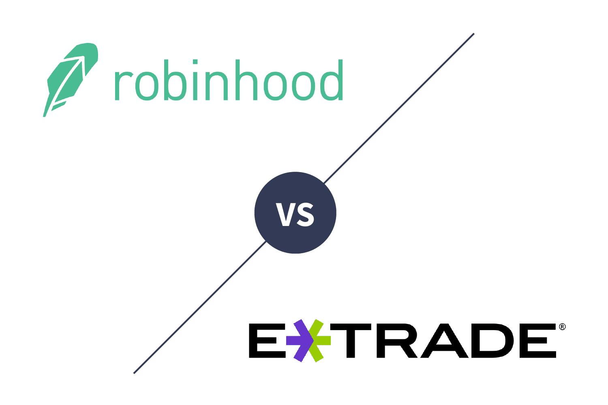

In recent years, the digital investment landscape has undergone a significant transformation as online trading platforms have become increasingly popular among investors seeking convenience and accessibility. These platforms have democratized trading, allowing individuals from diverse backgrounds to participate in financial markets with greater ease. The advent of algorithmic trading has played a crucial role in this evolution, introducing sophisticated, automated strategies that can execute trades at speeds and frequencies beyond human capacity. These systems leverage mathematical models and algorithms to analyze market data, identify trends, and make investment decisions without direct human intervention.

E*TRADE and Robinhood are two prominent platforms competing for dominance in the retail investment market. E*TRADE, with its long-standing history and comprehensive suite of tools, offers robust features tailored to both novice and experienced investors. In contrast, Robinhood's user-friendly interface and commission-free trading have attracted a younger, tech-savvy audience, aspiring to make finance accessible to all.

This article aims to compare E*TRADE and Robinhood with a particular focus on their approaches to algorithmic trading. While E*TRADE provides more traditional and comprehensive tools suitable for constructing and executing algorithmic strategies, Robinhood's offerings in this area are relatively limited but are continuously evolving to meet user demands.

Readers will gain insights into the advantages and disadvantages of each platform regarding algorithmic trading. The article will explore the features and tools offered by E*TRADE and Robinhood, helping investors ascertain which platform aligns better with their individual or business algorithmic trading needs.

## Table of Contents

## Overview of E*TRADE Investment Platform

E*TRADE, a pioneer in online brokerage services, was founded in 1982 by William A. Porter and Bernard A. Newcomb. It began as an electronic trading platform that provided individual investors with direct access to stock market data, a revolutionary concept at the time. Over the decades, E*TRADE expanded its offerings and became a significant entity in the financial services sector, continuing to innovate and adapt to the digital transformation of the industry.

### Key Features and Services

E*TRADE offers a comprehensive suite of financial services tailored for individual investors. Its key features include a user-friendly online platform, a mobile trading app, and a full spectrum of investment products such as stocks, bonds, ETFs, options, mutual funds, futures, and more. E*TRADE also provides banking services, including savings and checking accounts, loans, and credit cards, which complement its investment offerings.

### Algorithmic Trading Capabilities

E*TRADE offers several tools and resources for [algorithmic trading](/wiki/algorithmic-trading), catering especially to more sophisticated traders who leverage automated trading systems. Its platform provides advanced charting tools, technical analysis, and [backtesting](/wiki/backtesting) capabilities, all crucial for developing and deploying algorithmic strategies. Additionally, traders can use E*TRADE’s API to create custom trading algorithms and integrate them into their trading activities.

### Ideal Trader Profiles

E*TRADE is particularly suited for intermediate to advanced investors who require robust tools and analytics to execute complex trading strategies. These traders benefit from E*TRADE's extensive research offerings, educational resources, and access to a wide array of investment products. However, even novice traders can find value in E*TRADE’s educational content and user-friendly interface, which supports learning and growth in trading proficiency.

### Pros and Cons of Using E*TRADE for Algorithmic Trading

**Pros:**
- Comprehensive tools and resources for algorithmic trading, including an API for custom strategies.
- A wide range of investment products and research tools, enhancing trading possibilities.
- Strong customer support and educational resources, assisting traders of all levels.

**Cons:**
- The complexity of tools might be overwhelming for beginner traders.
- Higher trading fees compared to some competitors might deter cost-sensitive investors.

In conclusion, E*TRADE provides a versatile platform for investors, particularly those engaged in algorithmic trading. While it offers powerful tools beneficial for sophisticated strategies, its comprehensive services also support investors at various experience levels, making it a prominent player in the online trading realm.

## Overview of Robinhood Investment Platform

Robinhood Markets, Inc., established in 2013, has profoundly influenced retail trading by adhering to its mission of democratizing finance for everyone. By offering a platform characterized by its simplicity and accessibility, Robinhood significantly lowers the barriers for individual investors to enter the stock market. The platform gained popularity by introducing zero-commission trades, allowing users to trade a variety of financial instruments including stocks, options, ETFs, and cryptocurrencies without incurring transaction fees.

**Key Features and Usability**

Robinhood's interface is designed with a focus on user-friendliness, primarily targeting novice investors. It features an intuitive design that allows users to easily navigate through account creation, executing trades, and monitoring their investment portfolios. The platform's mobile-first approach ensures that trading can be done effortlessly from a smartphone, which further enhances its appeal to young and tech-savvy users.

One of Robinhood's standout features is its Cash Management account, which provides users with a competitive annual percentage yield (APY) on uninvested cash. Additionally, Robinhood offers educational resources like articles and quick tips to help beginners understand basic market concepts. However, these educational tools are relatively basic and may not suffice for those seeking advanced trading strategies or in-depth market analysis.

**Algorithmic Trading Options**

As of now, Robinhood's offerings in the domain of algorithmic trading are minimal. The platform does not provide native support for algorithmic trading tools or automation, which means users interested in deploying complex trading algorithms might find the platform limiting. Robinhood primarily caters to users who prefer to execute trades manually instead of relying on automated systems.

Despite the lack of direct support for algorithmic trading, there are indirect ways users can engage in such strategies on Robinhood. Some traders might use external programming interfaces (APIs) and third-party software to construct and deploy algorithms that interact with their Robinhood accounts. However, this approach requires a higher level of technical expertise and may not be feasible for the average user.

**Ideal User Profiles**

Robinhood is particularly well-suited for beginner traders who are taking their first steps in investing. Its easy-to-use interface and the absence of commission fees provide a low-risk entry point for those unfamiliar with investing. Casual investors who do not engage in frequent trading or those looking to build a small, self-managed portfolio without significant financial investment will find Robinhood an attractive choice. 

On the other hand, seasoned traders seeking advanced trading capabilities, comprehensive research tools, or integrated algorithmic trading functionalities might find Robinhood lacking. The platform's minimalist design, while beneficial for beginners, does not cater to the needs of professional traders who rely on sophisticated trading systems and detailed analytical tools.

**Advantages and Disadvantages in Algorithmic Trading Context**

The primary advantage of Robinhood lies in its no-cost trading model and ease of use, positioning it as an accessible platform for retail traders who are just starting and those making trades manually based on personal analysis. However, in the context of algorithmic trading, these strengths are overshadowed by its limitations. The platform's lack of built-in algorithmic trading features means that those interested in automated strategies must seek out supplemental tools, possibly incurring additional costs and technical challenges.

Overall, while Robinhood succeeds in fulfilling its mission to democratize finance, its platform is not optimized for users who wish to employ algorithmic trading techniques without external aid. Users seeking fully integrated algorithmic trading services may consider alternative platforms better equipped to handle such demands, emphasizing the importance of matching platform capabilities with personal trading objectives.

## Comparative Analysis of E*TRADE and Robinhood

When comparing E*TRADE and Robinhood, both platforms strive to cater to retail investors but differ significantly in user experience and offerings, particularly in the context of algorithmic trading.

### User Experience

E*TRADE is known for providing a robust platform designed for more experienced traders. It boasts advanced tools and comprehensive market research resources, making it suitable for those who require detailed analytics and diverse investment products. The platform's interface reflects its rich feature set, which can be daunting for beginners but offers depth for seasoned investors.

On the other hand, Robinhood is targeted towards beginner traders. Its interface is clean, intuitive, and designed to simplify trading. By focusing on user-friendly features, Robinhood has attracted a large base of novice investors who appreciate ease of use over advanced functionalities. However, this simplicity can be limiting for those seeking more sophisticated trading tools.

### Algorithmic Trading Tools and Resources

E*TRADE provides an array of algorithmic trading options, including custom script generation for automated trades. It offers tools like the E*TRADE Pro desktop platform, which allows for the use of algorithmic strategies and integrates with third-party software for backtesting. These features make E*TRADE a preferred choice for traders with an interest in programming and automatic trading strategies.

In contrast, Robinhood does not offer dedicated algorithmic trading tools. The platform's focus has historically been on accessibility and commission-free trading rather than providing the infrastructure needed for developing and deploying algorithmic trading strategies. While some third-party applications attempt to bridge this gap, Robinhood does not natively support algorithmic trading.

### Cost Structure and Hidden Fees

Both E*TRADE and Robinhood are known for cost-effective trading options, yet their models differ. Robinhood operates on a zero-commission basis for standard trades, which has democratized access to stock markets. However, Robinhood's revenue model includes payment for order flow, which may impact the execution quality of trades.

E*TRADE, while competitive, generally charges commissions on certain products like options contracts, which could be a consideration for those engaging in algorithmic trading given the typically higher trading [volume](/wiki/volume-trading-strategy). Unlike Robinhood, E*TRADE is more transparent about its fee structures and provides detailed disclosures on potential costs associated with the utilization of advanced trading tools.

### Security Measures and Customer Service

Security is paramount for both platforms. E*TRADE implements robust security protocols, including two-[factor](/wiki/factor-investing) authentication and end-to-end encryption, ensuring data protection and account safety. Its customer service is widely regarded, providing multiple support channels with knowledgeable representatives available 24/7.

Robinhood also offers standard security features like two-factor authentication, but has faced scrutiny over past security lapses. Customer support is improving but often lacks the personal touch and immediacy that more established platforms like E*TRADE offer.

### Overall Performance and Satisfaction Ratings

User reviews and expert opinions indicate that E*TRADE consistently outperforms Robinhood in terms of reliability and depth of features. E*TRADE's customer satisfaction is bolstered by its comprehensive offerings and strong support infrastructure. Users value its extensive educational resources and advanced trading capabilities.

Robinhood, however, receives praise for innovation and ease of access, which have drawn a younger demographic to stock trading. Despite its popularity, it faces challenges with maintaining user satisfaction amidst concerns about its trading limitations and occasional technical issues.

In summary, E*TRADE and Robinhood cater to distinct investor profiles. E*TRADE appeals to those requiring advanced tools and comprehensive support, while Robinhood provides accessible entry for new investors prioritizing simplicity over functionality.

## The Role of Algorithmic Trading in Modern Investing

Algorithmic trading involves the use of automated, programmable systems to execute trading instructions at high speeds and frequencies, a practice commonly associated with modern financial markets. These systems rely on complex mathematical models and algorithms to decide on aspects such as timing, price, and volume of the trades. By utilizing historical data and quantitative analysis, algorithmic trading helps remove human emotions from trading decisions, thus promoting more disciplined and systematic approaches.

### Defining Algorithmic Trading

Algorithmic trading, often referred to as "algo trading," uses computational algorithms to make trading decisions, automating the trade processes in financial markets. The algorithms can follow specific triggers based on predefined criteria and execute buy or sell orders at optimal times without human intervention. This can be achieved through various strategies such as [trend following](/wiki/trend-following), [arbitrage](/wiki/arbitrage), or [market making](/wiki/market-making). The primary goals are to optimize trading performance, minimize transaction costs, and respond rapidly to market fluctuations.

### Market Trends Driving Adoption

The adoption of algorithmic trading among retail investors has been significantly influenced by technological advancements, including the proliferation of high-speed internet and the democratization of financial market data. Access to sophisticated trading tools and platforms that support algorithmic models has empowered retail investors to compete with institutional traders. Recent years have seen a surge in interest as individual investors seek higher efficiency and returns, driven by lower costs and increased market accessibility. The trend is likely to continue growing as platforms simplify the integration of algorithms into everyday trading.

### Benefits and Potential Risks

**Benefits**:
1. **Speed and Efficiency**: Algorithms can process market data and execute trades at speeds unmatched by humans.
2. **Reduced Costs**: Automation reduces the need for constant monitoring, thereby decreasing transaction costs and human resources.
3. **Risk Management**: Algorithms can be programmed to include real-time risk assessments, stop-loss orders, and other safeguards.

**Risks**:
1. **Technical Failures**: System glitches or connectivity issues can result in unintended trades, potentially leading to substantial financial losses.
2. **Over-Optimization**: Algorithms may be finely tuned to past data, which may not predict future scenarios accurately, leading to model weaknesses.
3. **Market Impact**: High-frequency trades can contribute to market volatility, especially in the event of erroneous trades or "flash crashes."

### Case Studies

While comprehensive case studies specifically focusing on algorithmic trades through E*TRADE and Robinhood are limited, both platforms offer insights into the successful implementation of algorithmic strategies. For instance, E*TRADE's robust suite of APIs enables advanced algorithmic features, often utilized by sophisticated users to deploy custom strategies. Robinhood, while more limited in terms of direct algorithmic trading tools, has played a role in encouraging a new class of investors who later seek algorithmic strategies on more advanced platforms.

### Future Outlook

The role of algorithmic trading is expected to expand further in the investment world. With continued improvements in [artificial intelligence](/wiki/ai-artificial-intelligence) and [machine learning](/wiki/machine-learning) technologies, algorithms will become increasingly sophisticated, enabling more precise market predictions and strategies. Additionally, regulatory advancements aimed at safeguarding market stability will shape the evolution of algorithmic trading practices. The marriage of powerful algorithms and enhanced user interfaces will likely lower the entry barriers for retail investors, fostering a more innovative and inclusive financial ecosystem.

In summary, algorithmic trading stands as a revolutionary force in modern investing, providing efficiency, speed, and significant competitive advantages. As technology evolves, the investment landscape will continue to adapt, presenting both opportunities and challenges for investors across the spectrum.

## How to Choose the Right Investment Platform for Algorithmic Trading

Choosing the right investment platform for algorithmic trading involves careful consideration of several factors. It's essential to assess personal investment goals, the platform's technological sophistication, usability, educational resources, community support, and customer service quality. Here’s a detailed look at how these factors play into selecting between E*TRADE and Robinhood for algorithmic trading.

### Key Considerations for Algorithmic Trading Platform Selection

**Personal Investment Goals and Trading Skills**

Before selecting a platform, investors should clearly define their investment goals, whether they are short-term gains or long-term wealth accumulation. A trader's skill level plays a significant role in this decision. E*TRADE caters to more experienced traders with its advanced tools, making it suitable for those who are interested in sophisticated trading strategies. Conversely, Robinhood is designed with simplicity in mind, ideal for beginners taking their first steps into the world of trading.

**Technological Sophistication and Usability**

The technological tools and user interface of a trading platform profoundly impact a trader's experience. E*TRADE offers a more robust set of trading tools, including custom charting capabilities and backtesting features, which are essential for algorithmic trading. These are complemented by a more comprehensive suite of APIs, allowing flexibility in developing custom algorithms. Robinhood, however, focuses on ease of use, with a streamlined interface that prioritizes simplicity over complexity, which can be beneficial for those who prefer straightforward, commission-free trading without the overwhelming array of features.

**Educational Resources, Community, and Customer Support**

An investment platform's educational resources and community can significantly enhance a trader's ability to succeed. E*TRADE provides extensive educational materials, including webinars and market analysis, that cater to traders looking to deepen their knowledge. The active E*TRADE community can be a valuable resource for exchanging insights and strategies. Robinhood, while offering some educational content, emphasizes user-friendly guides that cater to novice traders. However, its customer support has been a point of contention due to reports of delayed response times, which might be a critical consideration for users needing immediate assistance.

**Recommendations Based on Investor Profiles and Needs**

- **For Experienced Traders:** E*TRADE is recommended for traders with a solid understanding of financial markets who require advanced algorithmic trading tools and comprehensive educational resources.

- **For Beginners:** Robinhood is better suited for beginners due to its user-friendly interface and focus on simplicity. Its lack of advanced algorithmic features may limit more sophisticated trading strategies, but its zero-commission model is appealing for cost-conscious newcomers.

Investors should weigh these factors against their unique needs and trading strategies. Those seeking a platform that offers both robust technology and community support may lean towards E*TRADE, while individuals prioritizing simplicity and low-cost trades may find Robinhood more appealing. Ultimately, the selection should align with the investor's trading experience, goals, and commitment to learning and developing new strategies.

## Conclusion

E*TRADE and Robinhood represent significant options in the landscape of online trading platforms, each offering unique features catering to diverse investor needs. E*TRADE has established itself with a comprehensive suite of tools and resources, particularly appealing to more experienced traders who value robust algorithmic trading capabilities. Its history in online trading renders it a reliable choice for those looking to leverage advanced trading strategies and tools.

Robinhood, with its mission to democratize finance, appeals primarily to beginner investors. Its emphasis on zero-commission trades and user-friendly interface makes it an attractive choice for those new to investing. However, its current limitations in algorithmic trading options mean it might not suit traders seeking sophisticated algorithmic strategies.

Algorithmic trading continues to shape the investment world by providing automated, data-driven insights that can enhance trading efficiency and decision-making. As technology advances, the role of algorithmic trading, particularly in allowing retail investors to compete on a more level playing field with institutional investors, is likely to expand further. Consequently, understanding how each platform supports algorithmic trading is crucial for investors aiming to harness these capabilities in their investment strategies.

Looking ahead, the evolution of online trading platforms will likely see enhancements in AI-driven tools and increased personalization. Investors are encouraged to explore both E*TRADE and Robinhood to determine which platform aligns best with their trading goals, skills, and preferences. By evaluating their personal investment needs against the features offered by these platforms, investors can embark on a more informed and strategic trading journey.

In conclusion, the opportunities that algorithmic trading presents are vast and growing. For those interested in capitalizing on this technology, beginning with an exploration of platforms like E*TRADE and Robinhood can be a productive first step. Whether one is an experienced trader or a novice investor, both platforms offer a gateway to mastering the dynamics of modern trading practices. The future is bright for algorithmic trading, and now is an ideal time for investors to begin leveraging its potential.

## References & Further Reading

[1]: Bergstra, J., Bardenet, R., Bengio, Y., & Kégl, B. (2011). ["Algorithms for Hyper-Parameter Optimization."](https://dl.acm.org/doi/10.5555/2986459.2986743) Advances in Neural Information Processing Systems 24.

[2]: ["Advances in Financial Machine Learning"](https://www.amazon.com/Advances-Financial-Machine-Learning-Marcos/dp/1119482089) by Marcos Lopez de Prado

[3]: ["Evidence-Based Technical Analysis: Applying the Scientific Method and Statistical Inference to Trading Signals"](https://www.amazon.com/Evidence-Based-Technical-Analysis-Scientific-Statistical/dp/0470008741) by David Aronson

[4]: ["Machine Learning for Algorithmic Trading"](https://github.com/PacktPublishing/Machine-Learning-for-Algorithmic-Trading-Second-Edition) by Stefan Jansen

[5]: ["Quantitative Trading: How to Build Your Own Algorithmic Trading Business"](https://books.google.com/books/about/Quantitative_Trading.html?id=j70yEAAAQBAJ) by Ernest P. Chan