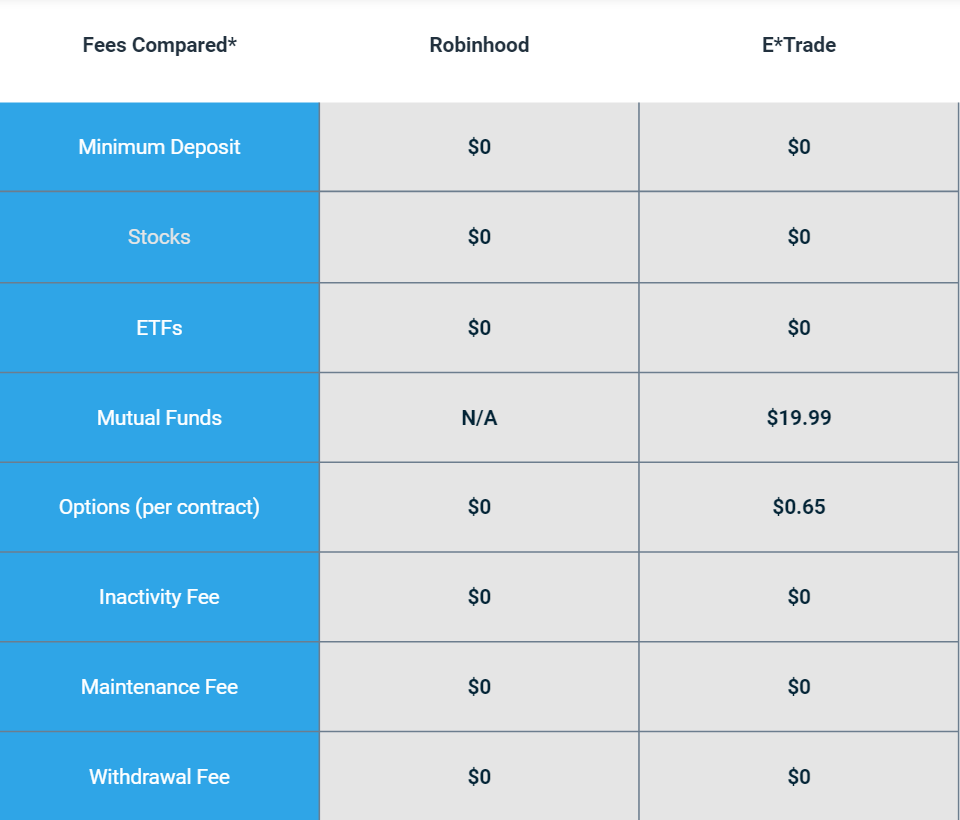

## Table of Contents

## What are Robinhood and E*TRADE?

Robinhood is an online trading platform that lets people buy and sell stocks, options, and cryptocurrencies without paying any fees. It was started in 2013 and is popular with young people because it's easy to use and doesn't cost anything to trade. Robinhood makes money from other sources, like interest on cash that users keep in their accounts and by lending out stocks that users own.

E*TRADE is another online trading platform that has been around since 1982. It offers a wide range of investment options, including stocks, bonds, mutual funds, and options. Unlike Robinhood, E*TRADE charges fees for some services, but it provides more tools and research options for investors. E*TRADE is known for its user-friendly website and mobile app, making it a good choice for both new and experienced investors.

## How do the fee structures of Robinhood and E*TRADE compare in 2024?

In 2024, Robinhood still offers commission-free trading for stocks, options, and cryptocurrencies. This means you don't pay any fees when you buy or sell these investments. Robinhood makes money in other ways, like charging for things like margin trading and getting paid when they send your trades to other companies. So, if you just want to trade without paying fees, Robinhood is a good choice.

E*TRADE, on the other hand, has a different fee structure. While they also offer commission-free trading for stocks and ETFs, they do charge fees for some other services. For example, you might have to pay a fee if you want to trade options or if you need to use a professional to help you manage your investments. E*TRADE's fees can add up, but they offer more tools and research options, which might be worth it if you need those extra features.

## What types of investment products can you access on Robinhood versus E*TRADE?

On Robinhood, you can invest in stocks, options, and cryptocurrencies. That means you can buy pieces of big companies, bet on whether stocks will go up or down, and even trade digital money like Bitcoin. Robinhood is great if you want to start investing without spending a lot of money because you don't have to pay any fees to trade these things.

E*TRADE offers a wider range of investment products. You can trade stocks, options, ETFs, mutual funds, bonds, and even futures. This means you have more choices for growing your money, like investing in a bunch of different companies at once with mutual funds or putting your money into safe investments like bonds. E*TRADE might be better if you want to try different types of investments and need more tools to help you make decisions.

## How do the user interfaces of Robinhood and E*TRADE differ?

Robinhood has a very simple and easy-to-use interface. When you open the app, you see big, colorful buttons and charts that show you how your investments are doing. It's designed to be friendly for people who are new to investing. You can quickly find what you want to buy or sell without getting lost in a lot of menus. Everything is straightforward, which makes it great if you just want to trade without a lot of fuss.

E*TRADE's interface is more detailed and has more options. When you log in, you'll see a lot of different tools and charts that can help you make smarter investment choices. It's not as simple as Robinhood, but it gives you more information and ways to analyze your investments. If you like to dig deeper into your investments and need more features to help you, E*TRADE's interface might be better for you, even though it can take a bit more time to learn how to use everything.

## What are the account minimums required for Robinhood and E*TRADE?

Robinhood does not have any account minimums. This means you can start investing with as little money as you want. Whether you have $1 or $100, you can open an account and start buying stocks, options, or cryptocurrencies right away. This makes Robinhood a great choice for people who are just starting out and don't have a lot of money to invest.

E*TRADE also does not have an account minimum for most of its accounts. You can open a standard brokerage account with no minimum amount. However, if you want to open certain types of accounts, like a robo-advisor account, you might need to start with a specific amount of money. For example, E*TRADE's robo-advisor service might ask for a minimum of $500 to get started. So, while E*TRADE is flexible for most accounts, some special services might need more money upfront.

## How do the educational resources provided by Robinhood and E*TRADE compare?

Robinhood offers some educational resources, but they are pretty basic. They have a section in their app called "Learn" where you can find short articles and videos about investing. These resources cover things like what stocks are, how to trade options, and tips for beginners. While it's good for people who are just starting out, Robinhood's educational materials are not as detailed or in-depth as some other platforms.

E*TRADE, on the other hand, provides a lot more educational content. They have a whole section called "Education" on their website and app, where you can find articles, videos, webinars, and even courses on different investing topics. Whether you want to learn about stocks, bonds, options, or retirement planning, E*TRADE has a lot of information to help you. This makes E*TRADE a better choice if you want to learn more about investing and need more detailed resources.

## What are the margin trading options and rates at Robinhood and E*TRADE in 2024?

In 2024, Robinhood offers margin trading, which lets you borrow money to buy more stocks. If you have a Robinhood Gold account, you can use margin trading. The [interest rate](/wiki/interest-rate-trading-strategies) for borrowing money on Robinhood can change, but it's usually around 8% to 12% a year, depending on how much you borrow. Robinhood makes it easy to start using margin, but remember that using borrowed money can be risky because you might lose more than you put in.

E*TRADE also offers margin trading for its customers. Like Robinhood, the interest rates at E*TRADE can change and depend on how much you borrow. In 2024, their rates start at about 12.2% a year for smaller amounts and can go down to around 9.5% if you borrow a lot. E*TRADE gives you more tools to help you manage your margin account, but it's still important to be careful because trading on margin can lead to big losses if the market goes against you.

## How do the research tools and analysis features of Robinhood and E*TRADE stack up?

Robinhood has simple research tools and analysis features. When you look at a stock, you can see a basic chart that shows how the price has changed over time. There are also some numbers like the stock's highest and lowest price in the last year, and how much the company is worth. Robinhood has a news section where you can read about what's happening with the companies you're interested in. But, Robinhood doesn't have a lot of detailed analysis tools, so if you want to dig deep into a company's financials, you might need to look elsewhere.

E*TRADE offers a lot more when it comes to research tools and analysis features. You can see detailed charts with many different ways to look at the data, like showing how the stock has done over different time periods. E*TRADE also gives you reports about a company's financial health, including things like earnings and how much money the company is making. There are tools to help you figure out how much risk you're taking and even screeners to find stocks that match what you're looking for. If you want to do a lot of research and analysis before you invest, E*TRADE has the tools you need.

## What are the customer support options available at Robinhood and E*TRADE?

Robinhood offers customer support through several channels. You can reach them by email or through their in-app messaging system. They also have a help center with articles and FAQs that can answer a lot of common questions. If you need to talk to someone, Robinhood has phone support, but it's only available during certain hours. They don't have live chat, so if you have a problem, you might need to wait a bit to get help.

E*TRADE provides more ways to get customer support. You can contact them by phone, email, or live chat, which makes it easier to get help when you need it. They also have a big help center with lots of articles and guides. E*TRADE's customer support is available 24/7, so you can always reach someone, no matter what time it is. If you like having different ways to get help and want support whenever you need it, E*TRADE might be a better choice.

## How do the security measures and insurance protections differ between Robinhood and E*TRADE?

Both Robinhood and E*TRADE take steps to keep your money and information safe. They use strong encryption to protect your data when you log in and make trades. They also watch for anything strange, like someone trying to get into your account without permission. If you lose money because of a security problem on their end, both companies have insurance to help you get your money back. This insurance is called SIPC, which stands for Securities Investor Protection Corporation, and it covers up to $500,000, including a $250,000 limit for cash.

Even though they both use SIPC insurance, E*TRADE goes a bit further to keep your money safe. They also have extra insurance from a company called Lloyd's of London, which can cover more money if something goes wrong. This means that if you have a lot of money in your E*TRADE account, you might be protected for more than what SIPC offers. Both Robinhood and E*TRADE care about keeping your money safe, but E*TRADE has a little extra protection.

## What are the mobile app experiences like for Robinhood and E*TRADE in 2024?

In 2024, Robinhood's mobile app is still easy to use and great for people who are new to investing. When you open the app, you see big, colorful buttons and simple charts that show how your investments are doing. It's really easy to buy and sell stocks, options, and cryptocurrencies. The app doesn't have a lot of fancy tools, but it's quick and simple. If you just want to trade without a lot of fuss, Robinhood's app is a good choice.

E*TRADE's mobile app in 2024 offers a lot more features and tools for people who want to dig deeper into their investments. The app has detailed charts and reports that help you understand a company's financials. You can also use screeners to find stocks that fit what you're looking for. It might take a little time to learn how to use everything, but if you like to do a lot of research and need more options, E*TRADE's app is better. Both apps are good, but they're made for different kinds of investors.

## How do the advanced trading features for experienced investors compare between Robinhood and E*TRADE?

Robinhood keeps things simple, so it doesn't have a lot of advanced trading features for experienced investors. You can trade stocks, options, and cryptocurrencies, but you won't find tools like advanced charting or the ability to set up complex trading strategies. If you want to trade quickly and easily without a lot of extra bells and whistles, Robinhood works fine. But if you're an experienced investor looking for more control over your trades, you might find Robinhood's options a bit limited.

E*TRADE, on the other hand, offers a lot more for experienced investors. You can use advanced charting tools to look at stock prices in many different ways. E*TRADE also lets you set up complex options strategies and use conditional orders, which let you make trades based on certain conditions being met. If you like to do a lot of research and need detailed tools to help you make smart investment choices, E*TRADE has what you need. It's a better fit for investors who want to use advanced features to manage their investments carefully.

## References & Further Reading

[1]: Bergstra, J., Bardenet, R., Bengio, Y., & Kégl, B. (2011). ["Algorithms for Hyper-Parameter Optimization."](https://dl.acm.org/doi/10.5555/2986459.2986743) Advances in Neural Information Processing Systems 24.

[2]: ["Advances in Financial Machine Learning"](https://www.amazon.com/Advances-Financial-Machine-Learning-Marcos/dp/1119482089) by Marcos Lopez de Prado

[3]: ["Evidence-Based Technical Analysis: Applying the Scientific Method and Statistical Inference to Trading Signals"](https://www.amazon.com/Evidence-Based-Technical-Analysis-Scientific-Statistical/dp/0470008741) by David Aronson

[4]: ["Machine Learning for Algorithmic Trading"](https://github.com/PacktPublishing/Machine-Learning-for-Algorithmic-Trading-Second-Edition) by Stefan Jansen

[5]: ["Quantitative Trading: How to Build Your Own Algorithmic Trading Business"](https://books.google.com/books/about/Quantitative_Trading.html?id=j70yEAAAQBAJ) by Ernest P. Chan