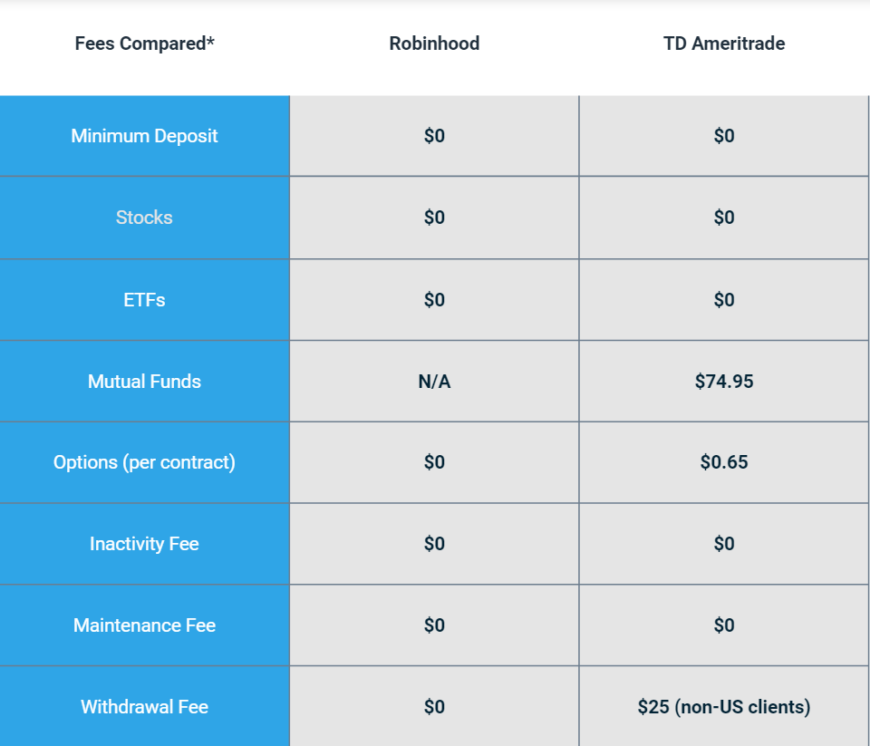

## Table of Contents

## What are Robinhood and TD Ameritrade?

Robinhood is a company that lets people buy and sell stocks, cryptocurrencies, and other investments easily on their phones or computers. They are known for not charging any fees for trading, which makes it easier for people who are just starting to invest. Robinhood's goal is to make investing accessible to everyone, even if they don't have a lot of money to start with.

TD Ameritrade is another company that helps people invest in stocks, options, mutual funds, and more. They have been around for a long time and offer a lot of tools and resources to help people make smart investment choices. Unlike Robinhood, TD Ameritrade does charge some fees for trading, but they also provide more advanced features and research options for people who want to dive deeper into investing.

## How do the fee structures of Robinhood and TD Ameritrade compare?

Robinhood is known for its simple fee structure. They don't charge any commission fees for trading stocks, ETFs, options, or cryptocurrencies. This means you can buy and sell these investments without worrying about extra costs for each trade. Robinhood makes money in other ways, like through interest on uninvested cash and by offering premium services like Robinhood Gold, which does have a monthly fee.

TD Ameritrade has a bit more complicated fee structure. They used to charge $6.95 per trade for stocks and ETFs, but they've moved to a no-commission model for these trades, similar to Robinhood. However, they still charge fees for other services, like $0.65 per contract for options trades and fees for certain mutual funds. TD Ameritrade also offers more advanced trading platforms and research tools, which can be useful but might come with additional costs or requirements.

## What types of investment products are available on Robinhood and TD Ameritrade?

Robinhood offers a variety of investment products that you can buy and sell easily on their app or website. You can trade stocks, which are pieces of ownership in companies, and exchange-traded funds (ETFs), which are baskets of stocks that you can buy and sell like a single stock. Robinhood also lets you trade options, which are contracts that give you the right to buy or sell stocks at a certain price, and cryptocurrencies like Bitcoin and Ethereum. They keep things simple so that even if you're new to investing, you can start with just a few dollars.

TD Ameritrade provides a wider range of investment products compared to Robinhood. You can invest in stocks and ETFs just like on Robinhood, but they also offer options, futures, and [forex](/wiki/forex-system) trading. Futures are contracts to buy or sell assets at a future date, and forex involves trading currencies. Additionally, TD Ameritrade allows you to invest in mutual funds, which are another type of investment that pools money from many investors to buy a diversified portfolio of stocks, bonds, or other assets. They have more options and tools, which can be helpful if you want to explore different kinds of investments and need more detailed research and analysis.

## How do the user interfaces of Robinhood and TD Ameritrade differ?

Robinhood's user interface is designed to be very simple and easy to use. When you open the app, you see a clean, colorful layout that makes it easy to find what you need. You can quickly see your investments, how they're doing, and what's happening in the market. Robinhood is great for people who are new to investing because everything is straightforward and you can start trading with just a few taps. They also have fun features like confetti that pops up when you make a trade, which makes the experience feel more exciting.

TD Ameritrade's user interface is a bit more complex but offers more tools and information. Their app and website have a professional look and feel, with lots of menus and options to explore. You can find detailed charts, research reports, and educational resources that help you make smarter investment decisions. While it might take a bit longer to get used to, TD Ameritrade's interface is good for people who want to dig deeper into their investments and use more advanced trading strategies.

## What are the account minimums for Robinhood and TD Ameritrade?

Robinhood does not have an account minimum. This means you can start investing with any amount of money you have, even if it's just a few dollars. They want to make it easy for everyone to start investing, no matter how much money they have.

TD Ameritrade also does not have an account minimum for most of their accounts. You can open a regular brokerage account or an IRA without needing to put in a certain amount of money to start. This makes it easy for people to begin investing with whatever amount they feel comfortable with.

## How do the educational resources provided by Robinhood and TD Ameritrade compare?

Robinhood offers educational resources that are easy to understand and great for beginners. They have a section called "Learn" where you can find short articles and guides about investing basics, like what stocks and ETFs are, and how to start investing. They also have a feature called "Snacks" that gives you quick news updates about the market. Robinhood's resources are designed to help you learn a little at a time without feeling overwhelmed.

TD Ameritrade provides more detailed and advanced educational resources. They have a whole section called "Education" with lots of articles, videos, and webinars that cover everything from beginner topics to advanced trading strategies. They also offer free online courses through their "Thinkorswim" platform, which can help you learn more about investing and trading. TD Ameritrade's resources are great if you want to dive deeper into your investments and learn more about different ways to trade.

## What are the trading tools and features offered by Robinhood versus TD Ameritrade?

Robinhood keeps things simple with its trading tools and features. You can buy and sell stocks, ETFs, options, and cryptocurrencies easily on their app. They have a feature called "Fractional Shares" that lets you buy parts of stocks, so you can invest even if you don't have enough money to buy a whole share. Robinhood also has a "Recurring Investments" feature that lets you set up automatic investments at regular times. Their tools are easy to use and great for people who are just starting to invest.

TD Ameritrade offers more advanced trading tools and features. Their "Thinkorswim" platform is a powerful tool that gives you detailed charts, technical analysis, and the ability to create custom trading strategies. You can also use their "Paper Trading" feature to practice trading without using real money. TD Ameritrade has tools for trading stocks, ETFs, options, futures, and forex, and they offer more advanced order types and research resources. These tools are better for people who want to explore different kinds of investments and need more detailed information to make their decisions.

## How does the customer service quality differ between Robinhood and TD Ameritrade?

Robinhood's customer service is simple and mostly done through their app. You can send them messages if you have questions or problems, but they don't have a phone number you can call. This can be good if you like talking through messages, but it can be hard if you need quick help or prefer talking to someone on the phone. Robinhood's support team tries to answer quickly, but sometimes it can take a while to get help.

TD Ameritrade's customer service is more detailed and you can reach them in different ways. They have a phone number you can call, and they also offer live chat and email support. This means you can choose the way that works best for you. TD Ameritrade's support team is known for being helpful and answering questions quickly, which is great if you need a lot of help or have complex questions about your investments.

## What are the mobile app experiences like on Robinhood and TD Ameritrade?

Robinhood's mobile app is designed to be easy and fun to use. When you open the app, you see a colorful and simple layout that makes it easy to find what you need. You can quickly check your investments, see how they're doing, and make trades with just a few taps. Robinhood also has fun features like confetti that pops up when you make a trade, which makes the experience feel more exciting. The app is great for people who are new to investing because everything is straightforward and easy to understand.

TD Ameritrade's mobile app offers a more professional and detailed experience. The app has a lot of menus and options to explore, which might take a bit longer to get used to. You can find detailed charts, research reports, and tools that help you make smarter investment decisions. The app is good for people who want to dig deeper into their investments and use more advanced trading strategies. While it might not be as simple as Robinhood's app, it provides a lot more information and tools for those who need them.

## How do the security measures of Robinhood and TD Ameritrade compare?

Robinhood takes security seriously and uses things like two-[factor](/wiki/factor-investing) authentication to keep your account safe. This means you need to enter a code sent to your phone when you log in, which helps stop people from getting into your account if they know your password. They also use encryption to protect your information when you're using their app or website. But, Robinhood has had some problems with security in the past, like a big outage in 2020 that made it hard for people to trade. They're always working to make things better, but it's good to know about these issues.

TD Ameritrade also focuses on keeping your account secure. They use two-factor authentication too, so you need a code to log in. They have strong encryption to protect your data and they watch for any strange activity that might mean someone is trying to get into your account. TD Ameritrade has a good reputation for security and hasn't had the same kind of big problems that Robinhood has. They also have extra security features like the ability to set up alerts if something unusual happens with your account.

## What are the advanced trading options available on Robinhood and TD Ameritrade?

Robinhood keeps things simple and doesn't offer a lot of advanced trading options. You can trade stocks, ETFs, options, and cryptocurrencies, but you can't do things like trading futures or forex. They do have a feature called "Options Trading" where you can buy and sell options, but it's not as detailed as what you might find on other platforms. If you want to set up automatic investments, you can use their "Recurring Investments" feature, but that's about as advanced as it gets on Robinhood.

TD Ameritrade offers a lot more advanced trading options. You can trade stocks, ETFs, options, futures, and forex, which gives you more ways to invest. Their "Thinkorswim" platform is a powerful tool that lets you do things like create custom trading strategies and use detailed charts for technical analysis. They also have "Paper Trading," which lets you practice trading without using real money. This makes TD Ameritrade a good choice if you want to explore different kinds of investments and need more advanced tools to help you make decisions.

## How do the interest rates for margin accounts differ between Robinhood and TD Ameritrade?

Robinhood offers margin accounts through their Robinhood Gold service, which lets you borrow money to buy more investments. The [interest rate](/wiki/interest-rate-trading-strategies) for Robinhood Gold can change, but it's usually around 8% per year. This means if you borrow $1,000, you'll pay about $80 in interest every year. Robinhood's rates can be higher than some other places, but they try to make it easy for people to start using margin trading.

TD Ameritrade also lets you use margin accounts, and their interest rates depend on how much money you have in your account. For smaller accounts, the rate can be around 12.5% per year, but if you have more money, the rate can go down to about 8.5%. This means if you borrow $1,000 with a smaller account, you might pay $125 in interest every year, but with a bigger account, you'd pay closer to $85. TD Ameritrade's rates can be a bit more complicated, but they offer different levels to help you save on interest if you have more money to invest.

## References & Further Reading

[1]: Bergstra, J., Bardenet, R., Bengio, Y., & Kégl, B. (2011). ["Algorithms for Hyper-Parameter Optimization."](https://dl.acm.org/doi/10.5555/2986459.2986743) Advances in Neural Information Processing Systems 24.

[2]: ["Advances in Financial Machine Learning"](https://www.amazon.com/Advances-Financial-Machine-Learning-Marcos/dp/1119482089) by Marcos Lopez de Prado

[3]: ["Evidence-Based Technical Analysis: Applying the Scientific Method and Statistical Inference to Trading Signals"](https://www.amazon.com/Evidence-Based-Technical-Analysis-Scientific-Statistical/dp/0470008741) by David Aronson

[4]: ["Machine Learning for Algorithmic Trading"](https://github.com/stefan-jansen/machine-learning-for-trading) by Stefan Jansen

[5]: ["Quantitative Trading: How to Build Your Own Algorithmic Trading Business"](https://books.google.com/books/about/Quantitative_Trading.html?id=j70yEAAAQBAJ) by Ernest P. Chan