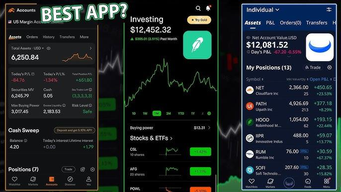

## Table of Contents

## What are Robinhood and Webull?

Robinhood and Webull are both popular online trading platforms that allow people to buy and sell stocks, options, and other financial products. Robinhood was one of the first to offer commission-free trading, which means you don't have to pay fees every time you buy or sell something. This made it easier for more people to start investing. Webull came along a bit later and also offers commission-free trading, but it focuses more on providing advanced tools and data for people who want to do more detailed research and analysis.

Both platforms have easy-to-use apps that you can download on your phone, making it simple to trade on the go. Robinhood is known for its simple design and user-friendly interface, which is great for beginners. Webull, on the other hand, offers more features like customizable charts and real-time data, which can be helpful for more experienced traders. Both platforms also offer different types of accounts, like individual and retirement accounts, so you can choose what works best for your investing goals.

## How do Robinhood and Webull differ in terms of user interface and experience?

Robinhood has a very simple and easy-to-use interface. When you open the app, you see a clean design with big buttons and clear labels. This makes it easy for beginners to understand how to buy and sell stocks. The home screen shows you your portfolio and some basic market information. If you want to trade, you just tap on a stock and hit the buy or sell button. Everything is straightforward, so you don't need to spend a lot of time figuring out how to use the app.

Webull, on the other hand, has a more complex interface with lots of features for people who like to do detailed research. When you open the app, you see more information and options right away. There are customizable charts, real-time data, and different tools to help you analyze stocks. This can be a bit overwhelming for beginners, but it's great for experienced traders who want to dive deep into the market. The trading process is still easy, but you have to navigate through more menus and options to get to it.

Both apps are designed to be user-friendly, but they cater to different types of users. Robinhood is better for people who want a simple way to start investing, while Webull is better for those who want advanced tools and data to make more informed trading decisions.

## What are the account opening requirements for Robinhood and Webull?

To open an account with Robinhood, you need to be at least 18 years old and have a valid Social Security Number. You'll need to provide your name, address, date of birth, and phone number. They'll also ask for your employment information and a government-issued ID like a driver's license or passport. Once you submit your information, Robinhood will do a quick check to make sure you're eligible. If everything looks good, you can start trading right away.

For Webull, the requirements are similar. You also need to be at least 18 years old and have a valid Social Security Number. You'll need to give them your personal details like your name, address, date of birth, and phone number. They'll ask for your employment status and a government-issued ID too. After you provide all this information, Webull will review it and, if approved, you can start using their platform to trade.

Both Robinhood and Webull make the account opening process pretty easy and quick. They want to make sure you're who you say you are and that you meet the basic requirements to trade on their platforms. Once you're approved, you can start investing in no time.

## How do the trading fees compare between Robinhood and Webull?

Robinhood and Webull both offer commission-free trading, which means you don't pay any fees when you buy or sell stocks or ETFs. This is a big reason why a lot of people like using these apps. They make it easy and cheap to start investing. But, there are some small differences in other fees. For example, Robinhood charges a fee for certain types of trades like options contracts, and there might be fees for things like wire transfers or account transfers.

Webull also has commission-free trading for stocks and ETFs. Just like Robinhood, you won't pay to trade these. But, Webull charges a small fee for options trading, which is a bit lower than Robinhood's fee. Webull also has fees for things like wire transfers and account inactivity. So, while both apps are similar in that they don't charge for basic trading, the fees for other services can be a bit different.

## What types of investment products can you trade on Robinhood versus Webull?

On Robinhood, you can trade a bunch of different things like stocks, ETFs, options, and even some cryptocurrencies like Bitcoin and Ethereum. They make it easy to buy and sell these things without paying any commission fees. But, Robinhood doesn't offer things like mutual funds or bonds, so if you want to invest in those, you'll need to look somewhere else.

Webull is similar because you can trade stocks, ETFs, options, and some cryptocurrencies too. Just like Robinhood, you don't pay any fees to trade these. But, Webull gives you a few more options. For example, you can trade futures and a bigger list of cryptocurrencies. They don't have mutual funds or bonds either, but if you're into trading futures, Webull might be a better choice for you.

## How do the educational resources and tools offered by Robinhood and Webull compare?

Robinhood offers some basic educational resources to help you learn about investing. They have a section called "Learn" where you can find articles and guides on different topics like stocks, ETFs, and options. They also have a feature called "Snacks" which gives you quick news updates about the market. These resources are good for beginners who want to start learning about investing. But, if you're looking for more detailed information or advanced tools, you might find Robinhood a bit limited.

Webull, on the other hand, has more advanced educational resources and tools. They offer a "Learn" section too, but it has more in-depth articles and guides. You can find information on things like technical analysis and trading strategies. Webull also has a paper trading feature, which lets you practice trading with fake money before you start using real money. This can be really helpful if you want to learn and try out different strategies without risking your own cash. So, if you're looking for more detailed educational content and advanced tools, Webull might be a better fit for you.

## What are the margin trading options and rates on Robinhood and Webull?

Robinhood offers margin trading, which means you can borrow money from them to buy more stocks. But, you need to apply for a margin account first. Once you're approved, you can start using margin to trade. Robinhood's margin rate changes depending on how much money you have in your account. If you have less than $2,000, the rate can be pretty high, around 12%. But, if you have more money in your account, the rate can go down to around 8%. It's important to know that using margin can be risky because if the stock price goes down, you might lose more money than you put in.

Webull also lets you trade on margin, but you need to apply for a margin account like with Robinhood. Once you're approved, you can start trading with borrowed money. Webull's margin rates are a bit different. They start at around 9.5% if you have less than $25,000 in your account. If you have more money, the rate can go down to around 5.5%. Just like with Robinhood, trading on margin with Webull can be risky, so you need to be careful and understand how it works before you start.

## How do the mobile apps of Robinhood and Webull perform in terms of functionality and reliability?

Robinhood's mobile app is known for being really easy to use. It has a simple design that makes it easy for beginners to buy and sell stocks without getting confused. The app works well most of the time, but sometimes there can be issues, especially when a lot of people are trying to use it at once. This can happen during big market events or when there's a lot of news about a certain stock. Overall, the app is reliable for everyday trading, but you might want to be prepared for some slowdowns during peak times.

Webull's mobile app is a bit more complex because it has a lot of extra features for people who want to do more detailed research. You can customize charts, look at real-time data, and use different tools to analyze stocks. The app is usually reliable and works smoothly, but like Robinhood, it can sometimes have problems when there's a lot of traffic. If you're someone who likes to dive deep into the market and use advanced tools, Webull's app might be a better fit for you. But, if you just want something simple and easy, Robinhood might be easier to use.

## What are the customer service options available on Robinhood and Webull?

Robinhood has a few ways to get help if you need it. You can use their in-app chat to talk to someone, but it might take a while to get an answer, especially when a lot of people are asking questions. They also have a help center with lots of articles and guides that can answer common questions. If you have a more serious problem, you can email them, but don't expect a quick reply. Robinhood's customer service can be a bit slow, so it's good to be patient.

Webull offers a few customer service options too. You can chat with someone in the app, and they usually reply faster than Robinhood. They also have a phone number you can call if you need to talk to someone right away. Like Robinhood, Webull has a help center with lots of articles and guides. If you email them, you might get a quicker response compared to Robinhood. Overall, Webull's customer service is a bit better and faster, but it still might take some time to get the help you need.

## How do the security measures and insurance protections differ between Robinhood and Webull?

Robinhood takes security seriously. They use things like two-[factor](/wiki/factor-investing) authentication to make sure it's really you logging in. They also encrypt your data to keep it safe. If something goes wrong and money goes missing from your account, Robinhood has insurance through the SIPC, which can cover up to $500,000, including a $250,000 limit for cash. But, this insurance doesn't cover things like losing money because the stock market goes down. So, it's good to know that your account is protected, but you still need to be careful with your investments.

Webull also focuses on keeping your account safe. They use two-factor authentication and encrypt your data too. Like Robinhood, Webull is covered by SIPC insurance, which means if the company goes bankrupt, your money is protected up to $500,000, with a $250,000 limit for cash. This insurance doesn't protect you if you lose money because your investments go down in value. Both Robinhood and Webull have strong security measures and the same level of insurance, so you can feel pretty safe using either one.

## What advanced trading features does each platform offer, such as options trading, short selling, and after-hours trading?

Robinhood offers some advanced trading features that can help you do more than just buy and sell stocks. You can trade options, which are a bit more complicated but can let you make money in different ways. Robinhood also lets you do after-hours trading, so you can buy and sell stocks even when the main market is closed. But, Robinhood doesn't let you do short selling, which means you can't bet that a stock's price will go down. So, if you want to do short selling, Robinhood might not be the best choice for you.

Webull has a lot of advanced trading features too. You can trade options, short sell stocks, and do after-hours trading. Short selling lets you borrow stocks and sell them, hoping to buy them back later at a lower price. This can be risky, but it's a way to make money if you think a stock's price will go down. Webull's platform has more tools to help you with these advanced trades, like customizable charts and real-time data. So, if you're into more complex trading strategies, Webull might be a better fit for you.

## How do the platforms' performance and execution speeds compare for high-frequency traders?

For high-frequency traders, Robinhood might not be the best choice. It's known for sometimes having slow execution speeds, especially during busy trading times. When a lot of people are using the app at once, like during big market events, you might have to wait a bit longer for your trades to go through. This can be a problem if you're trying to buy or sell stocks quickly. So, if you're doing a lot of fast trading, Robinhood's performance might not be fast enough for you.

Webull, on the other hand, is usually better for high-frequency traders. It tends to have faster execution speeds and can handle more trades at once without slowing down as much. This makes it easier to buy and sell stocks quickly, which is important if you're trading a lot. But, like Robinhood, Webull can still have some slowdowns during really busy times. Overall, though, Webull's platform is more reliable for high-frequency trading.

## References & Further Reading

[1]: Bergstra, J., Bardenet, R., Bengio, Y., & Kégl, B. (2011). ["Algorithms for Hyper-Parameter Optimization."](https://dl.acm.org/doi/10.5555/2986459.2986743) Advances in Neural Information Processing Systems 24.

[2]: ["Advances in Financial Machine Learning"](https://www.amazon.com/Advances-Financial-Machine-Learning-Marcos/dp/1119482089) by Marcos Lopez de Prado

[3]: ["Evidence-Based Technical Analysis: Applying the Scientific Method and Statistical Inference to Trading Signals"](https://www.amazon.com/Evidence-Based-Technical-Analysis-Scientific-Statistical/dp/0470008741) by David Aronson

[4]: ["Machine Learning for Algorithmic Trading"](https://github.com/stefan-jansen/machine-learning-for-trading) by Stefan Jansen

[5]: ["Quantitative Trading: How to Build Your Own Algorithmic Trading Business"](https://www.amazon.com/Quantitative-Trading-Build-Algorithmic-Business/dp/0470284889) by Ernest P. Chan