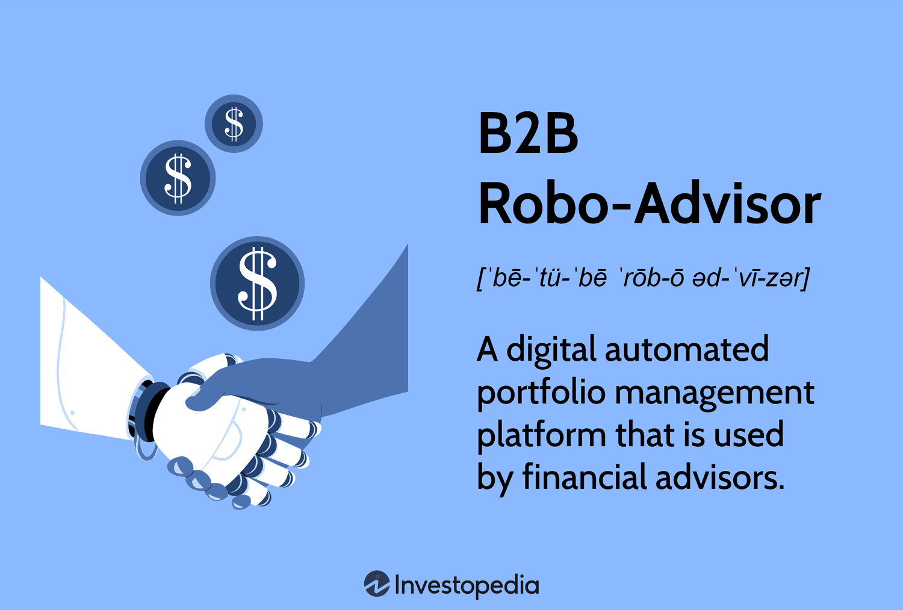

In the evolving landscape of investment management, investors have an array of options to select from, each serving different preferences and levels of involvement. This article examines three prominent investment approaches: traditional brokerage accounts, robo-advisors, and algorithmic trading. Understanding the differences, advantages, and potential drawbacks of each can help investors make informed choices that align with their financial goals and risk tolerance.

Traditional brokerage accounts allow investors to buy and sell a variety of financial instruments such as stocks, bonds, mutual funds, and ETFs. This approach requires individuals to either manage their own portfolios or seek advice from a financial advisor, appealing to those who desire a more hands-on approach. Offering a high degree of flexibility and control, brokerage accounts enable investors to engage in complex strategies if they choose. The advent of numerous online brokerages offering commission-free trades and low fees has made this option more accessible than ever before.

Robo-advisors, on the other hand, are digital platforms providing automated, algorithm-driven financial planning services with minimal human intervention. By assessing an investor’s risk tolerance and investment goals, a robo-advisor creates a diversified portfolio tailored to individual needs. Ideal for those seeking a low-cost, hands-off investment solution, robo-advisors offer significant convenience, although they may lack the personalized touch and flexibility associated with a human advisor.

Algorithmic trading utilizes computer programs to execute trades based on predetermined criteria without direct human intervention. Typically used by institutional investors and professional traders, this approach demands a higher level of technical expertise. It offers the advantage of analyzing large data sets swiftly and executing trades at optimal speeds and frequencies, though it also carries risks including market risk and potential technology failures.

The rise of technology in the financial sector has significantly democratized investing, providing individuals with more tools and options than ever before. This transformation allows investors unprecedented opportunities to grow their wealth by leveraging advanced, user-friendly platforms. By exploring the functionalities, fee structures, and ideal target audience for traditional brokerage accounts, robo-advisors, and algorithmic trading, investors can better align their strategies with personal preferences and objectives.

Moving forward, we will explore each investment option in detail to equip investors with the knowledge needed for effective decision-making.

## Table of Contents

## Traditional Brokerage Accounts

A brokerage account is a financial account that enables investors to buy and sell a range of investment products, such as stocks, bonds, mutual funds, and exchange-traded funds (ETFs). This type of account serves as a gateway for individuals to participate in the financial markets, offering the flexibility to manage one's investments directly or with the assistance of a financial advisor. 

For investors who prefer a hands-on approach, brokerage accounts provide a significant degree of autonomy. They can tailor their portfolios according to personal strategies and market insights, adopting complex investment strategies as desired. This level of control allows for a personalized investment experience, especially appealing to those who have the expertise or interest in active portfolio management.

Recent advancements in financial services technology have made brokerage accounts more accessible to a wider audience. The proliferation of online brokerage platforms has led to competitive pricing structures, including commission-free trades and reduced service fees, which lower the barrier to entry for individual investors. As a result, investing in financial markets has become an attainable goal for more people, regardless of their financial background.

Despite the benefits, managing a brokerage account requires a thorough understanding of the financial markets and the specific assets within the portfolio. The responsibility lies with the investor to conduct comprehensive research and maintain awareness of market trends and changes. This can be time-consuming and may pose challenges, particularly to those who do not possess advanced knowledge of investment strategies.

While commission-free trading is a notable advantage, investors must still be cautious of other potential costs, such as annual account maintenance fees, margin rates, and costs related to more complex financial products. Ensuring a clear understanding of the fee structures involved is crucial to effective financial management.

In summary, brokerage accounts offer an appealing combination of flexibility, control, and accessibility for investors willing to engage actively with their portfolios. However, the responsibility for research and risk management requires a commitment to ongoing education and market engagement.

## Robo-Advisors

Robo-advisors are digital platforms designed to democratize investment management by automating and simplifying the process of developing and maintaining a diversified investment portfolio. These platforms leverage algorithms to provide financial planning services, minimizing the need for manual intervention by human financial advisors. The primary mechanism involves an initial assessment of the investor's risk tolerance, time horizon, and investment goals. Through this, robo-advisors can construct a diversified portfolio that aligns with the client's specific investment profile.

One of the most significant benefits of robo-advisors is their cost efficiency. Traditional financial advisory services often come with high management fees, which can erode returns over time. Conversely, robo-advisors typically charge lower fees, making them an attractive option for cost-conscious investors or those with smaller portfolios. Another advantage is the hands-off nature of these platforms, which allows investors to engage in passive investing—a strategy known for lower transaction costs and reduced risks associated with frequent trading.

Despite these advantages, robo-advisors have some limitations. They may lack the personalized financial advice available from traditional human advisors, who can provide insights tailored to a client's unique financial situation or emotional readiness to certain market conditions. Additionally, while robo-advisors are adept at maintaining a balanced portfolio through algorithmic rebalancing and tax-loss harvesting, they may not fully accommodate complex financial scenarios or provide comprehensive wealth management services.

Several platforms have gained prominence in the robo-advisory space, distinguished by their features and services. For example, Betterment is acclaimed for its goal-based planning and user-friendly interface, making it an excellent choice for first-time investors. Wealthfront is another popular option, noted for its comprehensive financial planning tools and tax-efficient investment strategies. Meanwhile, Vanguard's Personal Advisor Services combine the benefits of robo-advising with occasional human advisor interaction, offering a hybrid approach.

In summary, robo-advisors represent a significant innovation in the investment world, offering a low-cost, automated solution for investors seeking simplicity and efficiency. However, for individuals requiring extensive financial planning or personalized advice, supplementing these tools with human financial expertise might be necessary.

## Algorithmic Trading

Algorithmic trading involves the utilization of computer programs to execute trades automatically based on predetermined criteria, without any human intervention. This approach is predominantly adopted by institutional investors and professional traders due to its inherent complexity and the technical expertise it demands.

A key advantage of [algorithmic trading](/wiki/algorithmic-trading) is its ability to swiftly analyze vast amounts of data, enabling trades to be executed at optimal speeds and frequencies. This speed and precision offer significant benefits, particularly in today's fast-paced financial markets where even microsecond advantages can result in substantial gains.

Various types of algorithms are employed in algorithmic trading, each designed to optimize particular trading objectives. Common types include:

1. **Trend-Following Algorithms**: These algorithms capitalize on market trends and do not make predictions about prices but rely on technical indicators like moving averages.

2. **Arbitrage Algorithms**: Designed to exploit price differentials of identical or related assets across different markets or exchanges.

3. **Market-Making Algorithms**: These facilitate liquidity by providing continuous bid and ask prices. They exploit the bid-ask spread for profit.

4. **Scalping Algorithms**: These execute a large number of small trades to take advantage of small price gaps.

The benefits of algorithmic trading are well-documented. Speed allows for rapid decision-making and execution of trades, often leading to more favorable pricing. Precision minimizes human errors and can execute complex strategies with great efficiency. Additionally, algorithms can operate continuously without fatigue, ensuring trading opportunities are not missed.

However, algorithmic trading is not without its potential drawbacks. Market risk remains ever-present; if the markets move unfavorably, algorithms can compound losses at an accelerated rate. Technology failures pose another significant risk. System glitches or connectivity issues can lead to trade execution errors or missed trades entirely.

Understanding the role and impact of algorithmic trading within financial markets is crucial for assessing its applications and limitations. While it offers high-speed and precise trading capabilities, the need for stringent risk management strategies cannot be overstated. As the technology continues to advance, so too will the sophistication of algorithmic strategies, expanding the opportunities—and challenges—within the financial landscape.

## Comparing Investment Options

When comparing traditional brokerage accounts, robo-advisors, and algorithmic trading, several critical factors come into play, including fees, levels of involvement, risk management, and investor suitability. Each offers unique advantages that cater to different investor preferences and financial objectives.

### Fees

**Traditional Brokerage Accounts:** Investors often encounter a varied fee structure, ranging from trading commissions to account maintenance fees. However, the proliferation of online brokerages has led to reduced fees, with many offering commission-free trades. Despite this, fees for advanced trading tools or consultative services from human advisors can still accrue.

**Robo-Advisors:** Typically, robo-advisors charge lower fees than traditional brokers. They employ a straightforward, often annual flat fee or a percentage of assets under management, generally ranging from 0.25% to 0.50%. This makes them a cost-effective choice for those interested in a passive management style.

**Algorithmic Trading:** Fees in algorithmic trading vary widely and can be quite complex. They encompass the cost of software development, data feeds, and potentially higher transaction fees due to the volume and frequency of trades executed by these systems. 

### Level of Involvement

**Traditional Brokerage Accounts:** These offer high engagement, allowing investors full control over trading decisions. This suits those who enjoy hands-on management and have time for market research and strategy development. 

**Robo-Advisors:** They provide a low-involvement experience, managing portfolios autonomously based on the investor's risk tolerance and goals. This makes them suitable for individuals preferring a set-and-forget strategy.

**Algorithmic Trading:** Requires initial setup and monitoring but involves no manual trading once operational. While the automated processes reduce day-to-day involvement, understanding and maintaining these systems demand sophisticated expertise.

### Risk Management

**Traditional Brokerage Accounts:** Risk management depends heavily on the investor's knowledge and diligence. While this provide flexibility in tailoring strategies, it requires skill in developing effective risk mitigation strategies (e.g., diversification).

**Robo-Advisors:** They handle risk by automatically diversifying investments in line with pre-defined risk tolerance levels. However, their rigidity might not accommodate sudden shifts in personal risk preferences or market conditions.

**Algorithmic Trading:** Algorithms can process vast amounts of data to mitigate risk through strategies like statistical arbitrage. However, they can be susceptible to market anomalies and require robust error-handling protocols to prevent substantial losses from unexpected events.

### Suitability for Investors

**Traditional Brokerage Accounts:** Best suited for investors seeking control and who have the time and acumen for active management. They provide the flexibility to pursue a broad range of investment strategies.

**Robo-Advisors:** An excellent option for individuals who want minimal involvement without sacrificing strategic diversification. Ideal for novices or those with limited time for financial management.

**Algorithmic Trading:** Typically favored by institutional investors or experienced traders with technical expertise. Offers potential benefits from speed and precision in execution, but unsuitable for those without the necessary quantitative skills.

### Topics of Consideration

**Regulatory Considerations:** All three approaches operate within stringent regulatory frameworks. For example, the SEC oversees brokerage activities, while robo-advisors must comply with fiduciary standards. Algorithmic trading faces additional scrutiny to prevent market disruptions.

**Technological Advancements:** The rise in artificial intelligence and machine learning continues to reshape these platforms. Innovations enhance robo-advisor capabilities for personalized strategies, while algorithmic trading systems become more adept at predictive analytics.

**Market Trends:** The democratization of investing, driven by technology, leads to increased adoption of robo-advisors among millennials, whereas algorithmic trading remains entrenched in institutional settings. Traditional brokers have adapted by offering technologically enhanced trading platforms.

In conclusion, selecting an investment avenue depends on aligning these factors with individual financial goals, risk appetites, and desired involvement levels. Each method provides distinct pathways for wealth building, guided by personal preference and technical acumen.

## Conclusion

Choosing the right investment option is crucial for meeting one's financial objectives and effectively managing risk. A comprehensive understanding of financial goals, risk tolerance, and desired level of involvement in investment management is essential for selecting an appropriate investment strategy. Traditional brokerage accounts, robo-advisors, and algorithmic trading each present distinct advantages and potential drawbacks that cater to varied investor preferences.

Brokerage accounts offer the highest level of control, enabling investors to actively manage their portfolios and execute complex strategies tailored to their personal investment goals. This approach appeals to individuals who seek a hands-on role in their financial planning and possess the requisite knowledge and time commitment.

In contrast, robo-advisors provide a convenient, cost-effective solution for those seeking a more passive investment management experience. These platforms employ advanced algorithms to construct and maintain diversified portfolios, making them ideal for individuals with limited investment experience or those who prefer minimal day-to-day involvement in portfolio management.

Algorithmic trading, known for its speed and precision, is an advanced technique primarily utilized by institutional investors and professional traders. It involves the use of sophisticated algorithms to make trading decisions and execute high-frequency trades without human intervention. While it offers significant advantages in terms of efficiency and scalability, its complexity and technical demands require substantial expertise.

The evolving landscape of financial technology continues to enhance the sophistication and accessibility of these investment options, providing individuals with unprecedented opportunities to grow their wealth. Investors are encouraged to remain informed and adaptable, as ongoing learning is key to successfully navigating the complexities of modern investment environments. By aligning their chosen investment strategy with their personal financial aspirations and capabilities, investors can effectively harness the potential of these diverse tools to achieve their financial goals.

## References & Further Reading

[1]: Bergstra, J., Bardenet, R., Bengio, Y., & Kégl, B. (2011). ["Algorithms for Hyper-Parameter Optimization."](https://dl.acm.org/doi/10.5555/2986459.2986743) Advances in Neural Information Processing Systems 24.

[2]: ["Advances in Financial Machine Learning"](https://www.amazon.com/Advances-Financial-Machine-Learning-Marcos/dp/1119482089) by Marcos Lopez de Prado

[3]: ["Evidence-Based Technical Analysis: Applying the Scientific Method and Statistical Inference to Trading Signals"](https://www.amazon.com/Evidence-Based-Technical-Analysis-Scientific-Statistical/dp/0470008741) by David Aronson

[4]: ["Machine Learning for Algorithmic Trading"](https://github.com/stefan-jansen/machine-learning-for-trading) by Stefan Jansen

[5]: ["Quantitative Trading: How to Build Your Own Algorithmic Trading Business"](https://www.amazon.com/Quantitative-Trading-Build-Algorithmic-Business/dp/1119800064) by Ernest P. Chan