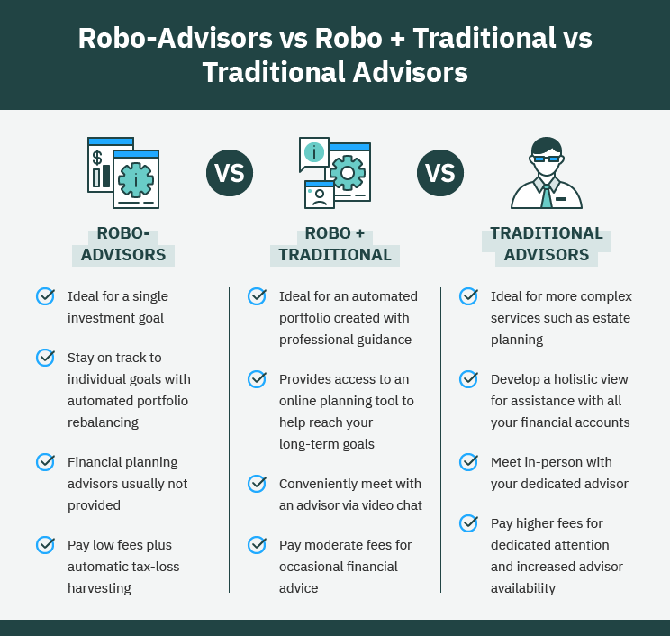

## Table of Contents

## What is a robo-advisor?

A robo-advisor is a type of online investment platform that uses computer algorithms to manage your money. Instead of working with a human financial advisor, you answer some questions about your financial goals and risk tolerance, and the robo-advisor creates and manages a personalized investment portfolio for you. This makes investing easier and more accessible, especially for people who are new to investing or don't have a lot of money to start with.

Robo-advisors are popular because they are usually cheaper than traditional financial advisors. They charge lower fees because they don't need to pay for human advisors and large office spaces. This means you can keep more of your money invested and growing over time. However, robo-advisors may not be able to offer the same level of personalized advice and complex financial planning that a human advisor can provide. They are best for people who want a simple, low-cost way to invest their money.

## What is a financial advisor?

A financial advisor is a person who helps you with your money. They give you advice on how to save, invest, and plan for your future. They can help you make a plan to reach your financial goals, like buying a house, saving for your kids' college, or retiring comfortably. Financial advisors can work with you to create a personalized plan based on your income, expenses, and what you want to achieve.

Financial advisors can offer more than just investment advice. They can help you with things like budgeting, tax planning, and estate planning. They can also help you understand complicated financial products and make sure you are making smart choices with your money. Because they work closely with you, they can provide a level of personalized service that a robo-advisor might not be able to match. However, this personalized service usually comes with higher fees than using a robo-advisor.

## How do robo-advisors and financial advisors differ in terms of cost?

Robo-advisors are usually cheaper than financial advisors. They use computer programs to manage your money, so they don't need to pay for human advisors or big offices. This means they can charge lower fees. For example, robo-advisors often charge a small percentage of your money each year, like 0.25% to 0.50%. This can save you a lot of money over time, especially if you are just starting to invest.

Financial advisors, on the other hand, are usually more expensive. They offer personalized advice and spend time understanding your specific needs and goals. Because of this, they often charge more. Their fees can be a percentage of your money, like 1% to 2% each year, or they might charge by the hour or a flat fee for their services. While they can be more costly, many people find the personalized help and detailed planning worth the extra money.

## What level of personalization can you expect from robo-advisors compared to financial advisors?

Robo-advisors offer less personalization than financial advisors. When you use a robo-advisor, you answer some questions about your goals and how much risk you're willing to take. The robo-advisor then uses this information to create an investment plan for you. It's all done by a computer, so it can't understand your unique situation or change the plan if your life changes. It's good for simple investing but not for complex financial planning.

Financial advisors, on the other hand, give you a lot more personalization. They meet with you and talk about your life, your dreams, and your money. They can make a plan that fits you perfectly and change it as your life changes. If you get a new job, have a baby, or want to buy a house, they can help you adjust your financial plan. They can also help with things like taxes and planning for when you're older, which robo-advisors can't do as well.

## How do the investment strategies of robo-advisors and financial advisors typically differ?

Robo-advisors use computer programs to create your investment plan. They look at how much risk you want to take and what you want to achieve, then they pick a mix of investments like stocks and bonds for you. They often use something called "passive investing," which means they put your money in low-cost funds that follow the market. They don't try to pick individual stocks or time the market; instead, they stick to a plan and make small changes over time to keep your investments balanced.

Financial advisors, on the other hand, can create a more customized investment strategy. They spend time learning about your life and goals, so they can make a plan that fits you perfectly. They might use "active investing," where they try to pick stocks or other investments that they think will do better than the market. They can also change your investments more often based on what's happening in your life or in the world. This personalized approach can be more flexible and tailored to your needs, but it can also come with higher fees and more risk.

## What kind of access and interaction can you expect with a robo-advisor versus a financial advisor?

With a robo-advisor, you mostly interact through a website or an app. You answer some questions when you sign up, and then the robo-advisor does the rest. If you have questions, you can usually find answers in the app or on the website, or you might be able to email or chat with a customer service team. But you won't have regular meetings or phone calls with a person who knows you and your goals. It's all pretty hands-off, which can be good if you want to set it and forget it.

With a financial advisor, you get a lot more personal interaction. You'll usually have meetings or phone calls with your advisor, where you talk about your life and your money. They get to know you and can help you make decisions that fit your situation. If you have questions or if something big changes in your life, you can reach out to them and get personalized advice. This kind of close relationship can be really helpful, especially if your financial situation is complicated or if you need help with more than just investing.

## How do robo-advisors and financial advisors handle tax strategies and estate planning?

Robo-advisors can help with some basic tax strategies, like putting your money in tax-friendly accounts like IRAs or 401(k)s. They can also do something called tax-loss harvesting, which means selling investments that have gone down in value to lower your taxes. But robo-advisors don't give you personalized tax advice. They can't help you with your whole tax plan or tell you what to do about things like buying a house or starting a business.

Financial advisors, on the other hand, can help you with a lot more when it comes to taxes and estate planning. They can look at your whole financial picture and give you advice that fits your life. They can help you with things like figuring out how much to save for taxes, planning for when you retire, and making sure your money goes to the right people after you're gone. They can also work with your tax preparer or lawyer to make sure everything is set up just right. This kind of personalized help can be really important if you have a lot of money or if your situation is complicated.

## What are the minimum investment requirements for using robo-advisors versus hiring a financial advisor?

Robo-advisors usually have low minimum investment requirements. Many robo-advisors let you start with just a few hundred dollars, or sometimes even less. This makes them a good choice if you don't have a lot of money to invest right away. You can start small and add more money as you go. This low barrier to entry is one reason why robo-advisors are popular with people who are just starting to invest.

Financial advisors often have higher minimum investment requirements. They might ask you to have at least $10,000, $25,000, or even more before they'll work with you. This is because they spend a lot of time getting to know you and making a personalized plan, so they need to make sure it's worth their time. If you have a smaller amount to invest, you might not be able to work with a financial advisor until you save up more money.

## How do robo-advisors and financial advisors manage risk and portfolio rebalancing?

Robo-advisors manage risk and portfolio rebalancing using computer programs. They ask you how much risk you want to take, then they pick investments that match that level of risk. They keep your portfolio balanced by automatically buying and selling investments to keep your mix of stocks and bonds the same. For example, if stocks go up a lot, the robo-advisor might sell some stocks and buy more bonds to keep your risk level steady. This is all done without you having to do anything, so it's easy and hands-off.

Financial advisors manage risk and portfolio rebalancing in a more personal way. They talk to you about your comfort with risk and your goals, then they create a plan that fits you. They might change your investments more often based on what's happening in your life or in the world. If you get a new job or if the market changes a lot, they can adjust your portfolio to manage the risk. They also help you rebalance your portfolio, but they do it while thinking about your whole financial picture, not just following a computer program.

## What are the qualifications and credentials typically held by financial advisors, and how do they compare to the algorithms used by robo-advisors?

Financial advisors usually have to get special training and pass tests to give you advice about your money. They might have degrees in finance or business, and they often have certifications like Certified Financial Planner (CFP) or Chartered Financial Analyst (CFA). These credentials show that they know a lot about money and how to help people with their finances. They have to keep learning and follow rules to make sure they're giving good advice.

Robo-advisors, on the other hand, don't have people giving you advice. Instead, they use computer programs, or algorithms, to manage your money. These algorithms are made by people who are good with computers and finance, but you don't interact with them directly. The algorithms follow set rules to pick your investments and manage your risk, but they can't understand your personal situation like a human advisor can. So while financial advisors have qualifications and can give personalized advice, robo-advisors rely on technology to do their work.

## How have robo-advisors and financial advisors adapted to the integration of ESG (Environmental, Social, and Governance) investing?

Robo-advisors have started to include ESG investing options in their services. They use computer programs to pick investments that match your values, like protecting the environment or supporting fair work practices. You can tell the robo-advisor what's important to you, and it will choose investments that fit those values. This makes it easy for people who want to invest in a way that helps the world, without having to do a lot of research themselves. But because robo-advisors use set rules, they might not be able to change their choices as quickly as the world changes.

Financial advisors have also started to offer ESG investing options. They talk to you about what you care about and help you find investments that match those values. They can look at your whole financial plan and suggest ways to invest in companies that are good for the environment, treat their workers well, or have strong leadership. Because financial advisors work closely with you, they can change your investments if your values or the world changes. This personalized approach can be really helpful if you want to make sure your money is doing good in the world in the best way possible.

## What future trends might influence the choice between robo-advisors and financial advisors?

In the future, technology might change how people choose between robo-advisors and financial advisors. As computers get smarter, robo-advisors could get better at understanding what people want and need. They might start using things like artificial intelligence to give advice that feels more personal. This could make robo-advisors more appealing to people who want a simple, low-cost way to invest, but also want their money to match their values or goals. But even with better technology, robo-advisors might still not be as good as human advisors at understanding complicated life situations or giving detailed financial plans.

Another trend that might affect the choice is how people's ideas about money and investing change. More and more people are interested in things like ESG investing, where they want their money to help the world. Financial advisors might get better at helping people with these special kinds of investments, because they can talk to you and understand what you really care about. At the same time, robo-advisors might add more options for ESG investing, making it easier for people to pick investments that match their values without having to pay a lot for advice. So, the future might see both robo-advisors and financial advisors trying to meet the growing demand for personalized and socially responsible investing, but in different ways.

## References & Further Reading

[1]: Bergstra, J., Bardenet, R., Bengio, Y., & Kégl, B. (2011). ["Algorithms for Hyper-Parameter Optimization."](https://dl.acm.org/doi/10.5555/2986459.2986743) Advances in Neural Information Processing Systems 24.

[2]: ["Advances in Financial Machine Learning"](https://www.amazon.com/Advances-Financial-Machine-Learning-Marcos/dp/1119482089) by Marcos Lopez de Prado

[3]: ["Evidence-Based Technical Analysis: Applying the Scientific Method and Statistical Inference to Trading Signals"](https://www.amazon.com/Evidence-Based-Technical-Analysis-Scientific-Statistical/dp/0470008741) by David Aronson

[4]: ["Machine Learning for Algorithmic Trading"](https://github.com/stefan-jansen/machine-learning-for-trading) by Stefan Jansen

[5]: ["Quantitative Trading: How to Build Your Own Algorithmic Trading Business"](https://www.amazon.com/Quantitative-Trading-Build-Algorithmic-Business/dp/1119800064) by Ernest P. Chan