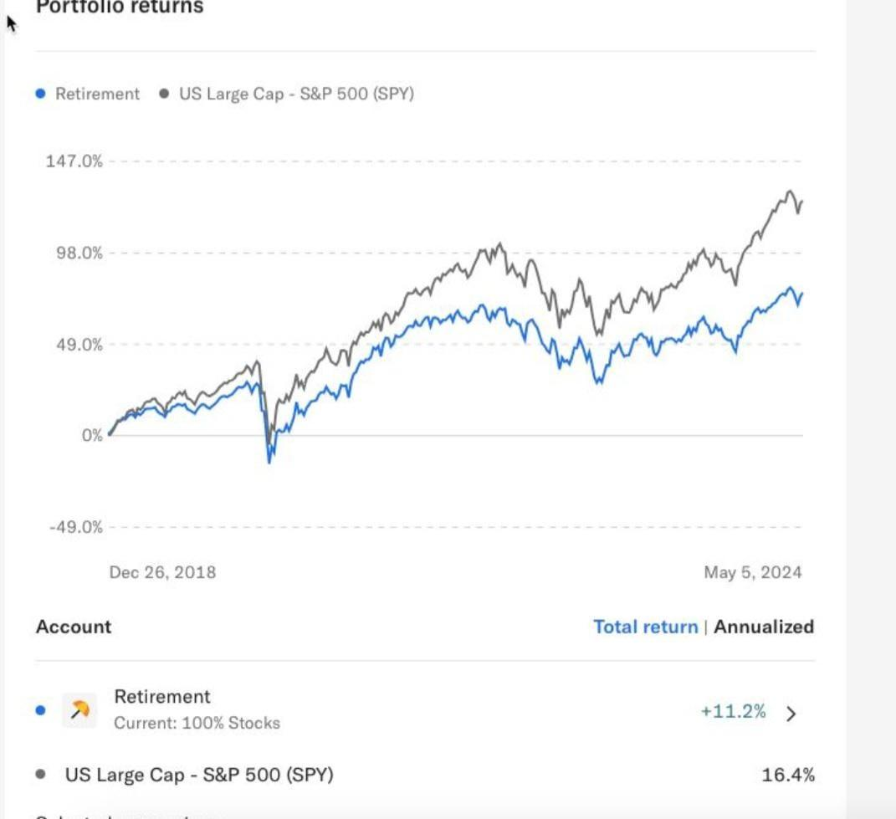

## Table of Contents

## What are robo-advisors and how do they work?

Robo-advisors are online platforms that use computer algorithms to manage your investments. They help you invest your money without needing to talk to a human financial advisor. You tell the robo-advisor how much risk you want to take and what your financial goals are, and it creates a personalized investment plan for you. The robo-advisor then automatically buys and sells investments like stocks and bonds to keep your portfolio balanced.

These services are usually cheaper than traditional financial advisors because they don't have the high costs of running an office and paying human advisors. Robo-advisors often use a method called "passive investing," which means they invest in a wide range of assets to match the overall market performance, rather than trying to pick individual stocks that might do better. This approach can help reduce risk and keep your investments growing steadily over time.

## What are index funds and how do they work?

Index funds are a type of investment that tries to match the performance of a specific market index, like the S&P 500. An index is just a list of stocks or other investments that represent a part of the market. When you invest in an index fund, you're buying a little bit of all the stocks in that index. This means you're spreading your money across many different companies, which can be less risky than picking individual stocks.

Index funds work by using a strategy called passive investing. Instead of trying to beat the market by picking the best stocks, index funds aim to match the market's performance. They do this by holding all the stocks in the index in the same proportions as the index itself. This approach is usually cheaper because it doesn't need a lot of people to manage it, and it can be a good way to grow your money over time without taking big risks.

## How do the fees of robo-advisors compare to those of index funds?

Robo-advisors usually charge a fee based on a percentage of the money you have invested with them. This fee is often around 0.25% to 0.50% per year. For example, if you have $10,000 invested, you might pay $25 to $50 a year. This fee covers the cost of the robo-advisor managing your investments, including choosing which index funds or other investments to buy and sell.

Index funds, on the other hand, charge what's called an expense ratio. This is a small percentage of your investment that goes toward the cost of running the fund. The expense ratio for index funds is typically very low, often around 0.05% to 0.20% per year. So, if you have $10,000 in an index fund, you might pay $5 to $20 a year. 

When you use a robo-advisor, you're usually paying for both the robo-advisor's fee and the expense ratios of the underlying index funds it invests in. This means the total cost can be higher than just investing in index funds directly. However, the robo-advisor provides additional services like automatic rebalancing and personalized advice, which some people find worth the extra cost.

## What level of customization can you expect from robo-advisors versus index funds?

Robo-advisors offer more customization than index funds. When you use a robo-advisor, you can tell it about your goals, how much risk you want to take, and even your timeline for investing. The robo-advisor then creates a personalized plan just for you. It might mix different types of investments like stocks, bonds, and even some alternative investments to match your needs. Plus, it can change your investments over time to keep them in line with your goals.

Index funds, on the other hand, are pretty straightforward. When you invest in an index fund, you're buying a piece of all the stocks in a specific index, like the S&P 500. You can't change what's in the fund or how it's managed. It's a one-size-fits-all approach, which means it's simple but not personalized. If you want to change your investment strategy, you'd have to switch to a different index fund or mix several funds yourself.

## How do the investment strategies of robo-advisors differ from those of index funds?

Robo-advisors use a mix of different investment strategies to create a personalized plan for you. They often start with your risk level and goals to decide how much to put into stocks, bonds, and other investments. They might use index funds as part of their strategy, but they can also include other types of investments to spread out risk and try to get the best returns. Robo-advisors also keep an eye on your investments and make changes over time to keep everything in line with your plan. This is called rebalancing, and it helps make sure your investments stay on track without you having to do anything.

Index funds, on the other hand, follow a very simple strategy called passive investing. They aim to match the performance of a specific market index, like the S&P 500, by holding all the stocks in that index in the same amounts. This means they don't try to pick the best stocks or change things around based on what's happening in the market. Index funds are all about keeping costs low and giving you a steady way to grow your money over time, without the need for someone to actively manage your investments.

## What are the minimum investment requirements for robo-advisors and index funds?

Robo-advisors usually have a minimum amount of money you need to start investing with them. This can be anywhere from $0 to $5,000, depending on the robo-advisor. Some robo-advisors let you start with just a little bit of money, which can be good if you're new to investing or don't have a lot to invest at first. Others might need more money to get started, but they might offer more services or better investment options.

Index funds often have lower minimum investment requirements than robo-advisors. Many index funds let you start investing with as little as $1 or even no minimum at all if you're buying through certain brokers. This makes index funds a good choice if you want to start investing with a small amount of money. But, keep in mind that some index funds might have higher minimums if you buy them directly from the fund company instead of through a broker.

## How do the tax implications of investing in robo-advisors compare to index funds?

Investing in robo-advisors and index funds can both have tax implications, but they work a bit differently. Robo-advisors often use a strategy called tax-loss harvesting to help reduce your taxes. This means they sell investments that have lost value to offset any gains you've made, which can lower the amount of taxes you owe. Robo-advisors do this automatically, so you don't have to think about it. However, you'll still have to pay taxes on any money you make from your investments, like dividends and capital gains.

Index funds are a bit simpler when it comes to taxes. They don't usually do tax-loss harvesting like robo-advisors, but they can still be tax-efficient. This is because index funds have low turnover, meaning they don't buy and sell investments very often. Less buying and selling means fewer taxable events, which can help keep your taxes down. Just like with robo-advisors, you'll need to pay taxes on any dividends and capital gains from your index fund investments.

## What kind of returns can investors expect from robo-advisors versus index funds?

The returns you can expect from robo-advisors depend on how they invest your money. Most robo-advisors use a mix of investments like stocks and bonds, which can give you different levels of returns based on how much risk you're willing to take. If you choose a plan with more stocks, you might see higher returns, but it could also be riskier. Over the long term, robo-advisors often aim to match the market's performance, which means you might see returns similar to what you'd get from a broad market index. But remember, past performance doesn't guarantee future results, so your actual returns can go up or down.

Index funds aim to match the performance of a specific market index, like the S&P 500. This means your returns will be pretty close to the overall performance of that index. Historically, the S&P 500 has given an average annual return of around 10% before inflation, but this can vary a lot from year to year. Index funds are good for long-term investing because they're simple and usually have low costs, which can help you keep more of your returns. Just like with robo-advisors, your actual returns can be higher or lower depending on what's happening in the market.

## How does the level of risk management differ between robo-advisors and index funds?

Robo-advisors manage risk by spreading your money across different types of investments, like stocks and bonds. They ask you about how much risk you want to take and then make a plan that matches your comfort level. Robo-advisors also keep an eye on your investments and make changes to keep your risk level steady. This is called rebalancing. If the market goes up or down a lot, the robo-advisor might sell some stocks and buy more bonds to keep things balanced. This way, they try to protect your money from big ups and downs.

Index funds manage risk a bit differently. They don't change what's in the fund based on what you want. Instead, they just try to match the performance of a specific market index, like the S&P 500. This means your risk level depends on the overall market. Index funds spread your money across many different companies, which can help lower risk. But if the whole market goes down, your index fund will go down too. Index funds don't do things like rebalancing to manage risk, so you need to think about your risk level when you choose which index fund to invest in.

## What are the advantages of using robo-advisors over index funds for beginners?

For beginners, robo-advisors offer a lot of help and guidance. When you start investing with a robo-advisor, you answer some questions about your goals and how much risk you want to take. The robo-advisor then makes a plan just for you, picking the right mix of investments like stocks and bonds. This is great if you're new to investing because you don't have to figure out everything yourself. Plus, robo-advisors keep an eye on your investments and make changes over time to keep them on track, which can make investing feel less scary.

Another big advantage of robo-advisors for beginners is that they often have tools and resources to help you learn more about investing. Many robo-advisors have easy-to-understand information and advice, so you can start to understand how investing works without feeling overwhelmed. While index funds are simple and can be a good choice, they don't offer the same level of personalized help and ongoing management that robo-advisors do. So, if you're just starting out and want some extra support, robo-advisors might be the better choice for you.

## How do robo-advisors and index funds handle market volatility and economic downturns?

Robo-advisors help handle market ups and downs by watching your investments and making changes to keep your plan on track. They use something called rebalancing, which means they might sell some stocks and buy more bonds if the market goes up a lot, or do the opposite if it goes down. This helps keep your risk level steady. Robo-advisors also use a strategy called tax-loss harvesting, where they sell investments that have lost value to help lower your taxes. This can be helpful during tough economic times because it gives you a bit of a cushion.

Index funds take a simpler approach to market volatility and downturns. They don't change what's in the fund based on what's happening in the market. Instead, they just keep trying to match the performance of a specific market index, like the S&P 500. This means if the market goes down, your index fund will go down too. But, because index funds hold a lot of different companies, they can be less risky than picking individual stocks. Over time, index funds can help your money grow even through market ups and downs, but you need to be ready for the ride.

## What advanced features do robo-advisors offer that are not typically available with index funds?

Robo-advisors have some cool features that you won't find with index funds. One of these is tax-loss harvesting. This means they sell investments that have lost money to help you pay less in taxes. It's like finding a silver lining in a bad situation. Another feature is automatic rebalancing. This keeps your investments in line with your plan, even if the market goes up or down a lot. Robo-advisors do this work for you, so you don't have to worry about it.

They also offer personalized investment plans. When you start with a robo-advisor, you tell them about your goals and how much risk you're okay with. Then, they make a plan just for you, picking the right mix of investments. This is different from index funds, which are the same for everyone. Plus, robo-advisors often have tools to help you learn about investing. They make it easy to understand what's going on with your money, which can be really helpful if you're new to investing.

## What is an Index Fund?

An index fund is a passive investment vehicle designed to mirror the performance of a specific market index, such as the S&P 500. It achieves this by holding the same proportion of stocks as the index it tracks, offering investors a way to benefit from the overall movements of the stock market without engaging in active stock [picking](/wiki/asset-class-picking). 

Typically, index funds are structured as mutual funds or ETFs (Exchange-Traded Funds). Both structures provide investors with broad market exposure at a relatively low cost. One of the key advantages of index funds is their low operating expenses. Because these funds do not require extensive research or active management, they tend to have lower fees compared to actively managed funds. Furthermore, their strategy leads to low portfolio turnover, reducing transaction costs and improving tax efficiency for the investors. 

The concept of index funds was popularized by John Bogle, the founder of the Vanguard Group, who introduced the first index mutual fund available to the public in 1976. His approach was based on the principle that, over the long term, the average investor would achieve better outcomes by investing in a low-cost index fund rather than trying to outperform the market through actively managed funds.

The primary goal of index funds is to offer a diversified and low-cost method for investors to gain exposure to the stock market's entire performance. By tracking broader indices, like the S&P 500 or the total stock market index, these funds provide investors with diversification across various sectors and industries, which helps mitigate individual stock risk. This strategy is particularly appealing to long-term investors seeking steady growth with minimal maintenance and expense.

In a typical implementation, the performance of an index fund, $R_{f}$, can be expressed as:

$$
R_{f} = \sum_{i=1}^{n} w_i \times R_i
$$

where $w_i$ is the weight of the $i^{th}$ stock in the index, and $R_i$ is the return of the $i^{th}$ stock. By aligning their holdings with the index weights, index funds aim to replicate the index’s overall performance. 

In summary, index funds provide a straightforward, efficient, and cost-effective approach to investing in the stock market, appealing to those seeking an investment strategy that emphasizes risk diversification and long-term growth objectives.

## What are the pros and cons of index funds?

Index funds are financial instruments that offer investors several advantages, making them a popular choice for those seeking efficient market exposure. One of the foremost benefits of index funds is their provision of broad market exposure. By tracking a specific index, such as the S&P 500, these funds encapsulate a wide array of securities, allowing investors to diversify their holdings with a single investment. This diversification reduces the overall risk, as the impact of poor performance in individual stocks is mitigated by the collective performance of the entire index.

Another significant advantage is the low fees associated with index funds. Given their passive management style, index funds typically incur lower operating expenses compared to actively managed funds. The reduced need for research, analysis, and human oversight translates into cost savings that are passed on to investors in the form of lower expense ratios. For instance, the average expense ratio of an index fund is often less than 0.2%, compared to over 1% for many actively managed funds [1].

Tax efficiency is also a notable pro of index funds. Due to their passive nature and low turnover rates, index funds generate fewer taxable events, such as capital gains, over a given period. This efficiency can result in lower tax liabilities for investors, enhancing their net returns over time. The formula for calculating an investor's after-tax return can be expressed as:

$$
\text{After-tax return} = \text{Pre-tax return} \times (1 - \text{Tax rate})
$$

Despite these advantages, there are certain drawbacks to investing in index funds. A primary con is their design to replicate, not outperform, market indexes. While this provides stability and predictability, it limits the potential for exceptional returns that can be obtained through successful active management strategies. Investors in index funds forego the possibility of outperforming the market, as these funds are structured to align closely with the market's overall performance.

Additionally, managing an index fund investment requires more effort from the investor compared to robo-advisors, which automate many aspects of portfolio management. While rebalancing and investment adjustments are necessary to maintain alignment with investment goals, they must be conducted manually by the investor. This can be a disadvantage for those who prefer a more passive investment strategy.

In sum, index funds offer a mix of broad market exposure, low fees, and tax efficiency that appeals to long-term investors seeking steady growth. However, their inability to outperform the market and the requirement for personal management are important considerations for potential investors.

---

[1] "Lower Expense Ratios and Index Funds". Morningstar Research.

## References & Further Reading

[1]: Bogle, J. (1999). ["Common Sense on Mutual Funds: New Imperatives for the Intelligent Investor."](https://www.amazon.com/Common-Sense-Mutual-Funds-Imperatives/dp/0471392286) John Wiley & Sons.

[2]: Malkiel, B. G. (2019). ["A Random Walk Down Wall Street: The Time-Tested Strategy for Successful Investing."](https://yourknowledgedigest.org/wp-content/uploads/2020/04/a-random-walk-down-wall-street.pdf) W. W. Norton & Company.

[3]: ["Robo-Advisors: Investing Through Machines"](https://papers.ssrn.com/sol3/papers.cfm?abstract_id=3360125), Morningstar.

[4]: Statman, M. (2010). ["What Investors Really Want: Know What Drives Investor Behavior and Make Smarter Financial Decisions."](https://www.amazon.com/What-Investors-Really-Want-Financial/dp/0071741658) McGraw-Hill Education.

[5]: ["A Comparison Between Robo Advisors and Traditional Finance Advisors"](https://www.cnbc.com/select/robo-advisor-vs-financial-advisor/), Forbes.