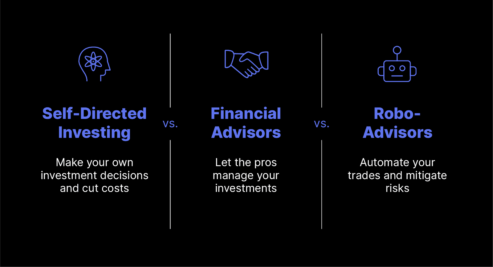

## Table of Contents

## What is a robo-advisor?

A robo-advisor is a type of automated financial service that uses computer algorithms to manage your investments. Instead of working with a human financial advisor, you tell the robo-advisor about your financial goals and how much risk you're willing to take. Then, the robo-advisor creates and manages a portfolio for you, usually made up of low-cost investments like ETFs (exchange-traded funds).

Robo-advisors are popular because they are often cheaper than traditional financial advisors. They charge lower fees because they don't need to pay for human advisors. This makes them a good choice for people who want to invest but don't have a lot of money to start with. Plus, they are easy to use, usually through a website or an app, so you can check on your investments anytime you want.

## What is self-directed investing?

Self-directed investing means you manage your own investments without help from a financial advisor. You decide which stocks, bonds, or funds to buy and sell, and you do all the research yourself. This approach gives you complete control over your money and how it's invested. It's like being your own boss in the world of investing.

It can be a good choice if you like learning about the stock market and enjoy making your own decisions. However, it also means you need to spend time keeping up with market news and understanding how different investments work. If you make a wrong choice, it's on you, so it's important to be careful and do your homework.

## How do robo-advisors and self-directed investing differ in terms of cost?

Robo-advisors usually have lower costs than self-directed investing. They charge a small fee, often around 0.25% to 0.50% of the money you invest each year. This fee covers the cost of managing your investments automatically. Since robo-advisors use computers to do the work, they don't need to pay for human advisors, which helps keep their fees low.

Self-directed investing can be a bit more expensive. You might need to pay trading fees every time you buy or sell stocks or funds. These fees can add up, especially if you trade a lot. Some platforms charge no trading fees, but you might still have to pay other costs, like account maintenance fees. Overall, the cost of self-directed investing depends on how often you trade and which platform you use.

## What level of control do investors have with robo-advisors versus self-directed investing?

With robo-advisors, you don't have as much control over your investments. You tell the robo-advisor what you want to achieve and how much risk you're okay with, and then it picks the investments for you. You can't choose specific stocks or funds yourself. If you want to change something, you have to do it within the options the robo-advisor gives you. It's like letting a computer do the driving, but you can still tell it where you want to go.

With self-directed investing, you are in the driver's seat. You get to pick every single investment yourself. You decide when to buy or sell stocks, bonds, or funds. If you want to change your investments, you can do it anytime you want. This gives you a lot of control, but it also means you need to know what you're doing and be ready to make all the decisions yourself. It's like driving your own car—you choose the route and can stop wherever you want.

## How does the ease of use compare between robo-advisors and self-directed investing?

Robo-advisors are really easy to use. You just answer some questions about your money goals and how much risk you want to take. Then, the robo-advisor does the rest. It picks your investments and keeps an eye on them for you. You can check everything on a website or an app, and it's simple to understand. It's like having a helper that does all the hard work for you.

Self-directed investing can be a bit harder to use. You have to learn about different investments and decide what to buy or sell. You need to use a website or an app to do this, and it can take some time to figure out. If you're new to investing, it might feel confusing at first. But if you like being in charge and making your own choices, you might enjoy it once you get the hang of it.

## What are the typical investment options available through robo-advisors compared to self-directed investing?

Robo-advisors usually stick to simple, low-cost investments like ETFs (exchange-traded funds) and sometimes mutual funds. They pick these investments for you based on what you tell them you want. You won't find individual stocks or risky investments with robo-advisors because they aim to keep things safe and easy for everyone. It's like they give you a menu of safe choices and you can't order off-menu.

With self-directed investing, you can choose from a lot more options. You can buy individual stocks, bonds, ETFs, mutual funds, and even things like options or cryptocurrencies if the platform allows it. It's like a big store where you can pick anything you want. But, you have to do all the research yourself to figure out what to buy and when to sell. This gives you more freedom, but it also means you need to know what you're doing to make good choices.

## How do the potential returns differ between using a robo-advisor and self-directed investing?

The potential returns from using a robo-advisor are usually steady but not super high. Robo-advisors aim for safe and steady growth over time. They invest your money in a mix of ETFs and sometimes mutual funds, which are designed to be less risky. This means you might not make a ton of money really fast, but you also won't lose a lot if the market goes down. It's like taking a slow and steady walk instead of sprinting.

With self-directed investing, the potential returns can be higher, but so can the risks. If you pick the right stocks or investments at the right time, you could make a lot more money than with a robo-advisor. But, if you make bad choices, you could lose money too. It's all up to you, so it's like playing a game where you can win big or lose big. You need to know a lot about investing to do well with self-directed investing.

## What kind of tax strategies can be implemented with robo-advisors versus self-directed investing?

With robo-advisors, tax strategies are pretty simple and automatic. They often use a method called tax-loss harvesting, where they sell investments that have lost value to offset the taxes you owe on your gains. This can help you save money on taxes without you having to do anything. Robo-advisors keep an eye on your account and do this for you, so it's easy and hands-off. But, because they use a set plan for everyone, you might not get the most tailored tax strategy for your specific situation.

With self-directed investing, you have more control over your tax strategies. You can decide when to buy and sell investments to take advantage of tax rules. For example, you can choose to hold onto investments for more than a year to get a lower tax rate on long-term capital gains. You can also use tax-loss harvesting yourself, but you need to keep track of everything and know the tax laws. This gives you more ways to save on taxes, but it also means you have to do more work and understand the tax rules better.

## How do robo-advisors and self-directed investing handle risk management?

Robo-advisors handle risk management by spreading your money across different types of investments. They use a mix of ETFs and sometimes mutual funds to keep things balanced. When you set up your account, you tell the robo-advisor how much risk you're okay with. Then, it picks investments that fit that level of risk. If the market changes, the robo-advisor will automatically adjust your investments to keep them in line with your risk level. It's like having a safety net that keeps your money safe without you having to do anything.

With self-directed investing, you manage the risk yourself. You decide which investments to buy and sell, and you have to keep an eye on how risky they are. You can spread your money across different investments to lower your risk, but you need to do all the work. If you want to change how much risk you're taking, you have to make those changes yourself. It gives you more control, but it also means you have to be careful and know what you're doing to keep your money safe.

## What are the educational resources and support provided by robo-advisors compared to self-directed investing platforms?

Robo-advisors usually have some educational resources, but they aren't as detailed as what you might find on self-directed investing platforms. They might offer basic articles or guides about investing and how their service works. Some robo-advisors also have customer support you can reach out to if you have questions. But, since robo-advisors are all about making things easy and automatic, they don't focus as much on teaching you how to invest on your own.

Self-directed investing platforms often have a lot more educational resources. They might offer videos, webinars, articles, and even courses about different kinds of investments and how to pick them. These platforms want you to learn how to invest by yourself, so they give you a lot of tools to help you do that. They also usually have customer support teams that can answer your questions, but you'll need to use these resources more actively to get the most out of them.

## How do the performance histories of robo-advisors stack up against self-directed investing?

Robo-advisors have a pretty good track record for steady growth. They usually do well because they spread your money across a lot of different investments to keep things safe. Studies show that robo-advisors often beat the average investor who doesn't have a plan. But, they might not make as much money as someone who knows a lot about investing and picks the right stocks at the right time.

With self-directed investing, your performance can be all over the place. If you're good at picking investments, you might make a lot more money than with a robo-advisor. But, if you make bad choices, you could lose money too. It's hard to say how self-directed investing will do because it depends so much on what you do. Overall, self-directed investing can be riskier but also has the potential for higher rewards if you know what you're doing.

## What advanced features are available for expert investors in robo-advisors versus self-directed investing platforms?

Robo-advisors usually don't have a lot of advanced features for expert investors. They focus on making things easy and automatic for everyone. But, some robo-advisors let you add a bit more control, like choosing from a few different investment options or tweaking your risk level. If you're an expert investor, you might feel a bit limited because you can't pick individual stocks or use complex trading strategies. Robo-advisors are more about keeping things simple and safe, so they might not be the best choice if you want to use advanced investing techniques.

Self-directed investing platforms, on the other hand, have a lot more advanced features for expert investors. You can trade individual stocks, use options, and even invest in things like cryptocurrencies if the platform allows it. These platforms often have tools like advanced charting, real-time market data, and the ability to set up complex trading strategies. If you're an expert investor, you'll find a lot more options to use your skills and try to make more money. But, you have to know what you're doing because these advanced features can be risky if you don't use them right.

## References & Further Reading

[1]: Ross, S. A., Westerfield, R. W., & Jaffe, J. (2008). ["Corporate Finance"](https://www.amazon.com/Corporate-Modigliani-Professor-Financial-Economics/dp/1259918947). McGraw-Hill Education.

[2]: Lopez de Prado, M. (2018). ["Advances in Financial Machine Learning"](https://www.amazon.com/Advances-Financial-Machine-Learning-Marcos/dp/1119482089). Wiley.

[3]: Chan, E. (2009). ["Quantitative Trading: How to Build Your Own Algorithmic Trading Business"](https://github.com/ftvision/quant_trading_echan_book). Wiley.

[4]: Aronson, D. R. (2007). ["Evidence-Based Technical Analysis: Applying the Scientific Method and Statistical Inference to Trading Signals"](https://www.amazon.com/Evidence-Based-Technical-Analysis-Scientific-Statistical/dp/0470008741). John Wiley & Sons.

[5]: Jansen, S. (2020). ["Machine Learning for Algorithmic Trading: Second Edition"](https://www.amazon.com/Machine-Learning-Algorithmic-Trading-alternative-ebook/dp/B08D9SP6MB). Packt Publishing.