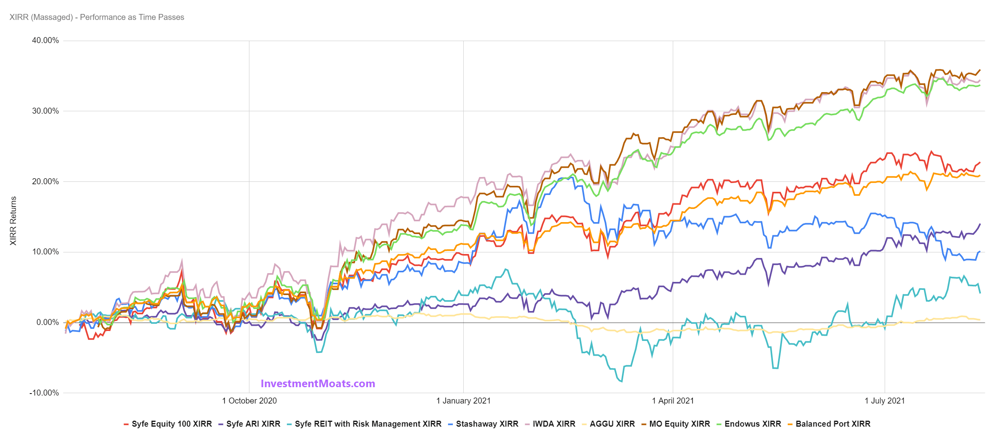

## Table of Contents

## What is a robo-advisor?

A robo-advisor is a type of online platform that helps people manage their money and investments. It uses computer programs to automatically choose and manage a person's investments based on their goals and how much risk they are willing to take. This makes it easier for people who don't have a lot of time or knowledge about investing to still grow their money.

Robo-advisors are popular because they are usually cheaper than working with a human financial advisor. They charge lower fees because they don't need as many people to run the service. This means more of your money can stay invested and potentially grow over time. However, robo-advisors might not be able to give the same personal touch and detailed advice that a human advisor can provide.

## What is the S&P 500?

The S&P 500 is a very important stock market index in the United States. It includes the 500 largest publicly traded companies in the country. These companies come from different industries, like technology, healthcare, and finance. The S&P 500 is used to show how well the overall U.S. stock market is doing. When people say "the market went up," they often mean the S&P 500 went up.

The value of the S&P 500 is calculated by looking at the total value of all the stocks in the index. This total value is then divided by a special number to make sure the index stays accurate even when companies are added or removed. Many investors use the S&P 500 as a benchmark to see if their own investments are doing well. If their investments are doing better than the S&P 500, they might be happy with their choices. If not, they might think about changing their investment strategy.

## How do robo-advisors invest your money?

Robo-advisors invest your money by using computer programs to pick and manage your investments. They start by asking you questions about your goals, like if you want to save for retirement or buy a house, and how much risk you are okay with taking. Based on your answers, the robo-advisor creates a plan that usually includes a mix of different investments like stocks, bonds, and maybe even some funds that follow the stock market. This mix is called a portfolio, and it's designed to help you reach your goals while keeping your money safe.

Once your portfolio is set up, the robo-advisor keeps an eye on it all the time. If the stock market goes up or down a lot, the robo-advisor might make changes to your investments to keep things balanced. This is called rebalancing. They also might use something called tax-loss harvesting, which can help you save money on taxes. All these things happen automatically, so you don't have to do much work. It's like having a smart helper who takes care of your money for you.

## What are the typical fees associated with robo-advisors?

Robo-advisors usually charge a fee that is a small percentage of the money you have invested with them. This fee is often between 0.25% and 0.50% per year. So, if you have $10,000 invested, you might pay between $25 and $50 a year. This is much lower than what you might pay a human financial advisor, who might charge 1% or more of your money each year.

Besides the robo-advisor's fee, you might also have to pay other costs. These can include fees for the funds that the robo-advisor invests your money in, like ETFs or mutual funds. These fees are usually very small, often less than 0.10% per year. All together, the total fees you pay to use a robo-advisor and invest in funds can be around 0.35% to 0.60% per year. This is still a good deal for many people who want an easy way to invest their money without spending a lot on fees.

## How has the S&P 500 performed historically?

The S&P 500 has had a good track record over the years. If you look at long periods of time, like 20 or 30 years, the S&P 500 usually grows a lot. On average, it goes up about 10% each year. But this doesn't mean it goes up every year. Some years, it can go down a lot, like during big economic problems. For example, in 2008, the S&P 500 lost about 37% of its value because of the financial crisis. But after those bad years, it usually comes back and keeps growing over time.

Even though the S&P 500 can be up and down in the short term, it has been a good place to invest money for the long term. If you had put $10,000 into the S&P 500 at the start of 1990 and left it there until the end of 2020, your money would have grown to around $100,000. This shows how powerful it can be to stay invested in the S&P 500 over many years. It's a good reminder that while the stock market can be scary at times, it has a history of rewarding people who are patient and keep their money invested for the long haul.

## What are the advantages of using a robo-advisor?

One big advantage of using a robo-advisor is that it's easy and cheap. You don't need to know a lot about investing because the robo-advisor does all the hard work for you. It asks you simple questions about what you want to do with your money and how much risk you can handle. Then, it picks the right investments for you. Plus, robo-advisors usually charge much less than human advisors. This means you get to keep more of your money, which can grow over time.

Another advantage is that robo-advisors are always watching your investments. They make sure your money stays balanced even when the stock market goes up and down. This is called rebalancing, and it helps keep your investments in line with your goals. Robo-advisors also use smart tricks like tax-loss harvesting to help you save money on taxes. So, even though you're not doing much work, your money is being taken care of in a smart way.

## What are the risks of investing in the S&P 500?

Investing in the S&P 500 can be risky because the stock market can go up and down a lot. Sometimes, the S&P 500 can lose a big part of its value in a short time, like during a financial crisis. If you need your money soon, you might have to sell your investments when they're worth less than when you bought them. This means you could lose money. It's important to remember that while the S&P 500 usually grows over the long term, it can be scary to see your money go down in the short term.

Another risk is that the S&P 500 might not do as well as other investments. Even though it's a good way to invest in a lot of big companies at once, there might be other places to put your money that could grow faster. Also, the S&P 500 is mostly made up of U.S. companies, so if the U.S. economy does badly, it could hurt your investments. It's a good idea to think about what you want from your investments and how much risk you can handle before you decide to put your money in the S&P 500.

## How do the returns of robo-advisors compare to the S&P 500 over the last 5 years?

Over the last 5 years, robo-advisors have generally done well, but their returns can vary depending on how they invest your money. Most robo-advisors create a mix of investments, like stocks and bonds, to match what you want and how much risk you're okay with. This mix often includes some investments in the S&P 500. Because of this, the returns from robo-advisors can be similar to the S&P 500 if they have a lot of their money in stocks, but they might be a bit lower if they also invest in safer things like bonds.

The S&P 500 has had an average yearly return of around 10% over the last 5 years. Robo-advisors that focus more on stocks might come close to this number, but they usually don't beat it by a lot because they also have to pay fees. If a robo-advisor charges 0.25% to 0.50% in fees each year, that can make their returns a bit lower than the S&P 500. But robo-advisors can still be a good choice because they help you invest without having to do a lot of work yourself, and they keep your money safe by spreading it out in different places.

## Can robo-advisors beat the market, and if so, how?

Robo-advisors can sometimes beat the market, but it's not easy. They use computer programs to pick and manage your investments. These programs look at a lot of information to try to find the best places to put your money. If the robo-advisor is really good at [picking](/wiki/asset-class-picking) investments and making smart changes to your portfolio, it might do better than the market. But this doesn't happen all the time because the market can be hard to predict.

Most of the time, robo-advisors don't beat the market by a lot. They usually try to match the market's performance while keeping your money safe. They do this by spreading your money across different types of investments, like stocks and bonds. This way, if one part of the market goes down, the other parts might help keep your money from losing too much value. So, while robo-advisors can sometimes do better than the market, their main goal is to help you grow your money in a safe and easy way.

## What role does diversification play in the performance of robo-advisors versus the S&P 500?

Diversification is really important for robo-advisors. It means spreading your money across different types of investments, like stocks, bonds, and maybe even some funds that follow the stock market. This helps keep your money safe because if one type of investment goes down, the others might still do okay. Robo-advisors use diversification to make sure your money is not all in one place. This is different from the S&P 500, which is just one big group of stocks. So, while the S&P 500 might go up a lot, it can also go down a lot. But a robo-advisor's mix of investments might not go up as much, but it also might not go down as much.

Because of diversification, robo-advisors might not beat the S&P 500 when the market is doing really well. But they can help protect your money better when the market goes down. This can be a good thing if you don't like taking big risks with your money. So, while the S&P 500 might give you higher returns sometimes, a robo-advisor's diversified approach can make your investments more stable over time. This balance can be really helpful for people who want to grow their money without losing sleep over big ups and downs in the market.

## How do tax strategies implemented by robo-advisors impact their performance relative to the S&P 500?

Robo-advisors use a smart trick called tax-loss harvesting to help you save money on taxes. This means they sell investments that have gone down in value and buy similar ones. This can lower the amount of taxes you have to pay on your investments. Because of this, robo-advisors might do better than the S&P 500 after taxes, even if their returns before taxes are a bit lower. The S&P 500 doesn't do anything special to help you with taxes, so you might end up paying more on your gains.

However, tax-loss harvesting doesn't always make a huge difference. It depends on how much you invest and what your tax situation is. If you don't have a big tax bill, the benefits might be small. Also, the fees that robo-advisors charge can eat into your returns. So, even with tax strategies, robo-advisors might not always beat the S&P 500. But for people who care a lot about saving on taxes, using a robo-advisor can still be a good choice because it can help keep more money in your pocket over time.

## What advanced metrics should investors use to compare the performance of robo-advisors and the S&P 500?

When comparing the performance of robo-advisors and the S&P 500, investors should look at something called the Sharpe Ratio. This metric tells you how much return you get for the risk you take. A higher Sharpe Ratio means you're getting better returns for the amount of risk you're taking. Robo-advisors often have a mix of investments, so their Sharpe Ratio might be different from the S&P 500's. If a robo-advisor has a higher Sharpe Ratio than the S&P 500, it means it's doing a better job at balancing risk and reward.

Another important metric is the standard deviation, which shows how much the returns go up and down. The S&P 500 can have big ups and downs, so its standard deviation might be higher than a robo-advisor's. Robo-advisors spread your money across different types of investments, which can make their returns more stable. If you want to see how steady your returns are, comparing the standard deviation of a robo-advisor to the S&P 500 can help you decide which one might be better for you.

Lastly, you might want to look at the alpha of a robo-advisor. Alpha measures how much better or worse an investment does compared to a benchmark like the S&P 500. If a robo-advisor has a positive alpha, it means it's doing better than the S&P 500 after adjusting for risk. This can show you if the robo-advisor is adding value beyond just following the market. By looking at these metrics, you can get a clearer picture of how a robo-advisor stacks up against the S&P 500.

## What is the S&P 500?

The S&P 500, short for the Standard & Poor's 500, is a stock market index that tracks the performance of 500 large-cap publicly traded companies in the United States. It is widely regarded as one of the best representations of the U.S. stock market and is used by investors as a benchmark for gauging the overall health and performance of the market. The index covers a broad spectrum of industries, thereby offering a diverse snapshot of the U.S. economy.

The S&P 500's construction is characterized by a market-capitalization-weighted methodology. This means that the weight of each company in the index is proportional to its market capitalization, calculated by multiplying the company’s stock price by its total number of outstanding shares:

$$
\text{Weight of Company} = \frac{\text{Market Capitalization of Company}}{\sum \text{All Market Capitalizations in the Index}}
$$

This method grants larger firms a more significant impact on the index’s overall performance, skewing it towards companies with massive market caps such as those from the technology, healthcare, and financial sectors. Consequently, movements in the stock prices of major companies like Apple, Microsoft, and Amazon can have a substantial influence on the index's direction.

The S&P 500 is distinct from other indices in its comprehensive inclusion criteria, which demand that listed companies meet specific market capitalization thresholds, have their headquarters in the U.S., and show a record of profitability. This meticulous selection process ensures that only stable and mature companies are included, which collectively represent over 80% of the U.S. equity market by capitalization [1].

Because of its extensive coverage and market influence, the S&P 500 is critical to institutional and individual investors. It often serves as a benchmark to compare mutual funds, ETFs, and individual investment portfolios, enabling investors to assess their investment performance against the market average.

---

**References:**

1. Standard & Poor's Financial Services LLC. (n.d.). *S&P 500*. [Link to source if applicable]

## References & Further Reading

[1]: Malkiel, B. G. (2015). ["A Random Walk Down Wall Street: The Time-Tested Strategy for Successful Investing"](https://www.tandfonline.com/doi/full/10.1080/14697688.2016.1256598). W.W. Norton & Company.

[2]: Piketty, T. (2014). ["Capital in the Twenty-First Century"](https://www.jstor.org/stable/j.ctt6wpqbc). Harvard University Press.

[3]: Sharpe, W. F. (1994). ["The Sharpe Ratio"](https://web.stanford.edu/~wfsharpe/art/sr/SR.htm). Journal of Portfolio Management, 21(1), 49-58.

[4]: Markowitz, H. (1952). ["Portfolio Selection"](https://onlinelibrary.wiley.com/doi/abs/10.1111/j.1540-6261.1952.tb01525.x). The Journal of Finance, 7(1), 77-91. 

[5]: Stein, B. (2006). ["The Real Cost of Robo-advisors"](https://www.sciencedirect.com/science/article/pii/S1544612324001491) Forbes. 

[6]: Statman, M. (2010). ["The 10 Commandments of Buffetology"](https://www.bogleheads.org/forum/viewtopic.php?p=8140434). Financial Analysts Journal, 66(5), 15-20. 

[7]: Vanguard Group. (2020). ["Investing with Vanguard: Diversification Strategies"](https://corporate.vanguard.com/content/corporatesite/us/en/corp/who-we-are/pressroom/How-America-Invests-20-12-3-20.html/)