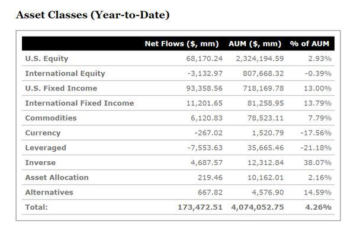

The integration of technology into the financial sector has significantly reshaped the investing landscape, with robo-advisors emerging as a pivotal innovation. These digital platforms leverage advanced algorithms to provide automated investment services, offering a modern alternative to traditional asset management. This article aims to compare the financial performance of robo-advisors with established benchmarks like the S&P 500, a key market index comprising 500 large capitalization U.S. companies.

In recent years, robo-advisors have gained prominence due to their potential for optimizing investment strategies through automation and data-driven decisions. They promise to streamline portfolio management by maintaining alignment with individual financial goals and risk tolerance while potentially enhancing returns through diversification. However, a critical question persists: can these automated systems consistently outperform the market indices that have traditionally been considered benchmarks of investment success?

Understanding these dynamics is essential for investors who seek to refine their asset management strategies. By examining the mechanisms behind robo-advisors, their advantages, and their comparative performance against the S&P 500, investors can make informed decisions about integrating these tools into their financial portfolios. As the financial landscape continues to evolve, determining the role of technology-driven solutions in achieving investment goals becomes increasingly important.

## Table of Contents

## What are Robo-Advisors?

Robo-advisors are digital platforms designed to offer automated investment management services through sophisticated algorithms. These platforms streamline the investment process by collecting crucial data from investors, such as their financial goals and risk tolerance. This information is used to customize investment portfolios tailored to each individual's needs.

The core functioning of robo-advisors involves utilizing algorithms that assess and manage investments with minimal human intervention. These algorithms are programmed to analyze vast data arrays, ensuring that portfolio management decisions are both informed and efficient. By automating the investment process, robo-advisors can offer a cost-effective alternative compared to traditional financial advisors.

Typically, robo-advisors diversify investments across a range of assets, including stocks, bonds, and exchange-traded funds (ETFs). These assets are selected to create a balanced portfolio aimed at maximizing returns while managing risk. The use of index ETFs, in particular, allows for broad market exposure often at lower expense ratios, contributing to the overall efficiency of the robo-advisor model.

The growing popularity of robo-advisors can be attributed to their ability to offer personalized investment strategies with the benefits of automation and reduced fees compared to conventional asset management services. As a result, they have become a viable option for a wide array of investors, from beginners to experienced individuals, seeking to optimize their investment portfolios in an increasingly digital financial landscape.

## Mechanism of Robo-Advisors

Robo-advisors leverage sophisticated algorithms to streamline various aspects of investment management, providing automated services that include asset allocation, portfolio rebalancing, and tax optimization. These digital platforms are designed to manage investment portfolios with minimal human intervention. 

Asset allocation is the process of distributing investments across various asset classes, such as stocks, bonds, and index funds. Robo-advisors use algorithms that consider an investor's financial goals, time horizon, and risk tolerance to determine an optimal asset mix. This tailored approach aims to maximize returns while minimizing risk, based on modern portfolio theory which advocates for diversification to achieve efficient portfolios.

The efficiency of robo-advisors is further enhanced by their ability to monitor portfolio performance and market conditions continuously. This capability allows them to automatically adjust portfolios to respond to market changes. For instance, if a particular asset class underperforms, the algorithm can decrease its allocation in favor of better-performing assets. This ongoing process helps ensure the portfolio remains aligned with the investor’s objectives.

A key feature of robo-advisors is their automated rebalancing function. Over time, the performance of individual assets and asset classes can cause a portfolio to drift away from its original allocation. Robo-advisors can rebalance portfolios at regular intervals or when market fluctuations exceed certain thresholds. This rebalancing process involves selling overrepresented assets and purchasing underrepresented ones, thereby realigning the portfolio with the target asset allocation.

Furthermore, some robo-advisors incorporate tax optimization strategies such as tax-loss harvesting. This involves selling securities at a loss to offset capital gains tax liabilities, potentially enhancing after-tax returns. Algorithmic systems can identify and execute these opportunities automatically, potentially increasing the investor's net returns.

Through these mechanisms, robo-advisors offer a convenient and efficient solution for managing investments, appealing to a broad spectrum of investors seeking a low-cost, hands-off investment approach.

## What is the S&P 500?

The S&P 500, short for the Standard & Poor's 500, is a stock market index that tracks the performance of 500 large-cap publicly traded companies in the United States. It is widely regarded as one of the best representations of the U.S. stock market and is used by investors as a benchmark for gauging the overall health and performance of the market. The index covers a broad spectrum of industries, thereby offering a diverse snapshot of the U.S. economy.

The S&P 500's construction is characterized by a market-capitalization-weighted methodology. This means that the weight of each company in the index is proportional to its market capitalization, calculated by multiplying the company’s stock price by its total number of outstanding shares:

$$
\text{Weight of Company} = \frac{\text{Market Capitalization of Company}}{\sum \text{All Market Capitalizations in the Index}}
$$

This method grants larger firms a more significant impact on the index’s overall performance, skewing it towards companies with massive market caps such as those from the technology, healthcare, and financial sectors. Consequently, movements in the stock prices of major companies like Apple, Microsoft, and Amazon can have a substantial influence on the index's direction.

The S&P 500 is distinct from other indices in its comprehensive inclusion criteria, which demand that listed companies meet specific market capitalization thresholds, have their headquarters in the U.S., and show a record of profitability. This meticulous selection process ensures that only stable and mature companies are included, which collectively represent over 80% of the U.S. equity market by capitalization [1].

Because of its extensive coverage and market influence, the S&P 500 is critical to institutional and individual investors. It often serves as a benchmark to compare mutual funds, ETFs, and individual investment portfolios, enabling investors to assess their investment performance against the market average.

---

**References:**

1. Standard & Poor's Financial Services LLC. (n.d.). *S&P 500*. [Link to source if applicable]

## Factors Affecting Robo-Advisor Performance

Robo-advisor performance is influenced by several critical factors, with portfolio composition taking a central role. The diversification across asset classes, such as stocks, bonds, and ETFs, is essential in mitigating risks and enhancing returns. By spreading investments across various sectors and markets, robo-advisors aim to achieve a balance that can withstand market [volatility](/wiki/volatility-trading-strategies).

The choice of Exchange-Traded Funds (ETFs) significantly impacts performance. Robo-advisors typically rely on ETFs due to their cost-effectiveness and diversified nature. Selecting the right ETFs involves considering factors like expense ratios, [liquidity](/wiki/liquidity-risk-premium), and tracking error, which may influence the overall cost and efficiency of the investment strategy.

Rebalancing strategy is another crucial [factor](/wiki/factor-investing). Rebalancing involves adjusting the portfolio periodically to maintain the desired asset allocation, in response to market movements or changes in financial goals and risk tolerance. This process ensures that volatility levels are controlled, and the investment stays aligned with the investor's profile. Automated rebalancing, a fundamental robo-advisor feature, helps maintain this balance without emotional biases.

Management fees are a significant consideration in evaluating robo-advisor performance. While traditionally lower than human financial advisors, these fees can still erode returns over time. Typically, robo-advisor fees range from 0.2% to 0.5% of assets under management, which contrasts with traditional advisors who might charge around 1% or more.

The broader diversification offered by robo-advisors, compared to direct investments in the S&P 500, presents another distinct advantage. While the S&P 500 includes only large-cap U.S. equities, robo-advisors usually incorporate a mix of asset classes, regions, and market capitalizations. This comprehensive diversification can potentially smooth returns across different economic cycles and reduce reliance on a single market segment for performance.

In summary, the performance of robo-advisors hinges on careful portfolio composition, strategic choices about ETFs, efficient rebalancing tactics, and competitive management fees. These elements collectively determine the efficacy of robo-advisors in catering to investor requirements and optimizing financial outcomes.

## Factors Affecting the S&P 500’s Performance

The S&P 500's performance is influenced by a variety of factors, including economic health, corporate earnings, and geopolitical events. Economic health is a fundamental driver, as it directly impacts the financial environment in which companies operate. As the economy expands, consumer confidence tends to rise, leading to increased spending and investment, which can boost corporate earnings and, subsequently, stock prices. Conversely, during economic downturns, reduced consumer spending and investment can negatively affect earnings and stock performance.

Corporate earnings are another critical component affecting the S&P 500. Companies with strong earnings typically see their stock prices rise, contributing positively to the index. Quarterly earnings reports can lead to significant fluctuations in the index, especially when companies surpass or fall short of market expectations. Since the S&P 500 is composed of large-cap companies, their earnings collectively have a substantial impact on the index's trajectory.

Geopolitical events can also significantly influence the S&P 500. Events such as elections, trade agreements, conflicts, and natural disasters can create uncertainty, which often leads to volatility in the financial markets. For example, trade tensions between major economies can disrupt supply chains, affecting corporate earnings and stock prices.

The market-capitalization-weighted nature of the S&P 500 means that larger companies have a more significant influence on the index's overall performance. This weighting system gives companies with higher market capitalization, such as Apple, Microsoft, and Amazon, a greater impact on the index. For instance, if a major company within the index announces groundbreaking technological advancements or unexpected earnings results, it can cause the entire index to move.

Sector-specific developments also play a role in the performance of individual stocks and thereby influence the S&P 500. Changes within a particular industry—such as technological innovation, regulatory changes, or shifts in consumer preferences—can significantly affect the stocks within that sector. For example, a surge in demand for renewable energy might boost the stock prices of companies in the clean energy sector, impacting the index if those companies are represented within it.

In summary, the performance of the S&P 500 is a complex interplay of economic indicators, corporate performance, geopolitical factors, and sectoral developments, all of which can shift sentiment and drive market movements.

## Robo-Advisor vs. S&P 500

Robo-advisors represent a significant evolution in investment management by offering a more hands-off and automated approach compared to traditional investment in the S&P 500. These digital platforms leverage algorithms to create diversified investment portfolios tailored to the individual's financial goals and risk tolerance, beyond just large-cap U.S. stocks. The diversification offered by robo-advisors often includes a wider array of asset classes such as bonds and international equities, which is in contrast to the S&P 500's targeted exposure strictly to large-cap U.S. companies.

An investment in the S&P 500 index provides a focused exposure to 500 of the largest U.S. companies, thereby aligning with investors looking for a concentration in large-cap equities. This investment strategy is straightforward, usually implying lower management fees when compared to actively managed funds or the diversified approaches of robo-advisors.

The choice between leveraging a robo-advisor and investing directly in the S&P 500 largely hinges on the investor's preference for diversification, level of involvement, and acceptance of management fees. Robo-advisors often charge fees that may include portfolio management and rebalancing services, which can appeal to investors seeking minimal personal involvement in day-to-day investment decisions. However, these fees might be higher than the costs associated with passively investing in the S&P 500 index funds or ETFs.

Additionally, robo-advisors’ automation offers consistent portfolio rebalancing, which ensures alignment with an investor’s risk profile and financial objectives over time. For some investors, the diversification strategy and automatic portfolio adjustments offered by robo-advisors can justify the additional fees, especially for those who value a broad asset allocation and wish to remain disengaged from regular investment management.

In conclusion, the decision between using a robo-advisor or investing directly in the S&P 500 depends on an individual investor's priorities in terms of diversification, financial involvement, and cost tolerance. Each approach has its distinctive benefits and should be evaluated in the context of the investor's overall financial strategy.

## Conclusion

Both robo-advisors and the S&P 500 present distinctive advantages and limitations that investors must consider. Robo-advisors provide automated, algorithm-driven asset management services that can offer significant diversification, encompass multiple asset classes, and require minimal investor involvement. These features are particularly appealing to those who prefer a hands-off investment approach or who lack the expertise or time to actively manage their portfolios. However, the choice of robo-advisor can significantly impact performance through variables such as management fees, portfolio composition, and the selection of exchange-traded funds (ETFs).

Conversely, direct investment in the S&P 500 offers concentrated exposure to large-cap U.S. equities, often favored by investors seeking to capitalize on American corporate growth and stability. This index is heavily influenced by the performance of its largest constituents due to its market-cap-weighted structure, which can lead to substantial volatility depending on economic conditions, corporate earnings reports, and geopolitical events.

The decision between utilizing a robo-advisor or investing directly in the S&P 500 ultimately hinges on individual investment objectives, risk tolerance, and preferred level of involvement in the investment process. For instance, an individual with a high risk tolerance and an interest in minimizing fees might opt for direct index investing, whereas someone prioritizing diversification and convenience might choose a robo-advisor. Evaluating personal financial goals, understanding the mechanisms and strategies of both investment options, and considering the associated risks and costs are critical for investors aiming to optimize their portfolio strategies and achieve their financial aspirations.

## References & Further Reading

[1]: Malkiel, B. G. (2015). ["A Random Walk Down Wall Street: The Time-Tested Strategy for Successful Investing"](https://www.tandfonline.com/doi/full/10.1080/14697688.2016.1256598). W.W. Norton & Company.

[2]: Piketty, T. (2014). ["Capital in the Twenty-First Century"](https://www.jstor.org/stable/j.ctt6wpqbc). Harvard University Press.

[3]: Sharpe, W. F. (1994). ["The Sharpe Ratio"](https://web.stanford.edu/~wfsharpe/art/sr/SR.htm). Journal of Portfolio Management, 21(1), 49-58.

[4]: Markowitz, H. (1952). ["Portfolio Selection"](https://onlinelibrary.wiley.com/doi/abs/10.1111/j.1540-6261.1952.tb01525.x). The Journal of Finance, 7(1), 77-91. 

[5]: Stein, B. (2006). ["The Real Cost of Robo-advisors"](https://www.sciencedirect.com/science/article/pii/S1544612324001491) Forbes. 

[6]: Statman, M. (2010). ["The 10 Commandments of Buffetology"](https://www.bogleheads.org/forum/viewtopic.php?p=8140434). Financial Analysts Journal, 66(5), 15-20. 

[7]: Vanguard Group. (2020). ["Investing with Vanguard: Diversification Strategies"](https://corporate.vanguard.com/content/corporatesite/us/en/corp/who-we-are/pressroom/How-America-Invests-20-12-3-20.html/)