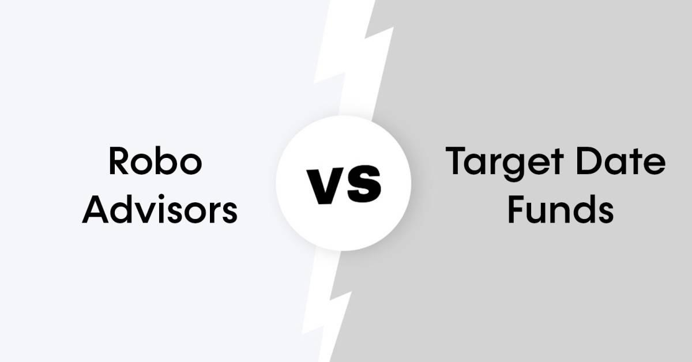

## Table of Contents

## What are robo-advisors?

Robo-advisors are a type of automated financial service that helps people manage their investments. They use computer algorithms to create and manage a portfolio of investments based on the user's goals, risk tolerance, and other factors. This means that instead of talking to a human financial advisor, you can use a robo-advisor to get personalized investment advice and management at a lower cost.

These services are popular because they make investing easier and more accessible for people who might not have a lot of money to invest or who don't want to spend time learning about the stock market. Robo-advisors often have lower fees than traditional financial advisors, and they can automatically adjust your investments to keep them in line with your goals. This makes them a good option for people who want a simple, hands-off way to grow their money.

## What are target date funds?

Target date funds are investment funds that automatically adjust their mix of investments over time. They are designed to help people save for retirement without having to make a lot of decisions about where to invest their money. When you pick a target date fund, you choose one based on the year you plan to retire. The fund starts out with more risky investments like stocks when you are young and far from retirement. As you get closer to your retirement date, the fund gradually shifts to safer investments like bonds.

These funds are popular because they are easy to use and require little effort to manage. They are a good choice for people who want a simple way to save for the future. However, it's important to remember that not all target date funds are the same. Some might be more aggressive or conservative than others, so it's a good idea to look at the details of the fund before you invest. This way, you can make sure it matches your comfort with risk and your retirement goals.

## How do robo-advisors work?

Robo-advisors are like smart helpers for your money. When you start using one, you tell it about your goals, how much risk you're okay with, and how long you plan to invest. The robo-advisor then uses a computer program to pick a mix of investments, like stocks and bonds, that fit what you told it. It's like having a personal money coach, but instead of a person, it's a computer doing the work.

After setting up your account, the robo-advisor keeps an eye on your investments. If the market changes or if it's time to make your investments safer or riskier, the robo-advisor will make those changes for you. This way, you don't have to worry about keeping track of everything yourself. It's all done automatically, which makes it easy and can save you money compared to hiring a human advisor.

## How do target date funds work?

Target date funds are like a set-it-and-forget-it way to save for retirement. You pick a fund based on the year you want to retire, like 2050 if you'll retire around that time. When you're young and far from retiring, the fund will have more risky investments like stocks. This is because you have time to ride out the ups and downs of the market. As you get closer to your retirement date, the fund slowly changes to have more safe investments like bonds. This makes your savings less risky as you near the time you'll need the money.

These funds are easy to use because they do the work for you. You don't need to decide when to move your money from stocks to bonds; the fund does that automatically. But remember, not all target date funds are the same. Some might take more risks than others, so it's good to check the details of the fund to make sure it fits what you're comfortable with. This way, you can feel confident that your savings are growing in a way that matches your retirement plans.

## What are the typical fees associated with robo-advisors?

Robo-advisors usually charge less than human financial advisors. Their fees often come as a percentage of the money you have invested with them. This fee is called an annual management fee, and it's usually between 0.25% and 0.50% of your total investment. So, if you have $10,000 invested, you might pay between $25 and $50 a year.

Besides the management fee, you might also have to pay other costs. These can include fees for the funds the robo-advisor invests in, like ETFs or mutual funds. These extra fees are usually small, around 0.05% to 0.25% a year. It's a good idea to look at all the fees before you start using a robo-advisor, so you know exactly how much it will cost you.

## What are the typical fees associated with target date funds?

Target date funds usually charge fees that are a bit higher than some other types of funds. These fees come in two main parts. The first part is called the expense ratio, which is a yearly fee based on a percentage of your investment. For target date funds, this fee is often around 0.10% to 0.75%. So, if you have $10,000 invested, you might pay between $10 and $75 a year.

The second part of the fees can be costs from the different investments inside the target date fund, like stocks and bonds. These are called underlying fund fees, and they add a bit more to the total cost. Together, these fees can make target date funds a bit more expensive than some other options, but they're still a good choice for people who want an easy way to save for retirement without having to manage their investments themselves.

## How do the investment strategies of robo-advisors compare to those of target date funds?

Robo-advisors and target date funds both help people invest their money, but they do it in different ways. Robo-advisors use a computer program to pick a mix of investments like stocks and bonds based on what you tell them about your goals and how much risk you're okay with. They can change your investments over time to match your needs, and they often look at things like tax savings and special investment strategies to help your money grow. This means robo-advisors can be more personalized and might be better if you want a plan that fits just you.

Target date funds, on the other hand, are simpler. You pick a fund based on when you want to retire, and the fund automatically changes from riskier investments like stocks to safer ones like bonds as you get closer to that date. This makes them easy to use because you don't have to do much after you pick the fund. But, target date funds are less personalized than robo-advisors. They follow a set plan that's the same for everyone with the same retirement date, so they might not fit your exact needs as well as a robo-advisor could.

## What are the potential benefits of using robo-advisors over target date funds?

Robo-advisors can give you a plan that fits you better than target date funds. When you use a robo-advisor, you tell it about your goals, how much risk you're okay with, and other things that matter to you. The robo-advisor then picks investments that match what you said. This means your money is being managed in a way that's just right for you. Robo-advisors can also look at things like taxes and special ways to grow your money, which can help you save more in the long run.

Another good thing about robo-advisors is that they often cost less than target date funds. The fees you pay for a robo-advisor are usually lower, which means more of your money stays in your pocket. Plus, robo-advisors can change your investments more often to match what's happening in the market or your life. This can be better than target date funds, which follow a set plan that doesn't change much even if your needs do. So, if you want a plan that's more personal and might save you money, a robo-advisor could be a better choice.

## What are the potential benefits of using target date funds over robo-advisors?

Target date funds are really easy to use. You just pick the year you want to retire, and the fund does the rest. It starts with more risky investments like stocks when you're young and slowly switches to safer investments like bonds as you get closer to retiring. This means you don't have to think about changing your investments yourself, which can be a big help if you don't want to spend time managing your money. It's like setting your savings on autopilot.

Another good thing about target date funds is that they are often available in retirement plans like 401(k)s. This makes it easy to start saving for retirement without needing to set up a new account or learn how to use a robo-advisor. While target date funds might not be as personalized as robo-advisors, they offer a simple way to grow your money over time without a lot of work. If you want something that's easy to use and doesn't need much attention, target date funds could be the better choice for you.

## How do the performance histories of robo-advisors compare to those of target date funds?

When looking at how robo-advisors and target date funds have done in the past, it's a bit hard to say which one is better because they can be different in how they invest. Robo-advisors try to pick investments that fit what you want and how much risk you're okay with. This means their performance can be different for each person. Some robo-advisors might do better than others because they use different ways to pick investments. But, over time, many robo-advisors have done well, often beating the market a bit because they can change investments to match what's happening.

Target date funds have a simpler way of working. They start with more risky stuff like stocks when you're young and slowly switch to safer things like bonds as you get closer to retiring. Because of this, their performance can be easier to guess. They usually follow the market pretty closely, but they might not do as well as robo-advisors that can change things more often. Still, target date funds have been a good choice for many people because they are easy to use and have done okay over the years.

## What level of customization and control do robo-advisors and target date funds offer to investors?

Robo-advisors give you a lot of control and customization. When you start using one, you tell it about your goals, how much risk you're okay with, and other things that matter to you. The robo-advisor then picks investments that match what you said. This means your money is managed in a way that fits you. You can also change your settings anytime if your goals or how much risk you want changes. So, if you like having a plan that's just for you, robo-advisors are a good choice.

Target date funds are simpler and offer less customization. You pick a fund based on when you want to retire, and it does the rest. The fund starts with more risky investments like stocks when you're young and slowly switches to safer ones like bonds as you get closer to retiring. This means you don't have to do much after you pick the fund. But, because it's a set plan that's the same for everyone with the same retirement date, it might not fit your exact needs as well as a robo-advisor could. If you want something easy that you don't have to think about much, target date funds work well.

## What should an investor consider when choosing between a robo-advisor and a target date fund based on their investment goals and risk tolerance?

When choosing between a robo-advisor and a target date fund, an investor should think about their investment goals and how much risk they're okay with. Robo-advisors can be a good choice if you want a plan that fits you just right. You tell the robo-advisor what you want to achieve and how much risk you're willing to take, and it picks investments that match what you said. This means your money is managed in a way that's personal to you. If your goals or how much risk you want changes, you can easily adjust your settings with a robo-advisor.

Target date funds are simpler and might be better if you want something easy that doesn't need much attention. You pick a fund based on when you want to retire, and it does the rest. The fund starts with more risky investments like stocks when you're young and slowly switches to safer ones like bonds as you get closer to retiring. This makes it easy because you don't have to do much after you pick the fund. But, because it's a set plan that's the same for everyone with the same retirement date, it might not fit your exact needs as well as a robo-advisor could. If you're okay with less customization and want a simple way to save for retirement, target date funds could be the better choice.

## References & Further Reading

[1]: Kirilenko, A., Kyle, A. S., Samadi, M., & Tuzun, T. (2017). ["The Flash Crash: The Impact of High Frequency Trading on an Electronic Market."](https://papers.ssrn.com/sol3/papers.cfm?abstract_id=1686004) *Journal of Finance*.

[2]: ["Advances in Financial Machine Learning"](https://www.amazon.com/Advances-Financial-Machine-Learning-Marcos/dp/1119482089) by Marcos Lopez de Prado.

[3]: ["Evidence-Based Technical Analysis: Applying the Scientific Method and Statistical Inference to Trading Signals"](https://www.amazon.com/Evidence-Based-Technical-Analysis-Scientific-Statistical/dp/0470008741) by David Aronson.

[4]: ["Machine Learning for Algorithmic Trading"](https://github.com/stefan-jansen/machine-learning-for-trading) by Stefan Jansen.

[5]: ["Quantitative Trading: How to Build Your Own Algorithmic Trading Business"](https://www.amazon.com/Quantitative-Trading-Build-Algorithmic-Business/dp/1119800064) by Ernest P. Chan.

[6]: Bogle, J. C. (2016). ["The Little Book of Common Sense Investing: The Only Way to Guarantee Your Fair Share of Stock Market Returns."](https://archive.org/details/littlebookofcomm0000bogl_o5f9) Wiley.

[7]: "Examining the Effects of Robo-Advisors on Investors’ Attitudes and Decisions" by Wei, J. & Simonson, I. (2020), available from SSRN. 

[8]: Geczy, C., & Samonov, M. (2016). ["212 Years of Price Momentum: The World's Longest Backtest: 1801-2012."](https://papers.ssrn.com/sol3/papers.cfm?abstract_id=2292544) *SSRN*.