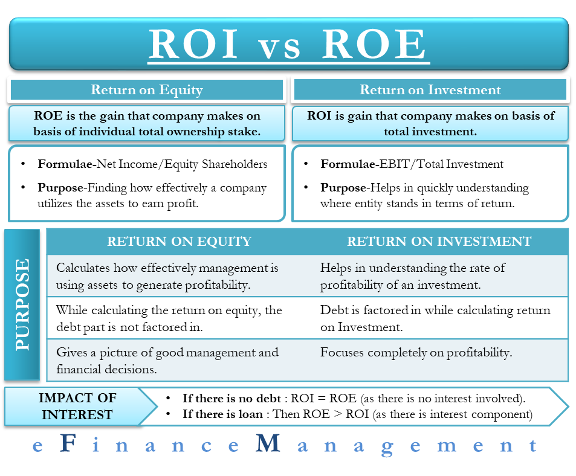

## Table of Contents

## What is ROCE and how is it calculated?

ROCE stands for Return on Capital Employed. It is a financial ratio that shows how well a company is using its capital to generate profits. Think of it as a way to see if a company is making good use of the money it has. It's important for investors because it helps them decide if a company is a good place to put their money.

To calculate ROCE, you take the company's earnings before interest and taxes (EBIT) and divide it by the capital employed. Capital employed is the total amount of money the company uses to run its business, which can be found by subtracting current liabilities from total assets. So, the formula is: ROCE = EBIT / Capital Employed. A higher ROCE means the company is using its capital more efficiently to make profits.

## What is ROI and how is it calculated?

ROI stands for Return on Investment. It's a way to figure out how much money you're making or losing on something you've spent money on. It's like asking, "If I put money into this, how much more money will I get back?" People use ROI to decide if it's worth spending money on something, whether it's a business project, a stock, or even a personal purchase.

To calculate ROI, you take the amount of money you've gained or lost from your investment and divide it by the amount of money you originally spent. Then, you multiply that number by 100 to get a percentage. So, the formula is: ROI = (Profit or Gain from Investment - Cost of Investment) / Cost of Investment x 100. If the ROI is positive, you've made money. If it's negative, you've lost money. A higher ROI means the investment was more successful.

## Why are ROCE and ROI important financial metrics?

ROCE and ROI are important because they help people understand how well their money is being used. ROCE, or Return on Capital Employed, tells you how good a company is at making profits from the money it has. It's like checking if a company is using its money wisely to grow and make more money. This is really helpful for investors who want to know if putting money into a company will be a smart choice. A high ROCE means the company is doing a great job at using its money to make profits.

ROI, or Return on Investment, is also key because it shows you how much money you're making or losing from something you've spent money on. It's a simple way to see if an investment was worth it. Whether you're buying stocks, starting a project, or making a personal purchase, ROI helps you decide if it's a good idea. A positive ROI means you've made money, while a negative ROI means you've lost money. Both ROCE and ROI give you clear numbers that help you make better choices about where to put your money.

## How do ROCE and ROI differ in their focus and application?

ROCE and ROI both help people see how well their money is working, but they focus on different things. ROCE, or Return on Capital Employed, looks at how good a company is at using all its money to make profits. It's like checking if a company is using its money wisely to grow and make more money. This is really helpful for investors who want to know if putting money into a company will be a smart choice. ROCE is often used to compare different companies to see which one is better at making money from the money it has.

ROI, or Return on Investment, is different because it focuses on how much money you make or lose from a specific thing you spent money on. It's like asking, "If I put money into this project or stock, how much more money will I get back?" ROI is used for all kinds of investments, not just companies. It helps people decide if buying something or starting a project is worth it. A positive ROI means you've made money, while a negative ROI means you've lost money. So, while ROCE is about how a company uses its total money, ROI is about the return from a specific investment.

## Can you provide an example of how to calculate ROCE for a company?

Let's say we want to figure out the ROCE for a company called ABC Corp. First, we need to find out the company's earnings before interest and taxes (EBIT). Let's say ABC Corp made $500,000 in EBIT last year. Next, we need to know the capital employed, which is the total amount of money the company uses to run its business. We can find this by looking at the company's balance sheet. If ABC Corp has total assets of $2,000,000 and current liabilities of $500,000, then the capital employed is $2,000,000 - $500,000 = $1,500,000.

Now, we can calculate the ROCE using the formula ROCE = EBIT / Capital Employed. For ABC Corp, that would be $500,000 / $1,500,000 = 0.3333. To turn this into a percentage, we multiply by 100, so ABC Corp's ROCE is 33.33%. This means that for every dollar of capital employed, ABC Corp is making 33.33 cents in profit. A higher ROCE means the company is using its money more efficiently to make profits, so this number can help investors decide if ABC Corp is a good place to put their money.

## Can you provide an example of how to calculate ROI for a specific investment?

Let's say you want to calculate the ROI for buying a used car. You bought the car for $5,000 and after a year, you sold it for $6,000. To find out your ROI, you need to figure out how much money you made or lost. In this case, you made a profit of $6,000 - $5,000 = $1,000. Now, you use the ROI formula: ROI = (Profit or Gain from Investment - Cost of Investment) / Cost of Investment x 100. So, your ROI is ($1,000 / $5,000) x 100 = 20%. This means you made a 20% return on your investment in the used car.

ROI is a helpful way to see if an investment was worth it. In this example, a 20% ROI means that for every dollar you spent on the car, you made an extra 20 cents. If you're thinking about making another investment, you can compare the ROI to see if it's a better or worse choice. A positive ROI like this one shows you made money, which can help you decide where to put your money in the future.

## What are the typical industry benchmarks for ROCE and ROI?

Industry benchmarks for ROCE, or Return on Capital Employed, can vary a lot depending on the type of business. For industries that need a lot of money to operate, like manufacturing or utilities, a good ROCE might be around 10% to 15%. But for businesses that don't need as much money, like tech or service companies, a good ROCE could be higher, maybe 20% or even more. When you're looking at ROCE, it's important to compare it with other companies in the same industry to see if it's doing well.

ROI, or Return on Investment, benchmarks also change a lot depending on what you're investing in. For stocks, a good ROI might be around 7% to 10% per year, which is about what the stock market usually grows. But if you're investing in real estate or starting a business, you might be looking for a higher ROI, like 15% or more, because these investments can be riskier. Just like with ROCE, it's a good idea to compare the ROI of your investment with others in the same area to see if you're getting a good return.

## How can ROCE and ROI be used together to assess a company's performance?

ROCE and ROI can be used together to get a fuller picture of how well a company is doing. ROCE looks at how good a company is at making money from all the money it has. It's like checking if the company is using its money wisely to grow and make more profits. When you look at ROCE, you can see if the company is doing a better job than other companies in the same type of business. A high ROCE means the company is using its money well.

ROI, on the other hand, helps you see how much money you're making or losing from a specific thing you've spent money on. For example, if you bought some of the company's stock, ROI would tell you if that was a good choice. By looking at both ROCE and ROI, you can see not just how the company is using its money overall, but also how well a specific investment in the company is doing. This way, you get a better idea of the company's overall health and whether it's a good place to put your money.

## What are the limitations of using ROCE as a performance metric?

ROCE is a good way to see if a company is using its money well, but it has some problems. One big problem is that ROCE can be hard to compare between companies in different industries. For example, a company that makes cars might need a lot of money to buy machines and factories, so their ROCE might be lower than a company that just sells things online. This doesn't mean the car company is doing a bad job, it just means they need more money to work. Also, ROCE doesn't tell you about the risks the company is taking. A company might have a high ROCE because it's taking big risks, which could be bad in the long run.

Another thing to think about is that ROCE only looks at one part of the company's money, which is the money they use to run the business. It doesn't tell you about other important things like how much the company owes or how much money they have in the bank. So, while ROCE is helpful, it's not the whole story. You need to look at other numbers too, like ROI, to really understand how the company is doing.

## What are the limitations of using ROI as a performance metric?

ROI is a useful way to see how much money you made or lost from an investment, but it has some problems. One big issue is that ROI doesn't think about how long you had your money tied up in the investment. If you made a 20% return on your money in one year, that's pretty good. But if it took ten years to get that 20%, it's not so great. ROI also doesn't tell you about the risks you took to get that return. A high ROI might mean you took a big risk, and that could be bad if things don't go well.

Another problem with ROI is that it can be hard to compare different investments. For example, if you're looking at ROI for stocks, real estate, and starting a business, they all have different risks and time frames. Just looking at ROI might not give you the full picture. Also, ROI doesn't tell you about other important things like how much you had to spend to get that return or if you could have used your money in a better way. So while ROI is helpful, you need to look at other things too to really understand if an investment was worth it.

## How do changes in accounting policies affect ROCE and ROI?

Changes in accounting policies can mess with ROCE and ROI, making them different from what they used to be. For ROCE, if a company changes how it figures out its earnings before interest and taxes (EBIT) or how it counts its total assets and current liabilities, the ROCE number will change. For example, if a company starts using a new way to value its machines and factories, the capital employed might go up or down, which changes the ROCE. This can make it hard to compare the company's performance over time or with other companies if they all use different accounting rules.

ROI can also be affected by changes in accounting policies, especially when it comes to figuring out the profit or cost of an investment. If a company changes how it counts the money it made or spent on an investment, the ROI will be different. For instance, if a company starts using a new way to count the value of its inventory, the profit from selling that inventory might change, which changes the ROI. This means that when looking at ROI, you need to know if the company changed its accounting rules, because it can make the ROI number look better or worse than it really is.

## What advanced analytical techniques can be used to enhance the interpretation of ROCE and ROI?

To get a better understanding of ROCE and ROI, you can use something called trend analysis. This means looking at how these numbers change over time. If you see that a company's ROCE is going up every year, it might mean they're getting better at using their money to make profits. On the other hand, if ROI is going down, it might mean that the investments the company is making are not as good as they used to be. By looking at these trends, you can see if the company is improving or if there are problems that need to be fixed. It's like watching a movie instead of just seeing one scene; you get the whole story.

Another way to make ROCE and ROI more useful is by using something called ratio analysis. This means comparing these numbers to other important numbers about the company. For example, you might look at ROCE along with the company's debt-to-equity ratio to see if they're using a lot of borrowed money to make profits. Or you might look at ROI and the company's cash flow to see if they have enough money to keep making good investments. By looking at these numbers together, you get a fuller picture of how the company is doing. It's like putting together pieces of a puzzle to see the whole picture.

## What is ROI and how can it be understood?

Return on Investment (ROI) is a commonly used financial metric that measures how effectively an investment generates profit relative to its cost. It is calculated using a straightforward formula: 

$$
\text{ROI} = \left(\frac{\text{Net Profit}}{\text{Cost of Investment}}\right) \times 100
$$

This formula yields a percentage which indicates the profitability of the investment. An ROI greater than zero indicates that the investment is profitable. A higher ROI signifies a more effective use of investment capital, reflecting efficient and successful investment strategies.

One of the significant advantages of ROI is its flexibility and applicability across various contexts. Investors can use ROI to evaluate the performance of individual assets, corporate projects, or entire investment opportunities. This versatility makes ROI an indispensable tool for investors seeking to assess the success of their financial undertakings.

However, despite its broad utility, ROI does have its limitations. It does not account for the time over which the profits are realized. For example, an investment yielding a 50% ROI over five years might be less appealing than an investment yielding 30% ROI over one year when considering the time value of money. Moreover, ROI calculations typically exclude external factors such as taxes, transaction fees, and inflation, which can significantly impact the actual returns on investment.

Given these constraints, while ROI is a valuable indicator of profitability, it should not be relied upon in isolation. Investors are advised to consider additional metrics and analyses to gain a comprehensive understanding of an investment’s performance.

## What is the meaning of ROCE and how can it be decoded?

Return on Capital Employed (ROCE) is a financial metric used to evaluate a company's efficiency in generating profits from its capital. The formula for calculating ROCE is:

$$
\text{ROCE} = \frac{\text{EBIT}}{\text{Capital Employed}}
$$

where EBIT stands for Earnings Before Interest and Taxes, and Capital Employed is the total amount of capital utilized for the company's operations. This metric serves as an essential tool for assessing how well a company is using its capital to generate profits.

ROCE is particularly valuable for comparing companies within the same industry because it focuses on capital efficiency. Industries that are capital-intensive, such as energy and telecommunications, benefit significantly from using ROCE. In these sectors, the efficient use of capital can have a substantial impact on profitability, making ROCE an important indicator for investors and analysts.

Unlike Return on Investment (ROI), which provides a general measure of profitability, ROCE offers deeper insights by considering both equity and debt. This makes ROCE a more comprehensive measure of capital efficiency, as it accounts for the total resources available to a company for generating earnings. By incorporating both sources of capital, ROCE provides a more complete understanding of how effectively a company is deploying its capital to generate returns. 

Overall, the inclusion of debt in the calculation allows ROCE to deliver a refined perspective on a company's financial performance, making it an indispensable metric for evaluating businesses with significant capital expenditures.

## What are the key differences between ROI and ROCE?

Return on Investment (ROI) and Return on Capital Employed (ROCE) are fundamental metrics for assessing profitability and efficiency in financial analysis. Despite their shared goal of evaluating profitability, they present distinct perspectives and applications.

ROI offers a broad overview of investment effectiveness, making it versatile across various investment types. The formula for ROI is: 

$$
ROI = \left(\frac{\text{Net Profit}}{\text{Cost of Investment}}\right) \times 100
$$

This metric provides a percentage that indicates the profitability of an investment, allowing for straightforward comparisons across different opportunities. However, it does not inherently account for the time required to achieve these returns or costs such as taxes and fees, which can lead to potential misinterpretations of its results.

ROCE, on the other hand, focuses on capital efficiency by calculating the earnings generated from capital employed, taking both equity and debt into consideration. The formula is:

$$
ROCE = \frac{\text{EBIT}}{\text{Capital Employed}}
$$

where EBIT stands for Earnings Before Interest and Taxes. ROCE is particularly useful for assessing companies within the same industry, especially those in capital-intensive sectors like energy or telecommunications. It provides a deeper insight into how well a company is using its capital to generate profits, highlighting operational efficiency.

The key differences between ROI and ROCE lie in their focus and utility. ROI's primary strength is its broad applicability across different investment categories, offering a quick profitability gauge. However, its lack of time consideration can be a drawback, potentially leading to overoptimistic projections. Meanwhile, ROCE's strength is its focus on capital efficiency and suitability for comparison within industries with similar capital structures. It provides a more comprehensive view of a company's operational efficiency but may not be as applicable across diverse investment types as ROI.

Investors are encouraged to use both ROI and ROCE in tandem to gain a holistic perspective on financial performance. By doing so, they can ensure that they account for both overall profitability and capital efficiency, thereby achieving a balanced understanding of an investment's true financial health.

## What are Algorithmic Trading and Investment Metrics?

Algorithmic trading systems leverage metrics such as Return on Investment (ROI) and Return on Capital Employed (ROCE) to develop and refine trading strategies. These metrics, alongside others like the Sharpe ratio and maximum drawdown, are integral to the performance evaluation of [algorithmic trading](/wiki/algorithmic-trading) systems.

The Sharpe ratio, a measure of risk-adjusted return, is calculated as:

$$
\text{Sharpe Ratio} = \frac{E[R_p - R_f]}{\sigma_p}
$$

where $E[R_p]$ is the expected return of the portfolio, $R_f$ is the risk-free rate, and $\sigma_p$ is the standard deviation of the portfolio's excess return. A higher Sharpe ratio indicates a more favorable risk-return balance, making it crucial for assessing the effectiveness of a trading strategy.

Maximum drawdown, another vital metric, quantifies the largest loss from a peak to a trough within a certain time frame. This metric is essential for understanding the potential downside risk of a trading strategy.

Tracking these metrics is key to effective risk management and optimizing trading strategies to achieve favorable returns. Algorithmic trading enables data-driven decision-making, utilizing real-time analysis of these metrics to guide investment strategies. For instance, trading algorithms can be programmed in Python using libraries such as NumPy and pandas to compute these metrics efficiently. Here is a sample Python code snippet to calculate some investment metrics:

```python
import numpy as np
import pandas as pd

def calculate_sharpe_ratio(returns, risk_free_rate=0):
    excess_returns = returns - risk_free_rate
    return np.mean(excess_returns) / np.std(excess_returns)

def calculate_max_drawdown(returns):
    cumulative_returns = (1 + returns).cumprod()
    peak = cumulative_returns.cummax()
    drawdowns = (cumulative_returns - peak) / peak
    return drawdowns.min()

# Example usage
returns = pd.Series([0.01, 0.02, -0.015, 0.03, -0.02])
print(f"Sharpe Ratio: {calculate_sharpe_ratio(returns)}")
print(f"Maximum Drawdown: {calculate_max_drawdown(returns)}")
```

By utilizing these investment metrics effectively, trading algorithms can identify profitable opportunities and minimize potential losses. This approach allows for the fine-tuning of strategies based on historical performance, enhancing the probability of achieving consistent returns in dynamic markets. As such, the real-time application of these metrics in algorithmic systems propels informed and strategic trading decisions.

## References & Further Reading

[1]: Bergstra, J., Bardenet, R., Bengio, Y., & Kégl, B. (2011). ["Algorithms for Hyper-Parameter Optimization."](https://papers.nips.cc/paper/4443-algorithms-for-hyper-parameter-optimization) Advances in Neural Information Processing Systems 24.

[2]: ["Advances in Financial Machine Learning"](https://www.amazon.com/Advances-Financial-Machine-Learning-Marcos/dp/1119482089) by Marcos Lopez de Prado

[3]: ["Evidence-Based Technical Analysis: Applying the Scientific Method and Statistical Inference to Trading Signals"](https://www.amazon.com/Evidence-Based-Technical-Analysis-Scientific-Statistical/dp/0470008741) by David Aronson

[4]: ["Machine Learning for Algorithmic Trading"](https://github.com/PacktPublishing/Machine-Learning-for-Algorithmic-Trading-Second-Edition) by Stefan Jansen

[5]: ["Quantitative Trading: How to Build Your Own Algorithmic Trading Business"](https://www.amazon.com/Quantitative-Trading-Build-Algorithmic-Business/dp/1119800064) by Ernest P. Chan