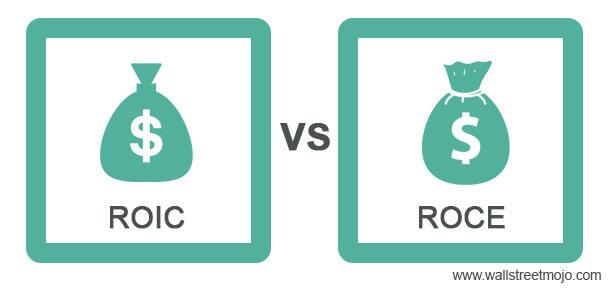

In the fast-paced world of investments, understanding key financial metrics is critical for making informed decisions. Effective financial analysis relies heavily on metrics such as Return on Investment (ROI) and Return on Capital Employed (ROCE), which provide insights into the profitability and efficiency of capital use. These metrics are integral not only to traditional investment evaluations but also play a significant role in algorithmic trading. 

As investors strive to maximize returns amidst market volatility and competition, focusing on these metrics can illuminate a company's financial performance and highlight strategic optimization opportunities. ROI, represented mathematically as $(\text{Net Profit} / \text{Cost of Investment}) \times 100$, offers a straightforward view of the profitability gained from various investments. Meanwhile, ROCE, defined as $\text{EBIT} / \text{Capital Employed}$, assesses how well a company utilizes its capital to generate earnings, providing a more nuanced understanding of its operational efficiency, especially in capital-intensive sectors.



Algorithmic trading leverages these financial metrics extensively in developing and fine-tuning trading strategies. Driven by quantitative analysis, these trading systems depend on the continuous monitoring of metrics like ROI and ROCE to ensure that their strategies are aligned with financial objectives. By integrating these metrics, algorithmic trading systems enhance their ability to evaluate company performance, thus ensuring a competitive advantage in financial markets.

Understanding and applying metrics like ROI and ROCE not only assists investors in gauging company performance but also fortifies trading systems, enhancing their ability to adapt to changing market conditions and identify lucrative opportunities. As markets continue to evolve, these metrics will remain crucial for strategy optimization and achieving sustained investment success.

## Table of Contents

## Understanding ROI

Return on Investment (ROI) is a commonly used financial metric that measures how effectively an investment generates profit relative to its cost. It is calculated using a straightforward formula: 

$$
\text{ROI} = \left(\frac{\text{Net Profit}}{\text{Cost of Investment}}\right) \times 100
$$

This formula yields a percentage which indicates the profitability of the investment. An ROI greater than zero indicates that the investment is profitable. A higher ROI signifies a more effective use of investment capital, reflecting efficient and successful investment strategies.

One of the significant advantages of ROI is its flexibility and applicability across various contexts. Investors can use ROI to evaluate the performance of individual assets, corporate projects, or entire investment opportunities. This versatility makes ROI an indispensable tool for investors seeking to assess the success of their financial undertakings.

However, despite its broad utility, ROI does have its limitations. It does not account for the time over which the profits are realized. For example, an investment yielding a 50% ROI over five years might be less appealing than an investment yielding 30% ROI over one year when considering the time value of money. Moreover, ROI calculations typically exclude external factors such as taxes, transaction fees, and inflation, which can significantly impact the actual returns on investment.

Given these constraints, while ROI is a valuable indicator of profitability, it should not be relied upon in isolation. Investors are advised to consider additional metrics and analyses to gain a comprehensive understanding of an investment’s performance.

## Decoding ROCE

Return on Capital Employed (ROCE) is a financial metric used to evaluate a company's efficiency in generating profits from its capital. The formula for calculating ROCE is:

$$
\text{ROCE} = \frac{\text{EBIT}}{\text{Capital Employed}}
$$

where EBIT stands for Earnings Before Interest and Taxes, and Capital Employed is the total amount of capital utilized for the company's operations. This metric serves as an essential tool for assessing how well a company is using its capital to generate profits.

ROCE is particularly valuable for comparing companies within the same industry because it focuses on capital efficiency. Industries that are capital-intensive, such as energy and telecommunications, benefit significantly from using ROCE. In these sectors, the efficient use of capital can have a substantial impact on profitability, making ROCE an important indicator for investors and analysts.

Unlike Return on Investment (ROI), which provides a general measure of profitability, ROCE offers deeper insights by considering both equity and debt. This makes ROCE a more comprehensive measure of capital efficiency, as it accounts for the total resources available to a company for generating earnings. By incorporating both sources of capital, ROCE provides a more complete understanding of how effectively a company is deploying its capital to generate returns. 

Overall, the inclusion of debt in the calculation allows ROCE to deliver a refined perspective on a company's financial performance, making it an indispensable metric for evaluating businesses with significant capital expenditures.

## ROI vs. ROCE: Key Differences

Return on Investment (ROI) and Return on Capital Employed (ROCE) are fundamental metrics for assessing profitability and efficiency in financial analysis. Despite their shared goal of evaluating profitability, they present distinct perspectives and applications.

ROI offers a broad overview of investment effectiveness, making it versatile across various investment types. The formula for ROI is: 

$$
ROI = \left(\frac{\text{Net Profit}}{\text{Cost of Investment}}\right) \times 100
$$

This metric provides a percentage that indicates the profitability of an investment, allowing for straightforward comparisons across different opportunities. However, it does not inherently account for the time required to achieve these returns or costs such as taxes and fees, which can lead to potential misinterpretations of its results.

ROCE, on the other hand, focuses on capital efficiency by calculating the earnings generated from capital employed, taking both equity and debt into consideration. The formula is:

$$
ROCE = \frac{\text{EBIT}}{\text{Capital Employed}}
$$

where EBIT stands for Earnings Before Interest and Taxes. ROCE is particularly useful for assessing companies within the same industry, especially those in capital-intensive sectors like energy or telecommunications. It provides a deeper insight into how well a company is using its capital to generate profits, highlighting operational efficiency.

The key differences between ROI and ROCE lie in their focus and utility. ROI's primary strength is its broad applicability across different investment categories, offering a quick profitability gauge. However, its lack of time consideration can be a drawback, potentially leading to overoptimistic projections. Meanwhile, ROCE's strength is its focus on capital efficiency and suitability for comparison within industries with similar capital structures. It provides a more comprehensive view of a company's operational efficiency but may not be as applicable across diverse investment types as ROI.

Investors are encouraged to use both ROI and ROCE in tandem to gain a holistic perspective on financial performance. By doing so, they can ensure that they account for both overall profitability and capital efficiency, thereby achieving a balanced understanding of an investment's true financial health.

## Algorithmic Trading and Investment Metrics

Algorithmic trading systems leverage metrics such as Return on Investment (ROI) and Return on Capital Employed (ROCE) to develop and refine trading strategies. These metrics, alongside others like the Sharpe ratio and maximum drawdown, are integral to the performance evaluation of [algorithmic trading](/wiki/algorithmic-trading) systems.

The Sharpe ratio, a measure of risk-adjusted return, is calculated as:

$$
\text{Sharpe Ratio} = \frac{E[R_p - R_f]}{\sigma_p}
$$

where $E[R_p]$ is the expected return of the portfolio, $R_f$ is the risk-free rate, and $\sigma_p$ is the standard deviation of the portfolio's excess return. A higher Sharpe ratio indicates a more favorable risk-return balance, making it crucial for assessing the effectiveness of a trading strategy.

Maximum drawdown, another vital metric, quantifies the largest loss from a peak to a trough within a certain time frame. This metric is essential for understanding the potential downside risk of a trading strategy.

Tracking these metrics is key to effective risk management and optimizing trading strategies to achieve favorable returns. Algorithmic trading enables data-driven decision-making, utilizing real-time analysis of these metrics to guide investment strategies. For instance, trading algorithms can be programmed in Python using libraries such as NumPy and pandas to compute these metrics efficiently. Here is a sample Python code snippet to calculate some investment metrics:

```python
import numpy as np
import pandas as pd

def calculate_sharpe_ratio(returns, risk_free_rate=0):
    excess_returns = returns - risk_free_rate
    return np.mean(excess_returns) / np.std(excess_returns)

def calculate_max_drawdown(returns):
    cumulative_returns = (1 + returns).cumprod()
    peak = cumulative_returns.cummax()
    drawdowns = (cumulative_returns - peak) / peak
    return drawdowns.min()

# Example usage
returns = pd.Series([0.01, 0.02, -0.015, 0.03, -0.02])
print(f"Sharpe Ratio: {calculate_sharpe_ratio(returns)}")
print(f"Maximum Drawdown: {calculate_max_drawdown(returns)}")
```

By utilizing these investment metrics effectively, trading algorithms can identify profitable opportunities and minimize potential losses. This approach allows for the fine-tuning of strategies based on historical performance, enhancing the probability of achieving consistent returns in dynamic markets. As such, the real-time application of these metrics in algorithmic systems propels informed and strategic trading decisions.

## Conclusion

Investment metrics such as Return on Investment (ROI) and Return on Capital Employed (ROCE) are crucial for assessing the financial health and strategic effectiveness in both investment and trading contexts. These metrics, when integrated into algorithmic trading systems, significantly enhance the ability to make informed decisions, thereby maintaining a competitive edge in the market. Each metric serves distinct roles; ROI provides a general measure of profitability, while ROCE offers insights into capital efficiency. Together, they create a comprehensive framework for evaluating investment efficiency.

As financial markets continue to evolve, the ability to effectively leverage these metrics will be an essential element of successful investment strategies and algorithmic trading endeavors. This is primarily due to their capacity to provide clear indicators of where capital is most efficiently utilized, which is critical in making timely and advantageous trading decisions.

For investors and traders, a deeper understanding of these metrics, complemented by broader financial analyses and industry-specific knowledge, can significantly optimize decision-making processes. By combining insights from ROI and ROCE with additional financial metrics and tools, such as the Sharpe ratio or maximum drawdown, investors can more effectively manage risks and identify profitable opportunities. Moreover, the dynamic nature of algorithmic trading allows for real-time analysis, ensuring that investment strategies remain aligned with financial goals amid market fluctuations.

## References & Further Reading

[1]: Bergstra, J., Bardenet, R., Bengio, Y., & Kégl, B. (2011). ["Algorithms for Hyper-Parameter Optimization."](https://papers.nips.cc/paper/4443-algorithms-for-hyper-parameter-optimization) Advances in Neural Information Processing Systems 24.

[2]: ["Advances in Financial Machine Learning"](https://www.amazon.com/Advances-Financial-Machine-Learning-Marcos/dp/1119482089) by Marcos Lopez de Prado

[3]: ["Evidence-Based Technical Analysis: Applying the Scientific Method and Statistical Inference to Trading Signals"](https://www.amazon.com/Evidence-Based-Technical-Analysis-Scientific-Statistical/dp/0470008741) by David Aronson

[4]: ["Machine Learning for Algorithmic Trading"](https://github.com/PacktPublishing/Machine-Learning-for-Algorithmic-Trading-Second-Edition) by Stefan Jansen

[5]: ["Quantitative Trading: How to Build Your Own Algorithmic Trading Business"](https://www.amazon.com/Quantitative-Trading-Build-Algorithmic-Business/dp/1119800064) by Ernest P. Chan