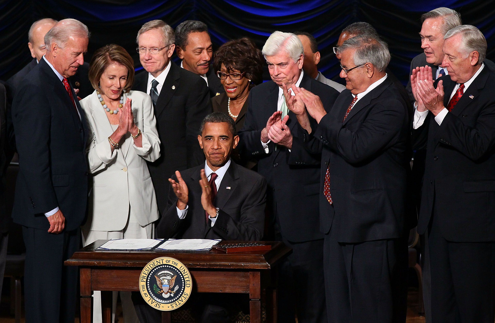

## Table of Contents

## What is the Sarbanes-Oxley Act and when was it enacted?

The Sarbanes-Oxley Act, often called SOX, is a law that was made to protect investors by making sure companies are honest about their finances. It was created after some big companies were found to be lying about their money, which hurt a lot of people who had invested in them. SOX makes it so that companies have to keep better records and be more open about their financial situation. It also set up rules to stop people from cheating with company money.

The Sarbanes-Oxley Act was passed by the United States Congress and signed into law on July 30, 2002. This law came about because of big financial scandals like Enron and WorldCom. It changed how companies report their finances and made it a crime to lie about financial reports. SOX also made sure that company leaders could be punished if they broke these new rules.

## What is the Dodd-Frank Act and when was it enacted?

The Dodd-Frank Act, also known as the Dodd-Frank Wall Street Reform and Consumer Protection Act, is a law that was made to stop big financial problems from happening again, like the one in 2008. It was created to make the financial system safer and to protect people from being taken advantage of by banks and other financial companies. The law makes rules for how banks and other financial companies can behave, and it set up a new group called the Consumer Financial Protection Bureau to watch over and protect people using financial products.

The Dodd-Frank Act was passed by the United States Congress and signed into law by President Barack Obama on July 21, 2010. This law came about because of the big economic crisis that hurt a lot of people and made it hard for many to keep their homes and jobs. It changed how banks and financial companies work, trying to make sure they don't take too many risks that could cause another big crash.

## What were the primary reasons for enacting the Sarbanes-Oxley Act?

The Sarbanes-Oxley Act was created because a lot of big companies were caught lying about their money. This happened with companies like Enron and WorldCom, and it made a lot of people lose their money. When these companies said they were doing well but were actually not, it hurt the people who had invested in them. This made people lose trust in the stock market and in companies' financial reports. So, the government decided to make a law to stop this from happening again.

The main reason for the Sarbanes-Oxley Act was to make sure companies tell the truth about their money. The law made new rules that companies have to follow to make their financial reports honest and clear. It also made sure that the people in charge of companies could be punished if they lied about the money. This was supposed to help people trust companies again and feel safer about investing their money.

## What were the primary reasons for enacting the Dodd-Frank Act?

The Dodd-Frank Act was made because of the big financial crisis that happened in 2008. This crisis hurt a lot of people, making them lose their homes and jobs. Banks and financial companies were taking big risks and not being careful with people's money. This caused a huge mess, and the government had to step in to fix things. The main reason for the Dodd-Frank Act was to stop this from happening again by making new rules for banks and financial companies.

The law aimed to make the financial system safer and protect people from being taken advantage of by banks. It set up a new group called the Consumer Financial Protection Bureau to watch over and make sure people using financial products are treated fairly. The Dodd-Frank Act also made rules to stop banks from taking too many risks that could cause another big crash. By doing this, the law tried to make people trust banks and the financial system again.

## How does the Sarbanes-Oxley Act aim to improve corporate governance?

The Sarbanes-Oxley Act aims to improve corporate governance by making sure companies are honest about their money. It does this by setting up rules that make companies keep better records and be more open about their financial situation. For example, the law says that companies have to have good systems to keep track of their money and report it correctly. This helps stop people from cheating or lying about the company's finances. By making these rules, the law tries to make sure that the people in charge of companies do their jobs the right way and are honest with investors.

Another way the Sarbanes-Oxley Act improves corporate governance is by making it clear that company leaders can be punished if they break these rules. This means that if someone in charge lies about the company's money, they can go to jail or pay a big fine. This makes people in charge think twice before doing anything wrong. By setting up these punishments, the law helps make sure that company leaders are careful and honest, which makes the whole company more trustworthy. This way, investors can feel safer putting their money into companies because they know the leaders are being watched closely.

## How does the Dodd-Frank Act aim to improve financial stability and consumer protection?

The Dodd-Frank Act aims to improve financial stability by making new rules for banks and other financial companies. Before the big financial crisis in 2008, banks were taking too many risks with people's money. The Dodd-Frank Act stops this by setting limits on how much risk banks can take. It also makes banks keep more money in reserve so they can handle tough times better. This way, the financial system becomes safer and less likely to crash again, which helps everyone feel more secure about their money.

The law also focuses on protecting consumers by creating the Consumer Financial Protection Bureau (CFPB). The CFPB watches over banks and other financial companies to make sure they treat people fairly. It stops banks from tricking people with hidden fees or confusing contracts. By having this group, the Dodd-Frank Act makes sure that people using financial products, like loans or credit cards, are treated honestly and can understand what they're getting into. This helps people trust banks more and feel safer when they use financial services.

## What are the key provisions of the Sarbanes-Oxley Act?

The Sarbanes-Oxley Act has several important parts that help make sure companies are honest about their money. One key part is that it makes companies keep good records of their finances. Companies have to set up systems to make sure their financial reports are correct and clear. This helps stop people from cheating or lying about the company's money. Another part is that it makes it a crime to lie in financial reports. If someone in charge of a company lies about the money, they can go to jail or pay a big fine. This makes people think twice before doing anything wrong.

Another important part of the Sarbanes-Oxley Act is that it makes the leaders of companies responsible for the financial reports. They have to sign off on the reports and say they are true. If the reports are wrong, the leaders can get in trouble. The law also set up the Public Company Accounting Oversight Board (PCAOB) to watch over the people who check the company's [books](/wiki/algo-trading-books). This group makes sure that the people checking the books are doing a good job and not letting companies lie. By doing all these things, the Sarbanes-Oxley Act tries to make sure companies are honest and people can trust them with their money.

## What are the key provisions of the Dodd-Frank Act?

The Dodd-Frank Act has several important parts that help make the financial system safer and protect people. One key part is that it makes banks keep more money in reserve. This means banks have to hold onto more money, so they can handle tough times better and not take too many risks. Another part is that it stops banks from doing risky things that could cause another big financial crash. The law sets rules on how much risk banks can take and makes them be more careful with people's money. By doing this, the Dodd-Frank Act tries to make sure the financial system stays stable and people feel safe.

Another important part of the Dodd-Frank Act is the creation of the Consumer Financial Protection Bureau (CFPB). This group watches over banks and other financial companies to make sure they treat people fairly. The CFPB stops banks from tricking people with hidden fees or confusing contracts. It also helps people understand the financial products they use, like loans or credit cards. By having the CFPB, the law makes sure that people are protected when they use financial services. This helps people trust banks more and feel safer about their money.

## How have the Sarbanes-Oxley and Dodd-Frank Acts impacted the financial industry?

The Sarbanes-Oxley Act has changed how companies handle their money and report it. Before, some big companies were caught lying about their finances, which hurt a lot of people who had invested in them. To stop this from happening again, the Sarbanes-Oxley Act made companies keep better records and be more open about their money. It also made it a crime to lie in financial reports, so company leaders have to be careful and honest. This has made companies more responsible and helped investors trust them more. But it also made things more complicated and expensive for companies because they have to follow a lot of new rules.

The Dodd-Frank Act has made the financial system safer and more focused on protecting people. After the big financial crisis in 2008, banks were taking too many risks with people's money. The Dodd-Frank Act set up rules to stop banks from doing risky things and made them keep more money in reserve. This helps make sure the financial system doesn't crash again. It also created the Consumer Financial Protection Bureau to watch over banks and make sure they treat people fairly. This has helped people feel safer when using financial services, but it has also made things more complicated for banks and other financial companies because they have to follow a lot of new rules.

## What are the criticisms and limitations of the Sarbanes-Oxley Act?

Some people say the Sarbanes-Oxley Act is too hard on small companies. It makes them spend a lot of money and time to follow the new rules about keeping records and reporting money. This can be really tough for small businesses because they don't have as much money or people to do all the extra work. Critics also say that the law might not stop all the bad things it was supposed to. Even with the new rules, some people might still find ways to cheat or lie about money if they really want to.

Another criticism is that the Sarbanes-Oxley Act can slow down businesses. The extra rules and checks make it take longer for companies to do things, which can make them less competitive. Some people think that the law is too focused on punishing people after they do something wrong instead of stopping them before they do it. This means that the law might not be as good at preventing problems as it is at dealing with them after they happen.

## What are the criticisms and limitations of the Dodd-Frank Act?

Some people think the Dodd-Frank Act is too complicated and hard for banks to follow. It has a lot of new rules that banks have to obey, and this can make things slower and more expensive for them. Critics say that because of these rules, banks might not be able to lend as much money to people and businesses. This can make it harder for people to get loans or start new businesses, which is bad for the economy. Some also worry that the law gives too much power to the government to control banks, which they think is not good for freedom in the market.

Another criticism of the Dodd-Frank Act is that it might not stop big financial problems from happening again. Even with all the new rules, some people think that banks could still find ways to take too many risks. Critics say that the law focuses too much on punishing banks after they do something wrong, instead of stopping them before they do it. This means the law might not be as good at preventing another crisis as it is at dealing with one after it happens. Some also think that the Consumer Financial Protection Bureau, which was created by the law, has too much power and might make it hard for new financial companies to start up and compete with big banks.

## How do the Sarbanes-Oxley and Dodd-Frank Acts complement or conflict with each other in their regulatory approaches?

The Sarbanes-Oxley Act and the Dodd-Frank Act both try to make the financial world safer and more honest, but they focus on different things. The Sarbanes-Oxley Act is all about making sure companies tell the truth about their money. It makes companies keep good records and says that if someone lies about the money, they can get in big trouble. This helps investors feel safer because they know companies have to be honest. On the other hand, the Dodd-Frank Act focuses on making the whole financial system safer and protecting people from being tricked by banks. It makes banks keep more money in reserve and stops them from taking too many risks. It also set up a group to watch over banks and make sure they treat people fairly.

Even though these laws have different focuses, they can work together to make the financial world better. The Sarbanes-Oxley Act helps by making companies more honest, which is good for everyone. The Dodd-Frank Act builds on this by making the whole system safer, so even if a company is honest, the banks that work with it are also being careful. But sometimes, these laws can make things harder for businesses. Both laws have a lot of rules that companies and banks have to follow, which can be expensive and slow things down. So while they complement each other in making things safer and more honest, they can also conflict by making it harder for businesses to work smoothly.

## References & Further Reading

[1]: Sarbanes-Oxley Act of 2002. Public Law 107-204. [Available here](https://www.congress.gov/107/plaws/publ204/PLAW-107publ204.pdf).

[2]: Dodd-Frank Wall Street Reform and Consumer Protection Act. Public Law 111-203. [Available here](https://www.govinfo.gov/content/pkg/PLAW-111publ203/pdf/PLAW-111publ203.pdf).

[3]: "High-Frequency Trading: A Practical Guide to Algorithmic Strategies and Trading Systems" by Irene Aldridge. [Available on Amazon](https://www.amazon.com/High-Frequency-Trading-Practical-Algorithmic-Strategies/dp/1118343506).

[4]: Krantz, M. J. (2010). "Dodd-Frank Wall Street Reform and Consumer Protection Act: Impact on Financial Institutions and Markets," Banking Law Journal, 127(9), 792-810.

[5]: "Flash Boys: A Wall Street Revolt" by Michael Lewis. [Available on Amazon](https://www.amazon.com/Flash-Boys-Wall-Street-Revolt/dp/0393351599).

[6]: Coffee, J. C. Jr. (2003). "What Caused Enron? A Capsule Social and Economic History of the 1990s". Columbia Law and Economics. [Columbia University](https://scholarship.law.cornell.edu/cgi/viewcontent.cgi?article=2944&context=clr).

[7]: "Algorithmic and High-Frequency Trading" by Álvaro Cartea, Sebastian Jaimungal, and José Penalva. [Available on Amazon](https://www.amazon.com/Algorithmic-High-Frequency-Trading-Mathematics-Finance/dp/1107091144).