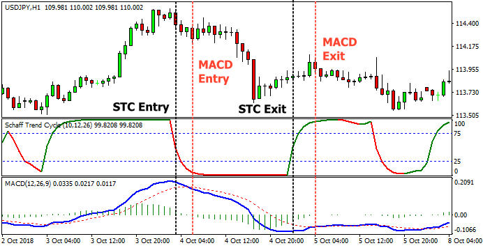

## Table of Contents

## What is the Schaff Trend Cycle Indicator?

The Schaff Trend Cycle (STC) Indicator is a tool used in trading to help identify trends and potential reversal points in the price of an asset. It was developed by Doug Schaff in the late 1990s as a way to combine the strengths of both cycle analysis and trend following. The STC indicator smooths out price data to reduce noise and provide a clearer picture of the market's direction. It does this by using a combination of exponential moving averages (EMAs) and a unique cycle component to generate a value that oscillates between 0 and 100.

The STC indicator is particularly useful because it can help traders spot when a trend is gaining or losing strength. When the STC line moves above 75, it suggests that the market is overbought, which could mean a potential downward reversal is coming. Conversely, when the STC line drops below 25, it indicates an oversold market, hinting at a possible upward reversal. Traders often look for the STC line to cross above or below its signal line, which is a moving average of the STC, to confirm trend changes. This makes the STC a valuable tool for making informed trading decisions.

## What is the MACD?

The MACD, or Moving Average Convergence Divergence, is a popular tool used by traders to understand the strength and direction of a trend in the price of an asset. It was created by Gerald Appel in the late 1970s. The MACD works by taking the difference between two moving averages, usually a 12-period and a 26-period exponential moving average (EMA). This difference is then plotted as a line on a chart, and it's called the MACD line. Another line, called the signal line, is created by taking a 9-period EMA of the MACD line. When the MACD line crosses above the signal line, it's seen as a bullish sign, suggesting it might be a good time to buy. When it crosses below, it's considered bearish, hinting at a time to sell.

In addition to the lines, the MACD also includes a histogram that shows the difference between the MACD line and the signal line. This histogram can help traders see the momentum of the trend more clearly. When the histogram bars are getting taller, it means the trend is getting stronger. When they're getting shorter, it suggests the trend might be weakening. Traders often use the MACD to spot potential buy or sell signals, but it's important to use it alongside other tools and analysis because no single indicator is perfect. By understanding how the MACD works, traders can make more informed decisions about when to enter or exit trades.

## How does the Schaff Trend Cycle Indicator work?

The Schaff Trend Cycle Indicator, or STC, is a tool that helps traders see the direction of a trend in the price of something they want to trade. It was made by Doug Schaff and uses a mix of moving averages and a special cycle part to make its calculations. The STC looks at the price over time and turns that into a number that goes from 0 to 100. When this number is high, like above 75, it means the price might be too high and could go down soon. When it's low, like below 25, it means the price might be too low and could go up soon.

Traders use the STC to help them decide when to buy or sell. They watch for the STC line to move above or below another line called the signal line. If the STC line goes above the signal line, it can be a sign to buy because it might mean the price is going up. If it goes below the signal line, it can be a sign to sell because it might mean the price is going down. By using the STC, traders can get a clearer idea of when a trend is starting or ending, which helps them make better choices about their trades.

## How does the MACD work?

The MACD, or Moving Average Convergence Divergence, is a tool traders use to see the strength and direction of a trend in the price of something they want to trade. It was made by Gerald Appel a long time ago. The MACD works by looking at the difference between two moving averages, usually a 12-day and a 26-day moving average. These moving averages help smooth out the price over time so it's easier to see the trend. The difference between these two averages is called the MACD line. Traders also use another line called the signal line, which is a 9-day moving average of the MACD line. When the MACD line goes above the signal line, it's a sign that the price might go up, so it's a good time to buy. When it goes below the signal line, it's a sign that the price might go down, so it's a good time to sell.

In addition to the lines, the MACD has something called a histogram. The histogram shows the difference between the MACD line and the signal line in a bar chart. When the bars on the histogram are getting bigger, it means the trend is getting stronger. When the bars are getting smaller, it means the trend might be getting weaker. Traders look at the histogram to get a better idea of how strong the trend is. The MACD is a useful tool, but it's important to use it with other tools and information because no single tool is perfect. By using the MACD, traders can make better decisions about when to buy or sell something.

## What are the main components of the Schaff Trend Cycle Indicator?

The Schaff Trend Cycle Indicator, or STC, has a few main parts that help traders see the direction of a trend in the price of something they want to trade. The first part is the STC line itself, which is made by looking at the price over time and turning it into a number that goes from 0 to 100. This line helps traders see if the price is too high or too low. If the STC line goes above 75, it means the price might be too high and could go down soon. If it goes below 25, it means the price might be too low and could go up soon.

The second part of the STC is the signal line. This line is made by taking a moving average of the STC line. Traders watch for the STC line to move above or below the signal line. If the STC line goes above the signal line, it can be a sign to buy because it might mean the price is going up. If it goes below the signal line, it can be a sign to sell because it might mean the price is going down. By using both the STC line and the signal line, traders can get a clearer idea of when a trend is starting or ending, which helps them make better choices about their trades.

## What are the main components of the MACD?

The MACD, or Moving Average Convergence Divergence, is a tool that helps traders see the direction and strength of a trend in the price of something they want to trade. It has two main lines: the MACD line and the signal line. The MACD line is made by taking the difference between two moving averages, usually a 12-day and a 26-day moving average. These moving averages help smooth out the price over time, making it easier to see the trend. The signal line is a 9-day moving average of the MACD line. Traders look for the MACD line to cross above or below the signal line. If the MACD line goes above the signal line, it's a sign that the price might go up, so it could be a good time to buy. If it goes below the signal line, it's a sign that the price might go down, so it could be a good time to sell.

In addition to the lines, the MACD also has a histogram. The histogram is a bar chart that shows the difference between the MACD line and the signal line. When the bars on the histogram are getting bigger, it means the trend is getting stronger. When the bars are getting smaller, it means the trend might be getting weaker. Traders use the histogram to get a better idea of how strong the trend is. By using the MACD line, the signal line, and the histogram together, traders can make better decisions about when to buy or sell something.

## How do you set up the Schaff Trend Cycle Indicator on a trading platform?

To set up the Schaff Trend Cycle Indicator on a trading platform, you first need to find the indicator in your platform's list of available tools. Most trading platforms have a menu or a search function where you can look for the STC. Once you find it, you can add it to your chart by clicking on it or dragging it onto the chart. After adding the STC, you might need to adjust its settings. The STC usually comes with default settings, but you can change them to fit your trading style. Common settings include the cycle period, the fast and slow lengths of the moving averages, and the signal line period.

Once you have the STC on your chart, you'll see two lines: the STC line and the signal line. The STC line will move between 0 and 100, and the signal line will follow it, usually with a slight delay. You can use these lines to spot trends and possible times to buy or sell. If the STC line goes above 75, it might mean the price is too high and could go down soon. If it goes below 25, it might mean the price is too low and could go up soon. Also, watch for the STC line to cross above or below the signal line. If it goes above, it's a sign to buy. If it goes below, it's a sign to sell. By setting up the STC correctly, you can use it to make better trading decisions.

## How do you set up the MACD on a trading platform?

To set up the MACD on a trading platform, first find the MACD in your platform's list of indicators. Most platforms have a menu or a search bar where you can look for it. Once you find the MACD, you can add it to your chart by clicking on it or dragging it onto the chart. After adding the MACD, you might want to adjust its settings. The default settings are usually a 12-day and a 26-day moving average for the MACD line, and a 9-day moving average for the signal line. You can change these numbers to fit how you like to trade.

Once the MACD is on your chart, you'll see three things: the MACD line, the signal line, and the histogram. The MACD line shows the difference between the 12-day and 26-day moving averages. The signal line is a 9-day moving average of the MACD line. The histogram is a bar chart that shows the difference between the MACD line and the signal line. You can use these to spot trends and decide when to buy or sell. If the MACD line goes above the signal line, it's a sign that the price might go up, so it could be a good time to buy. If it goes below the signal line, it's a sign that the price might go down, so it could be a good time to sell. By setting up the MACD correctly, you can use it to make better trading decisions.

## What are the typical signals generated by the Schaff Trend Cycle Indicator?

The Schaff Trend Cycle Indicator, or STC, gives traders signals about when the price of something they want to trade might go up or down. One important signal is when the STC line goes above 75. This means the price might be too high and could go down soon. Traders call this an overbought signal. On the other hand, if the STC line goes below 25, it means the price might be too low and could go up soon. This is called an oversold signal. By watching these levels, traders can get an idea of when to sell or buy.

Another signal the STC gives is when the STC line crosses the signal line. If the STC line goes above the signal line, it's a sign that the price might start going up, so it could be a good time to buy. If the STC line goes below the signal line, it's a sign that the price might start going down, so it could be a good time to sell. Traders look for these crossovers to help them decide when to enter or exit trades. By using these signals, traders can make better choices about their trades.

## What are the typical signals generated by the MACD?

The MACD, or Moving Average Convergence Divergence, gives traders signals about the direction and strength of a trend in the price of something they want to trade. One of the main signals the MACD gives is when the MACD line crosses the signal line. If the MACD line goes above the signal line, it's a sign that the price might go up, so it could be a good time to buy. If the MACD line goes below the signal line, it's a sign that the price might go down, so it could be a good time to sell. Traders look for these crossovers to help them decide when to enter or exit trades.

Another important signal from the MACD is the histogram. The histogram is a bar chart that shows the difference between the MACD line and the signal line. When the bars on the histogram are getting bigger, it means the trend is getting stronger. When the bars are getting smaller, it means the trend might be getting weaker. Traders use the histogram to get a better idea of how strong the trend is. By watching these signals, traders can make better choices about when to buy or sell something.

## How do the Schaff Trend Cycle Indicator and MACD perform in different market conditions?

The Schaff Trend Cycle Indicator (STC) and the MACD both help traders see trends in the price of something they want to trade, but they can work differently in different market conditions. In a trending market, where prices are clearly going up or down over time, both the STC and MACD can be very helpful. The STC is good at smoothing out the price data, so it can show a clear trend. When the STC line goes above the signal line, it's a good sign to buy in an uptrend, and when it goes below, it's a good sign to sell in a downtrend. The MACD also works well in trending markets because it shows the strength of the trend. When the MACD line crosses above the signal line, it's a buy signal, and when it crosses below, it's a sell signal. Both indicators help traders catch the trend and make good trading decisions.

In a sideways or choppy market, where prices are moving up and down without a clear direction, the STC and MACD can be less reliable. The STC might give too many false signals because it's trying to smooth out the price data, which can lead to buying or selling at the wrong times. The MACD can also give false signals in these markets because it's sensitive to small changes in the price. Traders might see the MACD line crossing the signal line back and forth a lot, which can be confusing. In these conditions, it's important for traders to use other tools and information along with the STC and MACD to make better trading choices.

## What are the advanced strategies for combining the Schaff Trend Cycle Indicator and MACD for trading?

Combining the Schaff Trend Cycle Indicator (STC) and the MACD can help traders make better decisions by using the strengths of both tools. One advanced strategy is to use the STC to find the overall trend and the MACD to spot the best times to enter or exit trades. For example, if the STC line is above its signal line and also above 25, it means the market is in an uptrend. Traders can then use the MACD to look for buy signals. When the MACD line crosses above the signal line, it's a good time to buy because it confirms the uptrend. On the other hand, if the STC line is below its signal line and below 75, it means the market is in a downtrend. Traders can use the MACD to look for sell signals. When the MACD line crosses below the signal line, it's a good time to sell because it confirms the downtrend.

Another strategy is to use the STC and MACD together to spot trend reversals. If the STC line is above 75 and starts to turn down, and at the same time, the MACD histogram starts to get smaller, it could mean the uptrend is losing strength and a reversal might be coming. This is a good time to sell or take profits. On the flip side, if the STC line is below 25 and starts to turn up, and the MACD histogram starts to get bigger, it could mean the downtrend is losing strength and a reversal might be coming. This is a good time to buy. By using both the STC and MACD, traders can get a clearer picture of the market and make more informed trading decisions.

## What is the Schaff Trend Cycle (STC) Indicator and how does it work?

The Schaff Trend Cycle (STC) is a sophisticated momentum oscillator introduced by Doug Schaff, utilized in technical analysis to identify market trends and potential reversals. Unlike traditional moving averages, the STC employs a distinctive approach by combining moving averages with cycle analysis, thus offering more timely and responsive trend signals.

### Core Mechanics

The STC primarily involves calculating the difference between two exponential moving averages (EMAs). This calculation, akin to other oscillators, forms the core of the STC's trend analysis.

#### Mathematical Concept

The STC's unique capability is its integration of cycle analysis into its formula. The indicator typically uses a shorter-term EMA and a longer-term EMA to establish the primary trend direction. While the specific details of the cycle analysis component can be more intricate, the STC generally operates within a range from 0 to 100. This range helps in identifying overbought and oversold market conditions, crucial for traders seeking entry and [exit](/wiki/exit-strategy) points.

$$
\text{STC Value} = \text{Cycle Function}(\text{Short Term EMA, Long Term EMA})
$$

Python implementation of the basic STC computation might look like this:

```python
def calculate_stc(short_ema, long_ema):
    # Placeholder for cycle analysis function
    def cycle_function(short_ema, long_ema):
        return (short_ema - long_ema)  # Simplified example

    stc_value = cycle_function(short_ema, long_ema)
    return stc_value
```

### Oscillation and Signal Generation

By oscillating between 0 and 100, the STC offers straightforward buy and sell signals—the lower band suggesting oversold conditions and the upper band indicating overbought conditions. This functionality assists traders in making informed decisions on potential market entries or exits.

### Complexity and Challenges

The complexity of the STC arises from its reliance on cycle analysis and use of multiple EMAs, potentially posing challenges for novice traders. Understanding and interpreting the indicator's signals necessitate familiarity with cycle analysis principles and proficiency in adjusting settings for specific market conditions. This complexity, however, also contributes to the STC's capability to generate leading signals, as opposed to the lagging nature of simple moving averages.

Overall, while the Schaff Trend Cycle presents some challenges, its intricate synthesis of moving averages and cycle analysis offers traders a powerful tool for trend detection and market analysis.

## What is an Overview of the MACD Indicator?

The Moving Average Convergence Divergence (MACD) is widely recognized as one of the most popular and utilized indicators within technical analysis. Developed by Gerald Appel in the late 1970s, the MACD aims to uncover shifts in trend strength, direction, [momentum](/wiki/momentum), and duration, offering traders a comprehensive tool for market analysis.

The MACD is calculated by taking the difference between the 12-period Exponential Moving Average (EMA) and the 26-period EMA. This difference is then plotted on a chart and is referred to as the MACD line. Additionally, a 9-period EMA of the MACD line, known as the signal line, is plotted to signal potential buy or sell opportunities. The formula for calculating the MACD is as follows:

$$

\text{MACD} = \text{EMA}_{12} - \text{EMA}_{26} 
$$

The MACD is predominantly used by traders to identify potential trend reversals, generate buy and sell signals, and assess the strength of these trends. Crossovers between the MACD line and the signal line are critical; a crossover above the signal line suggests a potential buying opportunity, while a crossover below indicates a possible sell signal.

The straightforward calculation of MACD, combined with its versatile application across different market conditions, has established it as a fundamental component in the toolkit of many traders. Its adaptability makes it suitable for various trading styles, from short-term [day trading](/wiki/day-trading-spy) to long-term investment strategies. Despite being a lagging indicator, its efficacy in highlighting momentum and trend changes continues to be esteemed among both novice and experienced traders.

## How can STC and MACD be used in algorithmic trading?

Algorithmic trading utilizes computer algorithms to automate trading decisions, aiming for speed and efficiency by executing trades based on pre-determined strategies. The integration of technical indicators like the Schaff Trend Cycle (STC) and Moving Average Convergence Divergence (MACD) offers traders distinct advantages when developing [algorithmic trading](/wiki/algorithmic-trading) systems.

The Schaff Trend Cycle (STC) indicator, characterized by its combination of moving averages and cycle analysis, is beneficial for algorithmic trading due to its ability to generate smoother trend signals and minimize noise. This approach enhances precision in trading execution, which is crucial in fast-paced markets. The STC calculates the difference between two exponential moving averages (EMAs) and applies cycle analysis to identify potential turning points in market trends. The calculation can be represented as follows:

$$
\text{STC} = \text{Cycle Analysis}\left(\frac{\text{EMA1} - \text{EMA2}}{\text{EMA1}}\right)
$$

This formula ensures that traders receive more responsive trend signals compared to traditional moving averages, enabling timely entry and exit strategies in automated systems.

On the other hand, the MACD indicator is lauded for its straightforwardness and historical performance, integrating seamlessly into algorithmic trading frameworks. It aids in momentum detection and divergence identification, which are key aspects of trading strategies. The MACD is calculated as:

$$
\text{MACD} = \text{EMA}_{12} - \text{EMA}_{26}
$$

With a 9-period EMA serving as the signal line. This simplicity allows for easy incorporation into trading algorithms, making it ideal for detecting trend reversals and confirming trend strength.

Traders must understand the distinct differences between the STC and MACD indicators, particularly their calculation methods and signal generation, and choose one that aligns with their trading strategy, market conditions, and risk tolerance. Each indicator has unique strengths: the STC provides leading signals due to its cycle analysis, while the MACD offers consistent momentum tracking.

Backtesting is an essential process in algorithmic trading, where historical data is used to simulate how these indicators would have performed in past market conditions. This practice helps refine strategies and enhance the reliability of trading decisions. By [backtesting](/wiki/backtesting) STC and MACD under various market scenarios, traders can optimize their algorithmic systems for improved performance and risk management. A typical backtesting setup could involve:

```python
import pandas as pd

# Load historical market data
data = pd.read_csv('historical_data.csv')

# Calculate MACD
data['EMA12'] = data['Close'].ewm(span=12, adjust=False).mean()
data['EMA26'] = data['Close'].ewm(span=26, adjust=False).mean()
data['MACD'] = data['EMA12'] - data['EMA26']
data['Signal Line'] = data['MACD'].ewm(span=9, adjust=False).mean()

# Implement Backtesting Logic
def backtest_strategy(data):
    # Example: Simple MACD crossover strategy
    buy_signals = []
    sell_signals = []

    for i in range(1, len(data)):
        if data['MACD'].iloc[i] > data['Signal Line'].iloc[i] and data['MACD'].iloc[i-1] <= data['Signal Line'].iloc[i-1]:
            buy_signals.append(data['Close'].iloc[i])
            sell_signals.append(None)
        elif data['MACD'].iloc[i] < data['Signal Line'].iloc[i] and data['MACD'].iloc[i-1] >= data['Signal Line'].iloc[i-1]:
            sell_signals.append(data['Close'].iloc[i])
            buy_signals.append(None)
        else:
            buy_signals.append(None)
            sell_signals.append(None)

    return buy_signals, sell_signals

# Run backtesting
buy, sell = backtest_strategy(data)
data['Buy Signal'] = buy
data['Sell Signal'] = sell
```

Through backtesting, traders can adjust parameters and improve the efficiency of STC and MACD integration within algorithmic trading systems, ensuring robust execution aligned with their strategic goals.

## References & Further Reading

[1]: Pring, M. J. (2002). ["Technical Analysis Explained: The Successful Investor's Guide to Spotting Investment Trends and Turning Points"](https://www.amazon.com/Technical-Analysis-Explained-Fifth-Successful/dp/0071825177). McGraw-Hill Education.

[2]: Katsanos, A. (2010). ["Intermarket Trading Strategies"](https://www.wiley.com/en-us/Intermarket+Trading+Strategies-p-9781119995906). Wiley.

[3]: Appel, G. (2005). ["Technical Analysis: Power Tools for Active Investors"](https://www.amazon.com/Technical-Analysis-Power-Active-Investors/dp/0132930048). FT Press.

[4]: Schaff, D. (2008). ["Schaff Trend Cycle: A Custom Indicator"](https://quantstrategy.io/blog/understanding-the-schaff-trend-cycle-stc-indicator-a-powerful-technical-analysis-tool/). Investopedia Article.

[5]: Murphy, J. J. (1999). ["Technical Analysis of the Financial Markets: A Comprehensive Guide to Trading Methods and Applications"](https://archive.org/details/technicalanalysi0000murp). New York Institute of Finance.

[6]: Lopez de Prado, M. (2018). ["Advances in Financial Machine Learning"](https://www.amazon.com/Advances-Financial-Machine-Learning-Marcos/dp/1119482089). Wiley.