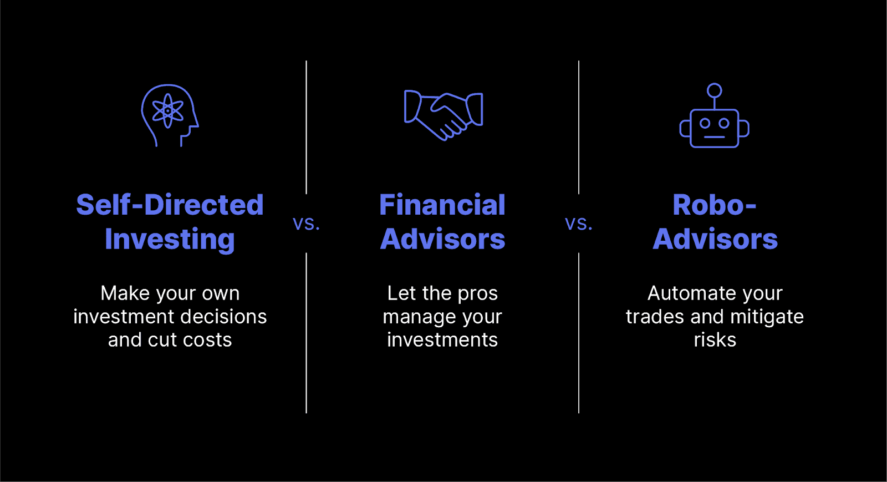

## Table of Contents

## What is self-directed investing?

Self-directed investing is when you manage your own investments without help from a financial advisor. You make all the decisions about what to buy and sell, and when to do it. This can be done through online platforms or apps that let you trade stocks, bonds, mutual funds, and other types of investments.

It's like being your own boss in the world of investing. You need to do your own research and keep up with market news to make smart choices. Self-directed investing can be rewarding because you have full control over your money, but it also means you take on all the risks. If you're new to investing, it might take some time to learn, but many people find it exciting and empowering.

## What is automated investing?

Automated investing is when a computer program or a robo-advisor manages your investments for you. You tell the program how much risk you want to take and what your goals are, and it picks investments that fit what you want. It's like having a helper that does the work for you, so you don't need to spend time picking stocks or worrying about when to buy or sell.

This type of investing is good for people who don't have a lot of time to manage their money or who don't want to learn a lot about investing. The robo-advisor keeps an eye on your investments and makes changes when needed, like if the market changes or if you get closer to your goal. It's a simple way to invest, but remember, even though it's automated, there's still risk involved, and it's important to choose a good robo-advisor.

## How do self-directed and automated investing differ in terms of control?

In self-directed investing, you have full control over your investments. You decide what to buy, what to sell, and when to do it. This means you are in charge of every decision, from picking individual stocks to setting up your investment strategy. It's like being the captain of your own ship, where you steer it in the direction you want to go. If you enjoy making these choices and feel confident in your ability to research and understand the market, self-directed investing can be very empowering.

In automated investing, you give up some control to a computer program or robo-advisor. You tell it your goals and how much risk you're comfortable with, and then it takes over. The robo-advisor picks the investments for you and makes changes as needed, without you having to do anything. It's like having a co-pilot who drives the ship for you. This can be great if you don't want to spend time managing your investments or if you're new to investing and want some help. But remember, even though you're not making the day-to-day decisions, you still choose the robo-advisor and set your initial goals, so you have some control over the big picture.

## What are the typical costs associated with self-directed investing?

When you do self-directed investing, you usually have to pay some fees. One common fee is called a commission, which is what you pay every time you buy or sell a stock or another investment. These fees can be different depending on which platform or app you use. Some platforms offer commission-free trades, which means you don't pay anything to buy or sell, but they might make money in other ways, like by charging for other services or getting paid by the companies whose stocks they sell.

Another cost you might see is a management fee, which is what you pay to keep your account open. This fee can be a flat amount every month or year, or it might be a percentage of the money you have invested. Not all platforms charge this, so it's good to check before you start. Also, if you invest in things like mutual funds or ETFs, there might be extra fees called expense ratios, which are the costs of running the fund. These fees are usually a small percentage of your investment, but they can add up over time.

Overall, the costs of self-directed investing can vary a lot. It's important to look at all the fees you might have to pay and think about how they could affect your returns. By choosing a platform with low fees and being smart about when you buy and sell, you can keep more of your money working for you.

## What are the typical costs associated with automated investing?

With automated investing, you usually pay a management fee. This fee is what you pay to the robo-advisor for managing your investments. It's often a percentage of the money you have invested, and it can be around 0.25% to 0.50% per year. This means if you have $10,000 invested, you might pay between $25 and $50 a year. Some robo-advisors might also charge extra fees for things like setting up your account or for certain services, but these are less common.

Another cost you might see with automated investing is the expense ratio of the funds the robo-advisor picks for you. These are the fees for running the funds, like mutual funds or ETFs, and they are usually a small percentage of your investment, often around 0.05% to 0.25%. These fees are taken out of your investment, so they can add up over time. Overall, the costs of automated investing can be lower than those of self-directed investing because you're not paying commissions for each trade, but it's still important to look at all the fees and see how they might affect your returns.

## How does the level of investment knowledge required compare between self-directed and automated investing?

Self-directed investing needs more knowledge than automated investing. When you do it yourself, you have to learn about things like stocks, bonds, and how the market works. You need to know how to pick good investments and when to buy or sell them. It's like being a student who has to study a lot to do well. If you don't know much about investing, you might make mistakes that cost you money. But if you take the time to learn, you can make smart choices and maybe do better than if someone else was picking for you.

Automated investing doesn't need as much knowledge. You just tell the robo-advisor what you want, like how much risk you're okay with and what your goals are, and it does the rest. You don't need to know a lot about investing because the computer does the work for you. This is good if you're new to investing or if you don't want to spend time learning about it. But even though it's easier, it's still good to understand a little bit about investing so you can pick a good robo-advisor and know what they're doing with your money.

## What are the potential risks involved in self-directed investing?

Self-directed investing can be risky because you're making all the choices yourself. If you don't know enough about the market, you might pick bad investments. For example, you might buy a stock that goes down a lot, and you lose money. Also, if you don't keep up with news and changes in the market, you might miss important things that affect your investments. It's like driving a car without knowing the rules of the road; you could end up in a crash.

Another risk is that you might make emotional decisions. When the market goes up and down, it can be hard not to panic and sell your investments at the wrong time. Or you might get too excited and buy things without thinking them through. This can lead to buying high and selling low, which is the opposite of what you want to do. It's important to stay calm and stick to your plan, but it's not always easy.

## What are the potential risks involved in automated investing?

Automated investing has some risks too. One big risk is that the robo-advisor might not pick the best investments for you. Even though it uses computer programs to make choices, those programs can make mistakes. They might not understand everything about the market or might not know about new things that could affect your investments. So, even if you set your goals and risk level, the robo-advisor might still pick investments that don't do well.

Another risk is that you might not pay attention to what the robo-advisor is doing. Because it's automated, you might think you don't need to check on your investments. But it's still important to keep an eye on them. If the market changes a lot or if your goals change, you might need to tell the robo-advisor to make different choices. If you don't, you could end up with investments that don't fit what you want anymore.

## How do the performance outcomes of self-directed and automated investing compare over the long term?

Over the long term, the performance of self-directed and automated investing can be different for different people. If you're good at picking investments and know a lot about the market, self-directed investing might do better for you. You can choose exactly what you want to invest in and change your strategy when things change. But if you don't know much about investing or make emotional decisions, you might not do as well. It's like trying to win a race without knowing the track; you could end up going the wrong way.

On the other hand, automated investing can be good if you don't have a lot of time to learn about investing or if you want someone else to make the choices for you. Robo-advisors use computer programs to pick investments that fit your goals and how much risk you want to take. Over time, this can help you get steady returns without having to do a lot of work. But remember, even though it's easier, the robo-advisor might not always pick the best investments, and you still need to check on what it's doing. So, while it can be a good choice for some people, it might not be the best for everyone.

## What types of investment options are available in self-directed investing?

In self-directed investing, you can choose from a lot of different types of investments. You can buy stocks, which are pieces of a company. If the company does well, the stock price might go up, and you can make money. You can also invest in bonds, which are like loans you give to a company or the government. They pay you back with interest over time. Another option is mutual funds, which are a way to invest in a bunch of different stocks or bonds at once. There are also exchange-traded funds (ETFs), which are like mutual funds but trade like stocks. Plus, you can invest in things like real estate investment trusts (REITs), commodities like gold or oil, and even cryptocurrencies like Bitcoin.

The choices you have in self-directed investing mean you can build a portfolio that fits what you want. If you like to take risks, you might pick more stocks or even try investing in something new like cryptocurrencies. If you want something safer, you might choose more bonds or ETFs that focus on stable companies. The key is to learn about each type of investment and decide which ones are right for you. By picking the right mix, you can try to grow your money over time.

## What types of investment options are available in automated investing?

In automated investing, the robo-advisor picks the investments for you. Usually, they use a mix of things like ETFs and mutual funds. ETFs are like baskets of different stocks or bonds that you can buy and sell like a single stock. Mutual funds are similar, but they're managed by a person who tries to pick the best investments. The robo-advisor chooses these based on how much risk you want to take and what your goals are.

Sometimes, robo-advisors might also include other types of investments, like bonds or even some stocks. But they keep it simple so you don't have to do a lot of work. The idea is to have a mix of investments that can grow over time without you having to pick each one yourself. This way, you can still invest in different things and spread out your risk, but the robo-advisor does all the choosing for you.

## How can an investor decide which approach, self-directed or automated, is best suited to their financial goals and risk tolerance?

To decide if self-directed or automated investing is better for you, think about how much you know about investing and how much time you want to spend on it. If you like learning about the market and picking your own investments, self-directed investing might be a good choice. You get to choose exactly what you want to invest in, like stocks, bonds, or even things like real estate. But it takes time to learn and you have to be careful not to make mistakes. If you're new to investing or don't want to spend a lot of time on it, automated investing could be better. A robo-advisor will pick investments for you based on your goals and how much risk you want to take. It's easier, but you still need to check on what it's doing sometimes.

Also, think about your risk tolerance. If you like taking risks and think you can handle the ups and downs of the market, self-directed investing might work well for you. You can pick investments that might grow a lot but also might lose value. If you want something safer and don't want to worry about losing money, automated investing can help. The robo-advisor will usually pick a mix of investments that are less risky and can help you reach your goals over time. In the end, the best choice depends on what you want from your investments and how much you're willing to learn and manage them yourself.

## What is Self-Directed Investing?

Self-directed investing involves the independent management of one's investment portfolio, allowing investors to make all decisions related to buying and selling assets. This autonomy means investors can select from various financial instruments, including stocks, bonds, exchange-traded funds (ETFs), mutual funds, real estate, and other securities. The primary allure of self-directed investing is the complete control it offers over investment decisions and strategies, thereby enabling customization according to individual preferences and financial objectives.

One of the primary advantages of self-directed investing is the potential for reduced costs. By eliminating financial advisors and middlemen, investors can bypass management fees and commissions typically associated with professional portfolio management. Additionally, many online brokerage platforms offer competitive pricing structures, further minimizing transaction costs. The lack of intermediary influence also means investors retain control over the timing of trades and tactical adjustments, which can be advantageous in volatile markets.

However, self-directed investing is best suited for individuals with a considerable understanding of financial markets, investment principles, and risk management strategies. The absence of professional guidance requires investors to [carry](/wiki/carry-trading) out their due diligence in researching and evaluating investment opportunities. This includes analyzing financial statements, staying updated with market trends, and understanding macroeconomic indicators that could impact investments.

Time commitment is another [factor](/wiki/factor-investing) to consider, as managing a self-directed portfolio demands regular monitoring and adjustments to ensure alignment with investment goals. This approach may be challenging for individuals with limited time or those unwilling to engage in constant learning and analysis.

To successfully navigate self-directed investing, a strong foundation in financial literacy is essential. Investors must be adept at interpreting market signals and employing various valuation techniques. For example, understanding the price-to-earnings (P/E) ratio can assist in evaluating stock valuations:

$$
\text{P/E Ratio} = \frac{\text{Market Value per Share}}{\text{Earnings per Share (EPS)}}
$$

As an alternative, technical analysis might be employed to gauge market sentiment and potential price movements, involving tools such as moving averages and [momentum](/wiki/momentum) indicators.

Ultimately, self-directed investing is a dynamic choice for experienced investors who prefer a hands-on approach to portfolio management. It offers the freedom to pursue unique investment strategies and the potential for greater returns, provided the investor possesses the requisite knowledge and dedication to navigate the complexities of financial markets effectively.

## References & Further Reading

[1]: Bergstra, J., Bardenet, R., Bengio, Y., & Kégl, B. (2011). ["Algorithms for Hyper-Parameter Optimization."](https://dl.acm.org/doi/10.5555/2986459.2986743) Advances in Neural Information Processing Systems 24.

[2]: ["Advances in Financial Machine Learning"](https://www.amazon.com/Advances-Financial-Machine-Learning-Marcos/dp/1119482089) by Marcos Lopez de Prado

[3]: ["Evidence-Based Technical Analysis: Applying the Scientific Method and Statistical Inference to Trading Signals"](https://www.amazon.com/Evidence-Based-Technical-Analysis-Scientific-Statistical/dp/0470008741) by David Aronson

[4]: ["Machine Learning for Algorithmic Trading"](https://github.com/stefan-jansen/machine-learning-for-trading) by Stefan Jansen

[5]: ["Quantitative Trading: How to Build Your Own Algorithmic Trading Business"](https://www.amazon.com/Quantitative-Trading-Build-Algorithmic-Business/dp/0470284889) by Ernest P. Chan