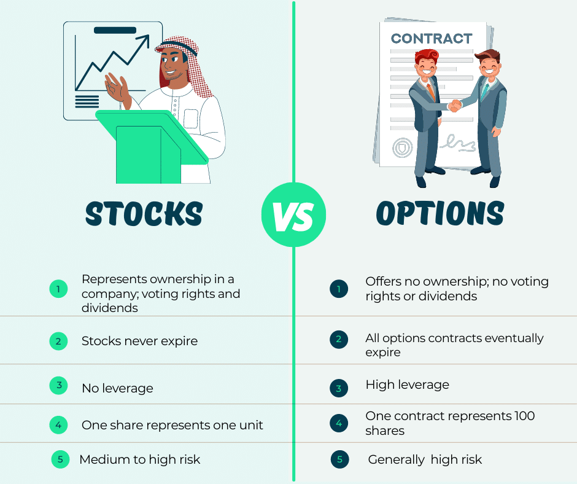

## Table of Contents

## What are share purchase rights?

Share purchase rights, also known as rights offerings, are a way for companies to raise money by giving their existing shareholders the chance to buy more shares at a lower price than what the shares are currently worth. This special price is usually offered for a limited time. The idea is to encourage current shareholders to invest more money in the company, which helps the company get the funds it needs to grow or pay off debts.

When a company decides to do a rights offering, it sends out a notice to all its shareholders. This notice tells them how many new shares they can buy and at what price. Shareholders can then decide if they want to buy these new shares or not. If they choose to buy, they can usually do so by sending money to the company or through a broker. If they don't want to buy the new shares, they can sell their rights to someone else who might want to buy the shares instead.

## What are stock options?

Stock options are a way for companies to give their employees, or sometimes other people, the chance to buy the company's stock at a special price. This special price is called the exercise price or strike price. It's usually set at what the stock is worth when the option is given out. The idea is to reward employees and encourage them to help the company do well, because if the company's stock price goes up, the employees can buy the stock at the lower price and then sell it for a profit.

There are two main types of stock options: incentive stock options (ISOs) and non-qualified stock options (NSOs). ISOs are usually only given to employees and can have some tax benefits if certain rules are followed. NSOs can be given to employees, consultants, or directors, but they don't have the same tax benefits as ISOs. Both types of options have a time limit, called the expiration date, by which the person has to decide whether to buy the stock or let the option expire.

## How do share purchase rights differ from stock options at a basic level?

Share purchase rights and stock options are both ways for people to buy a company's stock, but they work a bit differently. Share purchase rights are given to existing shareholders and let them buy more shares at a lower price for a short time. This is usually done to help the company raise money. The rights are given out based on how many shares someone already owns, and if they don't want to buy the new shares, they can sell their rights to someone else.

Stock options, on the other hand, are often given to employees as a reward or incentive. They give the employee the right to buy the company's stock at a set price, called the exercise price, which is usually the stock's value when the option is given. Unlike share purchase rights, stock options can be used over a longer period and are not tied to how many shares someone already owns. The goal is to motivate employees to help the company do well, so they can buy the stock at a lower price and sell it later for a profit.

In simple terms, share purchase rights are a way for companies to raise money from existing shareholders, while stock options are a way to reward and motivate employees. Share purchase rights are short-term and linked to current ownership, while stock options are longer-term and not tied to ownership.

## What are the key features of share purchase rights?

Share purchase rights let existing shareholders buy more shares in the company at a lower price than what the shares are worth right now. This special price is only available for a short time, usually a few weeks. The company sends a notice to all its shareholders telling them how many new shares they can buy and at what price. Shareholders can then decide if they want to buy these new shares or not. If they choose to buy, they can usually do so by sending money to the company or through a broker.

If shareholders don't want to buy the new shares, they can sell their rights to someone else who might want to buy the shares instead. This is called trading the rights. The main goal of share purchase rights is to help the company raise money. By offering shares at a lower price, the company hopes that its current shareholders will invest more money, which can be used to grow the business or pay off debts.

## What are the key features of stock options?

Stock options are a way for companies to give their employees, or sometimes other people, the chance to buy the company's stock at a special price. This special price is called the exercise price or strike price, and it's usually set at what the stock is worth when the option is given out. The idea is to reward employees and encourage them to help the company do well. If the company's stock price goes up, the employees can buy the stock at the lower price and then sell it for a profit. This can be a big motivation for employees to work hard and help the company succeed.

There are two main types of stock options: incentive stock options (ISOs) and non-qualified stock options (NSOs). ISOs are usually only given to employees and can have some tax benefits if certain rules are followed. NSOs can be given to employees, consultants, or directors, but they don't have the same tax benefits as ISOs. Both types of options have a time limit, called the expiration date, by which the person has to decide whether to buy the stock or let the option expire. This time limit can be several years, giving employees a longer window to decide if they want to use their options.

## How does the taxation of share purchase rights compare to stock options?

The taxation of share purchase rights and stock options can be different and depends on a few things. For share purchase rights, if you buy new shares and then sell them, you might have to pay capital gains tax. This tax is based on how much money you make from selling the shares compared to what you paid for them. If you sell the rights themselves instead of the shares, that could also be taxed as income. The exact tax you pay can depend on how long you hold the shares and the tax laws where you live.

For stock options, the tax rules can be a bit more complicated. If you have incentive stock options (ISOs), you might not have to pay any tax when you get the options or when you buy the shares. But if you sell the shares later, you could owe capital gains tax. If you sell the shares within a year of buying them, you might have to pay a higher short-term capital gains tax. If you hold them longer, you could pay a lower long-term capital gains tax. For non-qualified stock options (NSOs), you usually have to pay regular income tax on the difference between the exercise price and the stock's value when you buy the shares. This can be a big tax hit right away, but any further gains when you sell the shares would be taxed as capital gains.

## What are the vesting schedules typically associated with share purchase rights and stock options?

Share purchase rights usually don't have a vesting schedule. This means that when a company offers them, shareholders can decide right away if they want to buy the new shares at the special price. The rights are given to shareholders based on how many shares they already own, and they have a short time, often a few weeks, to use them or sell them to someone else. The main goal is to raise money quickly, so there's no need for a vesting period.

Stock options, on the other hand, almost always come with a vesting schedule. This means that employees can't use their options right away. Instead, they have to wait for a certain amount of time to pass or meet certain goals before they can buy the stock at the special price. A common vesting schedule is over four years, with a portion of the options vesting each year or even each month. This is meant to keep employees motivated to stay with the company and help it grow over time.

## How do the exercise prices of share purchase rights and stock options impact their value?

The exercise price of share purchase rights is usually set lower than the current market price of the stock. This makes them valuable because shareholders can buy more shares at a discount. The lower the exercise price compared to the market price, the more valuable the rights are. If the market price of the stock stays the same or goes up, shareholders can make a profit by buying the shares at the lower exercise price and then selling them at the higher market price. But if the market price drops below the exercise price, the rights become less valuable because there's no benefit in buying the shares at a higher price than they're worth.

For stock options, the exercise price is also set at the time the options are granted, often at the current market price of the stock. The value of stock options depends on how much the stock's market price goes up after the options are granted. If the market price goes above the exercise price, the options become valuable because employees can buy the stock at a lower price and then sell it at a higher price for a profit. But if the market price stays the same or goes down, the options might not be worth using because there's no profit to be made. The longer time frame of stock options means there's more chance for the stock price to change, which can affect their value a lot.

## What are the implications of share purchase rights and stock options on company valuation?

Share purchase rights can affect a company's valuation in a few ways. When a company offers share purchase rights, it's usually trying to raise money by selling new shares at a lower price. This can increase the total number of shares, which might make each share worth a little less if the company's overall value doesn't go up. But if the money raised helps the company grow and become more valuable, the share price might go up over time. Also, if shareholders see the rights as a good deal, it can make them feel more positive about the company, which can help the stock price.

Stock options can also impact a company's valuation, but in different ways. When a company gives out stock options, it's not selling new shares right away, but it's promising to let employees buy shares later. This can make the company's stock more attractive to employees, which can help the company grow and increase its value. But if a lot of employees use their options to buy shares, it can increase the total number of shares, which might lower the value of each share if the company's overall value doesn't grow enough. Also, the cost of giving out options can be seen as an expense, which might affect how investors see the company's value.

## How do the regulatory requirements for issuing share purchase rights compare to those for stock options?

When a company wants to issue share purchase rights, it has to follow some rules set by the government and stock market. These rules are there to make sure that all shareholders get a fair chance to buy the new shares. The company has to tell everyone about the rights offering, usually through a document called a prospectus. This document explains how many new shares are being offered, the price, and how long the offer will last. The company also has to make sure that the rights are given out equally to all shareholders based on how many shares they already own. If the company doesn't follow these rules, it could get in trouble with the government or the stock market.

For stock options, the rules can be a bit different. Companies often have to get approval from their board of directors before they can give out options. They also need to follow rules about how they report the options in their financial statements. This is because stock options can be seen as a kind of payment to employees, so the company has to account for their value. If the company is publicly traded, it might also have to follow rules set by the stock market about how it gives out options and reports them. These rules are there to make sure that the options are given out fairly and that investors know about them.

## What strategic considerations should a company take into account when deciding between offering share purchase rights or stock options?

When a company is thinking about whether to offer share purchase rights or stock options, it needs to think about what it wants to achieve. Share purchase rights are a good way to raise money quickly because they let existing shareholders buy more shares at a lower price. This can help the company get the cash it needs to grow or pay off debts. But, it might also make the value of each share go down a little because there are more shares. On the other hand, share purchase rights can make shareholders feel good about the company and might even make the stock price go up if the money is used well.

Stock options are different because they are usually given to employees as a reward or to keep them motivated. They don't raise money right away, but they can help the company grow over time if employees work hard to make the stock price go up. Stock options can also help the company attract and keep good employees. But, if a lot of employees use their options, it can increase the total number of shares and might lower the value of each share if the company's overall value doesn't grow enough. So, the company needs to think about its long-term goals and how it wants to balance raising money now with motivating employees for the future.

## How do share purchase rights and stock options fit into broader employee compensation and retention strategies?

Share purchase rights are not usually part of employee compensation and retention strategies. They are more about raising money from existing shareholders. When a company offers share purchase rights, it's giving its shareholders a chance to buy more shares at a lower price. This can help the company get the cash it needs to grow or pay off debts. But it doesn't directly help with keeping employees or rewarding them for their work. So, share purchase rights are more about the company's financial strategy than its employee strategy.

Stock options, on the other hand, are a big part of employee compensation and retention strategies. Companies give stock options to their employees as a way to reward them and keep them motivated. When employees get stock options, they have the chance to buy the company's stock at a special price in the future. This can be a big incentive for employees to work hard and help the company do well, because if the stock price goes up, they can make money. By offering stock options, companies can attract and keep good employees, which is important for long-term success.

## What are Options and Share Purchase Rights in the context of financial instruments?

Options and share purchase rights serve as essential components in the financial markets, offering distinct opportunities and risks for investors. An option is a derivative financial instrument that provides the holder with the right—but not the obligation—to buy or sell an underlying asset at a predetermined price, known as the strike price, on or before a specified expiration date. Options are categorized into calls and puts; a call option grants the right to purchase, while a put option grants the right to sell the asset. These instruments are utilized for various purposes, including hedging, speculation, and enhancing portfolio strategies. For instance, an investor anticipating a rise in stock prices might purchase a call option to benefit from potential gains while limiting downside risk to the premium paid for the option.

In contrast, share purchase rights are entitlements issued to existing shareholders, allowing them to buy additional shares of a company at a predetermined price, often at a discount to the current market price. These rights are usually temporary and can be traded in the secondary market, providing flexibility for shareholders who do not wish to exercise them. Share purchase rights are typically issued during rights offerings, an approach companies use to raise additional capital while giving existing shareholders a chance to maintain their proportional ownership. 

Both options and share purchase rights come with inherent risks and benefits. Options can be complex and require an understanding of pricing models, such as the Black-Scholes model, which is used to determine the theoretical price of an option. The formula for a European call option in the Black-Scholes model is:

$$
C = S_0 N(d_1) - X e^{-rT} N(d_2)
$$

where:
- $C$ is the call option price,
- $S_0$ is the current price of the stock,
- $X$ is the strike price,
- $T$ is the time to expiration,
- $r$ is the risk-free interest rate,
- $N$ is the cumulative distribution function of the standard normal distribution,
- $d_1 = \frac{\ln(S_0/X) + (r + \sigma^2/2)T}{\sigma\sqrt{T}}$,
- $d_2 = d_1 - \sigma\sqrt{T}$,
- $\sigma$ is the volatility of the stock.

Understanding each component is crucial for investors utilizing options in their strategies.

Share purchase rights, while potentially advantageous by allowing the purchase of shares at a lower price, also [carry](/wiki/carry-trading) the risk of dilution if not exercised or sold. Dilution can affect the value of existing shares when a company's capital structure changes. Thus, investors must evaluate the pricing, timing, and strategic value of exercising or trading these rights.

In summary, options and share purchase rights offer investors tailored tools for managing portfolios and executing strategic initiatives in the financial markets. These instruments, while promising, require careful consideration of their intrinsic and extrinsic values, potential returns, and associated risks.

## What is Options Trading: A Strategic Investment Approach?

Options trading is a strategic pursuit that thrives on the ability to forecast market movements and manage risk through the use of option contracts. These contracts grant the holder the right, but not the obligation, to buy (call option) or sell (put option) an underlying asset at a predetermined price before or at expiration. The flexibility of options allows traders to tailor their strategies according to market outlook, making them useful for both speculative and hedging purposes.

### Basic Strategies of Options Trading

#### Calls and Puts
1. **Call Options**: These confer the right to purchase an underlying asset at a specified strike price. They are typically employed when traders anticipate an upward movement in asset prices, allowing them to capitalize on potential gains. The buyer of a call option profits if the market price surpasses the strike price plus the option premium paid.

2. **Put Options**: Conversely, put options provide the right to sell an underlying asset at a predetermined price. These are advantageous when a trader expects a decline in asset value, offering a potential profit if the market price falls below the strike price minus the paid premium.

#### Risks and Rewards
Options trading involves specific risks, chiefly the potential total loss of the premium paid for the option. The leverage inherent in options can amplify gains but also magnifies potential losses. However, the maximum loss is limited to the premium paid for buyers, making options a controlled risk instrument.

### Understanding Leverage and Pricing Models

The leverage in options stems from the ability to control a substantial amount of the underlying asset with a relatively small capital outlay through the premium. This amplification of potential returns is a significant attraction for traders, especially in volatile markets.

Pricing models, such as the Black-Scholes model, are indispensable for valuing options. The Black-Scholes formula derives the option price based on various inputs: the current stock price ($S$), the strike price ($K$), the time to expiration ($T$), the risk-free [interest rate](/wiki/interest-rate-trading-strategies) ($r$), and the asset's [volatility](/wiki/volatility-trading-strategies) ($\sigma$). The formula for a call option is:

$$
C = S \cdot N(d_1) - K \cdot e^{-rT} \cdot N(d_2)
$$

Where:

$$
d_1 = \frac{\ln(\frac{S}{K}) + (r + \frac{\sigma^2}{2})T}{\sigma \sqrt{T}}
$$

$$
d_2 = d_1 - \sigma \sqrt{T}
$$

In this context, $N(\cdot)$ represents the cumulative distribution function of the standard normal distribution.

Mastery of these pricing models and strategies allows traders to make informed decisions based on predictive market analytics, leading to more effective use of options in various trading scenarios. Understanding the interplay of risk, reward, and leverage is crucial for navigating the complexities of options trading and executing strategic investment plans.

## What is the strategic use of share purchase rights?

Share purchase rights provide shareholders with an opportunity to acquire additional shares, typically at a price lower than the current market value. These rights serve as an incentive for existing shareholders to maintain or increase their stakes in the company. Share purchase rights are often issued during events such as rights offerings, where companies aim to raise additional capital. By granting these rights, companies give shareholders the ability to prevent dilution of their ownership or increase their investment with financial advantage. 

The strategic advantage for investors arises from the potential to purchase shares at a discount and subsequently benefit from capital appreciation. When share purchase rights are exercised, shareholders can obtain shares at a specified subscription price, which might be set below current market prices. This difference between the market price and the subscription price can represent an immediate gain for investors once the shares are acquired. However, this opportunity must be evaluated within the broader market context. The decision to exercise these rights depends on factors like future price expectations, the investor's portfolio strategy, and the level of discount provided.

The issuance of share purchase rights can affect share prices both positively and negatively. On one hand, the opportunity to acquire shares at a discount can drive existing shareholders to increase their holdings, potentially stimulating demand and supporting the share price. Conversely, if a significant number of shareholders choose to sell their rights rather than exercise them, it may suggest a lack of confidence in the company's future prospects, potentially leading to downward pressure on the share price.

Investors also have the option to trade share purchase rights in the market before they expire, offering flexibility to those who may not wish to increase their stake. The decision to trade or exercise these rights should be informed by an understanding of their intrinsic and time value. The intrinsic value of a right can be calculated as the difference between the market price of the stock and the exercise price of the right, expressed as:

$$
\text{Intrinsic Value} = \text{Market Price} - \text{Exercise Price}
$$

The time value, on the other hand, accounts for the potential of future price movements until the rights expire.

Effectively managing share purchase rights by either exercising them at an opportune moment or trading them efficiently can enhance shareholder value. Assessing the company's fundamentals and the broader market trends is essential for making informed decisions. Savvy investors will weigh the potential benefits against the financial outlay required to exercise these rights, integrating them into a well-balanced investment strategy.

## How can one implement algo trading with options?

Algorithmic trading, or algo trading, has significantly transformed the landscape of options trading by enabling the execution of complex strategies with speed and precision. This technological advancement leverages computer algorithms to assess market conditions, make informed decisions, and execute trades, all within microseconds. The integration of algorithmic systems into options trading provides enhanced capabilities for managing intricate market dynamics and optimizing risk management strategies.

One primary application of algorithmic systems in options trading is delta hedging. Delta hedging involves creating a portfolio consisting of options and the underlying asset to offset the price movements of the asset, maintaining a neutral delta position. The formula for delta is given by:

$$
\Delta = \frac{\partial V}{\partial S}
$$

where $\Delta$ represents the rate of change of the option's value $V$ with respect to the price of the underlying asset $S$. Algorithmic systems can automatically adjust the positions in real-time to maintain the desired delta, reducing the need for manual intervention and minimizing the risk of human errors.

Another powerful aspect of algo trading in options is its potential to identify [arbitrage](/wiki/arbitrage) opportunities. Arbitrage involves taking advantage of price inefficiencies between different markets or instruments. Algorithms can quickly scan multiple data sources, identify discrepancies in option pricing, and execute trades to capitalize on these opportunities before markets adjust. This capability enhances the efficiency of the market and allows traders to reap potential profits with minimal risk.

In more advanced applications, algorithms use sophisticated models to predict future market movements based on historical data and pattern recognition. Machine learning techniques, such as neural networks, can be employed to analyze large datasets and identify patterns that may not be evident to human traders. This predictive power aids in formulating strategies that optimize returns while managing risk levels.

Consider a simple Python script to illustrate the consistent monitoring of an option's delta for hedging purposes:

```python
import numpy as np

def calculate_delta(S, K, T, r, sigma, option_type='call'):
    """
    Calculate the Black-Scholes delta of an option.
    S: Current stock price
    K: Option strike price
    T: Time to expiration (in years)
    r: Risk-free interest rate
    sigma: Volatility of the underlying asset
    option_type: 'call' or 'put'
    """
    from scipy.stats import norm
    d1 = (np.log(S / K) + (r + 0.5 * sigma ** 2) * T) / (sigma * np.sqrt(T))

    if option_type == 'call':
        delta = norm.cdf(d1)
    elif option_type == 'put':
        delta = norm.cdf(d1) - 1
    return delta

# Example usage:
S = 100  # Current stock price
K = 100  # Option strike price
T = 1    # Time to expiration (1 year)
r = 0.05 # Risk-free interest rate (5%)
sigma = 0.2 # Volatility (20%)

delta = calculate_delta(S, K, T, r, sigma, 'call')
print(f"Delta of the call option: {delta}")
```

This script uses the Black-Scholes model to calculate the delta of a call option, a fundamental component in algorithmic delta hedging strategies.

The nuanced approach of algo trading in options extends beyond individual strategies to encompass comprehensive risk management. Automated systems can implement stop-loss orders, diversify option portfolios, and adjust exposure dynamically in response to market volatility. By doing so, traders maintain a balanced and resilient trading portfolio, capable of withstanding abrupt market shifts.

In conclusion, the incorporation of algorithmic systems into options trading represents a significant advancement, enhancing the ability to execute complex strategies with efficiency and precision. Through methods such as delta hedging and arbitrage, [algorithmic trading](/wiki/algorithmic-trading) not only optimizes strategies but also provides a robust framework for managing risks inherent in options trading.

## References & Further Reading

[1]: Black, F., & Scholes, M. (1973). ["The Pricing of Options and Corporate Liabilities."](https://www.cs.princeton.edu/courses/archive/fall09/cos323/papers/black_scholes73.pdf) Journal of Political Economy, 81(3), 637-654.

[2]: Hull, J. C. (2018). ["Options, Futures, and Other Derivatives."](https://www.semanticscholar.org/paper/Options%2C-Futures%2C-and-Other-Derivatives-Hull/89bdee500c8623864fc9eb7a471546aa713acc44) Pearson Education.

[3]: Jarrow, R. A., & Turnbull, S. M. (1996). ["Derivative Securities."](https://archive.org/details/derivativesecuri0000jarr) South-Western.

[4]: Kissell, R. (2013). ["The Science of Algorithmic Trading and Portfolio Management."](https://www.sciencedirect.com/book/9780124016897/the-science-of-algorithmic-trading-and-portfolio-management) Academic Press.

[5]: Chan, E. (2009). ["Quantitative Trading: How to Build Your Own Algorithmic Trading Business."](https://github.com/ftvision/quant_trading_echan_book) Wiley Trading Series.