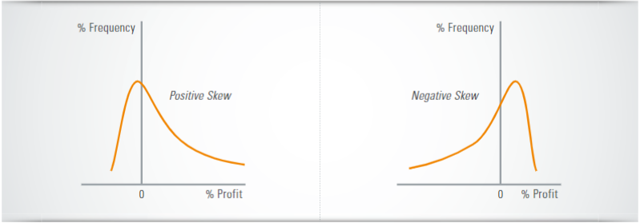

## Table of Contents

## What is the Sharpe Ratio and how is it calculated?

The Sharpe Ratio is a way to measure how well an investment is doing compared to how risky it is. It was created by a man named William F. Sharpe. The ratio helps investors see if the extra return they get from an investment is worth the extra risk they are taking. A higher Sharpe Ratio means the investment is doing better for the amount of risk involved.

To calculate the Sharpe Ratio, you need three pieces of information: the return of the investment, the risk-free rate, and the standard deviation of the investment's returns. The risk-free rate is usually the return you would get from a very safe investment, like a government bond. The standard deviation shows how much the investment's returns go up and down. You subtract the risk-free rate from the investment's return, and then divide that by the standard deviation. The formula looks like this: Sharpe Ratio = (Return of the investment - Risk-free rate) / Standard deviation of the investment's returns.

## What is the Sortino Ratio and how is it calculated?

The Sortino Ratio is another way to measure how well an investment is doing, but it focuses on the bad kind of risk, or downside risk. This ratio was created by a man named Frank A. Sortino. It helps investors see if the extra return they get from an investment is worth the risk of losing money. A higher Sortino Ratio means the investment is doing better for the amount of downside risk involved.

To calculate the Sortino Ratio, you need three pieces of information: the return of the investment, the risk-free rate, and the downside deviation of the investment's returns. The risk-free rate is the return you would get from a very safe investment, like a government bond. The downside deviation is different from the standard deviation because it only looks at the times when the investment's returns are lower than the risk-free rate. You subtract the risk-free rate from the investment's return, and then divide that by the downside deviation. The formula looks like this: Sortino Ratio = (Return of the investment - Risk-free rate) / Downside deviation of the investment's returns.

## What are the key differences between the Sharpe Ratio and the Sortino Ratio?

The main difference between the Sharpe Ratio and the Sortino Ratio is what kind of risk they look at. The Sharpe Ratio uses the standard deviation to measure all kinds of risk, both good and bad. This means it treats all ups and downs in an investment's returns the same way. On the other hand, the Sortino Ratio focuses only on the bad kind of risk, which is called downside risk. It only cares about the times when the investment's returns are lower than a safe investment, like a government bond. This makes the Sortino Ratio more useful if you're worried about losing money.

Another difference is how these ratios can change the way you see an investment's performance. Because the Sharpe Ratio looks at all kinds of risk, it might make an investment look less attractive if it has big ups and downs, even if those ups are good for you. The Sortino Ratio, by only looking at downside risk, might show that the same investment is actually doing well because it's not penalizing the good ups. So, if you're an investor who doesn't mind big gains but really wants to avoid big losses, the Sortino Ratio might be a better tool for you to use.

## How do the Sharpe and Sortino Ratios measure risk differently?

The Sharpe Ratio and the Sortino Ratio measure risk in different ways. The Sharpe Ratio looks at all kinds of risk, both good and bad. It uses something called standard deviation, which is a way to see how much an investment's returns go up and down. If an investment has big ups and downs, the Sharpe Ratio will see that as a lot of risk, even if some of those ups are good for you. This means the Sharpe Ratio might make an investment look riskier than it feels to you if you like those big ups.

On the other hand, the Sortino Ratio only cares about the bad kind of risk, which is called downside risk. It uses something called downside deviation, which only looks at the times when the investment's returns are lower than a safe investment, like a government bond. If an investment has big ups but only small downs, the Sortino Ratio will see it as less risky because it's only counting the bad downs. This makes the Sortino Ratio a better tool if you're an investor who really wants to avoid losing money but doesn't mind big gains.

## What are the advantages of using the Sharpe Ratio for investment analysis?

The Sharpe Ratio is really helpful for investors because it gives a quick and easy way to see how well an investment is doing for the amount of risk it takes. It's like a score that shows if the extra money you might make from an investment is worth the extra risk. This ratio is great for comparing different investments. If one investment has a higher Sharpe Ratio than another, it means that investment is giving you more return for the same amount of risk, or the same return for less risk. This makes it easier for investors to pick the best investments out of a bunch of choices.

Another advantage of the Sharpe Ratio is that it's very well-known and widely used. Because so many people use it, you can easily find Sharpe Ratios for lots of different investments. This means you can quickly compare how risky and rewarding different investments might be. Also, because it's so popular, it's easy to learn about and understand. Even if you're new to investing, you can use the Sharpe Ratio to make smart choices about where to put your money.

## What are the advantages of using the Sortino Ratio for investment analysis?

The Sortino Ratio is a great tool for investors because it only looks at the bad kind of risk, called downside risk. This means it helps you see if the extra money you might make from an investment is worth the risk of losing money. If you're an investor who doesn't want to lose money but is okay with big gains, the Sortino Ratio is really useful. It shows you how well an investment is doing without counting the good ups as risk, so you can focus on avoiding big losses.

Another advantage of the Sortino Ratio is that it can make some investments look better than they would with the Sharpe Ratio. If an investment has big ups and only small downs, the Sortino Ratio will see it as less risky because it only cares about the downs. This can help you find investments that might be good for you but wouldn't look as good if you were using the Sharpe Ratio. By using the Sortino Ratio, you can make better choices that fit your goals of avoiding losses while still aiming for good returns.

## Can you provide an example of how to apply the Sharpe Ratio in a real-world investment scenario?

Let's say you're thinking about investing in a stock fund that has given an average return of 10% over the last year. You also know that the risk-free rate, which is what you'd get from a very safe investment like a government bond, is 2%. To find out if this stock fund is a good choice for the risk you're taking, you can use the Sharpe Ratio. First, you need to know the standard deviation of the stock fund's returns, which measures how much the returns go up and down. Let's say the standard deviation is 15%. Now, you can calculate the Sharpe Ratio like this: (10% - 2%) / 15% = 0.53.

This Sharpe Ratio of 0.53 tells you how much extra return you're getting for the risk you're taking. A higher Sharpe Ratio means the investment is doing better for the amount of risk involved. If you compare this stock fund to another investment, like a bond fund with a Sharpe Ratio of 0.3, you can see that the stock fund is giving you more return for the same amount of risk. This helps you decide if the stock fund is a good choice for your investment goals.

## Can you provide an example of how to apply the Sortino Ratio in a real-world investment scenario?

Imagine you're looking at a stock fund that has given an average return of 10% over the last year. You know the risk-free rate, which is what you'd get from a very safe investment like a government bond, is 2%. To see if this stock fund is a good choice for you, especially if you're worried about losing money, you can use the Sortino Ratio. First, you need to know the downside deviation of the stock fund's returns, which only looks at the times when the returns are lower than the risk-free rate. Let's say the downside deviation is 10%. Now, you can calculate the Sortino Ratio like this: (10% - 2%) / 10% = 0.8.

This Sortino Ratio of 0.8 tells you how much extra return you're getting for the risk of losing money. A higher Sortino Ratio means the investment is doing better for the amount of downside risk involved. If you compare this stock fund to another investment, like a bond fund with a Sortino Ratio of 0.4, you can see that the stock fund is giving you more return for the same amount of downside risk. This helps you decide if the stock fund is a good choice for your investment goals, especially if you want to avoid big losses.

## How do the Sharpe and Sortino Ratios handle non-normal distribution of returns?

Both the Sharpe and Sortino Ratios can have trouble when the returns of an investment don't follow a normal pattern, which means the ups and downs aren't spread out evenly like a bell curve. The Sharpe Ratio uses standard deviation to measure risk, which assumes that returns are normally distributed. If the returns are not normal, the standard deviation might not be a good way to measure risk. For example, if an investment has a few big losses but lots of small gains, the standard deviation might make it look riskier than it really is because it counts both the big losses and the small gains the same way.

The Sortino Ratio tries to fix this by only looking at downside risk, which means it only cares about the times when the investment loses money. But even the Sortino Ratio can have problems with non-normal distributions. It uses downside deviation, which only looks at returns below the risk-free rate. If the investment has a few very big losses, the downside deviation might make the investment look even riskier than it feels to you. So, while the Sortino Ratio is better at focusing on the risk of losing money, it still might not work perfectly if the returns are not spread out in a normal way.

## What are the limitations of the Sharpe Ratio in investment performance evaluation?

The Sharpe Ratio has some problems when you use it to see how well an investment is doing. One big problem is that it thinks all kinds of risk are the same. It uses something called standard deviation to measure risk, which looks at all the ups and downs in an investment's returns. But if you're an investor who doesn't mind big gains but really wants to avoid big losses, the Sharpe Ratio might not be the best tool for you. It might make an investment look riskier than it feels to you because it counts both the good ups and the bad downs the same way.

Another problem with the Sharpe Ratio is that it assumes the returns of an investment follow a normal pattern, like a bell curve. But in the real world, returns often don't follow this pattern. If an investment has a few big losses but lots of small gains, the Sharpe Ratio might make it look riskier than it really is. This is because the standard deviation will be high, even though the big losses are what you're really worried about. So, if the returns of an investment are not spread out evenly, the Sharpe Ratio might not give you a good picture of how risky it really is.

## What are the limitations of the Sortino Ratio in investment performance evaluation?

The Sortino Ratio tries to focus only on the bad kind of risk, which is losing money. But it still has some problems. One big problem is that it needs you to decide what a bad return is. You have to pick a number, called the minimum acceptable return, to say when a return is bad. If you pick the wrong number, the Sortino Ratio might not show the right amount of risk. This can make it hard to compare different investments because everyone might pick a different number.

Another problem with the Sortino Ratio is that it can have trouble when the returns of an investment don't follow a normal pattern. The Sortino Ratio uses downside deviation to measure risk, which only looks at the times when the investment loses money. But if an investment has a few very big losses, the downside deviation might make it look even riskier than it feels to you. So, while the Sortino Ratio is better at focusing on the risk of losing money, it still might not work perfectly if the returns are not spread out in a normal way.

## How can investors use both the Sharpe and Sortino Ratios together to make better investment decisions?

Investors can use both the Sharpe and Sortino Ratios together to get a fuller picture of an investment's risk and reward. The Sharpe Ratio looks at all kinds of risk, both good and bad, and helps you see if the extra return you get from an investment is worth all the ups and downs. On the other hand, the Sortino Ratio only cares about the bad kind of risk, which is losing money. By using both ratios, you can see how an investment does when you count all the risk and when you only count the risk of losing money. This can help you pick investments that fit your goals better, whether you're okay with big ups and downs or really want to avoid big losses.

For example, if you're looking at a stock fund, you might find that it has a high Sharpe Ratio, which means it's doing well for the amount of risk it takes. But if you also look at the Sortino Ratio and see that it's low, it might mean the fund has some big losses that you want to avoid. By comparing both ratios, you can decide if the stock fund is a good choice for you. If you're okay with the big ups and downs, the high Sharpe Ratio might be enough to make you want to invest. But if you really want to avoid losing money, the low Sortino Ratio might make you look for a different investment. Using both ratios together helps you make smarter choices that fit what you're looking for in an investment.

## What is the Sharpe Ratio and how do we understand it?

The Sharpe Ratio is a widely recognized financial metric used to assess the risk-adjusted return of an investment portfolio. Named after its creator, Nobel laureate William F. Sharpe, this ratio serves as a foundational tool for investors, particularly in the area of algorithmic trading, where understanding the balance of risk and return is crucial.

### Calculation of the Sharpe Ratio

The formula for calculating the Sharpe Ratio is as follows:

$$
\text{Sharpe Ratio} = \frac{R_p - R_f}{\sigma_p}
$$

where:
- $R_p$ is the average return of the portfolio.
- $R_f$ is the risk-free rate, typically the return of government bonds like U.S. Treasury bills.
- $\sigma_p$ is the standard deviation of the portfolio's excess return, which measures the portfolio's total risk.

The numerator, $R_p - R_f$, represents the excess return over the risk-free rate, indicating how much additional return an investor receives for the extra risk taken. The denominator, $\sigma_p$, provides a measure of the [volatility](/wiki/volatility-trading-strategies) or risk associated with the portfolio's returns. 

A higher Sharpe Ratio suggests a more favorable ratio of risk-adjusted returns, making it a vital benchmark for algorithmic traders. These traders utilize the Sharpe Ratio to optimize their strategies by seeking to maximize returns for a given level of risk.

### Significance for Algorithmic Trading

In algorithmic trading, strategies are designed to capitalize on market inefficiencies and price anomalies. However, these opportunities come with inherent risks. By incorporating the Sharpe Ratio into their performance analysis, traders can better align their strategies with desired risk levels. A common approach is to adjust the strategy parameters to achieve the highest possible Sharpe Ratio, thereby enhancing the reward-to-risk profile.

#### Example in Algo Trading

Consider an algorithmic trading strategy that targets price [momentum](/wiki/momentum). An algo trader sets the strategy to trade based on historical price patterns, aiming to capture profitable trends. To evaluate the strategy's effectiveness, the trader calculates the Sharpe Ratio over a historical data period. If the result yields a high Sharpe Ratio, it implies that the strategy produced significant returns relative to the risk undertaken. Conversely, a low Sharpe Ratio may indicate a need to revise the strategy or explore alternative approaches.

Here's a simple Python code snippet to calculate the Sharpe Ratio for an investment strategy:

```python
import numpy as np

def calculate_sharpe_ratio(returns, risk_free_rate):
    excess_returns = returns - risk_free_rate
    avg_excess_return = np.mean(excess_returns)
    std_dev_excess_return = np.std(excess_returns)

    sharpe_ratio = avg_excess_return / std_dev_excess_return
    return sharpe_ratio

# Example usage:
returns = np.array([0.02, 0.03, 0.01, 0.05, 0.04])  # Example monthly returns
risk_free_rate = 0.01  # Monthly risk-free rate
sharpe_ratio = calculate_sharpe_ratio(returns, risk_free_rate)
print(f'Sharpe Ratio: {sharpe_ratio}')
```

In this context, algorithmic traders leverage the Sharpe Ratio not just as a solitary metric but as an ongoing analytical tool. Regular monitoring and adapting of trading strategies based on the Sharpe Ratio's insights are pivotal in maintaining a robust trading framework. This thorough application helps in achieving superior risk-adjusted performance, thereby contributing significantly to the traders' success in increasingly competitive financial markets.

## What is the Sortino Ratio and how can it be explored?

The Sortino Ratio is an adaptation of the Sharpe Ratio that focuses specifically on downside risk, distinguishing between harmful volatility—pertaining to potential losses—and overall market volatility. This refinement makes the Sortino Ratio particularly valuable when assessing investments characterized by positive skewness and asymmetric return distributions, where the primary concern is minimizing negative volatility rather than total volatility.

### Calculation of the Sortino Ratio

The Sortino Ratio is computed as follows:

$$
\text{Sortino Ratio} = \frac{R - R_f}{\mathrm{DD}}
$$

where:
- $R$ represents the average return of the investment.
- $R_f$ is the risk-free rate.
- $\mathrm{DD}$ stands for downside deviation, instead of the total standard deviation as used in the Sharpe Ratio.

The downside deviation, $\mathrm{DD}$, is defined by considering only the returns that fall below a minimum acceptable return (MAR). It reflects the frequency and magnitude of undesirable returns, calculated as follows:

$$
\mathrm{DD} = \sqrt{\frac{1}{N} \sum_{i=1}^{N} \min(R_i - \text{MAR}, 0)^2}
$$

Here $R_i$ denotes the returns below the MAR, and $N$ is the number of observations. 

By focusing on downside risk, the Sortino Ratio enables investors to assess how well their investments perform in avoiding poor outcomes.

### Applications in Algorithmic Trading

In algorithmic trading, the ability to optimize strategies for better risk management is essential. Traders use the Sortino Ratio to gain insights into how their strategies perform during adverse market conditions. By concentrating on downside risk, algo traders can fine-tune their models to limit potential losses while preserving performance potential.

For instance, an algorithm that systematically evaluates the Sortino Ratio might prioritize strategies where the potential losses are minimized, even if it sometimes means accepting lower overall volatility. This focus ensures that the strategy remains resilient through market downturns, a critical consideration for long-term viability.

#### Real-World Example

Consider an algo trading strategy that relies on [machine learning](/wiki/machine-learning) algorithms to predict stock movements. If the strategy shows a high Sortino Ratio over a significant period, this indicates it's effectively managing downside risk—essentially, the strategy is savvy at avoiding days with significant losses. This observation provides confidence to investors that the algorithm can withstand volatility and market turbulence.

By judiciously applying the Sortino Ratio, traders are better equipped to evaluate and enhance their strategies, especially in contexts where risk mitigation is prioritized. This ability is crucial for developing robust trading systems capable of delivering consistent performance across diverse market scenarios.

## How are ratios applied in algorithmic trading?

Algorithmic trading relies heavily on quantifiable metrics, such as the Sharpe and Sortino Ratios, to devise, evaluate, and adjust strategies. These ratios are critical in optimizing the balance between risk and return, thus enhancing overall trading performance.

To incorporate the Sharpe Ratio into algorithmic models, traders need to compute it by dividing the difference between the portfolio's returns and the risk-free rate by the standard deviation of the returns. The formula is:

$$
\text{Sharpe Ratio} = \frac{\overline{R_a} - R_f}{\sigma_a}
$$

where $\overline{R_a}$ is the average return of the asset, $R_f$ is the risk-free rate, and $\sigma_a$ is the standard deviation of the asset's excess return. Traders can implement this calculation in Python using libraries like NumPy and Pandas to handle data manipulation and statistical operations efficiently.

Similarly, the Sortino Ratio, which focuses on downside risk, is computed by subtracting the risk-free rate from the asset’s return and then dividing by the downside deviation:

$$
\text{Sortino Ratio} = \frac{\overline{R_a} - R_f}{\text{Downside Deviation}}
$$

The downside deviation measures the standard deviation of negative asset returns, excluding positive returns, thus providing more insight into the risk of loss. This metric is particularly useful for traders looking to assess strategies that favor reducing potential losses over overall volatility.

Practical implementation of these ratios in trading algorithms can be achieved through software tools such as QuantConnect or MetaTrader, which offer robust environments for [backtesting](/wiki/backtesting) and optimizing trading strategies. For instance, traders can use Python scripts in QuantConnect to calculate these ratios dynamically as part of their algorithms, thereby continuously assessing strategy performance against risk-adjusted benchmarks.

Case studies of successful algorithmic trading strategies often highlight the effective use of Sharpe and Sortino Ratios. For example, a long-short equity strategy that consistently maintained a Sharpe Ratio above 1.5 and a Sortino Ratio above 2 demonstrated robust risk-adjusted returns. These metrics guided strategy adjustments by indicating periods of heightened risk or inadequate returns, prompting timely reallocation or diversification tactics.

Continuous monitoring and adjustment of trading strategies based on the performance outputs of these ratios are crucial. Automated systems could be programmed to trigger alerts or automatically modify positions when Sharpe or Sortino Ratios deviate from predefined thresholds. Through proactive management, traders can enhance decision-making and maintain optimal risk-reward balances.

In conclusion, the integration of Sharpe and Sortino Ratios into algorithmic trading frameworks facilitates a structured approach to risk management and strategy assessment. By leveraging these ratios, traders can better adapt to dynamic market conditions and strive for superior investment outcomes.

## References & Further Reading

[1]: Sharpe, W. F. (1994). ["The Sharpe Ratio."](https://web.stanford.edu/~wfsharpe/art/sr/SR.htm) Journal of Portfolio Management, 21(1): 49-58.

[2]: Sortino, F. A., & Van Der Meer, R. (1991). ["Downside Risk."](https://www.semanticscholar.org/paper/Downside-risk-Sortino-Meer/2966d65b7995eaa2ee51b42ef496247f220c208e) Journal of Portfolio Management, 17(4): 27-31.

[3]: Lopez de Prado, M. (2018). ["Advances in Financial Machine Learning."](https://www.amazon.com/Advances-Financial-Machine-Learning-Marcos/dp/1119482089) Wiley Finance.

[4]: Aronson, D. R. (2007). ["Evidence-Based Technical Analysis: Applying the Scientific Method and Statistical Inference to Trading Signals."](https://www.amazon.com/Evidence-Based-Technical-Analysis-Scientific-Statistical/dp/0470008741) Wiley.

[5]: Chan, E. (2008). ["Quantitative Trading: How to Build Your Own Algorithmic Trading Business."](https://github.com/ftvision/quant_trading_echan_book) Wiley Trading.

[6]: Jansen, S. (2020). ["Machine Learning for Algorithmic Trading."](https://github.com/stefan-jansen/machine-learning-for-trading) Packt Publishing.

[7]: Amenc, N., & Martellini, L. (2002). ["Portfolio Optimization and Hedge Fund Style Allocation Decisions."](https://papers.ssrn.com/sol3/papers.cfm?abstract_id=305006) Journal of Financial Markets, Instruments & Institutions.