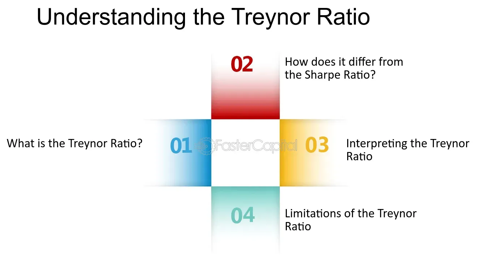

## Table of Contents

## What is the Sharpe Ratio and how is it calculated?

The Sharpe Ratio is a way to measure how good an investment is by comparing its returns to its risk. It was created by a man named William F. Sharpe. The ratio helps investors see if the extra returns they get from an investment are worth the extra risk they are taking. A higher Sharpe Ratio means the investment is doing a better job of giving good returns for the amount of risk involved.

To calculate the Sharpe Ratio, you need three things: the return of the investment, the risk-free rate, and the standard deviation of the investment's returns. The risk-free rate is what you could earn from a very safe investment, like a government bond. The standard deviation shows how much the investment's returns go up and down. You subtract the risk-free rate from the investment's return, and then divide that by the standard deviation. The formula looks like this: Sharpe Ratio = (Return of the investment - Risk-free rate) / Standard deviation of the investment's returns.

## What is the Treynor Ratio and how is it calculated?

The Treynor Ratio is another way to measure how good an investment is, similar to the Sharpe Ratio. It was created by Jack L. Treynor. This ratio looks at how much return an investment gives for the amount of risk it takes, but it measures risk in a different way. Instead of using the standard deviation like the Sharpe Ratio, the Treynor Ratio uses something called beta. Beta shows how much an investment moves with the overall market. A higher Treynor Ratio means the investment is doing well at giving returns for the risk it takes.

To calculate the Treynor Ratio, you need the return of the investment, the risk-free rate, and the beta of the investment. The risk-free rate is what you could earn from a very safe investment, like a government bond. You subtract the risk-free rate from the investment's return, and then divide that by the beta. The formula is: Treynor Ratio = (Return of the investment - Risk-free rate) / Beta. This ratio is useful because it focuses on how an investment performs compared to the market as a whole, which can be helpful for investors who care about market risk.

## What is the main difference between the Sharpe Ratio and the Treynor Ratio?

The main difference between the Sharpe Ratio and the Treynor Ratio is how they measure risk. The Sharpe Ratio uses something called standard deviation to show how much an investment's returns go up and down. This means it looks at the total risk of the investment, including risks that are specific to that investment and risks that come from the overall market. On the other hand, the Treynor Ratio uses beta, which only measures how much an investment moves with the market. So, the Treynor Ratio focuses on market risk and ignores the risks that are unique to the investment itself.

Both ratios help investors see if the returns they get from an investment are worth the risk they take. But they give different kinds of information. If you want to know how an investment does compared to the whole market, the Treynor Ratio is better because it only looks at market risk. If you want to know about all kinds of risk, including the ones specific to the investment, the Sharpe Ratio is the one to use. Each ratio can be useful depending on what kind of risk you care about most.

## How do the Sharpe Ratio and Treynor Ratio use risk in their calculations?

The Sharpe Ratio uses something called standard deviation to measure risk. Standard deviation is a way to see how much an investment's returns go up and down. This means the Sharpe Ratio looks at all kinds of risk, both the risks that come from the market and the risks that are special to the investment itself. When you calculate the Sharpe Ratio, you take the return of the investment, subtract the risk-free rate, and then divide by the standard deviation. This tells you how much return you're getting for every bit of total risk you're taking.

The Treynor Ratio, on the other hand, uses beta to measure risk. Beta shows how much an investment moves with the market. So, the Treynor Ratio only looks at the risk that comes from the market and ignores the special risks of the investment itself. To find the Treynor Ratio, you take the return of the investment, subtract the risk-free rate, and then divide by the beta. This ratio tells you how much return you're getting for every bit of market risk you're taking. Both ratios help you see if the returns are worth the risk, but they focus on different kinds of risk.

## Can you explain the concept of risk-free rate in the context of these ratios?

The risk-free rate is an important part of both the Sharpe Ratio and the Treynor Ratio. It's the return you can get from a very safe investment, like a government bond. This rate is called "risk-free" because the chance of losing your money is very low. In these ratios, the risk-free rate is used as a starting point to see how much extra return an investment gives you compared to what you could get safely.

When you calculate the Sharpe Ratio or the Treynor Ratio, you subtract the risk-free rate from the return of the investment. This shows you the extra return, or "excess return," that the investment gives you for taking on more risk. By doing this, the ratios help you see if the extra return is worth the extra risk. If the investment's return is only a little bit higher than the risk-free rate, but the risk is a lot higher, it might not be a good choice. But if the extra return is big compared to the risk, it could be a good investment.

## What types of investments are each ratio more suited to evaluate?

The Sharpe Ratio is good for looking at all kinds of investments, like stocks, bonds, or mutual funds. It's useful because it looks at all the risk, not just the risk from the market. This means it can help you see if an investment is worth it, even if it has risks that are special to that investment. If you want to know how an investment does compared to a safe option like a government bond, and you care about all kinds of risk, the Sharpe Ratio is a good choice.

The Treynor Ratio is better for investments that you want to compare to the whole market, like stocks or stock funds. It only looks at the risk that comes from the market, which is called market risk. This makes it helpful if you want to see how an investment does compared to the market, without worrying about risks that are special to that investment. If you're thinking about how an investment moves with the market and you want to know if the extra return is worth the market risk, the Treynor Ratio is the one to use.

## How do you interpret the results of the Sharpe Ratio and Treynor Ratio?

When you look at the Sharpe Ratio, a higher number means the investment is doing a good job at giving you returns for the risk you're taking. If the Sharpe Ratio is positive, it means the investment is doing better than a safe investment like a government bond. The bigger the number, the better the investment is at giving you extra returns for the total risk you're taking. But if the Sharpe Ratio is zero or negative, it means the investment isn't giving you enough return to make the risk worth it. So, you want to see a high, positive Sharpe Ratio to know if an investment is a good choice.

The Treynor Ratio works in a similar way, but it looks at how an investment does compared to the market. A higher Treynor Ratio means the investment is doing well at giving you returns for the risk that comes from the market. If the Treynor Ratio is positive, it means the investment is doing better than a safe investment, and the bigger the number, the better it is at giving you extra returns for the market risk. If the Treynor Ratio is zero or negative, it means the investment isn't worth the market risk you're taking. So, you want to see a high, positive Treynor Ratio to know if an investment is a good choice when you're thinking about how it moves with the market.

## What are the limitations of using the Sharpe Ratio?

One problem with the Sharpe Ratio is that it assumes the returns of an investment follow a normal pattern. But in real life, returns can be all over the place. This means the Sharpe Ratio might not show the true risk of an investment, especially if it can lose a lot of money quickly. Also, the Sharpe Ratio looks at all kinds of risk, but sometimes you might care more about the risk that comes from the market. If you only want to know about market risk, the Sharpe Ratio might not be the best choice because it includes other kinds of risk too.

Another issue is that the Sharpe Ratio uses something called standard deviation to measure risk. Standard deviation looks at how much the returns go up and down, but it treats going up and going down the same way. In real life, most people don't like losing money as much as they like making money. So, the Sharpe Ratio might not show how bad it feels to lose money. Also, the Sharpe Ratio can be hard to compare across different investments if they have different ways of making money. For example, comparing the Sharpe Ratio of a stock to a bond might not be fair because they work in different ways.

## What are the limitations of using the Treynor Ratio?

One limitation of the Treynor Ratio is that it only looks at market risk and ignores the special risks that come with each investment. This can be a problem if you care about all the risks, not just the ones from the market. For example, if an investment has a lot of risk that doesn't come from the market, the Treynor Ratio might make it look better than it really is because it doesn't count those risks.

Another issue is that the Treynor Ratio uses beta to measure risk, but beta can be tricky. Beta shows how an investment moves with the market, but it can change over time. If the market changes a lot, the beta might not be a good measure of risk anymore. Also, the Treynor Ratio can be hard to use if you're looking at investments that don't move with the market in a clear way. If an investment doesn't have a stable beta, the Treynor Ratio might not give you a good idea of the risk and return.

## How can the Sharpe Ratio and Treynor Ratio be used together for portfolio analysis?

Using both the Sharpe Ratio and the Treynor Ratio together can help you get a fuller picture of your investment portfolio. The Sharpe Ratio looks at all the risk, including the risks that are special to each investment. This helps you see if the extra return you get is worth all the risk you're taking. On the other hand, the Treynor Ratio only looks at the risk that comes from the market. This is good if you want to know how your investments do compared to the market as a whole. By using both ratios, you can understand both the total risk and the market risk, which can help you make better choices about your investments.

For example, if you see a high Sharpe Ratio for an investment, it means it's doing well at giving you returns for all the risk you're taking. But if the Treynor Ratio is low, it might mean that the investment isn't doing as well when you only look at the market risk. This can help you decide if the investment is worth it, depending on what kind of risk you care about most. By looking at both ratios, you can balance the total risk and the market risk to find the best investments for your portfolio.

## What advanced statistical considerations should be taken into account when using these ratios?

When using the Sharpe Ratio and the Treynor Ratio, it's important to think about how the returns of investments behave over time. Both ratios assume that returns follow a normal pattern, but in real life, returns can be very different. They can have big jumps or drops that a normal pattern wouldn't expect. This is called "non-normality" or "fat tails." If you don't think about this, the ratios might not show the true risk of losing a lot of money quickly. Also, the Sharpe Ratio uses something called standard deviation, which looks at how much returns go up and down. But standard deviation treats going up and going down the same way, even though most people feel worse about losing money than they feel good about making money. This is called "asymmetry" or "skewness," and it can make the Sharpe Ratio less useful if you don't take it into account.

Another thing to think about is how the Sharpe Ratio and the Treynor Ratio work over different time periods. Both ratios are usually calculated using past data, but past returns might not be a good guide for what will happen in the future. This is called "time-varying risk." If the risk of an investment changes a lot over time, the ratios might not give you a good idea of the risk now or in the future. The Treynor Ratio also uses beta, which measures how an investment moves with the market. But beta can change over time, especially if the market changes a lot. This can make the Treynor Ratio less useful if you don't update the beta often. By thinking about these advanced statistical ideas, you can use the Sharpe Ratio and the Treynor Ratio in a smarter way to understand the risk and return of your investments better.

## How do these ratios perform in different market conditions and how should they be adjusted?

The Sharpe Ratio and the Treynor Ratio can act differently in different market conditions. In calm markets, where prices don't change much, both ratios can give a good idea of how an investment is doing. But in wild markets, where prices jump around a lot, the ratios might not work as well. The Sharpe Ratio might not show the true risk because it looks at how much returns go up and down, but it doesn't care if those changes are big or small. The Treynor Ratio can also be tricky because it uses beta, which measures how an investment moves with the market. If the market is acting crazy, the beta might not be a good measure anymore.

To make these ratios work better in different market conditions, you need to think about how the market is acting and change how you use the ratios. For the Sharpe Ratio, you might want to look at something called "downside risk" instead of just standard deviation. Downside risk only looks at the bad changes in returns, which can be more important in wild markets. For the Treynor Ratio, you should update the beta often, especially when the market is changing a lot. By doing this, you can get a better idea of how an investment is doing, even when the market is acting crazy.

## What are the key aspects of understanding investment metrics?

Investment metrics serve as essential quantitative tools for investors seeking to assess the performance and potential profitability of their portfolios. These metrics provide a structured approach to evaluate various dimensions of an investment, highlighting both gains and potential risks associated with different financial instruments.

One fundamental investment metric is the absolute return, which represents the simple percentage increase or decrease in the value of an investment. Absolute return is calculated using the formula:

$$
\text{Absolute Return} = \frac{\text{Final Value} - \text{Initial Value}}{\text{Initial Value}} \times 100\%
$$

While absolute return offers a straightforward measure of profitability, it does not account for the time period over which the investment is held. Thus, annualized return is often used to provide a more standardized view of performance across various timeframes. The annualized return adjusts the absolute return to reflect a yearly rate of growth, facilitating a more meaningful comparison between investments with different durations. It can be calculated using:

$$
\text{Annualized Return} = \left( \left( \frac{\text{Final Value}}{\text{Initial Value}} \right)^{\frac{1}{n}} - 1 \right) \times 100\%
$$

where $n$ is the number of years the investment is held.

In the context of automated trading, investment metrics are crucial for enabling rapid decision-making. Automated trading systems rely on algorithmic processes to analyze vast amounts of data and execute trades based on predefined criteria. By integrating investment metrics into these algorithms, traders can swiftly assess the efficiency of their strategies and fine-tune them to optimize performance.

To illustrate, consider a simple Python code snippet that calculates both absolute and annualized returns for an investment:

```python
def calculate_returns(initial_value, final_value, years):
    absolute_return = ((final_value - initial_value) / initial_value) * 100
    annualized_return = (((final_value / initial_value) ** (1 / years)) - 1) * 100
    return absolute_return, annualized_return

initial = 1000  # Initial investment amount
final = 1500  # Final value of the investment
years = 3  # Holding period in years

absolute, annualized = calculate_returns(initial, final, years)
print(f"Absolute Return: {absolute:.2f}%")
print(f"Annualized Return: {annualized:.2f}%")
```

This program calculates and prints the absolute and annualized returns for an investment that grows from 1000 to 1500 over three years, demonstrating the utility of these metrics in evaluating investment outcomes.

As financial markets become more complex and data-driven, the ability to analyze investments through clear and quantifiable metrics becomes increasingly important. Utilizing investment metrics not only provides insights into current portfolio performance but also equips investors with the tools necessary to make informed adjustments, ultimately fostering more strategic and efficient investment practices.

## What are financial ratios and why are they important?

Financial ratios are critical analytical tools that provide insights into a company's financial health, performance, and valuation. They are utilized by investors, analysts, and other stakeholders to assess a company's operational efficiency, profitability, and market position relative to expectations. These ratios are derived from the company's financial statements, such as the balance sheet, income statement, and cash flow statement, and are often used to guide investment strategies.

One of the most common financial ratios is the **Price-to-Earnings (P/E) Ratio**, which is calculated as:

$$
\text{P/E Ratio} = \frac{\text{Market Price per Share}}{\text{Earnings per Share (EPS)}}
$$

The P/E ratio measures how much investors are willing to pay per dollar of earnings, indicating the market's expectations of a company's future profitability. A high P/E ratio may suggest that investors expect significant growth in the future, while a low P/E might indicate that the company is undervalued or experiencing difficulties.

Another vital ratio is the **Debt-to-Equity (D/E) Ratio**, expressed as:

$$
\text{D/E Ratio} = \frac{\text{Total Liabilities}}{\text{Shareholders' Equity}}
$$

The D/E ratio provides insights into the company's financial leverage and its ability to cover its outstanding debt with shareholder equity. A high D/E ratio may signal higher risk, as it indicates that a company is primarily financed through debt, which can impact its financial stability during economic downturns.

The **Return on Equity (ROE)** is also a crucial metric, calculated as:

$$
\text{ROE} = \frac{\text{Net Income}}{\text{Shareholders' Equity}}
$$

ROE measures a company's ability to generate profits from its shareholders' equity. A higher ROE indicates efficient management and strong profitability, making it a valuable tool for comparing the financial performance of companies within the same industry.

These financial ratios serve multiple purposes; they not only help assess intrinsic company value and performance but also aid in comparing different firms' financial conditions. By evaluating these ratios, investors can identify potential investment opportunities and make informed financial decisions.

## What are the Sharpe and Treynor Ratios in the context of Risk-Adjusted Return?

Risk-adjusted return metrics, such as the Sharpe and Treynor Ratios, play an essential role in evaluating how investment returns compensate for the risks involved. The Sharpe Ratio is widely utilized to measure total risk-adjusted return by taking into account standard deviation, which reflects the overall [volatility](/wiki/volatility-trading-strategies) of an investment. Mathematically, the Sharpe Ratio is represented as:

$$
\text{Sharpe Ratio} = \frac{R_p - R_f}{\sigma_p}
$$

where $R_p$ is the expected portfolio return, $R_f$ is the risk-free rate of return, and $\sigma_p$ is the standard deviation of the portfolio's excess return. A higher Sharpe Ratio indicates a more favorable risk-adjusted performance, as it suggests that additional returns are being generated per unit of risk undertaken.

On the other hand, the Treynor Ratio is specifically focused on assessing market risk, measured by beta ($\beta$). Beta represents the sensitivity of the investment's returns to market movements. The Treynor Ratio is calculated as follows:

$$
\text{Treynor Ratio} = \frac{R_p - R_f}{\beta_p}
$$

where $\beta_p$ is the beta of the portfolio. This ratio is particularly useful for evaluating portfolios that are part of a diversified portfolio, as it examines the returns earned beyond the risk-free rate in relation to the market risk assumed.

Both the Sharpe and Treynor Ratios are crucial in assessing the performance of investment portfolios, especially those utilizing [algorithmic trading](/wiki/algorithmic-trading) strategies. In algorithmic trading, these metrics can help optimize decision-making processes by providing insights into how well a trading strategy or investment portfolio compensates for the risk exposures it encounters.

Algorithmic traders often rely on [backtesting](/wiki/backtesting) and simulation techniques to evaluate these risk-adjusted return metrics, ensuring that strategies not only seek profitable opportunities but also manage risks efficiently. This process involves analyzing historical data to validate potential trading strategies and refine them for improved performance under varying market conditions, thereby strengthening the robustness of algorithmic operations.

## How can Algorithmic Trading leverage metrics?

Algorithmic trading utilizes sophisticated algorithms to automate trading activities, enhancing decision-making through precise and efficient use of investment metrics. The reliance on data-driven strategies has become pivotal in modern trading, particularly for its ability to analyze large datasets rapidly and execute trades based on pre-defined criteria.

Key metrics in assessing algorithmic trading strategies include maximum drawdown, win rate, and profit [factor](/wiki/factor-investing). Maximum drawdown measures the largest peak-to-trough loss in a portfolio, helping investors understand the potential downside risk associated with a strategy. It is mathematically expressed as:

$$

\text{Maximum Drawdown} = \frac{\text{Trough Value} - \text{Peak Value}}{\text{Peak Value}}
$$

A lower maximum drawdown indicates a more stable strategy, with fewer fluctuations in portfolio value.

Win rate, defined as the percentage of trades that are profitable, provides insight into the algorithm's accuracy and consistency. A balanced win rate, combined with other metrics, can help traders gauge the success of an algorithmic trading strategy better.

Profit factor is the ratio of gross profits to gross losses and indicates the strategy's profitability. A profit factor greater than one suggests that the strategy is profitable over time.

To refine these strategies and enhance performance, traders and investors frequently utilize backtesting platforms, which allow strategies to be tested using historical market data. Python is a preferred language in this process due to its simplicity and the availability of powerful libraries such as pandas and numpy, which facilitate data manipulation and analysis.

Here is a basic Python example for calculating maximum drawdown from historical equity data:

```python
import pandas as pd

def calculate_max_drawdown(equity_series):
    drawdown = (equity_series / equity_series.cummax()) - 1
    return drawdown.min()

# Example usage with an equity series
historical_data = pd.Series([100, 120, 150, 130, 125, 145])
max_dd = calculate_max_drawdown(historical_data)
print(f"Maximum Drawdown: {max_dd:.2%}")
```

Visualization tools, such as matplotlib or plotly, also play a significant role in analyzing and presenting backtest results, allowing traders to observe the performance comprehensively and identify potential areas for improvement.

In summary, the integration of metrics in algorithmic trading enhances decision-making, providing traders with the necessary tools to evaluate and optimize their strategies effectively. Continuous innovation in algorithmic approaches and the use of advanced data analytics ensure that this method remains at the forefront of financial trading.

## References & Further Reading

[1]: Markowitz, H. (1952). ["Portfolio Selection."](https://onlinelibrary.wiley.com/doi/abs/10.1111/j.1540-6261.1952.tb01525.x) The Journal of Finance, 7(1), 77-91.

[2]: Sharpe, W. F. (1966). ["Mutual Fund Performance."](https://www.jstor.org/stable/2351741) The Journal of Business, 39(1), Part 2: Supplement on Security Prices, 119-138.

[3]: Treynor, J. L. (1965). ["How to Rate Management of Investment Funds."](https://onlinelibrary.wiley.com/doi/10.1002/9781119196679.ch10) Harvard Business Review.

[4]: Tsay, R. S. (2010). ["Analysis of Financial Time Series."](https://onlinelibrary.wiley.com/doi/book/10.1002/9780470644560) Wiley.

[5]: Engle, R. F. (1982). ["Autoregressive Conditional Heteroscedasticity with Estimates of the Variance of U.K. Inflation."](https://www.econometricsociety.org/publications/econometrica/1982/07/01/autoregressive-conditional-heteroscedasticity-estimates) Econometrica, 50(4), 987-1007.

[6]: Harris, L. (2003). ["Trading and Exchanges: Market Microstructure for Practitioners."](https://academic.oup.com/book/52292) Oxford University Press.

[7]: Hull, J. C. (2015). ["Risk Management and Financial Institutions."](https://archive.org/download/quant_books/Risk%20Management%20_%20Financial%20Institutions%20-%20J.%20C.%20Hull.pdf) Wiley.

[8]: Aldridge, I. (2013). ["High-Frequency Trading: A Practical Guide to Algorithmic Strategies and Trading Systems."](https://onlinelibrary.wiley.com/doi/pdf/10.1002/9781119203803.fmatter) Wiley.

[9]: Pardo, R. (2008). ["The Evaluation and Optimization of Trading Strategies."](https://onlinelibrary.wiley.com/doi/book/10.1002/9781119196969) Wiley.

[10]: Menkveld, A. J. (2013). ["High Frequency Trading and the New Market Makers."](https://papers.ssrn.com/sol3/papers.cfm?abstract_id=1722924) Journal of Financial Markets, 16(4), 712-740.