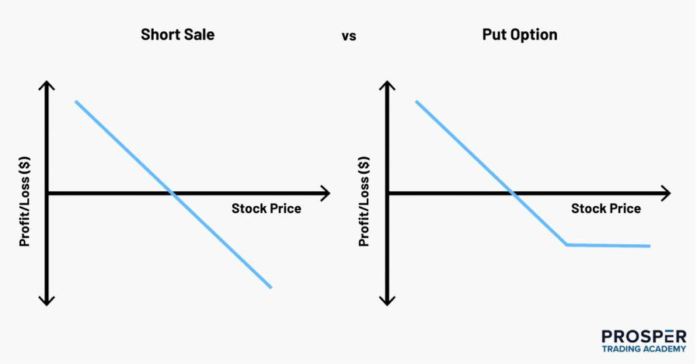

## Table of Contents

## What is short selling and how does it work?

Short selling is when you borrow a stock from someone else and sell it right away, hoping the price will go down. If the price does drop, you buy the stock back at the lower price, give it back to the person you borrowed it from, and keep the difference as profit. It's like betting that a stock's price will fall instead of rise.

However, short selling can be risky. If the stock price goes up instead of down, you'll have to buy it back at a higher price. This means you lose money because you have to pay more to replace the stock you borrowed. It's a way to make money if you think a stock is going to decrease in value, but it can lead to big losses if you're wrong.

## What are put options and how do they function?

Put options are like insurance for stocks. You buy a put option if you think the price of a stock is going to go down. When you buy a put option, you pay a fee, called a premium, to have the right to sell a specific stock at a set price, known as the strike price, before a certain date. If the stock's price drops below the strike price, you can sell the stock at the higher strike price and make a profit.

For example, let's say you buy a put option for a stock that's currently worth $50, with a strike price of $45 and an expiration date in one month. If the stock falls to $40 before the option expires, you can buy the stock at $40 and then use your put option to sell it at $45, making a $5 profit per share (minus the cost of the option). But if the stock stays above $45, your put option will expire worthless, and you'll lose the money you paid for the option.

## What are the basic differences between short selling and buying put options?

Short selling and buying put options are two ways to bet that a stock's price will go down, but they work differently. When you short sell, you borrow a stock and sell it right away, hoping to buy it back later at a lower price. If the price does drop, you make money by buying it back cheaper and returning it to the lender. But if the price goes up, you lose money because you have to buy it back at a higher price. Short selling can lead to big losses because there's no limit to how high a stock's price can go.

Buying a put option is like buying insurance against a stock's price dropping. You pay a fee, called a premium, to have the right to sell a stock at a set price, called the strike price, before a certain date. If the stock's price falls below the strike price, you can buy the stock at the lower market price and then use your put option to sell it at the higher strike price, making a profit. If the stock's price stays above the strike price, you just lose the money you paid for the option. The most you can lose with a put option is the premium you paid, which makes it less risky than short selling.

## How do the financial risks of short selling compare to those of buying put options?

Short selling is riskier than buying put options. When you short sell, you borrow a stock and sell it, hoping to buy it back later at a lower price. But if the stock's price goes up instead of down, you lose money because you have to buy it back at the higher price to give it back to the person you borrowed it from. There's no limit to how high a stock's price can go, so your losses can be huge. This makes short selling very risky.

On the other hand, buying a put option is less risky. When you buy a put option, you pay a fee, called a premium, to have the right to sell a stock at a set price before a certain date. The most you can lose is the money you paid for the option. If the stock's price stays above the set price, your option expires worthless, and you lose the premium. But that's all you lose, so your risk is limited to the amount you paid for the option. This makes buying put options a safer way to bet that a stock's price will go down.

## What are the potential rewards associated with short selling versus buying put options?

Short selling can lead to big rewards if you guess right that a stock's price will go down. If the price drops a lot, you can buy the stock back at a lower price and make a good profit. The more the price falls, the more money you can make. But you need to be right about the stock going down, and you need to do it before the price starts going up again.

Buying put options can also be rewarding if the stock's price goes down. If it falls below the strike price you chose, you can sell the stock at that higher price and make money. The reward is the difference between the strike price and the lower market price, minus the cost of the option. The good thing about put options is that you know the most you can lose is the money you paid for the option, so you can plan your rewards better.

## How does the cost of executing a short sale compare to the cost of buying a put option?

The cost of executing a short sale includes several parts. First, you might have to pay a fee to borrow the stock you're selling short. This fee can change and can be higher if the stock is hard to borrow. Second, when you sell the stock, you need to put up money or other stocks as a guarantee, called margin. This margin can cost you money because you might have to pay interest on it. Finally, if the stock's price goes up, you lose money when you buy it back at a higher price.

Buying a put option is simpler and usually cheaper upfront. You just pay a one-time fee, called the premium, to buy the option. This premium is the most you can lose, no matter what happens to the stock's price. You don't have to borrow the stock or put up margin, so you don't have to worry about borrowing fees or interest costs. But remember, the premium can be high if the stock is expected to move a lot or if there's not much time left until the option expires.

## What are the time horizons typically associated with short selling and put options?

Short selling usually doesn't have a set time limit. You can keep the short position open as long as you want, but you have to be careful. The person you borrowed the stock from can ask for it back anytime, and you'll have to buy it back to return it. Also, if the stock's price goes up a lot, you might get a margin call and have to buy it back even if you don't want to. So, short selling can be for the short term or the long term, but it's risky because you never know when you'll have to close the position.

Buying a put option has a clear time limit. When you buy the option, it comes with an expiration date. This means you have to use the option to sell the stock at the strike price before that date, or you lose the money you paid for the option. Put options can be for the short term, like a few weeks, or longer term, like a few months. The time until the option expires can affect its price, with longer-term options usually costing more.

## How does the regulatory environment affect short selling and put options differently?

The regulatory environment can affect short selling and put options differently. For short selling, there are rules like the uptick rule, which says you can only short sell a stock if its price has gone up a little bit first. This rule is meant to stop the price from falling too fast. Also, there are rules about how much money or other stocks you need to have as a guarantee, called margin requirements. These rules can change and can make short selling harder or more expensive.

For put options, the rules are different. There's no uptick rule for options, so you can buy them anytime. But there are rules about how options are traded and settled. For example, options are standardized and traded on exchanges, which makes them easier to buy and sell. There are also rules about how much money you need to have in your account to buy options, but these are usually less strict than the rules for short selling. Overall, the regulatory environment for put options is more straightforward and less restrictive than for short selling.

## In what market conditions are short selling and put options most effective?

Short selling works best when the market is going down or you think a specific stock will lose value. If you believe a stock is overvalued and will drop in price, short selling can be a good way to make money from that drop. It's especially effective in a bear market, where prices are falling and more stocks are likely to go down. But you need to be careful because if the market or the stock starts going up instead, you can lose a lot of money.

Put options are also good when you think a stock's price will go down. They're useful in the same kinds of market conditions as short selling, like during a bear market or when a specific stock is expected to fall. Put options give you a way to bet on falling prices without the big risks of short selling. You know the most you can lose is the money you paid for the option, which makes it easier to use put options in uncertain or falling markets.

## How do the tax implications differ between profits from short selling and those from put options?

The tax treatment for profits from short selling and put options can be different. When you make money from short selling, the profit is usually treated as capital gains. If you hold the short position for less than a year, it's a short-term capital gain, which is taxed at your regular income tax rate. If you hold it for more than a year, it's a long-term capital gain, which is taxed at a lower rate. But short selling can also lead to some tricky tax situations, like having to pay taxes on dividends you didn't actually get but had to pay to the person you borrowed the stock from.

For put options, the tax rules are a bit simpler. If you buy a put option and make money from it, the profit is also treated as a capital gain. Like with short selling, if you hold the option for less than a year, it's a short-term capital gain taxed at your regular income tax rate. If you hold it for more than a year, it's a long-term capital gain with a lower tax rate. The big difference is that with put options, you don't have to worry about things like dividend payments, so the tax situation is usually less complicated.

## What are the advanced strategies that can be used with short selling and put options?

One advanced strategy with short selling is called a short squeeze. This happens when a lot of people have shorted a stock and then the price starts to go up. If the price goes up a lot, the people who shorted the stock have to buy it back to avoid losing more money. This buying can make the price go up even more, causing a "squeeze." To use this to your advantage, you can look for stocks that a lot of people have shorted and then buy them when you think the price is about to go up. This can be risky, but if you guess right, you can make a lot of money.

With put options, one advanced strategy is called a protective put. This is like buying insurance for a stock you already own. If you own a stock and you're worried its price might go down, you can buy a put option for that stock. If the stock's price does go down, you can use the put option to sell the stock at a higher price than the market price, so you don't lose as much money. This can help you keep your stock but also protect you from big losses. It's a good way to manage risk if you want to hold onto a stock but are worried about the market going down.

## How can an investor use a combination of short selling and put options to hedge a portfolio?

An investor can use a combination of short selling and put options to protect their portfolio from big losses. If you think the market or a specific stock might go down, you can short sell that stock. This means you borrow the stock and sell it right away, hoping to buy it back later at a lower price. If the price does go down, you make money from the difference. By short selling, you can make up for some of the losses in your portfolio if the market goes down.

Another way to protect your portfolio is by buying put options. A put option is like insurance for a stock you own. If you think the price of a stock in your portfolio might go down, you can buy a put option for that stock. This gives you the right to sell the stock at a set price, called the strike price, even if the market price drops below that. If the stock's price does go down, you can use the put option to sell it at the higher strike price, which helps you lose less money. Using both short selling and put options together can help you manage risk and protect your portfolio from big drops in the market.

## References & Further Reading

[1]: Fabozzi, F. J., Focardi, S. M., & Kolm, P. N. (2006). ["A Primer on Machine Learning in Finance"](https://onlinelibrary.wiley.com/doi/book/10.1002/9781119202172) in The Journal of Portfolio Management, 39(3).

[2]: Hull, J. C. (2018). ["Options, Futures, and Other Derivatives"](https://www.semanticscholar.org/paper/Options%2C-Futures%2C-and-Other-Derivatives-Hull/89bdee500c8623864fc9eb7a471546aa713acc44), 10th Edition. Pearson.

[3]: ["Algorithmic Trading and DMA: An introduction to direct access trading strategies"](https://www.semanticscholar.org/paper/Algorithmic-trading-%26-DMA-%3A-an-introduction-to-Johnson/aa5de1ab883d5e23b6651faa7c1807586d688e4b) by Barry Johnson

[4]: Shreve, S. E. (2004). ["Stochastic Calculus for Finance I & II"](https://files.owenoertell.com/textbooks/finance/stochCal2-shreve.pdf). Springer.

[5]: Kolanovic, M. & Krishnamachari, R. (2017). ["Big Data and AI Strategies: Machine Learning and Alternative Data Approach to Investing"](https://docslib.org/doc/12945320/big-data-and-ai-strategies-machine-learning-and-alternative-data-approach-to-investing) J.P. Morgan.