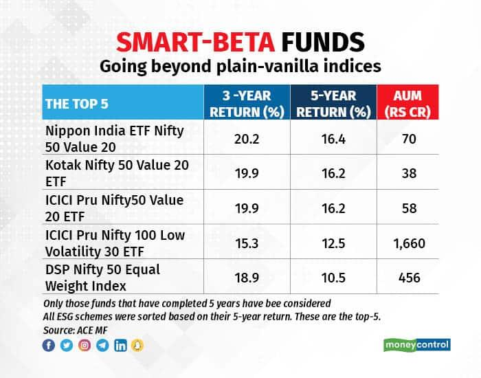

## Table of Contents

## What are Smart Beta Mutual Funds?

Smart Beta Mutual Funds are a type of investment that tries to do better than regular index funds. They use special ways to pick stocks, not just following a big index like the S&P 500. Instead of just buying a little bit of everything in the index, Smart Beta Funds focus on certain things like how big a company is, how much it's growing, or how much it pays out in dividends. This special way of choosing stocks is called a "factor" and it helps the fund try to beat the market.

These funds are called "Smart Beta" because they mix two ideas: passive investing, which is easy and low-cost like index funds, and active investing, which tries to pick winners. By using factors, Smart Beta Funds aim to give investors a better return than just following the market. But, like any investment, they can still go up and down, and they might not always do better than the market. So, it's important for investors to understand what they're getting into and how these funds work before they decide to invest.

## What are Smart Beta ETFs?

Smart Beta ETFs are a type of exchange-traded fund that tries to do better than regular index funds. They don't just follow a big index like the S&P 500. Instead, they use special ways to pick stocks based on things like how big a company is, how fast it's growing, or how much it pays out in dividends. These special ways of choosing stocks are called "factors." By focusing on these factors, Smart Beta ETFs aim to give investors a better return than just following the market.

These ETFs are called "Smart Beta" because they mix two ideas: passive investing, which is easy and low-cost like index funds, and active investing, which tries to pick winners. Smart Beta ETFs use factors to try to beat the market while still being easier to manage than [picking](/wiki/asset-class-picking) individual stocks. But, like any investment, they can still go up and down, and they might not always do better than the market. So, it's important for investors to understand how these ETFs work before deciding to invest.

## How do Smart Beta Mutual Funds differ from traditional mutual funds?

Smart Beta Mutual Funds and traditional mutual funds are both ways to invest money, but they work differently. Traditional mutual funds are often managed by people who try to pick the best stocks to beat the market. They look at lots of information and make decisions based on what they think will happen. These funds can be more expensive because of the work the managers do. On the other hand, Smart Beta Mutual Funds use a special way to pick stocks called "factors." These factors can be things like how big a company is, how fast it's growing, or how much it pays out in dividends. Instead of trying to guess which stocks will do well, Smart Beta Funds follow a set of rules based on these factors.

The main difference between the two is how they try to do better than the market. Traditional mutual funds rely on the skills of the fund manager to pick winners. This can work well, but it can also be risky if the manager makes bad choices. Smart Beta Mutual Funds, however, use a more automatic way to pick stocks. They don't rely on one person's guesses but on a set of rules that can be followed without much human input. This can make Smart Beta Funds cheaper to run because they don't need as much active management. But, like all investments, they can still go up and down, and they might not always do better than the market.

## How do Smart Beta ETFs differ from traditional ETFs?

Smart Beta ETFs and traditional ETFs are both ways to invest money, but they work differently. Traditional ETFs usually try to match the performance of a big index like the S&P 500. They buy a little bit of everything in that index, so they go up and down with the market. This type of investing is called passive because it doesn't try to beat the market, just copy it. Traditional ETFs are often cheaper to own because they don't need someone to pick stocks all the time.

Smart Beta ETFs, on the other hand, use special rules called "factors" to pick stocks. These factors can be things like how big a company is, how fast it's growing, or how much it pays out in dividends. Smart Beta ETFs try to do better than the market by focusing on these factors. This type of investing is a mix of passive and active because it follows rules but tries to beat the market. Smart Beta ETFs can be a bit more expensive than traditional ETFs because they need more work to set up and manage the factors, but they are usually still cheaper than funds where someone picks all the stocks by hand.

## What are the key differences between Smart Beta Mutual Funds and Smart Beta ETFs?

Smart Beta Mutual Funds and Smart Beta ETFs both try to do better than the market by using special rules called "factors" to pick stocks. But they have some key differences. Smart Beta Mutual Funds are bought and sold at the end of the day, like regular mutual funds. This means you can only buy or sell them once a day, at the price set at the close of the market. On the other hand, Smart Beta ETFs can be bought and sold anytime during the trading day, just like stocks. This gives investors more flexibility to react to changes in the market.

Another difference is how they are managed. Smart Beta Mutual Funds are usually run by a fund manager who follows the special rules to pick stocks. This can make them a bit more expensive because of the management costs. Smart Beta ETFs, however, often have lower costs because they are more automatic and don't need as much hands-on management. Also, Smart Beta ETFs usually have to share more information about what they own, which can make them more transparent than Smart Beta Mutual Funds. Both types of funds aim to beat the market, but these differences can affect how easy and costly it is for investors to use them.

## What are the advantages of investing in Smart Beta Mutual Funds?

Smart Beta Mutual Funds can be a good choice for investors because they try to do better than the market in a smart way. They use special rules called "factors" to pick stocks, like looking at how big a company is or how fast it's growing. This means they don't just follow the market but try to beat it. This can be a good middle ground between regular index funds, which just copy the market, and actively managed funds, where someone tries to pick winners. Smart Beta Mutual Funds can give you a chance to get better returns without paying as much as you would for a fund where someone picks all the stocks by hand.

Another advantage is that Smart Beta Mutual Funds can help spread out your risk. By focusing on different factors, these funds can own a mix of stocks that might do well in different situations. For example, if the market goes up because big companies are doing well, a Smart Beta Fund that focuses on company size might do better than the market. If the market goes up because fast-growing companies are doing well, a fund that focuses on growth might do better. This can help your investments do well in different kinds of markets. Plus, these funds are usually easier to understand than regular mutual funds because they follow clear rules, which can make it easier for you to know what you're investing in.

## What are the advantages of investing in Smart Beta ETFs?

Smart Beta ETFs are a good choice for investors because they try to do better than the market in a smart way. They use special rules called "factors" to pick stocks, like looking at how big a company is or how fast it's growing. This means they don't just follow the market but try to beat it. Smart Beta ETFs can give you a chance to get better returns without paying as much as you would for a fund where someone picks all the stocks by hand. They are often cheaper than actively managed funds because they don't need as much work to run.

Another advantage is that Smart Beta ETFs can help spread out your risk. By focusing on different factors, these funds can own a mix of stocks that might do well in different situations. For example, if the market goes up because big companies are doing well, a Smart Beta [ETF](/wiki/etf-trading-strategies) that focuses on company size might do better than the market. If the market goes up because fast-growing companies are doing well, a fund that focuses on growth might do better. This can help your investments do well in different kinds of markets. Plus, Smart Beta ETFs are easy to buy and sell anytime during the trading day, giving you more flexibility to react to changes in the market.

## How do the costs compare between Smart Beta Mutual Funds and Smart Beta ETFs?

Smart Beta Mutual Funds and Smart Beta ETFs both try to do better than the market using special rules called "factors." But they can cost different amounts to own. Smart Beta Mutual Funds usually have higher costs because they need a fund manager to follow the special rules and pick the stocks. This extra work means you might pay more in fees. On the other hand, Smart Beta ETFs are often cheaper. They don't need as much hands-on management because they follow the rules more automatically. This can save money on fees, making them a more affordable choice for many investors.

Even though Smart Beta ETFs are generally cheaper, the costs can still vary a lot depending on the specific fund. Some Smart Beta ETFs might have higher fees if they use more complex rules or if they are run by a company that charges more. It's important to look at the expense ratio, which tells you how much you'll pay each year to own the fund. By comparing the expense ratios of different Smart Beta Mutual Funds and ETFs, you can find the one that fits your budget and investment goals best.

## What are the tax implications of investing in Smart Beta Mutual Funds versus Smart Beta ETFs?

When you invest in Smart Beta Mutual Funds, you might have to pay more in taxes. This is because mutual funds can create what's called capital gains distributions. These happen when the fund manager sells stocks for a profit and then has to share that profit with you, the investor. You have to pay taxes on these gains, even if you didn't sell any of your shares in the fund. Smart Beta Mutual Funds might do this more often because they are managed actively, which can mean more buying and selling of stocks.

On the other hand, Smart Beta ETFs usually have fewer tax issues. This is because ETFs are set up in a way that they don't have to sell their stocks as often. When you want to sell your ETF shares, you usually sell them to another investor, not back to the fund. This means the ETF doesn't have to sell its stocks to give you your money, so there are fewer capital gains to worry about. Because of this, Smart Beta ETFs can be a smarter choice if you want to keep your tax bill lower.

## How does the liquidity of Smart Beta Mutual Funds compare to that of Smart Beta ETFs?

Smart Beta Mutual Funds and Smart Beta ETFs have different levels of [liquidity](/wiki/liquidity-risk-premium). Liquidity means how easy it is to buy or sell your investment. With Smart Beta Mutual Funds, you can only buy or sell them at the end of the trading day. The price you get is based on the value of all the stocks in the fund at the close of the market. This means if you want to sell your mutual fund shares, you have to wait until the end of the day to see how much money you'll get.

On the other hand, Smart Beta ETFs are much more liquid. You can buy or sell them anytime during the trading day, just like you would with regular stocks. The price changes all day long based on what people are willing to pay. This gives you more flexibility to react to changes in the market quickly. If you need to sell your ETF shares in a hurry, you can do it right away, not just at the end of the day like with mutual funds.

## What are some strategies for constructing a portfolio using Smart Beta Mutual Funds and Smart Beta ETFs?

When building a portfolio using Smart Beta Mutual Funds and Smart Beta ETFs, it's important to think about what you want your investments to do for you. Smart Beta funds use special rules called "factors" to pick stocks, like how big a company is or how fast it's growing. You can mix different Smart Beta funds that focus on different factors to spread out your risk. For example, you might pick one fund that looks at company size and another that looks at how much companies pay out in dividends. This way, if one type of stock doesn't do well, the others might help balance it out. You can also decide how much risk you want to take by choosing funds that focus on more stable or more risky factors.

Another strategy is to think about costs and taxes. Smart Beta ETFs are usually cheaper than Smart Beta Mutual Funds because they don't need as much work to run. If you want to keep your costs low, you might want to use more ETFs in your portfolio. Also, ETFs can be better for taxes because they don't create as many capital gains distributions as mutual funds do. So, if you want to keep your tax bill down, using more ETFs might be a good idea. By mixing Smart Beta Mutual Funds and ETFs in a smart way, you can build a portfolio that fits your goals, manages your risk, and keeps your costs and taxes in check.

## How have Smart Beta Mutual Funds and Smart Beta ETFs performed relative to each other over the past decade?

Over the past decade, Smart Beta Mutual Funds and Smart Beta ETFs have both tried to do better than the market by using special rules to pick stocks. In general, the performance of Smart Beta ETFs has been a bit better than Smart Beta Mutual Funds. This is because ETFs are usually cheaper to own, which means more of the money you make stays in your pocket. Also, ETFs can be bought and sold more easily during the day, which can help investors react to changes in the market faster. But, the difference in performance between the two isn't huge, and it can change from year to year.

When looking at how well they did, it's important to remember that both types of Smart Beta funds can go up and down a lot. Some years, Smart Beta Mutual Funds might do better because the way they pick stocks works well in that kind of market. Other years, Smart Beta ETFs might do better because they are cheaper and easier to trade. Over the long run, though, Smart Beta ETFs have often had a small edge in performance because of their lower costs and better liquidity. But, what matters most is picking the right Smart Beta funds that match your goals and how much risk you want to take.

## What is Smart Beta Investing?

Smart Beta Investing represents an innovative approach in the field of asset management, blending elements of both passive and active investment strategies. This method diverges from traditional market-capitalization-weighted indices by employing alternative index construction rules designed to capture specific investment factors.

One of the core principles of Smart Beta investing is its focus on certain quantifiable factors, often referred to as factors or "styles," such as value, growth, dividends, and [volatility](/wiki/volatility-trading-strategies). These factors are selected based on historical performance and academic research, which suggest that they can potentially deliver superior risk-adjusted returns over time. The value [factor](/wiki/factor-investing), for example, targets stocks that appear undervalued based on fundamental metrics like price-to-earnings ratios, while growth strategies focus on companies with faster-than-average earnings growth rates.

Smart Beta strategies employ diverse weighting schemes to achieve desired exposures to these factors. Unlike traditional indices that weight holdings by market capitalization, Smart Beta indices might apply equal weightings, volatility weighting, or fundamental weightings that reflect a company's financial performance metrics. This allows for a tailored approach that aims to enhance returns or reduce risk compared to traditional passive strategies.

An equation often associated with Smart Beta strategies is the fundamental indexation formula, which can be described as follows:

$$
\text{Weight}_{i} = \frac{\text{Fundamental Metric}_{i}}{\sum \text{Fundamental Metrics}}
$$

where $\text{Weight}_{i}$ represents the weight of asset $i$ in the portfolio, and $\text{Fundamental Metric}_{i}$ could be measures like dividends, sales, or book value.

Smart Beta strategies offer potential for outperformance due to their systematic nature and ability to capture desired factor exposures. They also retain the cost advantages and diversification benefits typical of passive investing. By systematically targeting specific attributes that have been shown to influence stock returns, Smart Beta strategies provide investors with a cost-effective mechanism to potentially achieve excess returns relative to standard index tracking.

In the context of diversification, Smart Beta strategies can lead to a more balanced portfolio, as they tend to redistribute weight from heavily capitalized stocks to those with favorable factor exposures. This diversification not only mitigates risks associated with concentration in a few large companies but also ensures broader exposure across an array of assets.

Overall, Smart Beta Investing continues to gain prominence in the investment world, driven by its promise of achieving better returns with efficiency and a disciplined approach to capturing factor-driven performance. This strategy serves as a bridge for investors seeking a refined blend of passive and active management methodologies.

## References & Further Reading

[1]: ["Smart Beta and Factor Investing: A Guide to Understanding Factor ETFs"](https://www.etf.com/sections/news/smart-beta-vs-factor-funds-whats-difference) published by the CFA Institute.

[2]: Fama, E. F., & French, K. R. (1993). ["Common risk factors in the returns on stocks and bonds,"](https://www.sciencedirect.com/science/article/pii/0304405X93900235) Journal of Financial Economics, 33(1), 3-56.

[3]: Lopez de Prado, M. (2018). ["Advances in Financial Machine Learning,"](https://www.amazon.com/Advances-Financial-Machine-Learning-Marcos/dp/1119482089) Wiley.

[4]: Hendershott, T., Jones, C. M., & Menkveld, A. J. (2011). ["Does algorithmic trading improve liquidity?"](https://onlinelibrary.wiley.com/doi/full/10.1111/j.1540-6261.2010.01624.x) The Review of Financial Studies, 24(8), 2253-2297.

[5]: Arnott, R. D., Hsu, J., & Moore, P. (2005). ["Fundamental Indexation,"](https://papers.ssrn.com/sol3/papers.cfm?abstract_id=604842) Financial Analysts Journal, 61(2), 83-99.

[6]: ["The Intelligent Investor: The Definitive Book on Value Investing."](https://www.amazon.com/Intelligent-Investor-Definitive-Investing-Essentials/dp/0060555661) by Benjamin Graham.

[7]: Chan, E. (2008). ["Quantitative Trading: How to Build Your Own Algorithmic Trading Business,"](https://github.com/ftvision/quant_trading_echan_book) Wiley.