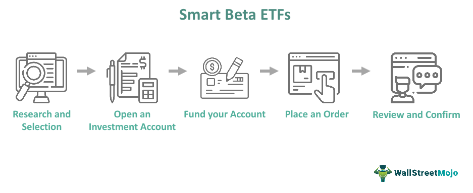

Investment strategies have undergone a profound transformation, driven by technological advancements that have redefined the financial landscape. Among the foremost innovations in modern finance are Exchange-Traded Funds (ETFs), Smart Beta strategies, and algorithmic trading. Each of these components plays a crucial role in enhancing portfolio diversification and optimizing risk management.

ETFs have revolutionized the way investors gain exposure to various asset classes, by offering the liquidity and transparency of stocks while maintaining the diversity of mutual funds. These products have democratized investing, making it accessible to a broader audience with their cost-efficiency and tax advantages.



Smart Beta represents an evolutionary step beyond traditional indexing. By incorporating alternative index construction rules, Smart Beta strategies aim to capture specific investment factors—such as value, growth, and volatility—that can potentially lead to outperformance. This strategy offers a middle ground between passive and active investment, providing the benefits of both in a cost-effective manner.

Simultaneously, algorithmic trading has emerged as a powerful tool for executing trades with speed and precision. By utilizing complex mathematical models and computer algorithms, this approach minimizes human error and allows for rapid, data-driven decision-making. Algorithmic trading is pivotal in high-frequency trading environments, where milliseconds can be the difference between profit and loss.

This article explores the interplay between these innovative strategies: the foundational aspects of ETFs, the strategic nuances of Smart Beta, and the technological prowess of algorithmic trading. By examining these intersections, we uncover new opportunities for investment efficiency and enhanced risk-adjusted returns.

## Table of Contents

## Understanding ETFs

Exchange-Traded Funds (ETFs) are investment vehicles that function similarly to mutual funds but trade on stock exchanges like individual stocks. This unique characteristic allows investors to buy and sell ETFs throughout the trading day at market prices, providing significant liquidity and flexibility compared to mutual funds, which are priced only at the end of the trading day.

ETFs offer investors exposure to a broad range of asset classes, including equities, bonds, and commodities. This approach enables diversification within a single investment, reducing risk by spreading exposure across various sectors or industries. The diversified nature of ETFs allows investors to tailor portfolios according to specific market views or sectors, such as technology or healthcare, or even geographic regions like emerging markets or developed markets.

Several types of ETFs cater to different investment objectives, including:

1. **Equity ETFs:** These track specific stock indices, such as the S&P 500. They replicate the performance of these indices and offer a straightforward way to invest in the stock market.

2. **Bond ETFs:** Designed to provide exposure to fixed-income markets, these ETFs can focus on corporate bonds, government bonds, or municipal bonds, among others.

3. **Commodity ETFs:** These offer a way to invest in physical commodities like gold, silver, or oil, either through physical holdings or derivative contracts.

4. **Sector and Industry ETFs:** These target specific sectors such as technology, finance, or healthcare, allowing investors to focus on preferred industries.

5. **International ETFs:** These provide exposure to foreign markets, providing diversification beyond domestic investments.

6. **Smart Beta ETFs:** Combining elements of passive and active management, these ETFs use alternative index construction rules that focus on specific factors such as value or momentum.

One of the significant advantages of ETFs is their generally lower cost compared to traditional mutual funds. The expense ratios for ETFs are often lower because they tend to be passively managed, tracking established indices rather than relying on fund managers to select securities. This cost efficiency is further enhanced by their tax benefits. ETFs usually generate fewer capital gains distributions due to their unique creation and redemption process, which can minimize the tax impact on investors.

Moreover, ETFs provide an easy route to diversification. By holding a basket of assets, investors can achieve broad market exposure without the complexity and cost of purchasing individual securities. This diversification not only mitigates risk but also simplifies the process of constructing a balanced investment portfolio.

Overall, ETFs have become a cornerstone in modern portfolio management, offering versatility, cost efficiency, and simplicity. They cater to a wide range of investment strategies, accommodating both conservative and aggressive investment goals.

## Smart Beta Investing

Smart Beta Investing represents an innovative approach in the field of asset management, blending elements of both passive and active investment strategies. This method diverges from traditional market-capitalization-weighted indices by employing alternative index construction rules designed to capture specific investment factors.

One of the core principles of Smart Beta investing is its focus on certain quantifiable factors, often referred to as factors or "styles," such as value, growth, dividends, and [volatility](/wiki/volatility-trading-strategies). These factors are selected based on historical performance and academic research, which suggest that they can potentially deliver superior risk-adjusted returns over time. The value [factor](/wiki/factor-investing), for example, targets stocks that appear undervalued based on fundamental metrics like price-to-earnings ratios, while growth strategies focus on companies with faster-than-average earnings growth rates.

Smart Beta strategies employ diverse weighting schemes to achieve desired exposures to these factors. Unlike traditional indices that weight holdings by market capitalization, Smart Beta indices might apply equal weightings, volatility weighting, or fundamental weightings that reflect a company's financial performance metrics. This allows for a tailored approach that aims to enhance returns or reduce risk compared to traditional passive strategies.

An equation often associated with Smart Beta strategies is the fundamental indexation formula, which can be described as follows:

$$
\text{Weight}_{i} = \frac{\text{Fundamental Metric}_{i}}{\sum \text{Fundamental Metrics}}
$$

where $\text{Weight}_{i}$ represents the weight of asset $i$ in the portfolio, and $\text{Fundamental Metric}_{i}$ could be measures like dividends, sales, or book value.

Smart Beta strategies offer potential for outperformance due to their systematic nature and ability to capture desired factor exposures. They also retain the cost advantages and diversification benefits typical of passive investing. By systematically targeting specific attributes that have been shown to influence stock returns, Smart Beta strategies provide investors with a cost-effective mechanism to potentially achieve excess returns relative to standard index tracking.

In the context of diversification, Smart Beta strategies can lead to a more balanced portfolio, as they tend to redistribute weight from heavily capitalized stocks to those with favorable factor exposures. This diversification not only mitigates risks associated with concentration in a few large companies but also ensures broader exposure across an array of assets.

Overall, Smart Beta Investing continues to gain prominence in the investment world, driven by its promise of achieving better returns with efficiency and a disciplined approach to capturing factor-driven performance. This strategy serves as a bridge for investors seeking a refined blend of passive and active management methodologies.

## Algorithmic Trading

Algorithmic trading, often referred to as algo trading, leverages mathematical models to make high-speed financial decisions. This method of trading relies on algorithms, which are sets of instructions designed to execute trades based on various market conditions. The use of sophisticated algorithms enables traders to conduct precise, rapid, and efficient trade executions, a major advantage in the highly dynamic world of finance.

One of the primary benefits of [algorithmic trading](/wiki/algorithmic-trading) is its ability to facilitate high-frequency trading ([HFT](/wiki/high-frequency-trading-strategies)), a form of trading where a large number of orders are executed within fractions of a second. This is achieved by utilizing automated trading platforms that can process vast datasets and execute complex strategies much faster than a human trader. By automating the trading process, algorithmic trading significantly reduces human error, ensuring that trades are executed with consistency and accuracy.

In competitive market environments, algorithmic trading employs data-driven strategies to optimize trading outcomes. These strategies often involve statistical [arbitrage](/wiki/arbitrage), where algorithms identify and exploit price inefficiencies between related securities. For instance, consider two financial instruments, A and B, whose prices typically move together. If the price of A increases while B remains static, an arbitrage opportunity may exist if historical data suggests that B should also rise. An algorithm can quickly identify and act upon this opportunity by executing trades before the market naturally corrects the discrepancy.

The precision offered by algorithmic trading is further enhanced by implementing advanced mathematical models. An example is the use of stochastic calculus in models such as the Black-Scholes model, which assists in pricing derivative instruments. Python, a popular programming language in finance, can be used to implement such models:

```python
import numpy as np

def black_scholes(S, K, T, r, sigma, option_type='call'):
    d1 = (np.log(S / K) + (r + sigma ** 2 / 2) * T) / (sigma * np.sqrt(T))
    d2 = d1 - sigma * np.sqrt(T)

    if option_type == 'call':
        price = (S * norm.cdf(d1) - K * np.exp(-r * T) * norm.cdf(d2))
    else:
        price = (K * np.exp(-r * T) * norm.cdf(-d2) - S * norm.cdf(-d1))

    return price
```

In this code snippet, `black_scholes` is a function that calculates the theoretical price of a call or put option using the Black-Scholes formula. Such implementations highlight the power of algorithmic tools to automate complex financial calculations that feed into strategic trading decisions. 

Algorithmic trading's capacity to compete in complex markets is bolstered by continuous advances in technology and data analysis techniques. As these tools evolve, they provide traders with enhanced opportunities to develop innovative, data-driven trading strategies that can adapt to ever-changing market conditions.

## Integrating Smart Beta with Algorithmic Trading

Combining Smart Beta with algorithmic trading has emerged as a powerful strategy that enhances investment efficiency through the precise execution of complex, rule-based strategies. Smart Beta investing traditionally focuses on capturing specific factors such as value, growth, or volatility by utilizing alternative indexing rules. When integrated with algorithmic trading, these factors can be dynamically adjusted, allowing for more precise and timely investment decisions.

Algorithmic trading leverages computational algorithms to automate the trading process, allowing trades to be executed at speeds and accuracies that humans cannot match. This automation facilitates the incorporation of complex investment strategies, such as those used in Smart Beta, into live trading environments. For example, a Smart Beta strategy focusing on low volatility could dynamically adjust its exposure based on real-time market volatility assessments made possible through algorithmic analysis.

Moreover, this integration aids in reducing transaction costs, which can be a significant drag on performance, especially in frequent trading strategies. High-frequency trading algorithms can optimize the timing and size of trades to minimize market impact and trading costs, thereby improving the overall net performance of Smart Beta ETFs. Liquidity is also improved as algorithmic trading can provide continuous pricing and execution, ensuring Smart Beta strategies remain adaptable and actionable even in fluctuating markets.

Several case studies have highlighted the benefits of merging Smart Beta with algo trading. These hybrid strategies have demonstrated enhanced risk-adjusted returns and greater precision in portfolio adjustments. For instance, algorithmically-driven Smart Beta funds have shown they can outperform traditional passive strategies by effectively adapting to shifting market dynamics while maintaining the cost advantage typical of index-based investing.

The integration of Smart Beta and algorithmic trading not only offers improved financial outcomes through optimized strategy execution but also pushes the boundaries of what is possible in portfolio management by leveraging technology and data-driven insights. Investors seeking innovative investment opportunities should consider these advancements as part of their strategic toolkit.

## Global Trends and Future Outlook

Smart Beta ETFs have witnessed significant growth driven by their hybrid investment approach, which combines elements of passive and active management. This unique strategy seeks to enhance returns by targeting specific factors such as value, [momentum](/wiki/momentum), and volatility, thus offering a refined form of diversification compared to traditional market-cap-weighted ETFs.

Regulatory and technological advancements are pivotal in shaping the landscape of Smart Beta ETFs. Regulatory bodies have been working to ensure transparency and investor protection, which builds trust and encourages wider adoption. For example, the implementation of strict guidelines on disclosure requirements helps investors understand the underlying strategies and risks associated with these products. Additionally, technological advancements have facilitated the seamless execution of these strategies by improving data collection, processing capabilities, and trading infrastructure, thereby increasing the operational efficiency and accessibility of Smart Beta ETFs.

There is a growing emphasis on Environmental, Social, and Governance ([ESG](/wiki/esg-investing)) factors within the investment community. Investors are increasingly demanding products that align with their ethical and social values, and Smart Beta strategies are adapting to this trend. By incorporating ESG criteria, Smart Beta ETFs can provide socially responsible investment options that cater to the diverse preferences of modern investors, thereby expanding their appeal.

Personalized investment strategies are becoming more prevalent as technology enables the customization of portfolios to meet individual investor needs. Advanced data analytics and [machine learning](/wiki/machine-learning) algorithms allow for the tailoring of Smart Beta strategies to align with personal risk tolerances, investment goals, and preferences. This trend towards personalization is likely to grow, driven by investor demand for more control and customization in their investment portfolios.

The ongoing improvement of algorithmic trading continues to enhance the efficiency and effectiveness of Smart Beta strategies. Algorithmic trading systems, which use mathematical models and sophisticated algorithms for executing trades, can optimize trade execution by minimizing costs and maximizing [liquidity](/wiki/liquidity-risk-premium). These systems can also adapt to varying market conditions and execute Smart Beta strategies with precision, resulting in improved risk-adjusted returns.

Overall, the future outlook for Smart Beta ETFs is promising, as they are well-positioned to capitalize on regulatory developments, technological innovations, and evolving investor preferences. As these trends continue to evolve, Smart Beta ETFs are expected to play an increasingly important role in the investment landscape. Investors seeking to benefit from these developments should consider the integration of Smart Beta strategies into their portfolios to achieve optimized investment outcomes.

## Conclusion

The intertwined landscape of ETFs, Smart Beta, and algorithmic trading represents a significant advancement in modern investment strategies. Understanding these components is crucial for investors seeking to optimize their portfolios in today's dynamic financial markets. Each strategy offers unique benefits: ETFs provide cost-effective and diversified market exposure, Smart Beta offers a hybrid approach blending active and passive methodologies for strategic factor exposure, and algorithmic trading enhances precision and efficiency in trade execution.

These investment strategies collectively offer powerful tools for managing risks and maximizing returns. ETFs simplify diversification and cost management, Smart Beta integrates factor-based strategies with the potential for outperformance, and algorithmic trading allows for rapid and precise transactions, minimizing human error.

The integration of Smart Beta strategies with algorithmic trading further amplifies opportunities for innovative investment solutions. By automating the trading processes and implementing sophisticated, rule-based strategies, investors can achieve enhanced risk-adjusted returns and improved operational efficiency.

Investors are encouraged to explore these modern strategies to tailor their portfolio management approaches to evolving market conditions and individual investment goals. As technology and investment methodologies continue to advance, these strategies provide valuable opportunities for achieving optimal financial outcomes.

## References & Further Reading

[1]: ["Smart Beta and Factor Investing: A Guide to Understanding Factor ETFs"](https://www.etf.com/sections/news/smart-beta-vs-factor-funds-whats-difference) published by the CFA Institute.

[2]: Fama, E. F., & French, K. R. (1993). ["Common risk factors in the returns on stocks and bonds,"](https://www.sciencedirect.com/science/article/pii/0304405X93900235) Journal of Financial Economics, 33(1), 3-56.

[3]: Lopez de Prado, M. (2018). ["Advances in Financial Machine Learning,"](https://www.amazon.com/Advances-Financial-Machine-Learning-Marcos/dp/1119482089) Wiley.

[4]: Hendershott, T., Jones, C. M., & Menkveld, A. J. (2011). ["Does algorithmic trading improve liquidity?"](https://onlinelibrary.wiley.com/doi/full/10.1111/j.1540-6261.2010.01624.x) The Review of Financial Studies, 24(8), 2253-2297.

[5]: Arnott, R. D., Hsu, J., & Moore, P. (2005). ["Fundamental Indexation,"](https://papers.ssrn.com/sol3/papers.cfm?abstract_id=604842) Financial Analysts Journal, 61(2), 83-99.

[6]: ["The Intelligent Investor: The Definitive Book on Value Investing."](https://www.amazon.com/Intelligent-Investor-Definitive-Investing-Essentials/dp/0060555661) by Benjamin Graham.

[7]: Chan, E. (2008). ["Quantitative Trading: How to Build Your Own Algorithmic Trading Business,"](https://github.com/ftvision/quant_trading_echan_book) Wiley.