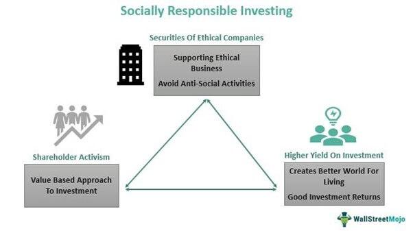

## Table of Contents

## What is Socially Responsible Investing (SRI)?

Socially Responsible Investing (SRI) is a way of investing money that takes into account not just financial returns but also the impact on society and the environment. People who use SRI want their investments to help make the world a better place. They look at things like how a company treats its workers, how it affects the environment, and whether it supports good causes.

SRI is also called ethical investing or sustainable investing. Investors might avoid companies that make things like tobacco, weapons, or fossil fuels because they think these things are harmful. Instead, they might choose to invest in companies that focus on renewable energy, fair labor practices, or community development. By doing this, they hope to support positive changes while still making money.

## What are Sin Stocks?

Sin stocks are stocks of companies that are involved in businesses that some people think are bad or harmful. These businesses often include things like making and selling alcohol, tobacco, gambling, and weapons. People call them "sin stocks" because they are connected to activities that some believe go against moral or ethical values.

Even though some people avoid sin stocks because of their beliefs, others might invest in them because they can make a lot of money. These companies often do well even when the economy is not doing great because people keep buying their products or using their services. So, while sin stocks might be controversial, they can still be a good choice for investors who are mainly looking to make money.

## How do the financial performance of SRI funds compare to Sin Stocks?

The financial performance of Socially Responsible Investing (SRI) funds compared to Sin Stocks can vary a lot depending on the time and the specific stocks or funds you look at. Studies have shown that SRI funds can do just as well as or even better than the overall market. This is because companies that focus on being good to the environment and society might be run better and be more popular with customers. But, SRI funds might miss out on some big gains from Sin Stocks, which can do really well even when the economy is not great.

Sin Stocks, on the other hand, often do very well financially because people keep buying things like alcohol, tobacco, and gambling services no matter what is happening in the world. These stocks can be a safe bet for investors who want to make money and don't mind the ethical issues. But, they can also be risky because laws and public opinions about these businesses can change, which might hurt their profits. So, while Sin Stocks might offer good returns, they come with their own set of challenges and risks.

## What are the ethical considerations when investing in SRI versus Sin Stocks?

When you invest in Socially Responsible Investing (SRI) funds, you are thinking about more than just making money. You want your money to help make the world a better place. SRI funds focus on companies that do good things for the environment, treat workers well, and support good causes. By choosing SRI, you show that you care about issues like climate change, fair labor, and social justice. This way of investing can make you feel good because you know your money is helping to make a positive difference.

On the other hand, investing in Sin Stocks means you are putting your money into companies that some people think are harmful. These companies might make things like alcohol, tobacco, or weapons, or they might run gambling businesses. People call them "sin stocks" because they are linked to activities that some see as bad or unethical. While these stocks can make a lot of money, they can also make you feel bad if you believe that these businesses are hurting people or the planet. So, when you choose Sin Stocks, you might be more focused on financial gains and less on the ethical impact of your investments.

## Can you explain the impact of SRI on corporate behavior?

When people invest in Socially Responsible Investing (SRI) funds, it can change how companies act. Companies want to get money from investors, so if more people choose SRI, companies might start doing things that are good for the environment and society. For example, a company might start using less energy or treating their workers better because they know that SRI investors care about these things. This can make the company more popular with customers and investors who want to support good causes.

Over time, SRI can push more companies to think about their impact on the world. If a lot of investors are choosing SRI, companies might see that it's important to be responsible and ethical. This can lead to big changes in how businesses work, like making products that are better for the environment or supporting fair labor practices. By choosing SRI, investors can help make the whole business world more focused on doing good things.

## How do regulatory environments affect investments in Sin Stocks?

The rules that governments make can really change how well Sin Stocks do. If a government makes strict laws about things like selling tobacco or gambling, it can make it harder for those companies to make money. For example, if a new law says that cigarettes have to cost more, fewer people might buy them. This can make the stock price of tobacco companies go down. So, when you invest in Sin Stocks, you need to keep an eye on what the government might do next.

But sometimes, the rules can actually help Sin Stocks. If a government decides not to make new laws against things like alcohol or gambling, those companies might keep doing well. People still want to buy these things, so the companies can keep making money. That's why some investors like Sin Stocks - they can be a safe bet even when the rules are tight. But, it's always a good idea to think about how the rules might change and what that could mean for your investments.

## What are the typical sectors included in SRI portfolios?

SRI portfolios usually include companies from sectors that focus on helping the environment and society. These sectors often include renewable energy, like solar and wind power, because they help fight climate change. Companies that work on clean water and waste management are also common because they help keep our planet clean. Another big sector is sustainable agriculture, where companies try to grow food in ways that are good for the earth.

Also, SRI portfolios often have companies that are good to their workers and support fair labor practices. This can include businesses in the healthcare sector that provide good care to people and treat their employees well. Education and community development are other sectors you might find, as these companies work to help people learn and grow. By choosing these kinds of companies, SRI investors aim to make money while also making the world a better place.

## Which industries are commonly categorized as Sin Stocks?

Sin Stocks are usually from industries that some people think are bad or harmful. These industries include making and selling alcohol, like beer and wine. Another big one is tobacco, where companies make cigarettes and other smoking products. Gambling is also a common Sin Stock industry, including casinos and online betting sites. Lastly, companies that make weapons, like guns and bombs, are often seen as Sin Stocks.

Even though these industries are called "sinful," they can make a lot of money. People keep buying alcohol and tobacco, and they keep gambling, no matter what is happening in the world. This means these companies can do well even when the economy is not great. But, they can also be risky because laws and public opinions about these businesses can change, which might hurt their profits.

## How does the risk profile differ between SRI and Sin Stocks?

The risk profile of Socially Responsible Investing (SRI) funds can be different from Sin Stocks. SRI funds often focus on companies that are good for the environment and society. This can mean they might miss out on some big gains from industries like tobacco or gambling, which are Sin Stocks. But SRI funds might also be less risky in some ways. Companies that care about the environment and their workers might be run better and be more popular with customers. This can make their stocks more stable and less likely to lose value suddenly.

Sin Stocks, on the other hand, can be more risky because they depend a lot on laws and public opinion. If a government makes new rules about selling alcohol or tobacco, it can hurt these companies' profits. Also, if people start thinking these businesses are bad, they might buy less. But Sin Stocks can also do very well because people keep buying things like alcohol and tobacco, even when the economy is not good. So, while Sin Stocks might offer good returns, they come with their own set of challenges and risks that investors need to think about.

## What are the long-term sustainability implications of investing in SRI versus Sin Stocks?

Investing in Socially Responsible Investing (SRI) funds can be good for the long-term health of the planet and society. SRI funds focus on companies that care about the environment and treat their workers well. This means they might help fight climate change by supporting renewable energy and sustainable farming. They also help make sure workers are treated fairly and communities are supported. Over time, this can lead to a healthier planet and happier people. By choosing SRI, investors are not just thinking about making money now but also about making the world better for the future.

On the other hand, investing in Sin Stocks might not be as good for long-term sustainability. Sin Stocks are from industries like tobacco, alcohol, gambling, and weapons, which some people think are harmful. These businesses can make a lot of money, but they can also hurt the environment and people's health. For example, tobacco companies can lead to more health problems, and gambling can cause financial issues for some people. If more money goes into these industries, it might make these problems worse in the long run. So, while Sin Stocks might give good returns now, they could have negative effects on the world's sustainability in the future.

## How do investor demographics influence the choice between SRI and Sin Stocks?

The choice between SRI and Sin Stocks can be influenced a lot by who the investors are. Younger people, like millennials and Gen Z, often care a lot about the environment and social issues. They might choose SRI because they want their money to help make the world better. These investors think about the future and want to support companies that are good to the planet and people. On the other hand, older investors might focus more on making money now. They might be okay with investing in Sin Stocks because they want to make sure they have enough money for their retirement, even if it means supporting businesses that some people think are harmful.

Also, where people live and their culture can affect their investment choices. In places where people care a lot about the environment, like some parts of Europe, more investors might choose SRI. But in places where making money is the main focus, like some parts of the United States, more people might go for Sin Stocks. It's all about what investors value more - making money now or helping the world in the long run.

## What advanced strategies can be used to balance a portfolio containing both SRI and Sin Stocks?

To balance a portfolio with both SRI and Sin Stocks, you can use a strategy called diversification. This means spreading your money across different kinds of investments so you don't put all your eggs in one basket. By having some SRI funds and some Sin Stocks, you can try to get the best of both worlds. The SRI part of your portfolio can help you feel good about making a positive impact on the world, while the Sin Stocks can help you make more money, especially when the economy is not doing great. This way, you can balance your desire to do good with your need to make money.

Another strategy is to use a dynamic asset allocation approach. This means you keep an eye on how both SRI and Sin Stocks are doing and change how much you invest in each based on what's happening in the market and the world. If you see that SRI funds are doing really well and helping the environment, you might put more money into them. But if Sin Stocks are making a lot of money because of changes in laws or the economy, you might decide to invest more in those. By staying flexible and adjusting your investments, you can try to get the best returns while still supporting your values.

## What is the difference between Ethical Investing and Socially Responsible Investing (SRI)?

Ethical investing is a strategy that aligns investment portfolios with an investor's personal values. This approach typically avoids sectors considered morally contentious, including alcohol, tobacco, and firearms, collectively referred to as 'sin stocks.' The ethical investing methodology prioritizes the selection of companies that engage in practices consistent with core ethical principles. These principles can range from environmental stewardship to social justice and corporate accountability.

Socially Responsible Investing (SRI) integrates environmental, social, and governance (ESG) criteria into the investment decision-making process. By evaluating companies based on these criteria, SRI aims to select businesses demonstrating robust corporate governance and active community engagement. For instance, an SRI investor might favor companies that have transparent supply chains, invest in renewable energy, or practice ethical labor policies.

Investors engaged in SRI are motivated by the dual goals of financial return and social good. This approach contrasts traditional investing that focuses solely on maximizing financial returns without regard to social or environmental impact. SRIs typically evaluate companies using ESG metrics, adding a layer of analysis that considers a company’s impact on the world.

A quantitative approach in ethical investing may involve the use of [ESG](/wiki/esg-investing) scores, which can serve as a numerical representation of a company's adherence to SRI principles. These scores are derived from data on a company's operations, such as carbon emissions, employee diversity, and shareholder rights. The formula to calculate a sample ESG score might include:

$$
\text{ESG Score} = \frac{\text{Environmental Score} + \text{Social Score} + \text{Governance Score}}{3}
$$

Each score component can be converted from qualitative assessments into a normalized scale (e.g., 0 to 10), allowing investors to compare companies consistently.

ESG scores and metrics assist in identifying companies that are not only profitable but also committed to minimizing harm and contributing positively to society. As interest in socially responsible investing continues to grow, tools such as these, coupled with rigorous analysis, aid investors in making informed decisions that align with their ethical objectives.

## References & Further Reading

[1]: Hong, H., & Kacperczyk, M. (2009). ["The price of sin: The effects of social norms on markets."](https://www.sciencedirect.com/science/article/pii/S0304405X09000634) Journal of Financial Economics, 93(1), 15-36.

[2]: Statman, M. (2006). ["Socially Responsible Indexes: Composition, Performance, and Tracking Error."](https://www.researchgate.net/publication/247905935_Socially_Responsible_Indexes) The Journal of Portfolio Management, 32(3), 100-109.

[3]: Bauer, R., Koedijk, K., & Otten, R. (2005). ["International evidence on ethical mutual fund performance and investment style."](https://www.sciencedirect.com/science/article/pii/S0378426604001372) Journal of Banking & Finance, 29(7), 1751-1767.

[4]: Friede, G., Busch, T., & Bassen, A. (2015). ["ESG and financial performance: aggregated evidence from more than 2000 empirical studies."](https://www.tandfonline.com/doi/full/10.1080/20430795.2015.1118917) Journal of Sustainable Finance & Investment, 5(4), 210-233.

[5]: Sparkes, R., & Cowton, C. J. (2004). ["The maturing of socially responsible investment: A review of the developing link with corporate social responsibility."](https://link.springer.com/article/10.1023/B:BUSI.0000033106.43260.99) Journal of Business Ethics, 52(1), 45-57.

[6]: Dorfleitner, G., Utz, S., & Wimmer, M. (2018). ["Where and when does it pay to be social responsible? A global long-term analysis of CSI effects on firm profitability."](https://www.studocu.com/vn/document/hoc-vien-tai-chinh/advance-audit-and-assurance/nyu-ram-esg-paper-2021-2/102571610) Journal of Sustainable Finance & Investment, 8(3), 192-220.

[7]: Renneboog, L., Ter Horst, J., & Zhang, C. (2008). ["Socially responsible investments: Institutional aspects, performance, and investor behavior."](https://www.sciencedirect.com/science/article/pii/S0378426607004220) Journal of Banking & Finance, 32(9), 1723-1742.