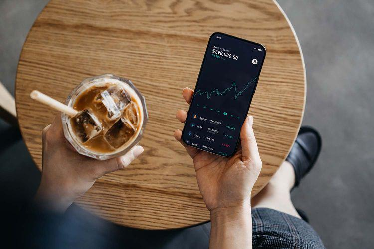

The interest in cryptocurrency and algorithmic trading has surged dramatically in recent years, driven by technological advancements and an increasing appetite for digital assets. This trend reflects a fundamental shift in how financial transactions and investments are conducted, with blockchain technology providing the backbone for this revolution. Algorithmic trading, with its ability to automate complex trading strategies, has become a cornerstone for traders seeking to capitalize on the volatility and opportunities presented by the cryptocurrency market.

Solana emerges as a prominent blockchain platform in 2024, renowned for its scalability and high transaction speeds. These features have positioned Solana as a favorite among developers and traders looking for efficiency and reliability in their blockchain interactions. As its ecosystem grows, Solana continues to garner attention for its capacity to handle a high throughput of transactions at a fraction of the cost associated with other leading blockchains, such as Ethereum and Binance Smart Chain.

A crucial component for anyone holding or trading Solana's native cryptocurrency, SOL, is the utilization of reliable wallets. These wallets not only secure one's holdings but also ensure seamless integration with various decentralized applications (dApps) and trading platforms. As the Solana network expands, the diversity and sophistication of available wallets increase, catering to different user needs ranging from novices to seasoned traders.

This article aims to provide a comprehensive overview of Solana wallets and algorithmic trading, guiding crypto enthusiasts through the essentials of managing their Solana assets securely and efficiently. The right tools and strategies are critical for effective crypto asset management; thus, understanding the functionalities and security features of Solana wallets and trading systems becomes imperative.

In summary, choosing the appropriate tools for cryptocurrency management can greatly influence one's success in navigating the dynamic and sometimes unpredictable crypto market. As the landscape continues to evolve, being well-informed and strategically equipped remains essential for both protection and growth in this digital era.

## Table of Contents

## Understanding Solana Blockchain in 2024

Solana has emerged as one of the leading blockchain platforms in 2024, characterized by significant growth and innovation in the cryptocurrency sector. Known for its high throughput and scalability, Solana has attracted traders and developers with these key features. Its capacity to handle thousands of transactions per second with negligible fees is primarily due to its unique consensus mechanism, known as Proof of History (PoH), which facilitates efficient transaction ordering. Coupled with Proof of Stake (PoS), this allows for a more energy-efficient validation process compared to traditional Proof of Work (PoW) systems.

Solana's position can be understood by comparing its features with established blockchains like Ethereum and Binance Smart Chain (BSC). Ethereum's transition to Ethereum 2.0 and its shift to a PoS consensus aims to address its scalability and energy usage issues; however, Solana's PoH coupled with PoS has already made it more scalable. Solana offers lower transaction costs than Ethereum, making it appealing for traders and developers interested in decentralized finance (DeFi) applications. Compared to BSC, Solana provides a more decentralized solution, which appeals to purists seeking to avoid the perceived centralization of BSC.

Recent updates in Solana, such as enhanced network optimization and developer tools, have contributed to its accelerated adoption. The introduction of new features that improve network resilience and support for complex smart contracts has expanded the possibilities for developers building on Solana. These advancements have not only increased user participation but have also attracted institutional interest, encouraging further market developments.

In 2024, Solana's ecosystem continues to thrive, supported by a robust community of decentralized applications (dApps), DeFi platforms, and non-fungible token (NFT) marketplaces. The Solana ecosystem is continually expanding with the integration of cross-chain solutions, allowing seamless interoperability with other blockchain networks. This has strengthened Solana’s impact on market developments, providing more opportunities for users to engage in diverse financial activities and applications. As Solana evolves, its ecosystem’s influence on the crypto market is expected to increase, driving innovation and creating new economic models for future applications.

## Top Solana Wallets for 2024

In 2024, selecting a reliable Solana wallet is crucial for effectively managing [cryptocurrency](/wiki/cryptocurrency) assets on the Solana blockchain. The following key criteria are essential when evaluating Solana wallets: security features, ease of use, integration capabilities, and user-specific needs.

### Criteria for Selecting a Solana Wallet in 2024

1. **Security**: A reliable Solana wallet must incorporate advanced security features. These include multi-signature support, end-to-end encryption, and frequent security audits. Wallets that offer hardware-level security or two-factor authentication (2FA) are particularly recommended.

2. **Ease of Use**: The user interface should be intuitive, allowing users to navigate easily even if they are not technologically savvy. Wallets should offer comprehensive customer support and user guides to assist both beginners and seasoned traders.

3. **Integration and Compatibility**: A good wallet should support integration with decentralized applications (dApps) on the Solana ecosystem and compatibility with other protocols. Flexibility in connecting with other popular platforms or exchanges is a plus.

4. **User-Specific Needs**: Different users require different functionalities. While a beginner may prioritize ease of setup and usage, experienced users might look for advanced trading features and analytics.

### Leading Solana Wallets for 2024

1. **Phantom**: Phantom continues to be a popular choice in 2024. Known for its user-friendly interface, Phantom supports Solana Pay and NFT transactions. It is equipped with robust security features like biometric authentication and automatic lock screens.

2. **Solflare**: Offering both mobile and web versions, Solflare boasts advanced security through Ledger hardware wallet compatibility. It provides functionalities for staking and participating in Solana-based DeFi activities.

3. **Exodus**: While primarily a multi-currency wallet, Exodus supports Solana. Its seamless design and desktop availability make it a versatile choice. It provides real-time tracking and a built-in exchange feature.

4. **Ledger Nano X**: As a hardware wallet, Ledger Nano X secures Solana assets offline. It ensures high-level security and is suitable for storing larger amounts of cryptocurrency due to its resistance to hacking.

### Features to Look for in a Solana Wallet

When choosing a Solana wallet, prioritize features such as:
- Multi-currency support, allowing the versatility of managing several assets.
- Built-in staking for earning rewards directly through the wallet.
- NFT support, given the rapid growth of the NFT market.
- Cross-platform functionality to enable access from various devices.

### Analysis of Hardware vs Software Solana Wallets

- **Hardware Wallets**: These are physical devices that store cryptocurrencies offline, offering superior security against online attacks. They are ideal for those holding substantial amounts, as they provide an extra layer of protection.

- **Software Wallets**: Although more susceptible to online threats, software wallets are convenient for everyday transactions and trading. Most are free to use and are updated regularly to improve security and functionality.

### Recommendations Based on User Needs

- **Beginners**: Phantom or Exodus are recommended for newcomers due to their intuitive interfaces and comprehensive support systems. These wallets cater to basic needs like transactions and initial exposure to dApp integrations.

- **Experienced Traders**: For users requiring advanced functionalities, Solflare or Ledger Nano X are ideal. Solflare provides extensive DeFi and staking options, while Ledger offers unmatched security for significant holdings.

Selecting the appropriate Solana wallet involves considering individual requirements and balancing them against the wallet's security, usability, and integration capabilities. By choosing the right wallet, users can efficiently manage and protect their Solana assets in 2024.

## Algorithmic Trading with Solana in 2024

Algorithmic trading is a method of executing trades utilizing automated pre-programmed trading instructions to account for variables such as time, price, and [volume](/wiki/volume-trading-strategy). In the cryptocurrency markets, it offers several benefits, including enhanced speed, the ability to manage multiple trades simultaneously, and removing emotional biases from trading decisions. These capabilities are particularly significant in the fast-paced and volatile crypto environment, where timely execution and precision are critical.

Solana, with its high throughput and low transaction costs, is exceptionally conducive to [algorithmic trading](/wiki/algorithmic-trading). Solana's blockchain operates using a unique consensus model known as Proof of History (PoH), which allows the network to process transactions at lightning speed—up to 65,000 transactions per second—as of 2024. This rapid transaction speed significantly reduces latency, which is crucial for high-frequency trading strategies where every millisecond counts. Additionally, Solana's low fees, typically less than a cent per transaction, make it economically viable to execute a large volume of small transactions, which is often required in algorithmic trading strategies.

Several algorithmic trading strategies are well-suited for Solana due to these attributes. These include high-frequency trading ([HFT](/wiki/high-frequency-trading-strategies)), [arbitrage](/wiki/arbitrage), and market-making. HFT involves executing a large number of trades in fractions of a second to exploit small price discrepancies. Arbitrage takes advantage of price differences of the same asset across different markets, while market-making involves providing [liquidity](/wiki/liquidity-risk-premium) to other traders by placing buy and sell orders for a financial asset.

The Solana ecosystem has multiple tools and platforms facilitating algorithmic trading. Decentralized exchanges (DEXs) like Serum, built on the Solana blockchain, provide infrastructure for executing trades robustly and efficiently. Quant trading platforms like Hummingbot also enable traders to develop and deploy HFT bots tailored for Solana's rapid transaction capabilities. These platforms typically offer APIs and SDKs for easier integration and customization, empowering traders to tailor strategies to specific market conditions.

Case studies highlight the success of algorithmic trading strategies on Solana. In 2023, a trading firm successfully implemented an arbitrage bot that capitalized on price discrepancies between different Solana DEXs and centralized exchanges, yielding significant profits. The bot leveraged Solana's speed to execute trades rapidly, thereby maximizing opportunities before they vanished—a feat that would be challenging on slower networks like Ethereum. Another example features a high-frequency trading strategy that constantly adjusts bids within liquidity pools to profit from frequent, small price changes, showcasing the profitability of exploiting Solana's speedy transaction processing.

Algorithmic trading on Solana in 2024 is not only feasible but presents distinct advantages due to the network's inherent characteristics. The combination of rapid transaction speeds and low fees, along with a growing suite of trading platforms and tools, ensures that traders can develop and execute sophisticated strategies tailored to the dynamic demands of the cryptocurrency marketplace.

## Integrating Solana Wallets with Trading Algorithms

Connecting Solana wallets with algorithmic trading systems requires several steps and careful consideration of tools and security measures. Here is an approach to integrate these systems effectively.

### Steps to Connect Solana Wallets with Algorithmic Trading Systems

1. **Choose a Suitable Wallet**: Begin by selecting a Solana wallet that offers robust API support. Examples include Sollet.io and Phantom, which provide developers with the necessary interfaces to connect and interact with trading algorithms.

2. **Accessing Wallet APIs**: Utilize wallet APIs such as Solana's JSON RPC API, which allows for direct interaction with the Solana blockchain. This API is essential for executing transactions, checking balances, and obtaining account information.

3. **Set Up a Development Environment**: Establish a development environment in Python or another language capable of interacting with Solana's APIs. Python's web3 or Solana.py libraries can facilitate communications with the blockchain.

4. **Authenticate and Authorize Access**: Implement authentication procedures using access tokens or private keys to ensure secure access to wallet APIs. Keep these credentials confidential to prevent unauthorized access.

5. **Integrate Trading Algorithms**: Write or implement trading algorithms that can communicate with your wallet via the API. These can include strategies based on market data analysis or predefined trading rules.

6. **Test the Integration**: Conduct comprehensive testing to ensure that wallet and algorithmic trading system integration operates smoothly. Simulate transactions in a controlled environment before deploying them live.

### Software Solutions and APIs

Several software solutions and APIs facilitate seamless integration:

- **Solana.py and Web3.py**: These are Python libraries designed for blockchain interactions, enabling easy execution of transactions and retrieval of blockchain data.
- **Serum and Orca APIs**: For advanced decentralized trading, Serum and Orca offer APIs that can be integrated with trading algorithms to access liquidity on the Solana network.

### Security Considerations

Security is paramount when linking wallets with trading algorithms:

- **Secure Storage of Keys**: Use hardware wallets or encrypted key storage solutions to safeguard private keys.
- **Regular Security Audits**: Conduct periodic security evaluations to detect and resolve vulnerabilities in the integration setup.
- **Rate Limiting and Monitoring**: Implement rate limiting on API calls and continual monitoring for suspicious activity.

### Managing Multiple Accounts and Portfolios

When managing multiple accounts or portfolios:

- **Utilize Account Abstraction**: Abstraction layers allow easier management of multiple accounts, enabling algorithms to perform actions without direct access to each account.
- **Automated Rebalancing**: Use automated tools to rebalance multiple portfolios according to predefined strategies, ensuring consistent portfolio management across accounts.

### Pitfalls to Avoid

- **Neglecting Security**: The most significant risk is failing to protect private keys or allowing unauthorized access to APIs.
- **Overlooking Testing**: Deploying untested integrations can result in transaction failures or financial loss.
- **Ignoring Updates**: Stay informed about updates to Solana's APIs and technological changes that could impact trading algorithms.

By following these guidelines and employing the appropriate technologies, traders can successfully integrate Solana wallets with algorithmic trading systems, ensuring efficient and secure management of digital assets.

## Risks and Considerations

Algorithmic trading on the Solana blockchain in 2024 presents several potential risks that traders must carefully evaluate to safeguard their investments and maximize returns. 

**Potential Risks Involved in Algorithmic Trading on Solana**

Algorithmic trading, by nature, turns risks inherent to traditional trading into automated processes that can exacerbate errors if systems are not properly calibrated. The fast-paced environment of Solana, characterized by its high throughput and low transaction fees, can augment these risks. Common risks include algorithmic errors, market anomalies, and price slippage, which could lead to substantial financial losses.

**Security Vulnerabilities Specific to Solana Wallets**

One critical risk is security vulnerabilities unique to Solana wallets. These vulnerabilities arise from potential exploits in wallet software and the broader blockchain infrastructure. To mitigate such risks, users should opt for wallets with robust security features, including multi-signature support and hardware wallet compatibility. Regular updates to wallet software are essential to protect against newly discovered exploits, and users are advised to adhere to cybersecurity best practices, such as enabling two-[factor](/wiki/factor-investing) authentication and maintaining secure backups of wallet credentials.

**Assessing Market Volatility and Its Implications for Traders**

Solana’s market [volatility](/wiki/volatility-trading-strategies) is both an opportunity and a challenge for traders. Volatile conditions can lead to rapid price changes, impacting order execution and potentially leading to unfavorable trades. Traders need to develop and deploy advanced algorithms capable of real-time risk assessment and rapid response to market conditions. Building stop-loss functions and employing hedging strategies can help mitigate potential losses due to volatility.

**Significance of Staying Updated with Solana’s Technological and Legal Developments**

In 2024, the technological and legal landscapes of Solana continue to evolve, impacting how algorithmic trading is conducted. Staying informed about updates and changes to Solana’s protocol, as well as potential regulatory shifts, is crucial. Subscribing to official Solana communications, following trusted news sources, and participating in community forums can keep traders abreast of vital developments. Compliance with legal requirements is critical to avoid penalties and ensure the longevity of trading operations.

**Guidelines for Risk Management and Preserving Assets**

Effective risk management practices are essential for preserving assets in volatile markets like Solana. Traders should adopt a diversified trading strategy, spreading investments across different asset classes to minimize exposure to any single market event. Monitoring key performance metrics and stress-testing algorithmic models under various scenarios can provide insights into potential vulnerabilities. Implementing a dynamic risk management framework capable of adapting to market conditions can help balance risk and reward.

Algorithmic traders on Solana should remain vigilant, continuously refining strategies and enhancing security measures to navigate the intricacies of an evolving cryptocurrency landscape.

## Future Trends and Opportunities

Predictions for Solana and its ecosystem suggest a robust future as it continues to evolve and adapt to the needs of the cryptocurrency market. The scalability and efficiency of Solana's blockchain, characterized by high throughput and low transaction costs, position it as a formidable player. As developers seek platforms that can handle intensive workloads, Solana is poised to attract significant interest.

Emerging technologies and tools in the crypto trading space are expected to shape the future landscape significantly. One such technology is decentralized finance (DeFi), which is rapidly gaining traction and providing more opportunities for peer-to-peer lending, yield farming, and decentralized exchanges. Tools that enable decentralized swaps, cross-chain compatibility, and advanced security protocols are likely to see substantial adoption within Solana’s ecosystem. Furthermore, the continuous improvement and integration of decentralized identity solutions add another layer of innovation, enhancing user trust and transactional privacy.

Opportunities for innovation and growth within Solana's network also include its potential role in non-fungible tokens (NFTs) and digital collectibles. Solana’s ability to process a high volume of transactions quickly and cost-effectively could engender a vibrant marketplace for NFT creation, trading, and gaming applications. Projects that leverage Solana's capabilities to innovate in this space are likely to attract investment and consumer interest.

Potential regulatory changes pose both challenges and opportunities for Solana. As global regulators consider stricter measures for cryptocurrency, Solana and its stakeholders must remain agile. This environment necessitates proactive regulatory engagement to influence policy that fosters innovation while ensuring compliance. The ability of Solana's platforms to integrate Know Your Customer (KYC) and Anti-Money Laundering (AML) protocols will be crucial, representing both a technical and strategic challenge.

The role of AI and [machine learning](/wiki/machine-learning) in advancing algorithmic trading on Solana is another area ripe for development. These technologies can optimize trading algorithms by analyzing vast datasets to predict market trends, improve decision-making, and minimize risks. AI-driven analytics tools can enhance the effectiveness of algorithmic traders on Solana, leading to smarter and more profitable trading strategies. Python libraries such as TensorFlow and PyTorch can be utilized to develop models that automatically adjust trading strategies based on real-time market conditions.

To sustain growth and capitalize on these future trends, stakeholders in the Solana ecosystem should focus on cultivating a robust infrastructure that encourages participation from developers and users alike. This includes fostering a collaborative environment for innovative projects, ensuring compliance with emerging regulations, and leveraging AI and machine learning to stay ahead in the competitive cryptocurrency trading market.

## Conclusion

The article has explored key aspects of managing Solana cryptocurrency assets and engaging in algorithmic trading as of 2024. Central to this discussion is the critical role of selecting the right Solana wallets and trading systems. With the ongoing developments in Solana’s ecosystem, highlighted by its speed and low transaction fees, having a reliable and efficient wallet becomes indispensable for both novice and experienced traders. It ensures the security and accessibility of funds while fostering seamless integration with advanced trading algorithms.

Crypto enthusiasts are encouraged to remain open to exploring emerging technologies and strategies that can enhance their trading efficiency and effectiveness. The cryptocurrency landscape is continuously evolving, with innovations that present new opportunities as well as challenges. By leveraging these new tools, traders can better adapt to and capitalize on market dynamics.

As we navigate the changing cryptocurrency market of 2024, it’s essential for participants to remain informed about technological, economic, and regulatory shifts. Staying proactive and knowledgeable enables traders to make strategic decisions that preserve and grow their investments in volatile markets.

In conclusion, as the crypto market becomes more sophisticated, the onus is on traders to keep abreast of developments, adapt to advancements in trading platforms, and judiciously select the technologies that align with their trading goals. This vigilance and adaptability are key to thriving in the dynamic world of cryptocurrency trading.

## References & Further Reading

[1]: Yakovenko, A., & Gokal, R. (2021). ["Solana: A New Architecture for a High Performance Blockchain."](https://www.semanticscholar.org/paper/Solana-%3A-A-new-architecture-for-a-high-performance-Yakovenko/8328278c5843963e9cfff3f595b52081bb9aacf0) Solana Labs. 

[2]: ["Distributed Ledger Technology Systems"](https://en.wikipedia.org/wiki/Distributed_ledger) by EU Blockchain Observatory & Forum (2018).

[3]: Antonopoulos, A. M. (2019). ["Mastering Ethereum: Building Smart Contracts and DApps."](https://www.amazon.com/Mastering-Ethereum-Building-Smart-Contracts/dp/1491971940) O'Reilly Media.

[4]: Narang, R. K. (2014). ["Inside the Black Box: A Simple Guide to Quantitative and High Frequency Trading."](https://www.amazon.com/Inside-Black-Box-Quantitative-Frequency/dp/1118362411) Wiley Finance.

[5]: Siegel, J. G. (2023). ["Crypto Trading Strategies for High Frequency Traders in 2024."](https://link.springer.com/book/10.1007/978-3-031-38548-3) Journal of Financial Markets.