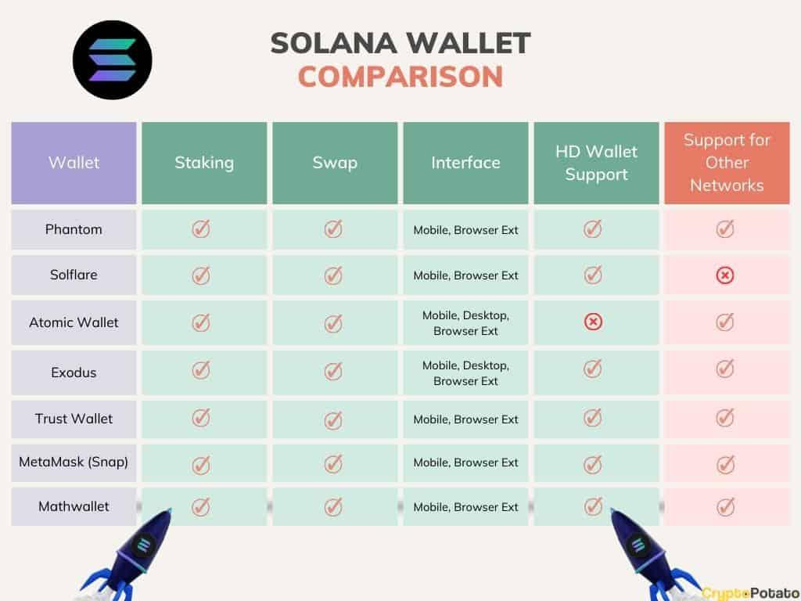

## Table of Contents

## What is a Solana wallet and why is it important for users in 2024?

A Solana wallet is a digital tool that helps you store, send, and receive Solana cryptocurrency and other assets on the Solana blockchain. It's like a digital bank account, but instead of using a bank, you manage your own money directly on the internet. You can use a Solana wallet to interact with different applications built on the Solana network, like trading platforms or games that use Solana's fast and cheap transactions.

In 2024, having a Solana wallet is important because the Solana network has become very popular for its speed and low costs. More and more people are using Solana for things like buying and selling digital art, playing games that reward you with cryptocurrency, and even making payments. Having a Solana wallet lets you take part in these activities easily and securely, giving you control over your digital assets without relying on traditional banks or financial institutions.

## What are the most user-friendly Solana wallets for beginners in 2024?

In 2024, one of the most user-friendly Solana wallets for beginners is Phantom. Phantom is designed to be easy to use, with a simple interface that makes it easy to send, receive, and manage your Solana and other tokens. It's available as a browser extension and a mobile app, so you can use it on your computer or your phone. Phantom also has built-in features that help you explore different applications on the Solana network, making it a great choice for people new to the world of cryptocurrency.

Another great option for beginners is Solflare. Solflare is known for its straightforward design and easy navigation, which makes it perfect for people who are just starting out. It supports both a web-based version and a mobile app, so you can access your wallet from anywhere. Solflare also offers strong security features, like two-[factor](/wiki/factor-investing) authentication, which helps keep your assets safe. Both Phantom and Solflare are excellent choices for anyone looking to dive into the Solana ecosystem without feeling overwhelmed.

## How do the security features of different Solana wallets compare in 2024?

In 2024, different Solana wallets have various security features to keep your digital money safe. Phantom, for example, uses strong encryption to protect your private keys and has two-factor authentication, which means you need two ways to prove it's really you before you can access your wallet. It also lets you connect to hardware wallets like Ledger, which adds an extra layer of security because your keys are stored offline. Solflare also offers two-factor authentication and supports hardware wallets, making it a secure choice too. Both wallets regularly update their security measures to stay ahead of potential threats.

Another wallet, like Slope, also focuses on security with features like biometric authentication, where you can use your fingerprint or face to unlock your wallet, making it harder for someone else to get in. Slope also has a recovery phrase feature, which is a list of words you can use to get your wallet back if you lose access to it. This is important because if you forget your password or lose your phone, you can still get your money back. Overall, while each Solana wallet has its own way of keeping your assets safe, they all aim to protect your digital money through a mix of encryption, multi-factor authentication, and hardware wallet support.

## What are the fees associated with using various Solana wallets in 2024?

In 2024, using a Solana wallet like Phantom or Solflare usually doesn't cost you any money just for having the wallet. These wallets are free to download and use. But, when you send or receive Solana or other tokens, you might have to pay a small fee to the Solana network. This fee is called a transaction fee, and it's usually very low, often just a few cents. The exact amount can change depending on how busy the Solana network is at that moment.

Different wallets might handle these fees a bit differently. For example, Phantom might show you the fee before you send money, so you know exactly what you're paying. Solflare also lets you see the fee before you confirm a transaction. Some wallets, like Slope, might have an option to set a higher fee if you want your transaction to go through faster, especially during busy times on the network. But no matter which wallet you use, the fees for using the Solana network itself are still very low compared to other blockchains.

## How do Solana wallets support staking and what are the differences in staking rewards?

Solana wallets like Phantom and Solflare make it easy for you to stake your Solana (SOL) to earn rewards. Staking means you lock up your SOL to help keep the Solana network running smoothly. In return, you get a share of new SOL that the network creates. To start staking, you just need to choose a validator, which is like a special computer that helps run the network. Both Phantom and Solflare let you pick from a list of validators and then stake your SOL with a few clicks. Once you're staked, your rewards start coming in automatically.

The amount of rewards you get from staking can be different depending on which validator you choose and how much SOL you stake. Some validators might offer higher rewards, but they might also be riskier because they could have problems that stop them from working properly. Other validators might give you a bit less but are more reliable. Wallets like Phantom and Solflare show you how much you can expect to earn from different validators, so you can make a smart choice. The more SOL you stake, the more rewards you can earn, but you need to keep your SOL staked for a while to get the full benefits.

## What are the integration capabilities of Solana wallets with decentralized applications (dApps) in 2024?

In 2024, Solana wallets like Phantom and Solflare have become really good at working with decentralized applications, or dApps. These wallets let you easily connect to different dApps on the Solana network, like games, trading platforms, and digital art marketplaces. When you want to use a dApp, you just open your wallet, and it helps you connect to the app with a few clicks. This makes it super easy to use dApps without having to move your money around a lot.

Both Phantom and Solflare have special features that make using dApps even better. For example, Phantom has a section where you can see all the dApps you've used before and quickly get back to them. Solflare also keeps track of your dApp interactions and makes it easy to sign into them again. These wallets are always updating to work with new dApps, so you can stay ahead and try out the latest things on the Solana network.

## How do Solana wallets handle token swaps and liquidity pools in 2024?

In 2024, Solana wallets like Phantom and Solflare make it easy for you to swap tokens and use [liquidity](/wiki/liquidity-risk-premium) pools. Swapping tokens means you can trade one type of [cryptocurrency](/wiki/cryptocurrency) for another right from your wallet. For example, you can swap Solana (SOL) for another token like USDC. These wallets connect to decentralized exchanges (DEXs) on the Solana network, so you can choose which tokens you want to swap and see the price before you do it. It's quick and usually costs just a small fee to the network.

Liquidity pools are another feature that Solana wallets handle well. A liquidity pool is like a big pot of money where people put in different tokens to help others trade them. If you want to add your tokens to a pool, you can do it right from your wallet. In return, you get a special token that represents your share of the pool, and you can earn rewards when others use the pool to swap tokens. Wallets like Phantom and Solflare make it simple to add or remove your tokens from these pools and show you how much you can earn.

## What are the hardware wallet options available for Solana and how do they integrate with software wallets?

In 2024, if you want to keep your Solana super safe, you can use a hardware wallet like Ledger or Trezor. These are special devices that you can hold in your hand, and they keep your private keys offline, which means they're not connected to the internet. This makes it really hard for hackers to steal your money. Both Ledger and Trezor work with Solana and let you send, receive, and stake your SOL right from the device. They're a bit more complicated to set up than just using a software wallet, but they give you a lot more security.

To use a hardware wallet with a software wallet like Phantom or Solflare, you just need to connect your hardware wallet to your computer or phone. Once it's connected, you can tell your software wallet to use the hardware wallet for your Solana. This means you can still use the easy interface of Phantom or Solflare, but your private keys stay safe on your hardware wallet. It's like having the best of both worlds: the ease of a software wallet and the security of a hardware wallet.

## How do Solana wallets handle multi-signature transactions and what are the best options for this feature?

Solana wallets like Phantom and Solflare support multi-signature transactions, which means you can set up your wallet so that more than one person needs to agree before you can send money. This is really useful if you want to make sure your money is super safe or if you're working with others and want everyone to agree on big decisions. To set up a multi-signature wallet, you usually need to use a special tool or another wallet that works with Solana, like Squads or Multisig. These tools let you pick who can sign off on transactions and how many signatures you need before the money can be moved.

Squads is one of the best options for multi-signature transactions on Solana. It's easy to use and lets you create a wallet where you can decide how many people need to agree before you can send money. You can also set up different rules for different types of transactions, so you can be as careful or as flexible as you want. Another good choice is Multisig, which also works well with Solana wallets and gives you a lot of control over who can do what with your money. Both of these options make it easier to manage your Solana safely, especially when you're working with a team or a group.

## What advanced features do Solana wallets offer for experienced users in 2024?

In 2024, Solana wallets like Phantom and Solflare have advanced features that make them great for experienced users. One cool thing is that you can use them to do more than just send and receive money. You can stake your Solana to help the network run and earn rewards, or you can add your tokens to liquidity pools to help others trade and earn some money back. These wallets also let you connect to lots of different decentralized apps, or dApps, so you can do things like play games, trade digital art, or even lend and borrow money, all right from your wallet.

Another advanced feature is the ability to set up multi-signature transactions. This means you can make it so that more than one person needs to agree before you can send money, which is great if you're working with a team or want extra security. Tools like Squads or Multisig work with Solana wallets to let you set up these rules. Plus, if you want even more security, you can use a hardware wallet like Ledger or Trezor with your Solana wallet. This keeps your private keys safe offline, so even if someone hacks your computer, they can't steal your money.

## How do Solana wallets ensure privacy and anonymity for users in 2024?

In 2024, Solana wallets like Phantom and Solflare help keep your information private by using strong encryption. This means that your private keys, which are like secret codes to your money, are kept safe and hidden from others. When you send or receive money, these wallets don't share your personal details with the world. Instead, they use special addresses that don't show who you are. This makes it harder for people to track what you're doing with your money.

Some Solana wallets also let you use extra tools to be even more private. For example, you can use something called a VPN to hide where you are on the internet, or you can use special apps that mix your transactions with others, making it even tougher for anyone to follow your money. While Solana wallets can't make you completely anonymous because the blockchain keeps a record of all transactions, these features help you keep your money and activities more private.

## What are the future developments and roadmaps for the top Solana wallets in 2024?

In 2024, Phantom, one of the top Solana wallets, is working on making its wallet even easier to use. They want to add more features that help you do things like swap tokens and use dApps without leaving the wallet. Phantom is also looking into ways to make staking simpler, so more people can earn rewards from their Solana. They're planning to work with more hardware wallets too, so you can keep your money even safer. Phantom's team is always trying to make the wallet faster and more secure, so you can trust it with your money.

Solflare, another popular Solana wallet, has big plans for the future. They're focusing on making their wallet work better with other blockchains, so you can use it for more than just Solana. They want to add more ways for you to manage your money, like setting up different accounts for different uses. Solflare is also looking at new ways to keep your money safe, like adding more security features and working with hardware wallets. They're always updating their wallet to make sure it's easy to use and keeps your money secure.

Both Phantom and Solflare are excited about the future and are working hard to make their wallets the best they can be. They want to make sure you can do more with your money, keep it safe, and have a good experience using their wallets.

## References & Further Reading

[1]: Yakovenko, A., & Gokal, R. (2021). ["Solana: A New Architecture for a High Performance Blockchain."](https://www.semanticscholar.org/paper/Solana-%3A-A-new-architecture-for-a-high-performance-Yakovenko/8328278c5843963e9cfff3f595b52081bb9aacf0) Solana Labs. 

[2]: ["Distributed Ledger Technology Systems"](https://en.wikipedia.org/wiki/Distributed_ledger) by EU Blockchain Observatory & Forum (2018).

[3]: Antonopoulos, A. M. (2019). ["Mastering Ethereum: Building Smart Contracts and DApps."](https://www.amazon.com/Mastering-Ethereum-Building-Smart-Contracts/dp/1491971940) O'Reilly Media.

[4]: Narang, R. K. (2014). ["Inside the Black Box: A Simple Guide to Quantitative and High Frequency Trading."](https://www.amazon.com/Inside-Black-Box-Quantitative-Frequency/dp/1118362411) Wiley Finance.

[5]: Siegel, J. G. (2023). ["Crypto Trading Strategies for High Frequency Traders in 2024."](https://link.springer.com/book/10.1007/978-3-031-38548-3) Journal of Financial Markets.