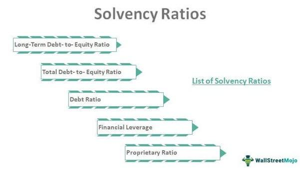

Understanding the financial health of a company is crucial for investors, analysts, and other stakeholders. Reliable evaluation metrics are indispensable in making informed decisions about investing or engaging with a particular business entity. Among these metrics, liquidity and solvency ratios stand out as fundamental components of financial analysis. Liquidity ratios measure a company's capability to meet its short-term liabilities with its most liquid assets, whereas solvency ratios gauge the ability to sustain long-term operations and obligations. Together, these ratios provide a comprehensive view of a company's financial robustness.

Liquidity ratios, such as the current ratio, quick ratio, and cash ratio, offer insight into a firm's operational efficiency by assessing how effectively it can convert its assets into cash to cover imminent obligations. Meanwhile, solvency ratios like the debt-to-equity ratio, debt-to-assets ratio, and interest coverage ratio appraise a company's financial leverage, illuminating its capacity to uphold operations and manage debt over the long haul. By examining these ratios, stakeholders can ascertain both immediate financial stability and enduring viability.



Complementing traditional financial assessment, algorithmic trading introduces a transformative approach to financial markets, driven by technology and data analytics. This innovative trading strategy employs computer algorithms to execute trades based on pre-established criteria, optimizing for speed and precision. The integration of liquidity and solvency ratios into algorithmic frameworks enables investors to make swift, data-driven trading decisions that reflect both present and prospective financial health indicators. This amalgamation of financial analysis with algorithmic trading strategies not only enhances the precision of investment outcomes but also capitalizes on market efficiencies.

In summary, this article explores the pivotal role of liquidity and solvency ratios in evaluating corporate financial health and their strategic application in algorithmic trading. Through such integration, investors and analysts can achieve a more nuanced understanding of a company's financial status, enabling robust and informed investment strategies.

## Table of Contents

## Understanding Liquidity Ratios

Liquidity ratios are essential financial metrics that determine a company's ability to meet its short-term obligations using its most liquid assets. They are pivotal for assessing the company's operational efficiency and its capability to convert assets into cash without the need for raising external capital. These ratios provide stakeholders with insights into the financial flexibility and short-term financial health of a business.

### Key Liquidity Ratios

#### Current Ratio

The current ratio is a primary measure used to evaluate a company's ability to cover its short-term liabilities with its short-term assets. It is calculated as:

$$
\text{Current Ratio} = \frac{\text{Current Assets}}{\text{Current Liabilities}}
$$

A current ratio greater than one indicates that the company has more current assets than current liabilities, suggesting good [liquidity](/wiki/liquidity-risk-premium). However, excessively high values might indicate inefficient use of assets.

#### Quick Ratio (Acid-Test Ratio)

The quick ratio refines the current ratio by excluding inventory from current assets, as inventory may not always be as liquid. The formula for the quick ratio is:

$$
\text{Quick Ratio} = \frac{\text{Current Assets} - \text{Inventory}}{\text{Current Liabilities}}
$$

This ratio presents a stricter assessment of liquidity, focusing on the most liquid assets, such as cash, marketable securities, and receivables. A higher quick ratio is generally favorable as it indicates that a company can cover its immediate liabilities without selling inventory.

#### Cash Ratio

The cash ratio is the most conservative liquidity ratio as it only considers cash and cash equivalents relative to a company's current liabilities. It is calculated using the formula:

$$
\text{Cash Ratio} = \frac{\text{Cash and Cash Equivalents}}{\text{Current Liabilities}}
$$

A cash ratio of more than one implies that a company can pay off its current liabilities solely from its cash resources, reflecting robust liquidity. Nevertheless, a very high cash ratio might suggest that the company is not investing its cash effectively.

### Importance of Liquidity Ratios

Liquidity ratios are vital as they help investors, creditors, and analysts assess whether a company can pay its short-term obligations, offering a glimpse into the firm's day-to-day financial management. A company with strong liquidity is often better positioned to withstand financial stress due to unexpected expenses or downturns, promoting overall operational stability.

In summary, understanding and analyzing liquidity ratios is crucial for gauging a company's operational efficiency and short-term financial health, providing a foundation for making informed financial decisions.

## Solvency Ratios: Gauging Long-Term Financial Health

Solvency ratios are essential tools for evaluating a company's ability to meet its long-term obligations and ensure ongoing business operations. These metrics provide insights into the financial stability and risk exposure of a company, which is crucial for stakeholders such as investors, creditors, and analysts.

### Key Solvency Ratios

1. **Debt-to-Equity Ratio**: This ratio measures a company's financial leverage by comparing its total liabilities to its shareholders' equity. It is calculated as:
$$
   \text{Debt-to-Equity Ratio} = \frac{\text{Total Liabilities}}{\text{Shareholders' Equity}}

$$

   A higher ratio indicates greater leverage and potential financial risk, as the company relies more on borrowed funds relative to the equity capital provided by shareholders.

2. **Debt-to-Assets Ratio**: This ratio indicates the proportion of a company's assets that are financed by debt. It is expressed as:
$$
   \text{Debt-to-Assets Ratio} = \frac{\text{Total Liabilities}}{\text{Total Assets}}

$$

   A higher debt-to-assets ratio means a significant portion of the company's assets are financed through debt, which may increase the financial risk during economic downturns.

3. **Interest Coverage Ratio**: This ratio assesses a company's ability to pay interest expenses on its outstanding debt. It is calculated using the formula:
$$
   \text{Interest Coverage Ratio} = \frac{\text{Earnings Before Interest and Taxes (EBIT)}}{\text{Interest Expenses}}

$$

   A higher interest coverage ratio indicates that a company can comfortably meet its interest obligations from its operating earnings, suggesting lower financial risk.

### Importance of Solvency Analysis

Solvency analysis is critical for understanding a company's financial leverage and risk profile. Companies with low solvency ratios may struggle to secure financing or investment, as they pose higher risk to creditors and investors. Conversely, strong solvency ratios imply lower financial risk, enhancing a company's attractiveness to investors. By analyzing solvency ratios, stakeholders can make informed decisions regarding investment, lending, and strategic management, ensuring a balanced approach to growth and financial health.

## The Role of Liquidity and Solvency in Financial Analysis

Understanding liquidity and solvency analyses is pivotal for assessing a company’s financial stability and overall risk profile. Liquidity indicators, such as the current, quick, and cash ratios, reflect a company's proficiency in managing short-term obligations with available assets. A robust liquidity position signifies that a company can fulfill its immediate liabilities without resorting to external financing. This capability is especially crucial in volatile markets or periods of financial uncertainty, where access to capital can be constrained.

Conversely, solvency ratios, including the debt-to-equity, debt-to-assets, and interest coverage ratios, are critical for evaluating a company's long-term financial health and its ability to sustain operations over extended periods. Companies that exhibit strong solvency are typically well-positioned to manage long-term debt and are less susceptible to financial distress. For investors, a strong solvency profile indicates lower financial risk and a foundation for continued business expansion and profitability.

Integrating liquidity and solvency metrics offers a comprehensive perspective of a company's financial condition. Employing these analyses in combination allows investors and analysts to discern a more rounded view of potential risks and opportunities. For instance, a company may exhibit high liquidity yet possess high leverage, indicating potential vulnerability if long-term debt obligations cannot be serviced. Alternatively, a firm with moderate liquidity but excellent solvency might suggest stable long-term prospects, even if short-term operations need attention.

By leveraging both liquidity and solvency metrics, investors can better navigate the complexities of financial health evaluation, resulting in more informed decision-making. This integration is not solely beneficial for risk mitigation but also crucial for identifying growth opportunities and ensuring sustainable investment returns. In financial analysis, achieving a balance between understanding current operational efficiency and long-term debt management facilitates a nuanced and strategic approach to investment.

## Algorithmic Trading and Financial Ratios

Algorithmic trading, often referred to as algo trading, leverages computer algorithms to execute trades rapidly and efficiently based on established criteria. This trading style revolutionizes traditional methods by integrating technology and data analysis for sophisticated decision-making. One significant advantage of [algorithmic trading](/wiki/algorithmic-trading) is the ability to incorporate financial ratios into its models, allowing for data-driven decisions that can swiftly adapt to changing market conditions.

Financial ratios, particularly liquidity and solvency ratios, provide essential insights into a company's financial health. Liquidity ratios, such as the current ratio and quick ratio, indicate a company's ability to meet its short-term liabilities using its liquid assets. On the other hand, solvency ratios, like the debt-to-equity ratio, assess a company's capacity to fulfill its long-term obligations, reflecting its overall financial stability.

Integrating these ratios into algorithms enhances the selection process by focusing on financially sound companies. For instance, an algorithm might include criteria that select stocks based on a minimum current ratio threshold, ensuring that the chosen companies can comfortably cover short-term debts. Similarly, an algorithm could prioritize companies with a lower debt-to-equity ratio, suggesting robust long-term financial health.

Here is a simple example of how one might implement such criteria in a Python-based trading algorithm:

```python
def select_stocks_based_on_ratios(stock_data):
    # Define thresholds for financial ratios
    current_ratio_threshold = 1.5
    debt_to_equity_threshold = 0.5

    # Filter stocks that meet the criteria
    selected_stocks = []
    for stock in stock_data:
        if (stock['current_ratio'] > current_ratio_threshold and 
                stock['debt_to_equity'] < debt_to_equity_threshold):
            selected_stocks.append(stock['ticker'])

    return selected_stocks

# Example stock data
stock_data = [
    {'ticker': 'AAPL', 'current_ratio': 1.8, 'debt_to_equity': 0.4},
    {'ticker': 'MSFT', 'current_ratio': 1.4, 'debt_to_equity': 0.6},
    {'ticker': 'GOOGL', 'current_ratio': 2.0, 'debt_to_equity': 0.3},
]

selected_stocks = select_stocks_based_on_ratios(stock_data)
print("Selected Stocks:", selected_stocks)
```

This code snippet demonstrates a simplistic approach to integrating financial ratios into a stock selection algorithm. The algorithm selects companies that meet specific financial health criteria, offering a method to filter investments based on liquidity and solvency measures.

Thus, incorporating liquidity and solvency ratios within algorithmic trading frameworks not only refines the selection process but also enhances risk management by concentrating on financially viable companies. This alignment of trading strategies with financial health indicators can significantly improve investment outcomes, providing investors with a competitive edge in the dynamic financial markets.

## Integrating Liquidity, Solvency Analyses with Algo Trading

The integration of liquidity and solvency analyses into algorithmic trading enhances both portfolio management and risk assessment by leveraging comprehensive financial health indicators for decision-making processes. Algorithmic trading involves executing trades based on predefined conditions and criteria. By incorporating liquidity and solvency ratios into these algorithms, traders can ensure that their selections are aligned with the financial stability of the companies being traded. 

Liquidity ratios, such as the current ratio, quick ratio, and cash ratio, provide insights into a company's ability to meet its short-term obligations. On the other hand, solvency ratios, including the debt-to-equity ratio, debt-to-assets ratio, and interest coverage ratio, offer a view of a company's capacity to manage its long-term debts. Together, these ratios can offer a powerful framework for evaluating the financial health of organizations and guiding investment decisions.

The integration process generally starts by incorporating these financial ratios into the algorithm's data inputs. The trading algorithm can be designed to filter companies based on thresholds set for liquidity and solvency ratios. For instance, a Python-based algorithm may use libraries such as NumPy and Pandas for data manipulation, setting conditions such as:

```python
import pandas as pd

# Example DataFrame for companies with their respective financial ratios
data = {
    'Company': ['A', 'B', 'C'],
    'Current_Ratio': [2.5, 1.2, 3.0],
    'Debt_to_Equity': [0.5, 1.5, 0.8]
}

df = pd.DataFrame(data)

# Define thresholds for liquidity and solvency
liquidity_threshold = 1.5
solvency_threshold = 1.0

# Filtering companies based on defined thresholds
filtered_companies = df[(df['Current_Ratio'] > liquidity_threshold) & (df['Debt_to_Equity'] < solvency_threshold)]

print(filtered_companies)
```

By ensuring these thresholds, the algorithm can prioritize selecting companies that exhibit a strong ability to handle their financial obligations, thereby minimizing the risk of investment. Additionally, these algorithms can dynamically adjust trading strategies based on the continuous monitoring of liquidity and solvency ratios, allowing for a more responsive and adaptive trading approach.

Moreover, the integration of financial ratios into algorithmic strategies can optimize portfolios by balancing high-return opportunities with underlying financial risks. These combined strategies enable investors to make informed decisions, aligning their trades with companies that demonstrate a solid financial footing, ultimately enhancing the potential for better investment outcomes. By consistently applying this methodology, investors can develop a robust framework that not only capitalizes on market opportunities but also safeguards against financial distress from poorly performing assets.

## Conclusion

Liquidity and solvency ratios are indispensable tools for assessing a company's financial health, providing critical insights into its ability to meet short-term obligations and maintain long-term stability. Liquidity ratios, such as the current ratio and quick ratio, help evaluate a company's efficiency in managing its immediate financial commitments, while solvency ratios, like the debt-to-equity ratio and interest coverage ratio, offer a perspective on long-term financial viability and risk.

Algorithmic trading has emerged as a powerful evolution in trading technology, enhancing the ability to execute trades swiftly and with precision. By leveraging advanced computer algorithms, trading processes can now incorporate a wide array of data points, including financial ratios, to make more calculated decisions. This integration allows for real-time analysis and responsiveness to market changes, crucial for optimizing trading strategies.

Combining these financial analyses with algorithmic strategies offers investors a pathway to more robust and informed investment decisions. The systematic use of liquidity and solvency metrics within trading algorithms ensures that investments are directed toward companies that exhibit strong financial health indicators. This alignment not only enhances risk assessment but also facilitates more strategic portfolio management.

In summary, the fusion of financial analysis with algorithmic trading democratizes access to sophisticated investment strategies, presenting a significant opportunity for investors to refine their approaches and achieve improved outcomes. The strategic application of liquidity and solvency ratios within this framework underscores their critical role in developing sound, data-driven investment strategies.

## References & Further Reading

[1]: ["Financial Ratios for Executives: How to Assess Company Strength, Fix Problems, and Make Better Decisions"](https://link.springer.com/book/10.1007/978-1-4842-0731-4) by Michael Rist

[2]: ["Algorithmic Trading and DMA: An Introduction to Direct Access Trading Strategies"](https://www.amazon.com/Algorithmic-Trading-DMA-introduction-strategies/dp/0956399207) by Barry Johnson

[3]: ["The Intelligent Investor: The Definitive Book on Value Investing"](https://www.amazon.com/Intelligent-Investor-3rd-Ed/dp/0063356724) by Benjamin Graham

[4]: ["Essentials of Corporate Finance"](https://www.amazon.com/Essentials-Corporate-Finance-Stephen-Ross/dp/1264101570) by Stephen A. Ross, Randolph W. Westerfield, and Bradford D. Jordan

[5]: ["Algorithmic Trading: Winning Strategies and Their Rationale"](https://www.wiley.com/en-us/Algorithmic+Trading%3A+Winning+Strategies+and+Their+Rationale-p-9781118460146) by Ernest P. Chan