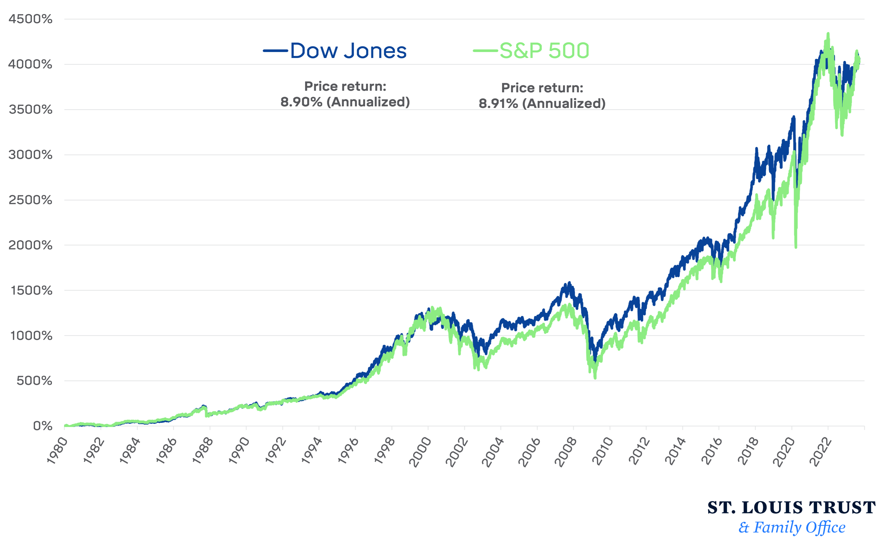

## Table of Contents

## What is an ETF?

An ETF, or Exchange-Traded Fund, is a type of investment that works like a basket of different stocks, bonds, or other assets. You can buy and sell it on a stock exchange, just like you would with a regular stock. ETFs are popular because they let you invest in a lot of things at once, which can help spread out your risk. Instead of picking one company to invest in, you can invest in many through an ETF.

ETFs are managed by professionals who choose what goes into the basket. This means you don't have to pick the individual stocks or bonds yourself. They often track a specific index, like the S&P 500, which means they try to match the performance of that index. This makes ETFs a good choice for people who want a simple way to invest in the market without having to do a lot of research on their own.

## What is the S&P 500?

The S&P 500 is a list of 500 big companies in the United States. It's like a scoreboard that shows how well these companies are doing. People use it to see how the stock market is doing overall. The S&P stands for Standard & Poor's, which is the company that makes the list. They pick the companies based on things like how much they're worth and how much people trade their stocks.

When you hear that the S&P 500 went up or down, it means the total value of those 500 companies changed. If it goes up, it usually means the stock market is doing well, and if it goes down, it might mean the market is not doing so well. A lot of people and companies use the S&P 500 to help them decide where to invest their money. It's a good way to get a quick look at how the U.S. economy is doing.

## What is the Dow Jones Industrial Average?

The Dow Jones Industrial Average, often just called the Dow, is a list of 30 big companies in the United States. It's like a report card that shows how these companies are doing. The Dow is made by a company called Dow Jones & Company. They pick the companies based on how important they are to the economy. When people talk about the Dow going up or down, they're talking about how the total value of these 30 companies changed.

The Dow is different from the S&P 500 because it has fewer companies, but it's still a popular way to check how the stock market is doing. When the Dow goes up, it usually means the stock market is doing well, and when it goes down, it might mean the market is not doing so well. People and companies use the Dow to help them decide where to put their money. It's a quick way to get an idea of how the U.S. economy is doing.

## How do S&P 500 ETFs and Dow Jones ETFs differ in their composition?

S&P 500 ETFs are made up of stocks from 500 big companies in the United States. These companies are picked by Standard & Poor's based on how much they're worth and how much their stocks are traded. When you invest in an S&P 500 [ETF](/wiki/etf-trading-strategies), you're investing in a wide range of companies from different industries, like technology, healthcare, and finance. This helps spread out your risk because if one industry does badly, the others might do well and balance it out.

Dow Jones ETFs, on the other hand, include stocks from just 30 big companies. These companies are chosen by Dow Jones & Company based on how important they are to the economy. The Dow focuses on a smaller number of companies, but they are very well-known and influential. When you invest in a Dow Jones ETF, you're betting on the performance of these specific 30 companies. This can be riskier because if a few of these companies do badly, it can have a bigger impact on your investment.

In summary, the main difference between S&P 500 ETFs and Dow Jones ETFs is the number of companies they include and how those companies are chosen. S&P 500 ETFs offer a broader and more diversified investment, while Dow Jones ETFs focus on a smaller, more select group of companies. Both can be good choices depending on what you're looking for in an investment.

## What are the historical performance differences between S&P 500 ETFs and Dow Jones ETFs?

Historically, S&P 500 ETFs have often done better than Dow Jones ETFs over the long term. This is because the S&P 500 includes a bigger and more diverse group of companies. When you invest in an S&P 500 ETF, you're spreading your money across many different industries and companies. This can help smooth out the ups and downs of the market. Over many years, this broad approach has usually given better returns than focusing on just the 30 companies in the Dow Jones.

On the other hand, the Dow Jones can sometimes do better in certain short periods. This happens because the Dow is made up of fewer, but very big and important companies. If these companies do really well, the Dow can go up a lot in a short time. But, because it's based on fewer companies, it can also go down a lot if those companies don't do well. So, while the Dow might have some big wins, it can be riskier and less stable than the S&P 500 over the long run.

In the end, it depends on what you're looking for. If you want a safer, more steady investment over many years, the S&P 500 might be a better choice. But if you're okay with more risk and are looking for shorter-term gains, the Dow Jones could be worth considering. Both have their ups and downs, but the S&P 500 has generally been a stronger performer over time.

## How do the expense ratios of typical S&P 500 ETFs compare to those of Dow Jones ETFs?

The expense ratio is how much it costs to own an ETF each year. For S&P 500 ETFs, these costs are usually pretty low. Many popular S&P 500 ETFs have expense ratios that are less than 0.10%. This is because there are a lot of S&P 500 ETFs, and they compete with each other to keep costs low. When you pay less in fees, more of your money can grow over time.

Dow Jones ETFs, on the other hand, often have slightly higher expense ratios. They might be around 0.20% or more. This is because there are fewer Dow Jones ETFs, so they don't have to compete as much on price. Even though the difference might seem small, over many years, paying a higher expense ratio can mean less money in your pocket at the end. So, if you're looking to keep costs down, S&P 500 ETFs usually have the edge.

## What are the liquidity differences between S&P 500 ETFs and Dow Jones ETFs?

S&P 500 ETFs usually have more [liquidity](/wiki/liquidity-risk-premium) than Dow Jones ETFs. Liquidity means how easy it is to buy or sell an ETF without affecting its price too much. Because S&P 500 ETFs are very popular and a lot of people want to buy and sell them, they have a lot of trading happening all the time. This means you can usually buy or sell them quickly and at a fair price.

Dow Jones ETFs, on the other hand, might not be as liquid. They are based on a smaller number of companies, and fewer people might be interested in them. This can mean that there's less trading happening, so it might be harder to buy or sell them without moving the price a bit. If you're looking for an ETF that's easy to trade, an S&P 500 ETF is usually a better choice.

## How do the diversification benefits of S&P 500 ETFs compare to those of Dow Jones ETFs?

S&P 500 ETFs offer better diversification than Dow Jones ETFs. Diversification means spreading your money across many different things to lower your risk. The S&P 500 includes 500 big companies from all kinds of industries, like technology, healthcare, and finance. When you invest in an S&P 500 ETF, you're not putting all your eggs in one basket. If one industry or company does badly, others might do well and balance it out. This makes your investment safer and more stable over time.

On the other hand, Dow Jones ETFs are based on just 30 companies. These companies are big and important, but they don't cover as many industries as the S&P 500. This means that if a few of these companies or industries don't do well, it can have a bigger impact on your investment. So, while Dow Jones ETFs can still be a good choice, they don't offer as much diversification as S&P 500 ETFs. If you want to spread your risk as much as possible, an S&P 500 ETF is usually a better option.

## What are the tax implications of investing in S&P 500 ETFs versus Dow Jones ETFs?

The tax implications of investing in S&P 500 ETFs and Dow Jones ETFs can be similar, but there are some things to keep in mind. Both types of ETFs can generate capital gains and dividends, which you might have to pay taxes on. Capital gains happen when you sell your ETF for more than you paid for it. Dividends are payments the ETF makes to you from the profits of the companies it holds. The tax rate on these can depend on how long you held the ETF and your income level.

One thing to consider is how often the ETF trades its holdings. S&P 500 ETFs usually have lower turnover because they track a broad index that doesn't change much. Lower turnover can mean fewer capital gains distributions, which can be good for your taxes. Dow Jones ETFs might have a bit more turnover because they focus on fewer companies, which can lead to more capital gains distributions. But the difference isn't always big, and other factors like how long you hold the ETF can matter more for your taxes.

## How do sector exposures differ between S&P 500 ETFs and Dow Jones ETFs?

S&P 500 ETFs have a wide range of sector exposures because they include stocks from 500 big companies across many different industries. This means you get a little bit of everything, from tech companies like Apple and Microsoft to healthcare companies like Johnson & Johnson, and financial firms like JPMorgan Chase. The S&P 500 is designed to reflect the whole U.S. economy, so it gives you a balanced mix of sectors. This can be good if you want to spread your risk across different parts of the economy.

Dow Jones ETFs, on the other hand, have a more focused sector exposure because they only include 30 big companies. These companies are often from industries like technology, healthcare, and finance too, but there are fewer of them. For example, you might find companies like Apple, UnitedHealth Group, and Goldman Sachs in the Dow. Because there are fewer companies, the Dow might not give you as much variety in sectors as the S&P 500. If you invest in a Dow Jones ETF, your money is more concentrated in these specific companies and sectors.

## What are the rebalancing strategies for S&P 500 ETFs compared to Dow Jones ETFs?

S&P 500 ETFs are rebalanced a few times a year to make sure they still match the S&P 500 index. This means they might buy or sell stocks to keep the right mix of companies. The S&P 500 is a big list that tries to show how the whole U.S. economy is doing, so it changes slowly. When a company gets too big or too small, or if a new company should be on the list, the S&P 500 changes. Then, the ETFs that follow this index have to change too, but they do it in a way that doesn't cause too much buying and selling. This keeps the ETF running smoothly and can help keep your taxes lower.

Dow Jones ETFs are rebalanced less often because the Dow Jones Industrial Average only has 30 companies. The Dow changes when a company on the list does something big, like merging with another company or going bankrupt. When this happens, the people who manage the Dow pick a new company to replace it. Then, the ETFs that follow the Dow have to buy or sell stocks to match the new list. Because the Dow has fewer companies, any change can have a bigger effect on the ETF. But, like with the S&P 500, the managers try to do this in a way that doesn't cause too much trouble for investors.

## How do S&P 500 ETFs and Dow Jones ETFs perform during different market cycles?

S&P 500 ETFs and Dow Jones ETFs can perform differently during different market cycles. In a bull market, when the stock market is going up and people are feeling good about investing, both types of ETFs usually do well. But S&P 500 ETFs often do better because they include a lot more companies from many different industries. If one industry isn't doing so well, other industries might be doing great, which can help keep the ETF's value growing. Dow Jones ETFs, with only 30 companies, might go up a lot if those companies are doing really well, but they can be riskier because they don't have as much variety.

In a bear market, when the stock market is going down and people are worried, both types of ETFs can lose value. But again, S&P 500 ETFs might do better over time because they are more diversified. If one sector is hit hard, the others might not be as bad, which can help cushion the fall. Dow Jones ETFs, with fewer companies, can drop more if those 30 companies are hit hard by the market downturn. So, while both ETFs can go through ups and downs, S&P 500 ETFs tend to be a bit steadier because they spread the risk across more companies and industries.

## How Do You Choose the Right ETF for Your Investment Goals?

When selecting between the S&P 500 and Dow Jones ETFs, investors must assess their personal investment goals and risk tolerance. The decision fundamentally revolves around the contrasting structures and market exposure that these two ETFs provide.

### Diversification and Market Exposure

The S&P 500 ETF is renowned for its diversification advantage, encompassing 500 constituent companies that span various sectors of the economy. This broad market exposure mitigates risk and captures the performance of large-cap U.S. equities. Investors seeking diversification benefit across multiple sectors, such as Information Technology, Healthcare, and Financials, may find the S&P 500 ETF more aligned with their objectives. This ETF is strategically weighted by market capitalization, meaning that larger companies have a bigger influence on the ETF's performance, which often results in tracking the performance of pioneering firms like Apple, Microsoft, and Amazon.

Mathematically, the weight $w_i$ of each company $i$ in a market-capitalization weighted index like the S&P 500 is calculated as:

$$
w_i = \frac{\text{Market Capitalization of Company } i}{\sum_{j=1}^{N} \text{Market Capitalization of Company } j}
$$

where $N$ is the total number of companies in the index.

### Stability and Blue-Chip Companies

Conversely, the Dow Jones ETF appeals to investors prioritizing stability and the consistent performance of established companies. The Dow Jones index consists of just 30 companies, primarily blue-chip stocks, which offer relative security and steady growth potential over time. Being a price-weighted index, the Dow Jones assigns weights to companies based on their stock price rather than market cap, which sometimes leads to disproportionate influence of higher-priced stocks, such as UnitedHealth Group and Goldman Sachs, on the index.

The price-weighted nature of the Dow Jones can be expressed as:

$$
w_i = \frac{\text{Share Price of Company } i}{\sum_{k=1}^{M} \text{Share Price of Company } k}
$$

where $M$ is the total number of companies in the Dow Jones index.

### Risk Tolerance and Investment Horizons

Investors with a higher risk tolerance and a longer investment horizon might prefer the S&P 500 ETF for its potential to harness market-wide gains during bullish trends, given its diverse collection of companies. Conversely, those with a more conservative approach, possibly nearing retirement or favoring capital preservation, might gravitate toward the Dow Jones ETF for its emphasis on reliable, time-tested corporations. 

Ultimately, the choice between these two ETFs should reflect an investor's risk appetite, investment timeline, and overall financial strategy. By understanding and aligning with these criteria, individuals can make informed decisions that optimize their portfolio's potential.

## References & Further Reading

[1]: ["Advances in Financial Machine Learning"](https://www.amazon.com/Advances-Financial-Machine-Learning-Marcos/dp/1119482089) by Marcos Lopez de Prado

[2]: ["A Random Walk Down Wall Street: The Time-Tested Strategy for Successful Investing"](https://www.amazon.com/Random-Walk-Down-Wall-Street/dp/0393358380) by Burton G. Malkiel

[3]: ["Quantitative Trading: How to Build Your Own Algorithmic Trading Business"](https://www.amazon.com/Quantitative-Trading-Build-Algorithmic-Business/dp/1119800064) by Ernest P. Chan

[4]: ["Evidence-Based Technical Analysis: Applying the Scientific Method and Statistical Inference to Trading Signals"](https://www.amazon.com/Evidence-Based-Technical-Analysis-Scientific-Statistical/dp/0470008741) by David Aronson

[5]: ["Exchange-Traded Funds and the New Dynamics of Investing"](https://rpc.cfainstitute.org/research/financial-analysts-journal/2017/exchange-traded-funds-and-the-new-dynamics-of-investing) by Ananth N. Madhavan