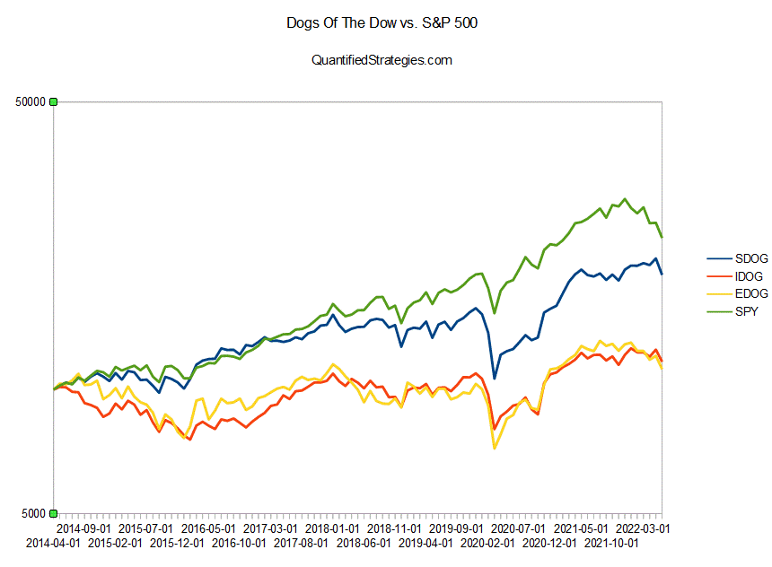

Investing in Exchange-Traded Funds (ETFs) has garnered significant attention among both new and seasoned investors. This interest stems primarily from the inherent benefits of ETFs, such as diversification and cost-effectiveness. Among the various ETF options available, the S&P 500 ETF and the Dow Jones ETF stand out as two of the most widely traded and recognized products in the financial markets.

The S&P 500 ETF offers investors exposure to 500 leading companies across various sectors in the United States, providing broad market exposure. In contrast, the Dow Jones ETF focuses on 30 of the most substantial and established U.S. companies, often referred to as blue-chip stocks. This distinction in composition between the two ETFs leads to different risk profiles and potential returns, making them appealing to different types of investors.



This article aims to explore the key differences between the S&P 500 ETF and the Dow Jones ETF. By examining their historical performance metrics, it becomes possible to understand how each ETF has fared in various market conditions. Additionally, we will discuss how algorithmic trading can enhance ETF investment strategies by leveraging systematic, pre-set strategies to optimize trade execution and reduce emotional biases. 

Understanding these elements is crucial for investors who wish to align their choices with individual investment goals, particularly when deciding between these ETFs. Whether seeking diversified market exposure or stability through well-established companies, this article will provide valuable insights to aid in making an informed decision.

## Table of Contents

## Understanding S&P 500 ETF

The S&P 500 ETF is designed to emulate the performance of the S&P 500 Index, which consists of 500 prominent companies traded in the United States. This ETF offers investors a gateway to broad market exposure, encapsulating diverse sectors of the economy. Its construction relies on a weighted average market capitalization methodology. This approach means that companies with a higher market capitalization hold more weight within the index, thus prominently influencing the ETF's overall performance. Consequently, investors are primarily exposed to larger, well-established companies, often reducing the volatility associated with smaller, more speculative stocks.

The S&P 500 Index is predominantly composed of sectors such as Information Technology, Healthcare, and Financials. Information Technology, for instance, frequently constitutes a significant portion of the index, illustrating the tech sector's impact on the U.S. economy. Similarly, the Healthcare sector provides defensive characteristics, benefiting from consistent demand regardless of economic cycles. The Financials sector includes banks and financial institutions, which are integral to market liquidity and economic growth.

Top holdings within the S&P 500 [ETF](/wiki/etf-trading-strategies) typically feature some of the largest corporations by market capitalization, including tech giants like Apple Inc., Microsoft Corporation, and Amazon.com Inc. These companies not only represent a significant portion of the ETF but also demonstrate strong revenue growth and consistent earnings, contributing to the overall financial stability and potential growth of the fund.

The emphasis on larger companies within the S&P 500 ETF may provide a level of stability and lower [volatility](/wiki/volatility-trading-strategies), advantageous for investors seeking steady growth over time. However, it also leads to concentration in high-market-cap stocks, which can pose a risk if these companies face economic downturns. Investors should be mindful of these dynamics when considering the S&P 500 ETF as part of their investment strategy.

## Understanding Dow Jones ETF

The Dow Jones ETF is an exchange-traded fund that aims to emulate the performance of the Dow Jones Industrial Average (DJIA), which includes 30 of the most influential and largest companies in the United States. This ETF is distinctive due to its price-weighted methodology, which sets it apart from the market-cap weighting strategy used by indices like the S&P 500. In a price-weighted index, stocks are weighted according to their stock price. Thus, companies with higher-priced shares have a greater impact on the index's performance. 

This composition fundamentally affects how the index responds to market changes; hence the ETF's performance can be skewed by movements in high-priced stocks. For instance, in a simplified scenario where a stock worth $200 experiences a 10% increase, its effect on the index will be more significant compared to a $50 stock with a similar percentage growth.

The Dow Jones ETF represents a sectoral allocation that is heavily skewed towards Financials, Healthcare, and Information Technology. These sectors play a critical role in the U.S. economy and continue to provide robust growth and stability opportunities. Key holdings in the Dow Jones ETF include UnitedHealth Group, Microsoft, and Goldman Sachs, which are considered market leaders and hold significant influence in their respective industries. 

Investors choosing the Dow Jones ETF often seek exposure to well-established blue-chip stocks, which tend to present lower volatility and consistent performance. Blue-chip companies are generally recognized for their ability to generate steady profits and dividends over time, thus offering core strength to an investor's portfolio. This ETF suits investors who favor capital preservation and modest appreciation, coupled with a reliance on the historically strong performance of large, seasoned corporations.

Given the nature of its composition and its high reliance on top-performing sectors, the Dow Jones ETF provides a mix of both cyclical and defensive qualities, catering to risk-averse investors who require a balanced blend of growth and safety in their investment strategies.

## Performance Comparison

The S&P 500 ETF, which tracks a broad array of 500 large-cap U.S. companies, has historically demonstrated superior performance compared to the Dow Jones ETF, which is designed to reflect the price movements of 30 prominent blue-chip corporations in the United States. This disparity in performance is largely attributed to the different methodologies used in constructing these indices, as well as the broader and more diversified exposure offered by the S&P 500.

When examining annualized returns, the S&P 500 ETF often provides higher returns over multiple time frames, ranging from short-term (1 year) to long-term (10 years or more). This is primarily because the S&P 500 index benefits from its greater number of constituent stocks, which allows it to better capture overall market trends and contribute to more stable growth.

Sectoral performance is another critical [factor](/wiki/factor-investing) influencing these ETFs. The S&P 500's diversified holdings in key sectors including Information Technology, Healthcare, and Financials often lead to stronger performance, especially during periods of significant technological advancement or economic growth. Conversely, the Dow Jones ETF, being more concentrated, is less reactive to sectoral shifts, potentially limiting its performance during rapid sectoral changes.

Liquidity, a crucial measure of how easily assets can be bought or sold in the market without affecting their price, further distinguishes these ETFs. The S&P 500 ETF typically exhibits higher [liquidity](/wiki/liquidity-risk-premium), which means that it can be traded more freely and with lower costs, thus enhancing its attractiveness to investors. This high liquidity is supported by the extensive trading [volume](/wiki/volume-trading-strategy) associated with the broad array of stocks in the S&P 500, compared to the more limited selection in the Dow Jones.

Risk assessments often utilize beta values to understand an ETF's volatility relative to the overall market. The S&P 500 ETF generally shows lower beta values, indicating less volatility and potentially less risk. This is because its wider diversification across various sectors tends to buffer the ETF against significant fluctuations experienced by individual stocks or industries. In contrast, the Dow Jones ETF, due to its price-weighted nature and limited number of holdings, might display higher volatility and risk depending on the performance of its constituent stocks.

In summary, the S&P 500 ETF's broader market exposure, diversified sector representation, enhanced liquidity, and reduced risk make it an appealing option for investors seeking steady, long-term growth. Meanwhile, the Dow Jones ETF offers tradition and stability through its blue-chip focus but may not match the dynamic performance provided by its broader counterpart.

## Leveraging Algorithmic Trading

Algorithmic trading has transformed the way investors engage with exchange-traded funds (ETFs), offering a means to enhance investment strategies through automation and sophisticated data analysis. By implementing systematic, pre-set strategies, [algorithmic trading](/wiki/algorithmic-trading) facilitates the execution of trades quickly and precisely, crucial for navigating the dynamic market environment of ETFs.

One of the primary advantages of algorithmic trading is its capacity for real-time data analysis. Algorithms can process vast amounts of market data instantaneously, identifying patterns and trends that might be imperceptible to human traders. This capability allows investors to make informed decisions based on current market conditions, optimizing the timing and execution of trades to achieve desired outcomes. For instance, moving average crossovers or relative strength index (RSI) calculations can be programmed to trigger buy or sell orders automatically, eliminating delays caused by manual interventions.

Consider the implementation of a simple moving average strategy, where an algorithm places trades based on the crossover points of short-term and long-term moving averages. In Python, one might use a library like NumPy to calculate these averages and execute trades using a platform-specific API:

```python
import numpy as np

def moving_average(data, window_size):
    return np.convolve(data, np.ones(window_size)/window_size, mode='valid')

short_window = 40
long_window = 100

# Example of price data
price_data = [/* Price data goes here */]

short_mavg = moving_average(price_data, short_window)
long_mavg = moving_average(price_data, long_window)

# Generating signals
signals = np.zeros(len(price_data))
signals[short_window:] = np.where(short_mavg > long_mavg[short_window-long_window:], 1, 0)
```

Algorithmic trading not only enhances efficiency but also reduces emotional biases that can negatively impact investment decisions. By adhering to a predefined set of rules, algorithmic strategies minimize the cognitive biases, such as overconfidence or panic-selling, that often lead to suboptimal trading behavior. This objectivity is particularly beneficial in volatile markets, where emotional responses can lead to significant financial losses.

Furthermore, algorithmic trading enables investors to capitalize on short-term market trends and inefficiencies that human traders may not exploit effectively. High-frequency trading ([HFT](/wiki/high-frequency-trading-strategies)), a subset of algorithmic trading, involves executing a large number of orders at extremely high speeds to profit from small price fluctuations. This approach requires advanced infrastructure and low-latency trading platforms but can be highly profitable when implemented responsibly.

Incorporating algorithmic trading strategies into an ETF investment portfolio can significantly improve performance by optimizing trade execution and providing access to advanced market trends analysis. As a result, investors can enhance their return potential while maintaining a disciplined approach to trade management.

## Choosing the Right ETF for Your Investment Goals

When selecting between the S&P 500 and Dow Jones ETFs, investors must assess their personal investment goals and risk tolerance. The decision fundamentally revolves around the contrasting structures and market exposure that these two ETFs provide.

### Diversification and Market Exposure

The S&P 500 ETF is renowned for its diversification advantage, encompassing 500 constituent companies that span various sectors of the economy. This broad market exposure mitigates risk and captures the performance of large-cap U.S. equities. Investors seeking diversification benefit across multiple sectors, such as Information Technology, Healthcare, and Financials, may find the S&P 500 ETF more aligned with their objectives. This ETF is strategically weighted by market capitalization, meaning that larger companies have a bigger influence on the ETF's performance, which often results in tracking the performance of pioneering firms like Apple, Microsoft, and Amazon.

Mathematically, the weight $w_i$ of each company $i$ in a market-capitalization weighted index like the S&P 500 is calculated as:

$$
w_i = \frac{\text{Market Capitalization of Company } i}{\sum_{j=1}^{N} \text{Market Capitalization of Company } j}
$$

where $N$ is the total number of companies in the index.

### Stability and Blue-Chip Companies

Conversely, the Dow Jones ETF appeals to investors prioritizing stability and the consistent performance of established companies. The Dow Jones index consists of just 30 companies, primarily blue-chip stocks, which offer relative security and steady growth potential over time. Being a price-weighted index, the Dow Jones assigns weights to companies based on their stock price rather than market cap, which sometimes leads to disproportionate influence of higher-priced stocks, such as UnitedHealth Group and Goldman Sachs, on the index.

The price-weighted nature of the Dow Jones can be expressed as:

$$
w_i = \frac{\text{Share Price of Company } i}{\sum_{k=1}^{M} \text{Share Price of Company } k}
$$

where $M$ is the total number of companies in the Dow Jones index.

### Risk Tolerance and Investment Horizons

Investors with a higher risk tolerance and a longer investment horizon might prefer the S&P 500 ETF for its potential to harness market-wide gains during bullish trends, given its diverse collection of companies. Conversely, those with a more conservative approach, possibly nearing retirement or favoring capital preservation, might gravitate toward the Dow Jones ETF for its emphasis on reliable, time-tested corporations. 

Ultimately, the choice between these two ETFs should reflect an investor's risk appetite, investment timeline, and overall financial strategy. By understanding and aligning with these criteria, individuals can make informed decisions that optimize their portfolio's potential.

## Conclusion

Both the S&P 500 and Dow Jones ETFs present distinct advantages and challenges for investors. The S&P 500 ETF, by tracking 500 companies across various sectors, offers broad exposure and diversification. This makes it particularly suitable for investors seeking to mitigate risk through a mixed portfolio of large-cap stocks. Alternatively, the Dow Jones ETF, with its focus on 30 prominent blue-chip companies, appeals to those prioritizing stability and the potential for steady growth from well-established firms.

Technological advancements, especially in algorithmic trading, have revolutionized investment strategies. Algorithmic trading enables investors to leverage systematic, data-driven approaches for executing trades, thus enhancing efficiency and accuracy. By utilizing real-time data analysis, investors can make informed decisions that capitalize on fleeting market opportunities while minimizing emotional biases that often lead to suboptimal outcomes.

Ultimately, selecting between the S&P 500 and Dow Jones ETFs should align with an investor's financial objectives and risk tolerance. Those seeking diversification across various sectors might lean towards the S&P 500, while investors focused on reliable performance from high-caliber companies might prefer the Dow Jones ETF. Incorporating technological tools and algorithmic trading strategies can augment these choices, offering new pathways to optimize returns and align investments with personal financial goals.

## References & Further Reading

[1]: ["Advances in Financial Machine Learning"](https://www.amazon.com/Advances-Financial-Machine-Learning-Marcos/dp/1119482089) by Marcos Lopez de Prado

[2]: ["A Random Walk Down Wall Street: The Time-Tested Strategy for Successful Investing"](https://www.amazon.com/Random-Walk-Down-Wall-Street/dp/0393358380) by Burton G. Malkiel

[3]: ["Quantitative Trading: How to Build Your Own Algorithmic Trading Business"](https://www.amazon.com/Quantitative-Trading-Build-Algorithmic-Business/dp/1119800064) by Ernest P. Chan

[4]: ["Evidence-Based Technical Analysis: Applying the Scientific Method and Statistical Inference to Trading Signals"](https://www.amazon.com/Evidence-Based-Technical-Analysis-Scientific-Statistical/dp/0470008741) by David Aronson

[5]: ["Exchange-Traded Funds and the New Dynamics of Investing"](https://rpc.cfainstitute.org/research/financial-analysts-journal/2017/exchange-traded-funds-and-the-new-dynamics-of-investing) by Ananth N. Madhavan